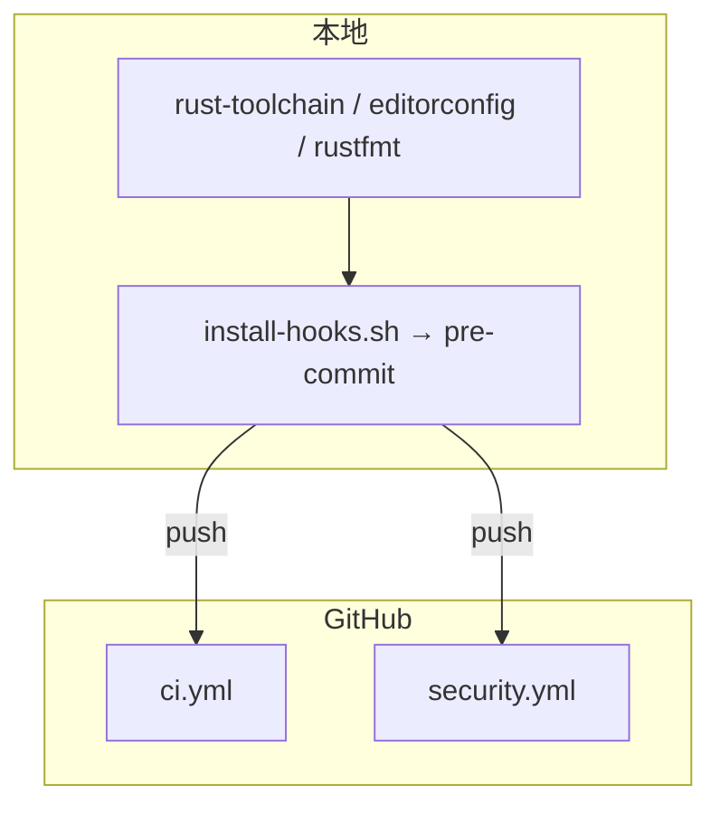
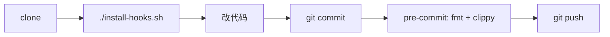
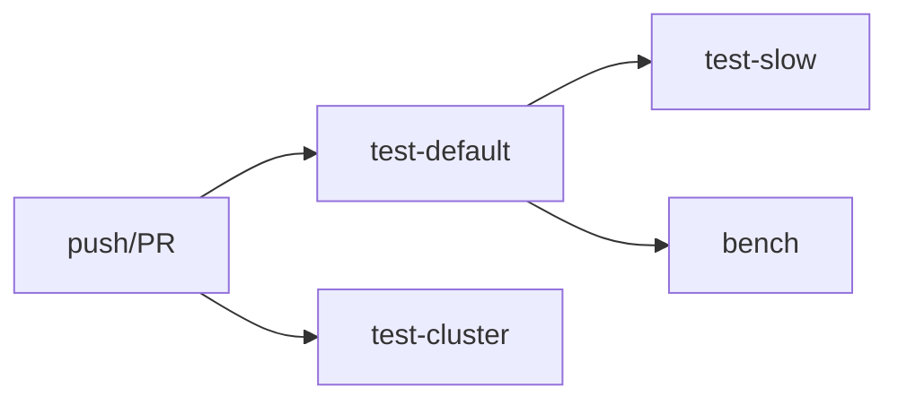
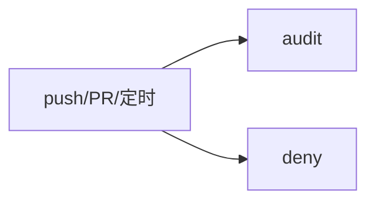

# 开发与 CI

push/PR 到 `main`、`new/main`、`new/wiqun` 时, 本地 pre-commit 与 GitHub Actions 一起构成质量门禁.

## 总览

| 层级 | 做什么 | 何时失败 |
|------|--------|----------|
| 格式/工具链 | 4 空格, stable + clippy/rustfmt | 编辑 / `cargo fmt` |
| pre-commit | 分支保护 + 链接检查 + fmt + clippy (不含 test) | `git commit` |
| CI | 测试 (+ bench) | push / PR |
| Security | audit + deny | push / PR / 每日定时 |

## 本地流程

1. 进入仓库 → `rust-toolchain.toml` 自动切 stable.
2. `./install-hooks.sh` 安装 pre-commit (可选, 推荐).
3. `git commit` 前: `cargo fmt --check` → clippy 默认 → clippy `--features cluster` (需本机 `protoc`).
4. 测试在 CI 跑, hook 不跑 `cargo test`.

### 本地 hook 门禁

`pre-commit` 在 fmt / clippy 之前先跑两个硬性检查:

- 分支保护: `hooks/check-branch.sh` 禁止在基础分支 (`new/main`, `main`, `new/wiqun`) 直接提交, 提示先开功能分支; 如需强行提交可用 `git commit --no-verify` 逃生.
- 文档链接检查: `hooks/check-docs-links.sh` 校验 staged `.md` 的相对链接指向真实存在的本地文件; 越出仓库的 `../` 跨仓链接 (sibling 布局) 跳过.

## CI 流程

| Job | 说明 |
|-----|------|
| `test-default` | fmt → clippy (默认) → test |
| `test-cluster` | clippy + test (`--features cluster`, 需 protoc) |
| `test-slow` | `cargo test -- --ignored` (slow + stress 集成测) |
| `bench` | criterion 基准测试 (依赖 test-default 通过) |
| `docs-link-check` | lychee 检查 markdown 外链 (仅 `**/*.md` 变更触发) |

同一分支新 push 会 cancel 未完成的旧 run (`concurrency`).

`docs-link-check` 是独立于 `ci.yml` 的 workflow: lychee 排除 `file://` 本地链接与私有地址, 本地/跨仓相对链接由 pre-commit hook 负责.

## 安全扫描

`security.yml`: `cargo audit` (CVE) + `cargo deny check` (许可证/依赖策略, 见 `deny.toml`). 与 CI 并行, 互不阻塞.

## 相关文件

| 文件 | 作用 |
|------|------|
| `.editorconfig` / `rustfmt.toml` | 格式 (Rust 4 空格) |
| `rust-toolchain.toml` | 工具链 |
| `deny.toml` | deny 策略 |
| `hooks/pre-commit` | 本地 hook |
| `workflows/ci.yml` | 主 CI |
| `workflows/security.yml` | 安全扫描 |
| `workflows/docs-link-check.yml` | 文档链接检查 (独立 workflow) |
