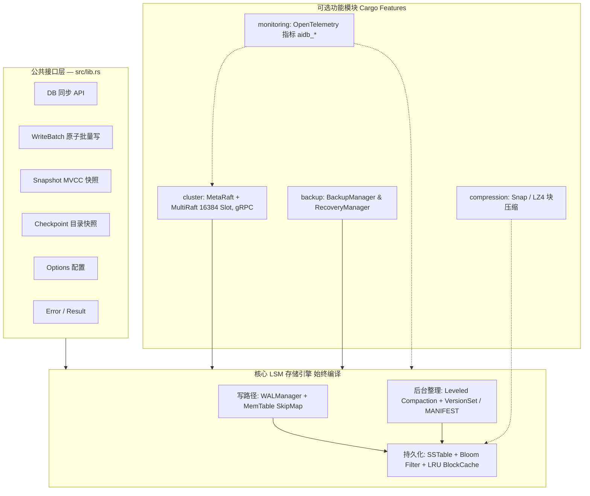
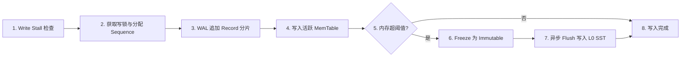
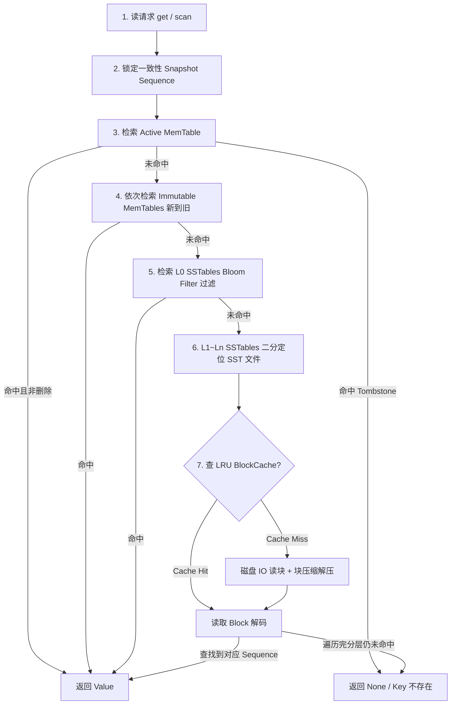
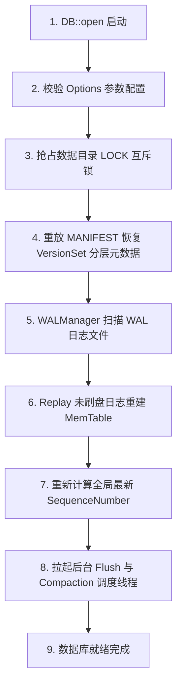
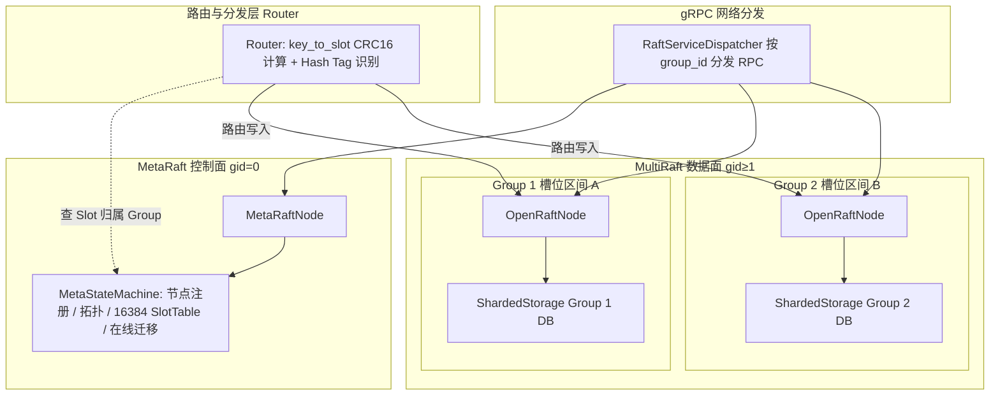
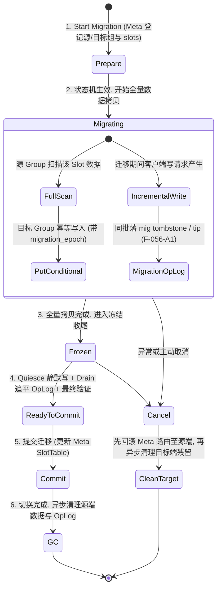
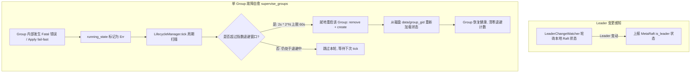

# AiDb 架构设计

> **AiDb** 是用 Rust 实现的高性能、轻量级**嵌入式 LSM-Tree 键值存储引擎库** (lib crate).
> 单机提供纯同步 `DB` API; 分布式共识、数据备份、块级压缩与监控指标通过 Cargo Feature 按需开启. **AiDb 不是独立网络服务** — 上层服务如 [AiKv](https://github.com/wiqun/AiKv/blob/main/docs/modules/03-storage.md) 在其上实现 Redis RESP 与 Cluster 协议.

日常开发修改各子系统代码时, 优先查阅 [docs/modules/](docs/modules/) 模块文档. 本文提供系统定位边界、分层拓扑、源码映射与 7 大核心生命周期/数据流总览.

---

## 1. 定位与职责边界 (Context & Boundaries)

AiDb 与下游网络服务 (如 AiKv) 保持严格的职责分工与分层解耦:

| 维度 | AiDb (存储与共识内核) | AiKv (下游网络服务) |
| --- | --- | --- |
| **形态** | 纯嵌入式 lib crate, **同步** API | 网络服务端, 异步驱动 (Tokio async) |
| **存储模型** | `DB::put/get/delete/scan`、MVCC 快照读、`WriteBatch` 原子写 | 内存引擎 / `AiDbEngine` 桥接 (`spawn_blocking`) |
| **分布式共识** | MetaRaft (控制面) + MultiRaft (数据面, 16384 Slot 路由) | `ClusterDataAdapter`、Redis MOVED/ASK 重定向、CLUSTER 命令 |
| **备份容灾** | `Checkpoint` 目录快照、`BackupManager` / `RecoveryManager` | `BGSAVE` 直接调用 `Checkpoint` |
| **块级压缩** | SSTable Data Block 支持 Snap 与 LZ4 编解码 | 生产镜像构建默认启用 `compression` |
| **可观测性** | `aidb_*` OTel 系列指标注册、`tracing` span 上下文注入 | 全局 `MeterProvider` 注入、OTLP 导出管道、HTTP 仅 `/health` |

公共 API 统一收敛在 `src/lib.rs` 进行 re-export; 底层存储引擎与集群协议细节均以 `pub(crate)` 严格封装在 `engine/` 与 `cluster/` 内部.

---

## 2. 系统分层模型 (Layered Architecture)



- **核心不可变性**: `engine/` 核心存储内核始终编译, 绝不硬依赖 `cluster`、`backup`、`monitoring` 或 `compression` 的第三方扩展 crate.
- **按需扩展**: 所有分布式、网络通信 (gRPC/Protobuf)、全量备份与 OTel 依赖均通过 Cargo Feature 严格解耦.

---

## 3. 源码目录拓扑 (Source Layout)

遵循单一职责与分层隔离原则, `src/` 核心目录映射如下:

```shell
aidb/src/
├── lib.rs           # crate 根; feature gate; 公共 API 统一 re-export
├── config.rs        # Options 配置项与预设 (约 25 个调优字段)
├── error.rs         # Error 与 Result 错误定义
├── engine/          # LSM 核心引擎 (始终编译)
│   ├── wal/         # WAL 日志 Record 格式与 WALManager
│   ├── memtable/    # InternalKey 编码与 Crossbeam SkipMap MemTable
│   ├── db/          # DB 协调总入口 (inner.rs)、Snapshot、WriteBatch
│   ├── sstable/     # SSTable 磁盘布局、Data/Index Block 与读路径
│   ├── compaction/  # Leveled Compaction 策略与 VersionSet / MANIFEST
│   ├── filter/      # Bloom Filter 过滤器实现
│   ├── cache/       # 16 分片 LRU BlockCache
│   └── checkpoint/  # 目录级一致性硬链接快照
├── cluster/         # MetaRaft + MultiRaft 分布式共识 (feature = "cluster")
├── backup/          # 全量备份与数据恢复 (feature = "backup")
└── metrics.rs       # OpenTelemetry 指标注册 (feature = "monitoring")
```

---

## 4. 核心数据流与生命周期 (Core Data Flows & Lifecycles)

### 4.1 写入流水线 (Write Pipeline)



1. **背压检查 (Write Stall)**: 检查当前 L0 SSTable 文件数与积压的 Immutable MemTable 数量, 超过阈值时主动延迟写入以保护系统内存.
2. **原子分配 (Sequence)**: 获取排他写入锁, 按 batch 操作数原子递增全局 `SequenceNumber`.
3. **WAL 追加 (WALManager)**: 将 `WriteBatch` 序列化为带 CRC32 校验和的分片 Record, 顺序追加至当前 WAL 文件.
4. **MemTable 写入**: 将带 Sequence 的 `InternalKey` 写入基于 `crossbeam-skiplist` 的并发 SkipMap.
5. **冻结与异步 Flush**: 当 MemTable 大小达到 `write_buffer_size` 阈值时, 转为不可变的 Immutable MemTable, 并唤醒后台 Flush 线程将其转化为 L0 SSTable 落盘.

### 4.2 读取与 MVCC 检索 (Read Pipeline & MVCC)



- **多级短路检索**: 严格遵循从新到旧的内存与分层顺序, 任一层命中且为有效 Value 时立即返回, 命中删除标记 (Tombstone) 时立即短路返回 `None`.
- **读放大控制**: L0 利用 Bloom Filter 快速排除无关文件; L1~Ln 因同层 Key 严格不重叠, 可通过二分查找精准定位单个 SSTable 并结合 16 分片 LRU BlockCache 减少物理 IO.

### 4.3 后台 Compaction 机制 (Compaction Lifecycle)


1. **分层评分**: `CompactionPicker` 周期性计算各 Level 的文件大小或数量评分 (L0 看文件数, L1+ 看总字节数), 优先选择分数最高的 Level 发起 Compaction.
2. **范围锁定 (Claim)**: 划定参与 Compaction 的输入 SSTable 集合及其在下层重叠的 Key 范围, 通过 Claim 机制防止并发 Compaction 冲突.
3. **多路归并**: `CompactionJob` 使用合并迭代器归并排序所有输入文件, 消除被覆写的旧版本与已脱离活跃 Snapshot 保护的 Tombstone 记录.
4. **版本推进**: 生成新的目标层 SSTables, 构造 `VersionEdit` 原子写入 `MANIFEST` 日志, 驱动 `VersionSet` 切换为最新版本.

### 4.4 启动与崩溃恢复机制 (Startup & Crash Recovery)



1. **目录互斥**: 验证 `Options` 并在数据目录创建或抢占 `LOCK` 文件锁, 杜绝多进程并发写入同一目录导致数据损坏.
2. **元数据重建**: 读取 `CURRENT` 指向的 `MANIFEST` 文件, 依序应用所有 `VersionEdit` 重建内存中的 `VersionSet` 分层视图.
3. **日志重放**: `WALManager` 按日志编号由小到大扫描未完成 Flush 的 WAL 文件, 校验 Record CRC32 并重放插入 MemTable, 恢复崩溃前的未落盘数据.
4. **引擎就绪**: 校准当前最大 `SequenceNumber`, 初始化活动 WAL 文件与 MemTable, 启动后台工作线程.

### 4.5 分布式共识与集群拓扑 (MultiRaft & Slot Topology - Feature `cluster`)



- **双层架构**:
  - **MetaRaft (gid=0)**: 负责集群元数据共识, 维护节点注册表、Group 分配表、16384 Slot 路由表与在线迁移状态机.
  - **MultiRaft (gid≥1)**: 数据分片按 Group 独立运行 Raft 状态机, 每个 Group 拥有独立的 `ShardedStorage` 与 Group DB 存储目录 (`data/group_{gid}/`).
- **路由计算**: 内置标准 CRC16 算法 (支持 `{...}` Hash Tag 提取), 将 Key 映射为 `0..16383` Slot 编号, 由 `Router` 定位所属 Group 并发起 Raft 提案.
- **网络分发**: 统一通过单端口 gRPC 服务暴露, `RaftServiceDispatcher` 依据 RPC 请求内的 `group_id` 精准分发至对应的 MetaRaftNode 或 MultiRaftNode.

### 4.6 在线槽位迁移数据流 (Online Slot Migration Pipeline)



1. **迁移启动与全量拷贝**: `SlotMigrationManager` 发起迁移并在 MetaRaft 注册 `BeginSlotMigration`, 进入 `Migrating` 状态. `SlotMigrationExecutor` 顺序扫描源 Group 中对应 Slot 的所有 Key, 并通过 `PutConditional` (附带 `migration_epoch`) 幂等复制到目标 Group.
2. **增量写入防护 (`F-056-A1`)**: 迁移期间客户端对源 Group 的并发写操作通过 `Request::MigrationWrite` 执行, 并在写数据时同步记录 `MigrationOpLog` (包括 tombstone 与 tip), 确保全量拷贝不会意外覆盖最新的增量写入.
3. **两阶段收尾 (`finish_migration`)**: 全量拷贝完成后进入 `Frozen` (写冻结) 阶段, 依次执行静默写、排空并追平 `MigrationOpLog`、最终数据一致性校验 (`final_verify`), 随后转为 `ReadyToCommit` 状态.
4. **原子提交与回滚保障**: MetaRaft 接收 `CommitSlotMigration` 请求将 Slot 路由原子指向目标 Group; 若中途发生异常或主动取消, 必须**先回滚 Meta 路由至源 Group**, 再异步清理目标端残留数据, 彻底杜绝读空洞与数据丢失.

### 4.7 故障自愈与 Leader 变更 (Failover & Self-Healing)



1. **Leader 变更感知**: `LeaderChangeWatcher` 在后台持续监听本地各 Group 的 Raft 选举与 Leader 状态变动, 及时向 MetaRaft 同步节点当前是否持有 Leader 租约.
2. **细粒度故障隔离**: 单个 Group 内部遭遇底层存储 IO 错误或 Apply 失败时, 仅将该 Group 的 `running_state` 标记为 `Err`, 不会导致整个节点进程崩溃退出.
3. **指数退避就地自愈**: `LifecycleManager::tick` 定期扫描所有 Group, 通过 `supervise_groups` 对异常 Group 按 `2s * 2^N` (上限 60s) 的退避策略执行就地安全重启 (`remove_group` + `create_group`), 重新挂载本地持久化磁盘数据并恢复 Raft 复制, 实现单 Group 级别的自动容灾自愈.

---

## 5. 横切机制概览 (Cross-Cutting Concerns)

### 5.1 备份与快照机制 (`backup`)
- **目录快照 (`Checkpoint`)**: 强制 Flush 内存数据后 Pin 住活跃 SSTable 集合, 优先通过硬链接 (Link) 或原子文件复制生成轻量目录快照.
- **备份管理 (`BackupManager` / `RecoveryManager`)**: 在 Checkpoint 基础上生成元数据 Manifest 与逐文件 SHA256 校验和, 支持备份保留策略与全量数据恢复.

### 5.2 数据块压缩机制 (`compression`)
- **SSTable Block 压缩**: 支持在写入 SSTable Data Block 时按需应用 Snap 或 LZ4 压缩算法, 显著节省磁盘存储空间并在读取时透明解压.
- **默认策略**: 启用 feature 时 `Options::default()` 默认采用 Snap 压缩.

### 5.3 链路追踪与指标观测 (`monitoring`)
- **Tracing 跟踪**: 热路径 (`put/get/write/WAL/MemTable/SSTable/Raft apply`) 的 `#[tracing::instrument]` 统一设为 `level = "debug"`, 生产在 `RUST_LOG=info` 下零性能开销.
- **OpenTelemetry 指标**: 内部指标统一采用 `aidb_*` 前缀. AiDb 不自建 HTTP 服务, 由宿主应用设置全局 `MeterProvider` 并调用 `aidb::metrics::init()` 后经 OTLP 统一管道导出.

---

## 6. 深入阅读与模块导航

- **文档索引与开发总览**: 详见 [docs/README.md](docs/README.md)
- **架构权衡与设计决策**: 详见 [docs/design.md](docs/design.md)
- **部署配置与嵌入指南**: 详见 [docs/deployment.md](docs/deployment.md)
- **开发测试与贡献规范**: 详见 [CONTRIBUTING.md](CONTRIBUTING.md)
- **各子模块的深度实现**: 详见 [docs/modules/](docs/modules/)
