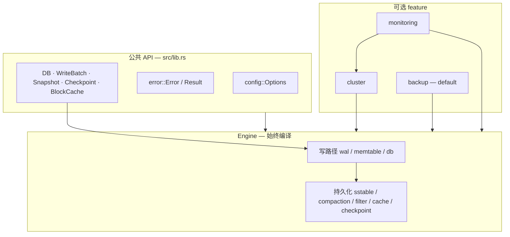
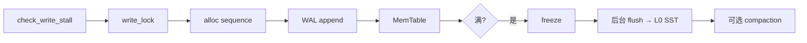
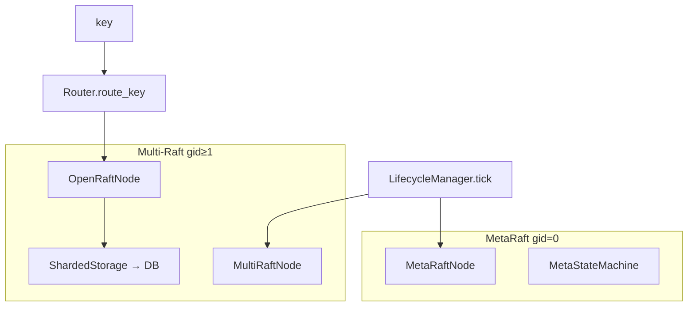

# AiDb 架构

AiDb 是用 Rust 实现的 **嵌入式 LSM-Tree KV 存储库** (lib crate). 单机提供同步 `DB` API; 分布式、备份、Prometheus 通过 Cargo feature 按需启用. **AiDb 不是网络服务** — [AiKv](../aikv/docs/modules/03-storage.md) 在其上实现 Redis RESP 与 Cluster 协议.

日常改代码优先读 [docs/modules/](docs/modules/) 域文档; 本文提供系统分层、模块关系与数据流总览.

## 定位与边界

| 维度 | AiDb | AiKv (嵌入方) |
|------|------|---------------|
| 形态 | lib crate, **同步** API | 网络服务, async (Tokio) |
| 存储 | `DB::put/get/...`, MVCC, LSM | `AiDbEngine` + `spawn_blocking` |
| 集群 | MetaRaft + Multi-Raft, slot 路由, gRPC | `ClusterDataAdapter`, MOVED/ASK, CLUSTER 命令 |
| 备份 | `BackupManager` / `Checkpoint` | `BGSAVE` 直调 `Checkpoint` |
| 指标 | `aidb_*` 系列, `register_into` | HTTP `/metrics`, `aikv_*` 系列 |

公共 API 刻意精简 (`lib.rs` re-export); 实现细节以 `pub(crate)` 隔离在 `engine/` 与 `cluster/` 内.

## 系统分层



## 目录结构

按域聚合 (非逐文件 listing). 完整路径见各 [module 文档](docs/modules/).

```shell
aidb/src/
├── lib.rs           # crate 根; feature gate; 公共 re-export
├── config.rs        # Options (~20 项)
├── error.rs         # Error; cluster 时 ClusterError
├── engine/          # LSM 核心 (始终编译)
│   ├── wal/         # WAL Record 格式与 WALManager
│   ├── memtable/    # InternalKey, SkipMap MemTable
│   ├── db/          # DB 总协调 (inner.rs); Snapshot, WriteBatch
│   ├── sstable/     # SSTable 布局与读路径
│   ├── compaction/  # Leveled compaction, VersionSet/MANIFEST
│   ├── filter/      # Bloom Filter
│   ├── cache/       # Block Cache (LRU)
│   └── checkpoint/  # 目录一致性快照
├── cluster/         # MetaRaft + Multi-Raft (feature cluster)
├── backup/          # BackupManager, RecoveryManager (feature backup)
└── metrics.rs       # Prometheus 系列 (feature monitoring)
```

## 模块导航

| Module 文档 | 覆盖 `src/` | 何时深入 |
|-------------|-------------|----------|
| [engine.md](docs/modules/01-engine.md) | `engine/{wal,memtable,db}` | WAL, MemTable, 写路径, `DB::*`, MVCC |
| [engine-storage.md](docs/modules/02-engine-storage.md) | `engine/{sstable,compaction,filter,cache,checkpoint}` | flush, compaction, Bloom, MANIFEST, Checkpoint |
| [cluster.md](docs/modules/03-cluster.md) | `cluster/*` | MetaRaft, Multi-Raft, Router, slot 迁移, gRPC |
| [backup.md](docs/modules/04-backup.md) | `backup/*` | 全量备份, manifest, restore |
| [observability.md](docs/modules/05-observability.md) | `metrics.rs`, `cluster/metrics.rs` | `aidb_*` 指标, tracing, 嵌入方注册 |

横切类型: `config.rs`, `error.rs` 在各 module 或后续 `docs/development.md` 中说明.

## Feature 边界

| Feature | Default | 启用内容 | 构建注意 |
|---------|---------|----------|----------|
| `backup` | yes | `backup::*` | 关则 mod 不存在 |
| `cluster` | no | `cluster::*` | 需 `protoc`; `cargo build --features cluster` |
| `monitoring` | no | `metrics`, `cluster/metrics` | Prometheus + tracing span 指标 |
| `compression` | no | `snap`/`lz4` crate | SSTable Data Block Snap/Lz4 压缩; `Options::default()` 默认 Snap |

核心 `engine` 不硬依赖 cluster / backup / monitoring 的可选 crate.

## 代码入口

| 能力 | 入口 |
|------|------|
| 打开单机 DB | `DB::open(path, Options)` → `engine/db/inner.rs` |
| 公共 re-export | `src/lib.rs` |
| MetaRaft / Multi-Raft | `cluster/meta_raft_node.rs`, `cluster/multi_raft_node.rs` |
| Slot 路由 | `cluster/router.rs` — `key_to_slot`, `Router::route_key` |
| Group 生命周期 | `cluster/lifecycle_manager.rs` — `LifecycleManager::tick` |
| gRPC 分发 | `cluster/network.rs` — `RaftServiceDispatcher` |
| 全量备份 | `backup/manager.rs` — `BackupManager::create_backup` |
| 指标注册 (嵌入) | `metrics.rs` — `register_into` |

## 数据流总览

### 写入 (put / write)



细节: [engine.md](docs/modules/01-engine.md), flush/compaction: [engine-storage.md](docs/modules/02-engine-storage.md).

### 读取 (get)

active MemTable → immutable (新→旧) → L0 SST (Bloom) → L1+ (范围定位 + BlockCache). MVCC 见 `Snapshot`.

### Compaction (后台)

`CompactionPicker` 选取 → claim 防重叠 → `CompactionJob` 归并 (含 trivial move / subcompaction) → `VersionEdit` 写 MANIFEST. Snapshot 保护旧版本.

### 打开 (recover)

`Options::validate` → `WALManager::recover` + replay → `VersionSet` recover / bootstrap → 加载 SST → 分配 sequence → 目录 `LOCK` → 启动 flush / compaction 线程.

### 集群 (feature `cluster`)



- **MetaRaft**: 节点 / Group / SlotTable / 迁移状态 (`MetaRequest` 共识).
- **Multi-Raft**: 每 Group 独立 `ShardedStorage` (目录 `data/group_{id}/`) + `OpenRaftNode`.
- **LifecycleManager::tick**: 对齐本地 Group, `Router.refresh_from_data`.
- **写 key**: 本地 Group → `OpenRaftNode.propose` → apply 到 Group DB 内 `sm_key(gid, user_key)`.
- **gRPC**: 统一端口, `RaftServiceDispatcher` 按 RPC 内 `group_id` 分发.

Redis MOVED/ASK / CLUSTER 子命令在 [aikv cluster.md](../aikv/docs/modules/06-cluster.md). 数据面端口偏移由 AiKv `--cluster-data-port-offset` 配置 (默认 10000).

### 备份 (feature `backup`)

`BackupManager::create_backup` → `Checkpoint::create` (flush + pin + link/copy) → manifest + 逐文件 SHA256 → 保留策略. Restore 经临时目录 + `DB::open` 冒烟后 rename.

### 可观测性

- **Tracing**: 始终编译; 各路径 `#[instrument]` span.
- **Prometheus**: `monitoring` feature; `DB::open` 时 `metrics::init()`.
- **暴露**: AiDb **无内置 HTTP scrape**; 嵌入方调用 `register_into` 后统一暴露 (见 [observability.md](docs/modules/05-observability.md)).

## 与 AiKv 的嵌入关系

AiKv 通过 `path = "../aidb"` 依赖本库:

1. **单机**: `AiDbEngine::open` 包装 `DB`, key 编码为 `{db_index}:{user_key}`.
2. **集群**: `ClusterDataAdapter` 包装数据面 Raft 写读; MetaRaft / MultiRaft 由 AiKv 启动流程与 aidb `cluster` API 对接.
3. **持久化**: memory 引擎无 checkpoint; aidb 路径委托 `flush` / `Checkpoint::create`.
4. **指标**: `aikv` 启动时 `aidb::metrics::register_into(&registry)`.

协议与数据结构编码在 AiKv; AiDb 提供 LSM 存储与 Raft/slot 基础设施.

## 设计取向 (摘要)

- **LSM + Leveled Compaction**: 写密集、点查友好; 详见 [DESIGN.md](DESIGN.md).
- **API 精简**: 借鉴 RocksDB/LevelDB 思路, 避免过多配置与 surface area.
- **集群**: OpenRaft + MetaRaft/Multi-Raft 分离控制面与数据面; 16384 slot (CRC16, Redis 兼容槽模型).

完整决策与 trade-off 见 [DESIGN.md](DESIGN.md).

## 进一步阅读

- [AGENTS.md](AGENTS.md) — AI 助手与 CI 入口
- [docs/modules/](docs/modules/) — 域级 Skill 文档
- [DESIGN.md](DESIGN.md) — 设计决策 (汇总)
- [DEPLOYMENT.md](DEPLOYMENT.md) — 构建、feature、运行 (汇总)
- [ISSUES.md](ISSUES.md) — 待核实项

## 待核实

- HTTP `/metrics` 与 OTel 运行在嵌入方 (AiKv), 非 aidb 库内 — 见 [ISSUES.md#ISSUE-014](ISSUES.md#issue-014-httpoteljson-log-运行在嵌入方-aidb-仅库内指标).
