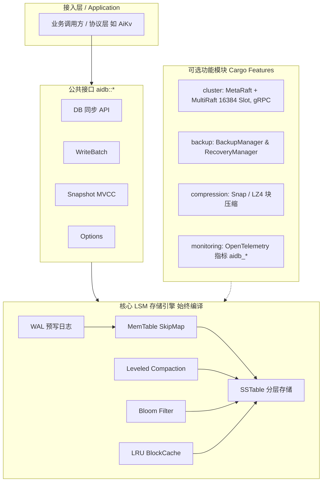

# AiDb

[](https://www.rust-lang.org)
[](Cargo.toml)
[](#许可证)
[](.github/workflows/ci.yml)

> **AiDb** 是一个纯 Rust 实现的高性能、轻量级**嵌入式 LSM-Tree 键值存储引擎库** (lib crate).  
> 既可作为单机应用内嵌的零依赖 KV 存储, 也可通过 Cargo Feature 开启基于 Raft 的分布式集群能力.

## 为什么开发 AiDb (Why AiDb?)

- **摆脱传统 C/C++ 引擎的包袱与 FFI 痛点**: RocksDB, LevelDB 等为兼容各方历史需求愈发庞大厚重; 引入 C++ FFI 亦带来跨平台编译负担与内存安全盲区.
- **弥补纯 Rust 生产级与分布式存储空白**: 现有纯 Rust 方案多偏向教学原型或局限于单机, 缺乏完善的 Compaction 机制、MVCC 快照与向分布式共识平滑扩展的能力.
- **发挥 Rust 现代语言优势**: 结合内存安全与无畏并发, 打造轻量纯粹、零 C/C++ 依赖、兼具单机极简内嵌与 Raft 集群扩展的现代化 LSM 存储底座.

## 核心亮点 (Key Highlights)

- **Pure Rust 实现**: 内存安全、性能高效、跨平台开箱即用.
- **LSM 存储引擎**: WAL + SkipMap + Leveled Compaction 分层存储, 结合 Bloom Filter 与 LRU Block Cache 降低读写放大.
- **存储原语支持事务**: 支持原子批量写 (`WriteBatch`)、MVCC 快照读 (`Snapshot`) 及目录级 Checkpoint.
- **原生分布式共识**: 基于 OpenRaft 实现 MetaRaft + MultiRaft, 内置 16384 槽路由与在线迁移.
- **高度模块化设计**: 核心引擎零外部可选依赖; 集群、备份、压缩与监控等能力均通过 Cargo Feature 解耦.
- **云原生可观测性**: 支持基于 OpenTelemetry 的指标导出 (`aidb_*`) 与全链路 tracing span 跟踪.

## 架构概览 (Architecture at a Glance)



## 快速开始

### 添加依赖

在 `Cargo.toml` 中引入:

```toml
[dependencies]
aidb = "1.0.0"
```

### 基础读写示例

```rust
use aidb::{DB, config::Options};

fn main() -> aidb::Result<()> {
    // 1. 打开或创建数据库
    let db = DB::open("/tmp/aidb-demo", Options::default())?;

    // 2. 基础写入与点查 (CRUD)
    let _ = db.put(b"hello", b"world")?;
    assert_eq!(db.get(b"hello")?, Some(b"world".to_vec()));

    // 3. 删除与关闭
    db.delete(b"hello")?;
    db.close()?;
    Ok(())
}
```

## 示例 (Examples)

更多完整用例可直接在仓库内运行:

| 示例场景 | 源码入口 | 包含能力 | 运行命令 |
| --- | --- | --- | --- |
| **基础与进阶操作** | [`examples/basic.rs`](examples/basic.rs) | CRUD、`WriteBatch` 批量写、`scan` 范围扫描、MVCC `Snapshot` 快照 | `cargo run --example basic` |
| **备份与恢复** | [`examples/backup.rs`](examples/backup.rs) | 目录快照创建、校验和验证与数据恢复 | `cargo run --example backup` |
| **分布式集群路由** | [`examples/cluster.rs`](examples/cluster.rs) | 16384 Slot 槽位计算与 Hash Tag 路由演示 | `cargo run --features cluster --example cluster` |

详细说明见 [examples/README.md](examples/README.md).

## 功能特性 (Feature Matrix)

| Feature | 默认状态 | 核心能力 | 依赖与说明 |
| --- | --- | --- | --- |
| `default` | 包含 `backup` | LSM 核心存储引擎 (WAL、MemTable、SSTable、Compaction、MVCC 快照) | 零额外外部环境依赖 |
| `backup` | 默认启用 | 全量数据备份、校验和生成与数据恢复 (`BackupManager` / `RecoveryManager`) | 基于 `ring` / `hex` / `serde_json` |
| `compression` | 按需开启 | SSTable Data Block 块级压缩 (支持 Snap 与 LZ4) | 启用时 `Options` 默认使用 Snap 压缩 |
| `cluster` | 按需开启 | MetaRaft 控制面 + MultiRaft 数据面 (16384 Slot 路由、在线迁移、gRPC 分发) | 基于 `openraft` / `tonic`, 构建需 `protoc` |
| `monitoring` | 按需开启 | OpenTelemetry 指标埋点 (`aidb_*`) 与 Tracing 链路上下文注入 | 宿主应用设置 global `MeterProvider` 后经 OTLP 导出 |

构建与 Feature 详细配置见 [docs/deployment.md](docs/deployment.md).

## 兼容性与支持平台

- `1.x` 遵循 Cargo SemVer, 保持公开 Rust API 兼容.
- v1 不保证读取 v1 之前版本生成的 WAL, MANIFEST, SSTable, Raft snapshot 或
  migration checkpoint, 也不支持与 v1 之前版本进行集群滚动升级.
- 从开发版本升级到 v1 时, 应使用新数据目录, 或通过应用层导入导出迁移数据.
- Linux x86_64 是正式验证平台. 其他平台仅提供 best-effort 支持.

安全漏洞报告方式见 [SECURITY.md](SECURITY.md), 手工发布步骤见
[RELEASING.md](RELEASING.md).

## 基准测试 (Benchmarks)

基准测试基于 [criterion](https://github.com/bheisler/criterion.rs):

```bash
# 运行全部基准测试
cargo bench

# 运行单项基准测试
cargo bench --bench write_bench
cargo bench --bench read_bench
cargo bench --bench backup_bench
```

性能指标与压测详情请参考 [docs/deployment.md §构建与验证](docs/deployment.md#构建与验证).

## 生态系统 (Ecosystem)

- **[wiqun/AiKv](https://github.com/wiqun/AiKv)**: 基于 AiDb 构建的高性能 Redis RESP2/RESP3 兼容键值服务.

## 文档导航

开发文档总览请查阅 [docs/README.md](docs/README.md).

| 文档分类 | 入口文件 | 适用场景与内容 |
| --- | --- | --- |
| **系统架构** | [ARCHITECTURE.md](ARCHITECTURE.md) | LSM 读写分层、Leveled Compaction 机制、MultiRaft 拓扑与数据流 |
| **设计决策** | [docs/design.md](docs/design.md) | 关键技术选型与跨模块架构权衡 (Trade-offs) |
| **开发与贡献** | [CONTRIBUTING.md](CONTRIBUTING.md) | Git Hooks、CI 门禁、完整测试矩阵、回归测试规范与 PR 流程 |
| **部署与运维** | [docs/deployment.md](docs/deployment.md) | Feature 组合构建、嵌入指南、数据目录规范与参数调优 |
| **模块详解** | [docs/modules/](docs/modules/) | 各子模块深入实现 (WAL, MemTable, SSTable, Cluster, Backup, Metrics) |
| **版本记录** | [CHANGELOG.md](CHANGELOG.md) | 历史版本与发布变更记录 |

## 许可证

本项目采用 [MIT](LICENSE-MIT) OR [Apache-2.0](LICENSE-APACHE) 双重开源许可证 (见 [Cargo.toml](Cargo.toml)).
