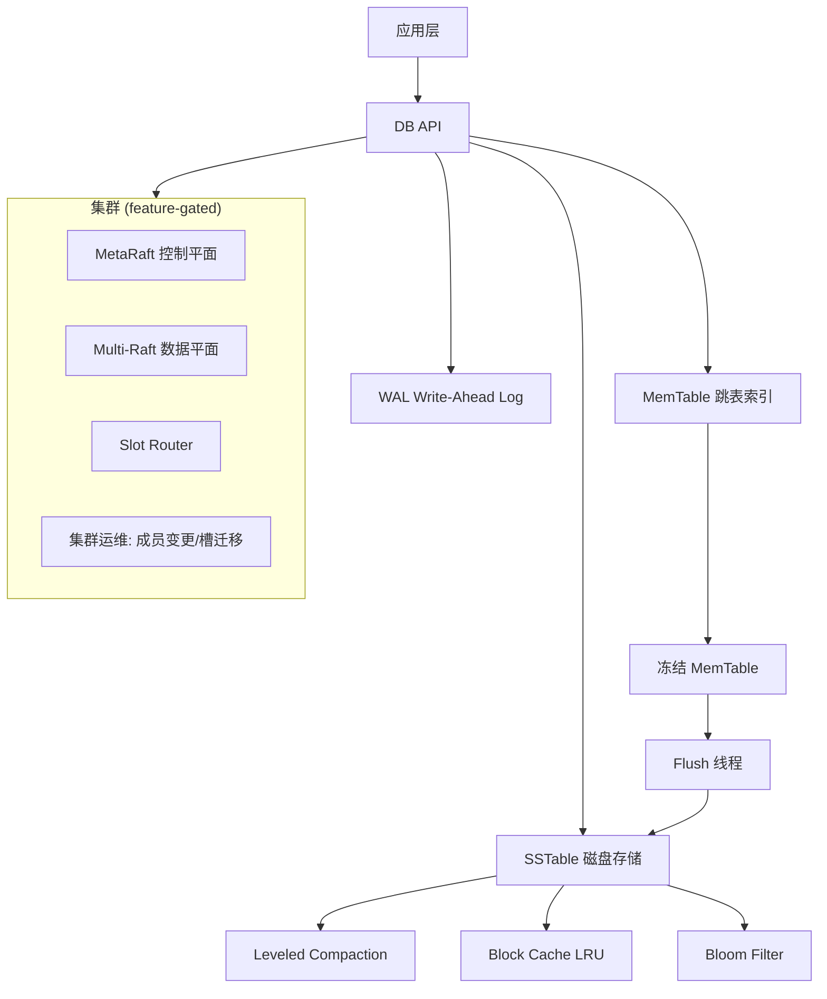

# AiDb

基于 LSM-Tree 的嵌入式 KV 存储引擎, Rust 实现. 核心引擎零可选依赖, 集群和可观测性通过 feature flags 启用.

## 架构



## 特性

| Milestone | 版本 | 内容 |
|-----------|------|------|
| **M1** 单机引擎 | 0.7.2 | WAL · MemTable (SkipList) · SSTable (Block/Index/Footer) · DB put/get/delete/scan · Leveled Compaction · Bloom Filter · Block Cache · MVCC Snapshot · write/read 基准测试 |
| **M2** 引擎优化 | 0.7.4 | `delete_range` (scan + WriteBatch) · `BlockIterator::prev` 反向迭代 · Cache 零拷贝 |
| **M4** Raft 集群 | 0.10.0 | OpenRaft 共识 · gRPC 网络 · MetaRaft 控制平面 (节点/Group/Slot 元数据) · Multi-Raft 数据平面 (16384 槽 · CRC16 路由 · per-Group 独立 DB) · ReplicaAllocator · MembershipCoordinator · SlotMigration |
| **M5** 生产就绪 | 0.13.0 | Checkpoint 快照 · BackupManager 备份/恢复 · OTel 导出 · Prometheus `:9191/metrics` · 慢查询日志 |

## 快速开始

```toml
[dependencies]
aidb = "0.13"
```

```rust
use aidb::config::Options;
use aidb::DB;

let db = DB::open("/tmp/aidb-data", Options::default())?;
db.put(b"hello", b"world")?;
assert_eq!(db.get(b"hello")?, Some(b"world".to_vec()));
```

### 构建与测试

```bash
cargo build
cargo test -- --test-threads=1
```

### 集群模式

```bash
cargo build --features cluster
cargo test --features cluster --test raft -- --test-threads=1
```

### 可观测性

```bash
cargo build --features monitoring
```

详见 [CONTRIBUTING.md](CONTRIBUTING.md).

## 测试矩阵

| 测试类别 | 命令 |
|----------|------|
| 单元测试 | `cargo test --lib` |
| 模块集成 | `cargo test --test {wal,sstable,memtable,filter,cache,compaction,db,backup}` |
| 管线测试 | `cargo test --test pipeline` |
| 引擎集成 | `cargo test --test engine` |
| 快照 | `cargo test --test snapshot` |
| 集群 | `cargo test --features cluster --test raft` |
| 回归 | `cargo test --test regression` |
| 随机测试 | `PROPTEST_CASES=100 cargo test --test proptest` |
| 基准 | `cargo bench` |

## 性能基准

基准测试使用 [criterion.rs](https://github.com/bheisler/criterion.rs), 运行 `cargo bench` 查看结果:

- **顺序写入**: `write_bench` — 1KB value 随机 key, WriteBatch 批量提交
- **随机读取**: `read_bench` — 10000 keys 预填充, 随机 get 延迟

可通过 `AIDB_BENCH_PRELOAD` 环境变量调整 read_bench 预填充规模.

## 设计文档

- [ARCHITECTURE.md](ARCHITECTURE.md)
- [DESIGN.md](DESIGN.md)
- [DEPLOYMENT.md](DEPLOYMENT.md)

## 许可

MIT
