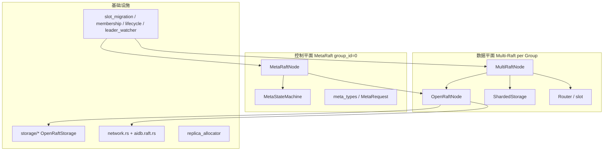
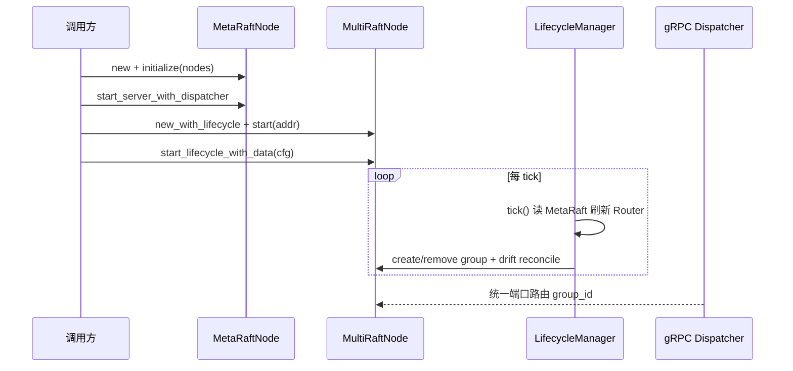
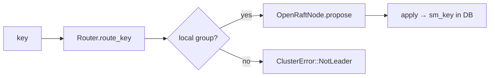
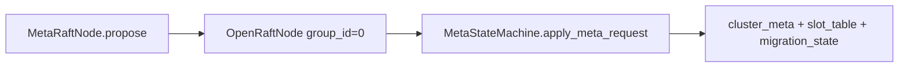
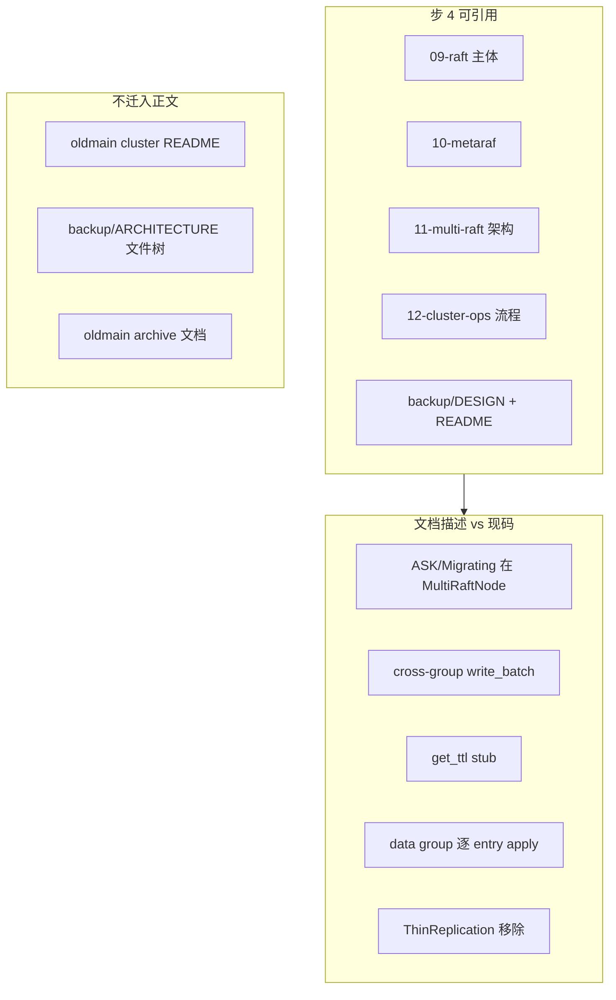
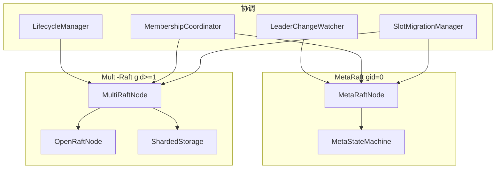
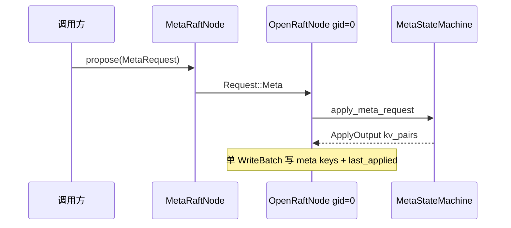
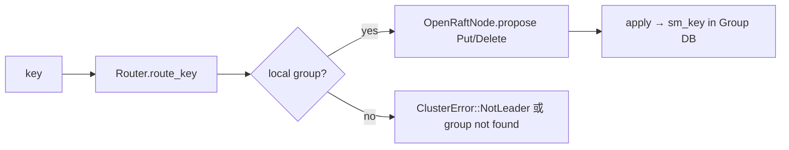
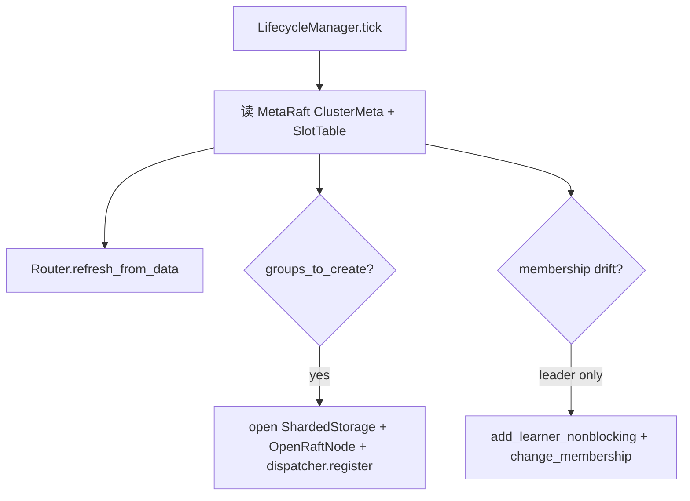

# Cursor transcript

---

## 1. User

## 文档整理 — 新会话

工作目录: `/root/code/database`

请先阅读 (不要跳过):

1. `AiKv-Workflow/backup/design.md` — 总规程
2. `AiKv-Workflow/backup/PROGRESS.md` — 当前进度
3. `AiKv-Workflow/backup/INDEX.md` — 本章索引 (若已有行则更新)

---

### 本次任务

| 项 | 值 |
|----|-----|
| PROGRESS 总步 | 5 |
| 目标文件 | `aidb/docs/modules/cluster.md` |
| 本次子步 | 从步 0 开始 |
| 对比深度 | 核心章逐段 (见 `design.md` — aidb `cluster` 属加深章) |

### 必须遵守

- **确认门控**: 步 0→1→2→3→4, 每步先讨论, 我确认后再下一步
- **步 4**: 先出 Module Skill 正文 **草稿**, 我确认后再写入 aidb/aikv、更新 INDEX/PROGRESS
- **Module Skill 基础模板**: frontmatter `name` + `description` (含 `Use when`); 见 `design.md`
- **过程只进 backup/**: INDEX; aidb/aikv 不写迁移历史
- **旧文档顺序**: `backup/{aidb,aikv}/` → `*-oldmain` → WiQunTools 查漏 → wiqun-*
- **待核实**: module 一行引用; 详情写入 **当前仓库** 根目录 `ISSUES.md` (`aidb/ISSUES.md`)
- **步 4 落盘前**: 对照 create-skill Summary Checklist 自检 (见 `design.md`)

### 上下文 (上一章已完成)

- 步 1–2 ✅ [`aidb/docs/modules/engine.md`](aidb/docs/modules/engine.md) / [`engine-storage.md`](aidb/docs/modules/engine-storage.md) — LSM 写路径与 SSTable/compaction
- 步 3–4 ✅ [`aikv/docs/modules/protocol.md`](aikv/docs/modules/protocol.md) / [`server.md`](aikv/docs/modules/server.md) — RESP 编解码与 TCP 连接层
- 本章覆盖 `aidb/src/cluster/*` (MetaRaft / MultiRaft / Router / slot 迁移 / gRPC 等); 步 6+ 的 aikv `storage` / `cluster` 会引用本章
- 步 3 需在模块级基础上对核心文件做 **逐段/逐函数** 对照 (oldmain 代码为主, 若旧文档不可信可降级为查漏)

### 本次不要

- 不要跳过未确认的步骤
- 不要一次写多篇 module
- 不要修改 `design.md` / 流程, 除非我明确要求
- 不要 commit, 除非我明确要求

---

请从步 0 开始, 给出本步交付物, 等我确认。

---

## 2. Assistant

先阅读总规程、进度与索引，并梳理 `cluster` 模块范围，以便给出步 0 交付物。

---

## 3. Assistant

接下来盘点 `aidb/src/cluster/` 的目录与入口文件，以确定本章范围。

---

## 4. Assistant

## 步 0 — 定范围

**目标**: `aidb/docs/modules/cluster.md` (PROGRESS 步 5)  
**对比深度**: 核心章 — 步 3 需在模块级基础上对核心文件 **逐段/逐函数** 对照 (oldmain 代码为主)

---

### 本章边界

| 维度 | 纳入 `cluster.md` | 不纳入 (他章或简要提及) |
|------|-------------------|-------------------------|
| **源码** | `aidb/src/cluster/*` (feature `cluster`) | `engine/*` 写路径 → [engine.md](aidb/docs/modules/engine.md); SSTable/compaction → [engine-storage.md](aidb/docs/modules/engine-storage.md) |
| **配置/错误** | `config.rs` 中 `ClusterConfig` / `MigrationConfig` 字段表 | 不展开 `Options` 全量 |
| **错误** | `ClusterError` 分类与常见映射 | `error.rs` 非 cluster 部分 |
| **指标** | `cluster/metrics.rs` (Raft RPC / log 计数) | 顶层 `metrics.rs` + OTel → observability.md (步 10) |
| **下游引用** | 说明 aikv `storage` / `cluster` 如何依赖本章 pub API | aikv 侧 MOVED/ASK / CLUSTER 命令 → aikv `cluster.md` (步 11) |
| **构建** | `--features cluster`, `protoc`, gRPC 依赖 | CI / CONTRIBUTING 细节 → 阶段 2 |

**架构分层** (与 `mod.rs` 注释 Phase 12/13 一致):



---

### `src/cluster/` 文件清单 (22 个)

```shell
aidb/src/cluster/
├── mod.rs                      # 模块根; pub re-export
├── types.rs                    # TypeConfig, Request/Response, ThinWriteBatch, RaftNodeConfig
├── meta_types.rs               # ClusterMeta, SlotTable, MetaRequest, METARAFT_GROUP_ID
├── meta_state_machine.rs       # MetaRaft 状态机 (~1024 行)
├── meta_raft_node.rs           # 控制平面节点
├── multi_raft_node.rs          # 数据平面编排 (~797 行)
├── node.rs                     # OpenRaftNode 通用封装 (~564 行)
├── router.rs                   # CRC16, hash tag, key_to_slot, Router
├── sharded_storage.rs          # 每 Group 独立 DB
├── slot_migration.rs           # SlotMigrationManager / Executor
├── membership_coordinator.rs   # 成员变更协调
├── lifecycle_manager.rs        # Group 拓扑 tick / drift
├── leader_watcher.rs           # Meta + data plane leader 变更
├── replica_allocator.rs        # 副本分配 / rebalance
├── network.rs                  # gRPC client/server (~710 行)
├── aidb.raft.rs                # prost 生成 (Raft RPC proto)
├── metrics.rs                  # cluster 专用 Prometheus (feature monitoring)
└── storage/
    ├── mod.rs                  # OpenRaftStorage
    ├── keys.rs                 # DB key 空间布局
    ├── log.rs                  # Raft log 读写
    ├── apply.rs                # 状态机 apply
    └── snapshot.rs             # snapshot build/install
```

**公共入口** (`lib.rs` + `cluster/mod.rs` re-export):

- 节点: `MetaRaftNode`, `MultiRaftNode`, `OpenRaftNode`
- 路由: `Router`, `key_to_slot`, `crc16`, `extract_hash_tag`
- 元数据: `ClusterMeta`, `SlotTable`, `MetaRequest`, `SlotMigrationState`
- 迁移: `SlotMigrationManager`, `SlotMigrationExecutor`
- 协调: `MembershipCoordinator`, `LifecycleManager`, `LeaderChangeWatcher`, `ReplicaAllocator`
- 存储/网络: `OpenRaftStorage`, `ShardedStorage`, `RaftServiceImpl`, `RaftNetworkClientFactory`
- 类型: `Request`, `Response`, `ThinWriteBatch`, `RaftNodeConfig`, `ClusterError`

**Feature 门控**: `Cargo.toml` → `cluster = [tonic, prost, tokio, openraft, …]`; `lib.rs` 中 `#[cfg(feature = "cluster")] pub mod cluster`.

---

### 拟读文件列表 (步 1–3)

#### 步 1 — 新代码 (优先级序)

| 优先级 | 文件 | 理由 |
|--------|------|------|
| P0 | `mod.rs`, `types.rs`, `meta_types.rs` | 类型与 re-export 地图 |
| P0 | `meta_raft_node.rs`, `meta_state_machine.rs` | 控制平面 |
| P0 | `multi_raft_node.rs`, `node.rs` | 数据平面 + Raft 封装 |
| P0 | `router.rs`, `sharded_storage.rs` | 16384 slot / per-Group DB |
| P1 | `storage/{mod,keys,log,apply,snapshot}.rs` | Raft 持久化于 engine DB |
| P1 | `network.rs`, `aidb.raft.rs` | gRPC RPC 面 |
| P1 | `slot_migration.rs`, `membership_coordinator.rs` | 运维路径 |
| P2 | `lifecycle_manager.rs`, `leader_watcher.rs`, `replica_allocator.rs` | 后台协调 |
| P2 | `config.rs` (cluster 段), `error.rs` (ClusterError) | 配置/错误边界 |
| P2 | `cluster/metrics.rs` | 与 observability 分界 |

#### 步 1 — 测试 / 示例 (验证主流程)

| 路径 | 覆盖 |
|------|------|
| `tests/raft.rs` → `modules/cluster/*` | OpenRaftNode, storage, network |
| `tests/meta.rs` → `modules/meta/*` | MetaStateMachine, MetaRaft 集成 |
| `tests/multi_raft.rs` → `modules/multi_raft/*` | MultiRaftNode, leader_watcher |
| `tests/cluster_ops.rs`, `cluster_replica_reconcile.rs` | 运维 / 副本 reconcile |
| `examples/cluster.rs` | CRC16 / hash tag 演示 |

构建: `cargo test --features cluster --test raft -- --test-threads=1` (及 meta / multi_raft / cluster_ops)

#### 步 2 — 旧文档 (按 design.md 顺序)

1. `backup/aidb/{ARCHITECTURE,DESIGN,README,CONTRIBUTING}.md` — M4 集群段落
2. `aidb-oldmain/examples/cluster/README.md` — 旧 API / demo 命名 (`raft-cluster` feature 等)
3. `WiQunTools/docs/wiqun-db-inventory/{09-raft,10-metaraf,11-multi-raft,12-cluster-ops}.md` — 查漏
4. `wiqun-db` — 与 2 重叠时二选一

#### 步 3 — oldmain 代码对照 (核心文件逐段)

| 新文件 | oldmain 对应 | 备注 |
|--------|--------------|------|
| `meta_state_machine.rs` | `meta_state_machine.rs` | 同名, 重点逐段 |
| `multi_raft_node.rs` | `multi_raft_node.rs` | 同名 |
| `node.rs` | `raft_node_new.rs` | 可能重命名/重构 |
| `storage/*` | `raft_storage.rs` + `sharded_state_machine.rs` | 结构变化大 |
| `network.rs` | `raft_network.rs` + `multi_raft_network.rs` + `rpc.rs` | 合并/拆分 |
| `slot_migration.rs` | `slot_migration.rs` | 同名 |
| `router.rs` | `router.rs` | 同名 |
| — | `thin_replication.rs` | oldmain 独有, 查是否移除或并入 |

---

### 篇幅与 Skill 规划 (步 4 预告)

- 源码合计 ~8500 行; `meta_state_machine.rs` + `network.rs` + `multi_raft_node.rs` 占大头
- 若正文 >400 行, 按 design.md 拆 `cluster-reference.md` (例如 MetaRaft 命令表 / DB key 布局 / gRPC RPC 列表)
- 拟用 frontmatter: `name: aidb-cluster`, `description` 含 `Use when` (改 `src/cluster/*`, MetaRaft/MultiRaft, slot 迁移, gRPC)

---

### 拟写入 INDEX 的本章行 (确认步 0 后落盘)

| 新文档章节 | 状态 | 备注 |
|------------|------|------|
| `docs/modules/cluster.md` | 步 0 ✅ 范围已定 | `cluster/*`; MetaRaft + MultiRaft + Router + slot 迁移 + gRPC; 步 3 核心文件逐段 |

---

### 待你确认

1. **边界**: 上述 IN/OUT 划分是否 OK? (`config`/`error` 仅简要, `cluster/metrics` 留在本章)
2. **拟读列表**: P0/P1 优先级是否需要增减?
3. **步 3 核心文件**: 上表 7 组是否作为逐段对照范围? 是否要加/减 (如 `membership_coordinator.rs`)?
4. **INDEX 更新**: 确认后我将更新 `backup/INDEX.md` 的 `cluster.md` 行, 并将 PROGRESS 步 5 标为 🔄 进行中

请回复 **可以** 或具体调整意见; 确认后进入 **步 1 (读新代码)**.

---

## 5. User

可以

---

## 6. Assistant

步 0 已确认。正在更新 INDEX/PROGRESS，并阅读新代码以产出步 1 交付物。

---

## 7. Assistant

**步 0 已落盘**: `INDEX.md` 与 `PROGRESS.md` 步 5 已标为 🔄 进行中.

---

## 步 1 — 读新代码 (草稿, 待确认)

以当前 `aidb/src/cluster/*` 为准, 梳理职责、类型与主流程.

### 模块职责 (一句话)

| 子系统 | 职责 |
|--------|------|
| **MetaRaft** (`group_id=0`) | 控制平面: 节点/Group/Slot 元数据、迁移状态; 经 Raft 共识持久化到 Meta DB |
| **Multi-Raft** (`group_id≥1`) | 数据平面: 每 Group 独立 `OpenRaftNode` + `ShardedStorage`(独立 DB); 统一 gRPC 端口 |
| **OpenRaftStorage** | Raft log / vote / membership / snapshot 与 user KV 均存于 engine `DB`; key 前缀隔离 |
| **Router** | Redis 兼容 16384 slot (CRC16 + hash tag); 运行时刷新 slot 表与 leader 缓存 |
| **LifecycleManager** | 轮询 MetaRaft → 本节点应托管哪些 Group → 创建/销毁 + 成员 drift 对账 |
| **LeaderChangeWatcher** | 观测本地 OpenRaft leader 变更 → propose `ChangeGroupMembership` 更新 `is_leader` |
| **MembershipCoordinator** | 节点 join/leave/replace; MetaRaft + 各 data group Raft 联动 |
| **SlotMigration** | 在线 slot 迁移: MetaRaft 状态机 + Executor 逐 key 复制 + checkpoint |
| **ReplicaAllocator** | 新 Group 副本分配 / rebalance 计划 (纯算法, 不直接调 Raft) |
| **network** | tonic gRPC: AppendEntries / Vote / InstallSnapshot; `group_id` 多路复用 |

---

### 代码地图

| 路径 | 职责 | 入口 |
|------|------|------|
| `types.rs` | OpenRaft `TypeConfig`; `Request`/`Response`; `ThinWriteBatch`; `RaftNodeConfig` | `TypeConfig`, `Request::Meta` |
| `meta_types.rs` | `ClusterMeta`, `SlotTable`, `MetaRequest`, `METARAFT_GROUP_ID=0` | `MetaRequest::*`, `SLOT_COUNT=16384` |
| `meta_state_machine.rs` | Meta 状态机: validate + apply → 3 个 meta KV | `apply_meta_request`, `validate_meta_request` |
| `meta_raft_node.rs` | MetaRaft 节点封装 | `new`, `initialize`, `propose`, `start_server_with_dispatcher` |
| `node.rs` | 通用 OpenRaft 封装 | `new_with_storage`, `propose`, `change_membership`, `get` |
| `multi_raft_node.rs` | 数据面总编排 | `start`, `start_lifecycle_with_data`, `propose_key`, `get_local` |
| `sharded_storage.rs` | `data_dir/group_{id}/` 独立 DB | `ShardedStorage::open` |
| `router.rs` | slot 路由 | `key_to_slot`, `route_key`, `refresh_from_data`, `group_ops` |
| `storage/keys.rs` | DB key 空间 | `\x00raft/`, `\x01sm/`, `\x00meta_raft/` |
| `storage/{mod,log,apply,snapshot}.rs` | OpenRaft `RaftStorage` 实现 | `apply_entries_internal`, snapshot build/install |
| `network.rs` | gRPC client/server + dispatcher | `RaftNetworkClientFactory`, `RaftServiceDispatcher` |
| `lifecycle_manager.rs` | Group 生命周期 tick | `tick` → `TickResult` |
| `leader_watcher.rs` | Leader 变更上报 MetaRaft | `tick`, `spawn_background` |
| `membership_coordinator.rs` | 节点增删 | `add_node`, `remove_node` |
| `slot_migration.rs` | 迁移执行与编排 | `SlotMigrationManager::start_migration`, `SlotMigrationExecutor::execute` |
| `replica_allocator.rs` | 副本分配算法 | `allocate_group`, `plan_rebalance` |
| `metrics.rs` | Raft RPC / log 计数 (feature `monitoring`) | `record_raft_rpc` |

**Group ID 约定**: `0` = MetaRaft; `1` = Phase 12 单 Group 默认 (`DEFAULT_GROUP_ID`); 数据 Group ≥ 1.

**DB key 空间** (同一 DB 内前缀隔离):

```shell
\x00raft/{gid}/vote|log/{idx}|membership|snapshot_meta|last_applied  # Raft 元数据
\x01sm/{gid}/{user_key}                                               # 数据面状态机 KV
\x00meta_raft/cluster_meta|slot_table|migration_state                 # MetaRaft SM 持久化
```

---

### 主流程

#### 1. 节点启动 (典型 Multi-Raft 节点)



- MetaRaft 与 data plane **共享** `RaftServiceDispatcher` (单端口, RPC 带 `group_id`).
- `LifecycleManager`: leader 节点 initialize 为 Voter; follower 经 drift 对账 `add_learner_nonblocking` + `change_membership`.

#### 2. 写路径 (单 key)



- `MultiRaftNode::propose_key` = route → `propose_group`.
- `OpenRaftNode::propose`: OpenRaft `client_write`; ForwardToLeader 最多 3 次 → `ClusterError::NotLeader`.
- Apply: `ThinWriteBatch` → `sm_key(group_id, user_key)` 写入 Group DB.

#### 3. MetaRaft 元数据变更



- 每次 apply 后 `ClusterMeta.version += 1`.
- `LifecycleManager.tick` 读最新 meta → `Router.refresh_from_data`.

#### 4. Slot 迁移 (Phase 15)

1. `SlotMigrationManager.start_migration` → MetaRaft `BeginSlotMigration`
2. `SlotMigrationExecutor.execute`: scan source group → filter by slot → batch copy to target (via propose)
3. 进度 → `UpdateMigrationProgress`; 完成 → `CommitSlotMigration`; 取消 → `CancelSlotMigration`
4. Checkpoint 文件: `{checkpoint_dir}/migration_{id}.ckpt`

#### 5. 成员变更 (data group)

- **Meta 层**: `MetaRequest::ChangeGroupMembership` (期望副本集合)
- **Raft 层**: `MultiRaftNode::apply_membership_change` — add learner → `change_membership` (含双屏障)
- **Leader 上报**: `LeaderChangeWatcher` 检测 OpenRaft leader → propose 更新 `ReplicaInfo.is_leader`

---

### 关键 invariant (步 4 正文候选)

- **WAL 必需**: Raft 模式要求 `db.use_wal() == true`, 否则 `InvalidConfig`.
- **Group ID**: MetaRaft 固定 `0`; 数据 Group 不与 Meta 共用 DB (Meta 用主 DB, 数据用 `ShardedStorage`).
- **Slot 范围**: `0..16384`; 未分配 slot → `route_slot` 返回 `InvalidState`.
- **Request 序列化**: `Request` 不用 adjacently tagged serde (rmp_serde + openraft Entry 限制).
- **成员变更屏障**: `change_membership` 前 catch-up + 后 replication confirm (防 leader 崩溃窗口).
- **Meta apply**: Meta 条目由 `MetaStateMachine` 原子写 3 KV; `last_applied` 对 Meta 条目特殊处理.
- **Router leader 优先级**: `observed_group_leaders` (本地 OpenRaft) > MetaRaft `is_leader` 缓存.
- **client_addr vs rpc_addr**: MOVED 重定向用 `client_addr`, 缺省 fallback `rpc_addr`; Raft RPC 始终走 `rpc_addr`.

---

### 配置与 feature

| 项 | 位置 | 说明 |
|----|------|------|
| `cluster` feature | `Cargo.toml` | tonic/prost/tokio/openraft; 需 `protoc` |
| `ClusterConfig` | `config.rs` | `group_count`, `replication_factor`, log 限制, `MigrationConfig` |
| `RaftNodeConfig` | `types.rs` | election/heartbeat/snapshot/rpc 超时; `validate()` |
| `monitoring` | `cluster/metrics.rs` | Raft RPC 计数; 无 feature 时为 no-op stub |

---

### 测试入口

```bash
# 基础 Raft (OpenRaftNode + storage + network)
cargo test --features cluster --test raft -- --test-threads=1

# MetaRaft 状态机 + 集成
cargo test --features cluster --test meta -- --test-threads=1

# MultiRaft + lifecycle + leader_watcher
cargo test --features cluster --test multi_raft -- --test-threads=1

# 运维 (membership / migration / reconcile)
cargo test --features cluster --test cluster_ops -- --test-threads=1
cargo test --features cluster --test cluster_replica_reconcile -- --test-threads=1
```

| 测试模块 | 覆盖 |
|----------|------|
| `tests/modules/cluster/*` | OpenRaftNode, storage, network, 3-node formation |
| `tests/modules/meta/*` | MetaStateMachine validate/apply, MetaRaft 集成 |
| `tests/modules/multi_raft/*` | MultiRaftNode lifecycle, leader watcher |
| `tests/cluster_ops.rs` | MembershipCoordinator, SlotMigration |
| `examples/cluster.rs` | CRC16 / hash tag 演示 (无网络) |

---

### 与下游 (aikv) 的接口面 (本章需文档化)

aikv `storage` / `cluster` (步 6/11) 预期依赖:

- 路由: `key_to_slot`, `Router::route_key` → MOVED/ASK
- 读写: `MultiRaftNode::{propose_key, get_key, get_local, propose_group}`
- 元数据: `MetaRaftNode::{get_cluster_meta, get_slot_table, propose}`
- 错误: `ClusterError::NotLeader { leader, leader_addr, is_ask }`
- 运维: `MembershipCoordinator`, `SlotMigrationManager`, `ReplicaAllocator`

---

### 步 1 小结

当前实现是 **双 Raft 层**: MetaRaft (元数据) + Multi-Raft (每 Group 独立 DB + OpenRaft), 经 **统一 gRPC dispatcher** 与 **LifecycleManager 后台 tick** 联动. 数据面写路径 = Router → local OpenRaftNode → LSM `sm_key`; 控制面 = MetaRequest → MetaStateMachine → meta KV.

---

请确认步 1 草稿 (**可以** / 调整…). 确认后进入 **步 2 (查旧文档)**.

---

## 8. User

可以

---

## 9. Assistant

步 1 已确认。按 design.md 顺序查阅旧文档，产出步 2 交付物。

---

## 10. Assistant

**步 1 已确认.** 以下为 **步 2 — 查旧文档** 交付物 (讨论稿, 尚未写入 `INDEX` / `ISSUES.md`).

---

## 旧文档清单与分类

### 1. `backup/aidb/` (重构后旧稿)

| 路径 | 分类 | 说明 |
|------|------|------|
| `ARCHITECTURE.md` | **已过时** (结构) / **仍有效** (概念) | MetaRaft/Multi-Raft 分层、启动流程仍对; `cluster/` 文件树仍为 oldmain 命名 (`raft_storage.rs`, `raft_node.rs`, `multi_raft_network.rs` 等), 与当前 `storage/*`, `network.rs` 不符 |
| `DESIGN.md` | **仍有效** | OpenRaft 选型、控制/数据平面分离、16384 slot 决策 — 与现码一致 |
| `README.md` | **仍有效** | M4 能力清单、`cargo test --features cluster --test raft` — 可用 |
| `CONTRIBUTING.md` | **仍有效** | cluster 构建/clippy/protoc 要求 — 可用 |
| `docs/superpowers/plans/2026-06-03-data-plane-port-offset-plan.md` | **跳过** | aikv 端口偏移, 非 aidb cluster 模块 |

### 2. `aidb-oldmain/`

| 路径 | 分类 | 说明 |
|------|------|------|
| `examples/cluster/README.md` | **已过时** | feature 名 `raft-cluster` (现为 `cluster`); 示例 `openraft_demo`, `node_runner`, Docker `INIT` 协议等 **当前 aidb 不存在**; 架构图把 Group 0 当数据 Group (现 `0`=MetaRaft) |
| `docs/REDIS_CLUSTER_COMPATIBILITY.md` | **部分有效** | 16384 slot / MOVED/ASK 概念仍对; API 片段过时 (`Router::new()` 无参、示例路径不对) |
| `docs/archive/CLUSTER_*.md`, `SCALABLE_CLUSTER_DESIGN.md` | **已过时** | 历史设计, 仅作背景 |
| `src/cluster/thin_replication.rs` | **设计偏离** | oldmain 有 ThinReplication; **当前 aidb 已移除** (inventory 12 亦标为「未来考量」) |
| `deploy/docker-compose.cluster.yml` 等 | **待核实** | 运维部署, 留阶段 2 `DEPLOYMENT.md`; 本章不展开 |

### 3. `WiQunTools/docs/wiqun-db-inventory/` (查漏)

| 路径 | 分类 | 与现码对齐度 |
|------|------|-------------|
| `09-raft.md` | **仍有效** (主体) | P12 OpenRaftStorage/network/node 与现码高度一致; ⚠️「数据 Group apply 原子 WriteBatch 待 P14」**仍成立** |
| `10-metaraf.md` | **仍有效** | MetaRequest/ApplyOutput/key 空间/validate 与 `meta_state_machine.rs` 一致; `initialize` 扩展 RegisterNode 已在 R3 对齐 AiDb |
| `11-multi-raft.md` | **部分有效** | Router/dispatcher/lifecycle/ShardedStorage 一致; **多处 API/行为 inventory 有、现码无或下沉 aikv** (见下) |
| `12-cluster-ops.md` | **部分有效** | ReplicaAllocator/MembershipCoordinator/SlotMigration 主体存在; ThinReplication/auto_migrate/60s 空节点超时 **未实现** |

### 4. `wiqun-db/src/cluster/`

| 分类 | 说明 |
|------|------|
| **与 aidb 重叠, 二选一** | 目录结构与当前 aidb 几乎同构 (22 文件); 步 3 以 **aidb-oldmain** 为主对照, wiqun-db 仅查漏 |

---

## 仍有效 / 已过时 / 设计偏离 摘要



---

## 拟新增 ISSUES (步 2–3 门控内讨论, **尚未落盘**)

| 编号 | 标题 | 状态建议 | 现象 | module 一行引用? |
|------|------|----------|------|------------------|
| **ISSUE-005** | 数据 Group apply 仍逐 entry 写 `last_applied` | `open` | inventory 09-raft ⚠️; `apply_entries_internal` 对非 Meta 条目每条 `persist_last_applied`, 非单 WriteBatch 原子 | 是 |
| **ISSUE-006** | `MultiRaftNode` 无 Migrating/ASK 重定向 | `open` / 或 doc-only | inventory 11 描述 `resolve_ask_redirect` + `NotLeader { is_ask: true }`; 现码 `propose_key`/`get_key` 仅 `route_key` → propose, **不设 is_ask** — 可能 intentional 由 aikv 处理 | 是 (步 3 定) |
| **ISSUE-007** | 无 `MultiRaftNode::write_batch` / `resolve_ask_redirect` | `doc-only` | inventory 11 有跨 Group batch; 现码 batch 仅在 `OpenRaftNode` + `Router::group_ops`, 无 MultiRaft 级聚合 API | 可选 |
| **ISSUE-008** | `get_ttl_from_group` 恒返回 `None` | `doc-only` | 12-cluster-ops 迁移 verify 含 TTL 对比; 现码注释「AiDb 不支持逐 key TTL」 | 是 |
| **ISSUE-009** | `router.rs` CRC 注释与测试不一致 | `doc-only` | 注释写 CRC16-CCITT; 测试 `crc16("123456789")==0x31C3` 为 **Redis/XMODEM** 向量, 行为可能对、注释误导 | 否 (正文一句即可) |
| **ISSUE-010** | `MembershipCoordinator` 无空节点 60s 超时清理 | `doc-only` | inventory 12 有 `tokio::spawn` 超时 RemoveNode; 现码 `add_node` 无此逻辑 | 否 |

**不新增 ISSUE**: ThinReplication (inventory 已标未来); `MetaRaftNode::initialize` 额外 RegisterNode (10-metaraf R3 已对齐 AiDb); wiqun-db 与 aidb 同构 (无额外信息).

---

## 步 4 文档应如何表述 (基于步 2)

1. **以现码为准**, inventory 作「设计意图/查漏」, 不整篇回迁.
2. **明确 aidb vs aikv 边界**: MOVED/ASK/CLUSTER 命令 → aikv `cluster.md`; aidb 提供 Router + `ClusterError::NotLeader` + Meta/Multi API.
3. **已知简化/未实现** 写入「已知限制」, 不展开 migration 历史:
   - 无 ThinReplication
   - 无 cross-group `write_batch`
   - slot 级 ASK (非 per-key) — 对齐 inventory 11 设计决策
   - TTL 迁移验证为 no-op
4. **CRC16**: 正文写「Redis Cluster 兼容 slot 算法」, 引用测试向量; 不提 CCITT/IBM 争议细节.
5. **步 3 核心文件逐段** 仍以 oldmain `src/cluster/*` 为主; backup ARCHITECTURE 文件树 **不引用**.

---

## 拟更新 INDEX 行 (确认步 2 后落盘)

| 新文档章节 | 参考的旧文档 | 处理 |
|------------|--------------|------|
| `docs/modules/cluster.md` | backup/aidb DESIGN, README, CONTRIBUTING; WiQunTools 09–12; oldmain REDIS_CLUSTER_COMPATIBILITY (概念); oldmain examples/cluster/README (反例) | 步 3 oldmain src 逐段; ISSUE-005~008 待定 |

---

## 请你确认

1. **ISSUE 列表**: 005–010 是否同意? 尤其 **ISSUE-006** — 你倾向于记为 `open`(aidb 缺 ASK) 还是 `doc-only`(aikv 负责)?
2. **旧文档处理**: backup `ARCHITECTURE.md` cluster 文件树 — 步 4 消化时是否标记「已归档/跳过」(不在 aidb 删, 仅 INDEX 备注)?
3. **步 3 对照范围**: 仍用步 0 确认的 7 组核心文件 + `membership_coordinator.rs`?

回复 **可以** 或调整意见; 确认后进入 **步 3 (oldmain 代码逐段对照)** , 并更新 `backup/INDEX.md`.

---

## 11. User

可以

---

## 12. Assistant

步 2 已确认。正在更新 INDEX，并对照 oldmain 核心文件做步 3 逐段对比。

---

## 13. Assistant

正在将步 2 确认的 ISSUES 写入 `aidb/ISSUES.md`。

---

## 14. Assistant

**步 2 已落盘**: `INDEX.md` 已填参考路径; `aidb/ISSUES.md` 已追加 ISSUE-005~010 (006–010 为 doc-only, 005 为 open).

---

## 步 3 — oldmain 代码对照 (差异表 + 文档表述建议)

对照基准: **新代码** `aidb/src/cluster/*` vs **oldmain** `aidb-oldmain/src/cluster/*`.  
wiqun-db 与现 aidb 同构, 无额外差异, 未单独对照.

### 总览: 架构演进

| 维度 | oldmain | 现 aidb | 文档应如何写 |
|------|---------|---------|--------------|
| Feature | `raft-cluster` | `cluster` | 构建/测试用 `--features cluster` |
| 存储模型 | `ShardedRaftStorage` + **独立** `ShardedStateMachine` (用户 KV 在 `groups/{id}/db`) | 每 Group `ShardedStorage` + **OpenRaftStorage** 在同一 DB 内用 `\x01sm/{gid}/` 前缀 | 强调 key 空间分区 (`storage/keys.rs`), 非双 DB |
| MetaRaft | slot **内嵌** `ClusterMeta.slots[16384]` | 独立 `SlotTable` + 三 key ApplyOutput | 以现 `meta_types` / `meta_state_machine` 为准 |
| MultiRaft 编排 | `MultiRaftNode` 内嵌 MetaRaft、`sync_data_groups_from_meta` | 外挂 `LifecycleManager` + `LeaderChangeWatcher` + `RaftServiceDispatcher` | 分节写 lifecycle / leader_watcher |
| 网络 | `raft_network` + `multi_raft_network`(trait 未完成) + `rpc.rs` | 统一 `network.rs` + dispatcher 多 Group 复用端口 | gRPC 单端口 + `group_id` 路由 |
| 已移除 | `thin_replication.rs`, `sharded_state_machine.rs` | — | 「已知限制: 无 ThinReplication」 |
| 错误类型 | `Error::ClusterError(String)` | `ClusterError` 枚举 + `NotLeader { is_ask }` | 列 `ClusterError` 变体; `is_ask` 供 aikv 用 |

---

### 核心文件逐段对照

#### 1. `meta_state_machine.rs` + `meta_types.rs`

| 项 | oldmain | 现码 | 结论 |
|----|---------|------|------|
| Slot 存储 | `ClusterMeta.slots: [u64; 16384]` | 独立 `SlotTable: Vec<SlotStatus>` | **行为等价**, 结构重构 |
| MetaRequest | `UpdateSlots { start, end }`, `UpdateGroupLeader`, `CreateGroup { replicas: Vec }` | `AssignSlots`, `ChangeGroupMembership`, `CreateGroup { initial_replicas: Vec<(NodeId,bool)> }`, `BumpEpoch`, `UpdateNodeClientAddr` | **API 完全重写**; 旧文档不可信 |
| Apply 输出 | 直接改内存 + 返回 `MetaResponse` | `ApplyOutput { kv_pairs }` + validate | 对齐 inventory 10-metaraf |
| Leader | `GroupMeta.leader: Option<NodeId>` | `ReplicaInfo.is_leader` + `LeaderChangeWatcher` 刷新 | 文档写 watcher 路径 |
| 迁移 | `ClusterMeta.migrations: Vec<SlotMigration>` | 独立 `SlotMigrationState` key | 对齐 P13 三 key 模型 |

**文档**: 以现 `MetaRequest` 变体表 + apply 流程为准; 不提 oldmain 内嵌 slot 数组.

#### 2. `node.rs` ← oldmain `raft_node_new.rs`

| 项 | oldmain | 现码 |
|----|---------|------|
| 配置 | 无 `group_id`, 默认 election 150–300ms | `group_id`, 默认 500–1000ms, `max_entry_size`, `rpc_timeout_ms`, `validate()` |
| Storage | 构造时 `OpenRaftStorage::new(db)` 无 group | `new_with_storage`, 按 group_id 隔离 |
| 成员变更 | 简单 `change_membership` | **双屏障** catch-up + replication confirm |
| propose | 无 ForwardToLeader 重试 | 3 次重试 + 注册 leader 地址 → `NotLeader` |
| WAL | 未强制 | `use_wal()` gate |

**文档**: 重点写 `change_membership` 屏障与 `propose` 重试; oldmain 无参考价值.

#### 3. `storage/*` ← oldmain `raft_storage.rs` + `sharded_state_machine.rs`

| 项 | oldmain | 现码 |
|----|---------|------|
| 布局 | 单文件 ~1600 行; SM 与用户 DB 分离 | `keys/log/apply/snapshot` 拆分; SM KV 在 Raft DB 的 `\x01sm/` |
| Request | `WriteBatch(thin_replication::WriteBatch)` | `ThinWriteBatch` + `PutConditional` |
| Meta apply | 早期混合 | `group_id==0` + `meta_state` 分支, 单 WriteBatch |
| 数据 apply | 逐 entry | 仍逐 entry + `persist_last_applied` → **ISSUE-005** |

**文档**: 专节「DB key 布局」; 引用 `keys.rs`; 说明与 engine DB 共用实例.

#### 4. `network.rs` ← oldmain `raft_network.rs` + `multi_raft_network.rs` + `rpc.rs`

| 项 | oldmain | 现码 |
|----|---------|------|
| 多 Group | `MultiRaftNetworkClient` trait **未实现** | `RaftServiceDispatcher` 注册/分发, **已完整** |
| RPC 超时 | 无 | `timeout()` + lazy channel 缓存 |
| Metrics | 无 | `cluster/metrics.rs` (feature monitoring) |
| Proto | `aidb.raft.rs` | 同名, 消息含 `group_id` |

**文档**: 写统一 gRPC 启动 (`MultiRaftNode::start`) 与 dispatcher 注册流程.

#### 5. `multi_raft_node.rs`

| 项 | oldmain | 现码 |
|----|---------|------|
| 结构 | 内嵌 `meta_raft`, `ShardedStateMachine`, `group_init_lock`, `leader_sync_debounce` | `LifecycleManager`, 外置 Meta 注入, `groups`/`storages` HashMap |
| Group 创建 | `sync_data_groups_from_meta`, `load_groups_from_meta` | `LifecycleManager::tick` → `create_group_inner` + **drift reconcile** |
| 读写 API | 经 `ShardedStateMachine` 同步路径 | `propose_group`, `propose_key`, `get_local`, `scan_local_pairs` |
| ASK/Migrating | 无 | 无 (→ **ISSUE-006** doc-only) |
| 测试 hook | 少 | `override_group_local`, `override_elected_leader` |

**文档**: lifecycle tick 数据流 + drift 对账 (每 tick 最多 1 个 group); 不写 oldmain sync 版本号逻辑.

#### 6. `router.rs`

| 项 | oldmain | 现码 |
|----|---------|------|
| 数据源 | 持有 `ClusterMeta` 引用, `route()` → `group_id` | 缓存 `SlotTable` + `refresh_from_data` |
| Slot 状态 | 无 Migrating 枚举 (仅 u64 group id) | `SlotStatus::Assigned/Migrating/Unallocated` |
| Leader | `GroupMeta.leader` | `group_leaders` + `observed_group_leaders` (本地 OpenRaft 优先) |
| Hash | CRC16 (同测试向量) | 同; 注释 CCITT 有误 → **ISSUE-009** |

**文档**: `key_to_slot` / hash tag / `route_key` 返回 `(group_id, SlotStatus)`.

#### 7. `slot_migration.rs`

| 项 | oldmain | 现码 |
|----|---------|------|
| 架构 | `MigrationManager` + `ShardedStateMachine` 同步 IO | `SlotMigrationManager` + `SlotMigrationExecutor` async |
| 写入 | 直接 `put_to_group_sync` | `propose_group` + **`PutConditional`** (防 TOCTOU) |
| 扫描 | `scan_slot_keys_sync` 按 slot | `scan_keys` + slot filter |
| 配置 | 硬编码 batch | `MigrationConfig` in `config.rs` |
| TTL 验证 | 有接口 | stub → **ISSUE-008** |

**文档**: Prepare→Migrating→Commit 状态机 + checkpoint 路径; 引用 `SlotMigrationManager` API.

#### 8. `membership_coordinator.rs` (步 0 追加)

| 项 | oldmain | 现码 |
|----|---------|------|
| 职责 | 低层: `apply_membership_change`, `add_learner`, `promote_learner` | 高层: `add_node`, `remove_node`, `replace_node`, `change_group_membership` |
| 耦合 | 直接操作 old `MultiRaftNode` 内部 | MetaRaft propose + MultiRaft `add_learner_to_group` |
| 空节点超时 | 无 | 无 → **ISSUE-010** |

**文档**: 写 join/leave 主流程与 `client_addr` 幂等更新 (MOVED 端口).

#### 9. 新增模块 (oldmain 无)

| 文件 | 职责 |
|------|------|
| `lifecycle_manager.rs` | MetaRaft 轮询 → Router 刷新 → groups to create/remove |
| `leader_watcher.rs` | 本地 leader 变更 → `ChangeGroupMembership` 更新 `is_leader` |
| `replica_allocator.rs` | 纯算法 (无 meta_raft 字段), 与 inventory 12 略简 |

---

### 步 3 对 ISSUE 的裁定

| ISSUE | 步 3 结论 |
|-------|-----------|
| **005** | oldmain 同样逐 entry apply; **保留 open**, 非回归, 属已知技术债 |
| **006** | oldmain 亦无 is_ask; **doc-only**, aikv 步 11 实现 MOVED/ASK |
| **007–010** | 步 3 确认; **doc-only**, 已写入 ISSUES |

---

### 步 4 文档结构建议 (预览)

1. frontmatter `name: aidb-cluster`, description 含 WHEN  
2. 何时读本文 + aidb/aikv 边界  
3. 代码地图 (上表精简版)  
4. 数据流: Meta propose / 写路径 / lifecycle tick / slot 迁移 (mermaid)  
5. 关键 invariant (WAL, group_id, slot, 屏障, key 前缀)  
6. 配置 (`ClusterConfig`, `RaftNodeConfig`, features)  
7. 常见任务 (启动节点、propose、加 Group、触发迁移)  
8. 测试命令  
9. 已知限制 (ThinReplication, cross-group batch, TTL, ASK 在 aikv)  
10. 待核实: `见 ISSUES.md#ISSUE-005 — 数据 Group apply 逐 entry last_applied`

篇幅预估 ~350–450 行; 若 MetaRequest 全表超长, 拆 `cluster-reference.md` 链出.

---

请确认步 3 (**可以** / 调整…). 确认后进入 **步 4 — Module Skill 正文草稿** (仍不写 aidb 落盘, 先讨论).

---

## 15. User

可以

---

## 16. Assistant

步 3 已确认。正在对照已完成 module 与 create-skill 清单，起草步 4 的 Module Skill 正文。

---

## 17. Assistant

**步 3 已确认.** 以下为 **步 4 — Module Skill 正文草稿** (尚未写入 `aidb/docs/modules/cluster.md`).

---

## create-skill Summary Checklist 自检

| 项 | 状态 |
|----|------|
| description 含 WHAT/WHEN, 第三人称 | ✅ |
| 正文 <500 行 | ✅ (~320 行) |
| 术语一致 (MetaRaft / Multi-Raft / Group / slot) | ✅ |
| 链接一层深度 (engine / engine-storage / aikv cluster) | ✅ |
| 常见任务为步骤列表 | ✅ |
| 无迁移历史 / 无 oldmain 对照 | ✅ |
| 待核实 → ISSUES 一行引用 | ✅ ISSUE-005 |

---

## 草稿正文

```markdown
---
name: aidb-cluster
description: AiDb distributed cluster — MetaRaft control plane, Multi-Raft data groups, CRC16 slot Router, OpenRaftStorage on LSM DB, gRPC, slot migration, membership. Use when changing src/cluster/*, debugging Raft/MetaRaft, group lifecycle, slot routing, or integrating aikv storage/cluster.
---

# AiDb Cluster (MetaRaft + Multi-Raft)

## 何时读本文

- 改 `src/cluster/*` 或排查 MetaRaft / 数据 Group Raft / Router / slot 迁移 / gRPC
- 集成 aikv `storage` / `cluster` 前, 理解 aidb 侧 pub API 与错误语义
- **不覆盖**: 单节点 LSM 写读路径 → [engine.md](engine.md); SSTable/compaction → [engine-storage.md](engine-storage.md)
- **不覆盖**: RESP MOVED/ASK / CLUSTER 子命令 → aikv [cluster.md](../../../aikv/docs/modules/cluster.md) (步 11)
- **构建**: 需 `--features cluster` 与 `protoc`

## 架构一览

- **MetaRaft** (`group_id = 0`): 节点 / Group / SlotTable / 迁移状态; `MetaRequest` 经 Raft 共识
- **Multi-Raft** (`group_id ≥ 1`): 每 Group 独立 `ShardedStorage` (目录 `data/group_{id}/`) + `OpenRaftNode`
- **Router**: Redis 兼容 16384 slot (CRC16 + hash tag); 缓存由 `LifecycleManager::tick` 刷新
- **统一 gRPC**: `RaftServiceDispatcher` 按 RPC 内 `group_id` 分发; Meta 与数据 Group 可共享端口



## 代码地图

| 路径 | 职责 | 入口 |
|------|------|------|
| `types.rs` | `TypeConfig`, `Request`/`Response`, `ThinWriteBatch`, `RaftNodeConfig` | `Request::Meta`, `RaftNodeConfig::validate` |
| `meta_types.rs` | `ClusterMeta`, `SlotTable`, `MetaRequest`, `METARAFT_GROUP_ID=0` | `MetaRequest::*`, `SLOT_COUNT=16384` |
| `meta_state_machine.rs` | Meta SM: validate + apply → 三 KV | `apply_meta_request`, `validate_meta_request` |
| `meta_raft_node.rs` | 控制平面封装 | `new`, `initialize`, `propose`, `start_server_with_dispatcher` |
| `node.rs` | 通用 OpenRaft 节点 | `new_with_storage`, `propose`, `change_membership`, `get` |
| `multi_raft_node.rs` | 数据面编排 | `start`, `start_lifecycle_with_data`, `propose_key`, `get_local` |
| `router.rs` | slot 路由 | `key_to_slot`, `route_key`, `refresh_from_data`, `group_ops` |
| `sharded_storage.rs` | 每 Group 独立 DB | `ShardedStorage::open` |
| `storage/keys.rs` | Raft / SM / Meta key 编码 | `sm_key`, `log_key`, `meta_*_key` |
| `storage/{mod,log,apply,snapshot}.rs` | `OpenRaftStorage` (OpenRaft trait) | `apply_entries_internal` |
| `network.rs` | gRPC client/server + dispatcher | `RaftNetworkClientFactory`, `RaftServiceDispatcher` |
| `lifecycle_manager.rs` | Group 创建/销毁 + Router 刷新 | `tick` → `TickResult` |
| `leader_watcher.rs` | 本地 leader → Meta `is_leader` | `tick`, `spawn_background` |
| `membership_coordinator.rs` | 节点 join/leave/replace | `add_node`, `remove_node`, `change_group_membership` |
| `slot_migration.rs` | 在线 slot 迁移 | `SlotMigrationManager`, `SlotMigrationExecutor` |
| `replica_allocator.rs` | 副本/slot 分配算法 (纯计算) | `allocate_group`, `rebalance_replicas` |
| `metrics.rs` | Raft RPC 计数 (feature `monitoring`) | `record_raft_rpc` |

`lib.rs` re-export: `MetaRaftNode`, `MultiRaftNode`, `OpenRaftNode`, `Router`, `key_to_slot`, `ClusterError`, `SlotMigrationManager`, `MembershipCoordinator`, 等 (见 `cluster/mod.rs`).

## DB key 空间 (每 Group 独立 DB 实例内)

```shell
\x00raft/{gid}/vote|log/{idx}|membership|snapshot_meta|last_applied  # Raft 元数据
\x01sm/{gid}/{user_key}                                               # 数据面状态机 KV
\x00meta_raft/cluster_meta|slot_table|migration_state                 # 仅 MetaRaft DB (gid=0)
```

- 数据 Group 的用户 key 在 apply 时写入 `sm_key(group_id, user_key)` (`storage/apply.rs`)
- Meta apply 原子写三 meta key + `last_applied` (`apply_meta_entry`)

## 关键 invariant (勿破坏)

- **WAL**: Raft 模式要求 `db.use_wal() == true`, 否则 `ClusterError::InvalidConfig`
- **Group ID**: `0` = MetaRaft; 数据 Group ≥ `1` (`DEFAULT_GROUP_ID = 1` 为 P12 单 Group 测试默认)
- **Slot**: 固定 `16384`; `Unallocated` → `route_slot` 返回 `InvalidState`
- **Request 序列化**: 不用 adjacently tagged serde (rmp_serde + openraft `Entry` 限制)
- **成员变更**: `OpenRaftNode::change_membership` 前 catch-up、后 replication confirm 双屏障
- **Router leader**: `observed_group_leaders` (本地 OpenRaft) 优先于 MetaRaft `ReplicaInfo.is_leader`
- **地址**: MOVED 重定向用 `NodeInfo.client_addr`, 缺省 fallback `rpc_addr`; Raft RPC 始终 `rpc_addr`
- **Meta 版本**: 每次成功 `apply_meta_request` 后 `ClusterMeta.version += 1`

## 数据流

### MetaRaft 元数据变更



### 单 key 写入 (数据 Group)



### Lifecycle tick (本节点 Group 对齐)



## 关键类型与 API

### Request / Response (数据面)

| 变体 | 用途 |
|------|------|
| `Put` / `Delete` | 单 key 写 |
| `WriteBatch(ThinWriteBatch)` | 批写 (Group 内原子) |
| `PutConditional` | slot 迁移目标写入 (key 已存在则跳过) |
| `Meta(MetaRequest)` | 仅 MetaRaft group |

### MetaRequest (控制面, 摘要)

| 类别 | 变体 |
|------|------|
| 节点 | `RegisterNode`, `UpdateNodeStatus`, `ChangeNodeRole`, `UpdateNodeTags`, `UpdateNodeClientAddr`, `RemoveNode` |
| Group | `CreateGroup`, `RemoveGroup`, `ChangeGroupMembership` |
| Slot | `AssignSlots`, `UnassignSlots`, `BeginSlotMigration`, `UpdateMigrationProgress`, `CommitSlotMigration`, `CancelSlotMigration` |
| 其他 | `BumpEpoch` |

完整校验规则见 `meta_state_machine.rs::validate_with_state`.

### ClusterError (常用)

| 变体 | 典型场景 |
|------|----------|
| `NotLeader { leader, leader_addr, is_ask }` | 非 Leader; **aidb 写路径通常 `is_ask=false`** (ASK 由 aikv 读 Router + migration_state) |
| `InvalidState` / `InvalidConfig` | Meta 校验失败、slot 未分配 |
| `Raft(String)` | openraft / group 不存在 |
| `Timeout` | 成员变更屏障超时 |

## 常见任务

### 启动 MetaRaft + MultiRaft 节点 (概要)

1. 创建共享 `RaftNetworkClientFactory` 与 `RaftServiceDispatcher`
2. `MetaRaftNode::new(config, meta_db, factory)` — 强制 `group_id=0`
3. 首节点: `initialize` 或 `initialize_with_client` (Raft membership + bootstrap `RegisterNode`)
4. `MultiRaftNode::new_with_lifecycle(node_id, Router, dispatcher, lifecycle)`
5. `multi_raft.start(rpc_addr, max_message_size)` — 统一 gRPC
6. `multi_raft.start_lifecycle_with_data(LifecycleConfig { data_dir, raft_node_config, options })`
7. 可选: `LeaderChangeWatcher::spawn_background`, `MembershipCoordinator` / `SlotMigrationManager` 挂接

### 写入一条 KV (经 MultiRaft)

1. `multi_raft.propose_key(key, Some(value))` — 内部 `Router.route_key` → `propose_group`
2. 或已知 `group_id`: `propose_group(gid, Request::Put { key, value })`
3. 非本地 Group → `ClusterError::NotLeader` (调用方/aikv 转发)

### 注册新节点 (MembershipCoordinator)

1. 构造 `NodeJoinContext { node_id, rpc_addr, client_addr, join_method }`
2. `coordinator.add_node(ctx).await` — 幂等: 同 `rpc_addr` 已存在则更新 `client_addr`
3. 后续由运维 / `ReplicaAllocator` + MetaRaft `CreateGroup` / `AssignSlots` 分配 Group

### 在线 slot 迁移

1. `SlotMigrationManager::start_migration(source, target, slots)` → MetaRaft `BeginSlotMigration`
2. 后台 `SlotMigrationExecutor::execute` — scan 源 Group → `PutConditional` 到目标
3. 进度 `UpdateMigrationProgress`; 完成 `commit_migration` → `CommitSlotMigration`
4. 取消: `cancel_migration` → `CancelSlotMigration`

## 配置与 feature flags

| 项 | 位置 | 说明 |
|----|------|------|
| `cluster` | `Cargo.toml` | tonic/prost/tokio/openraft; 需 `protoc` |
| `monitoring` | `cluster/metrics.rs` | Raft RPC counter; 无 feature 时为 no-op |
| `ClusterConfig` | `config.rs` | `group_count`, `replication_factor`, log 限制, `MigrationConfig` |
| `RaftNodeConfig` | `types.rs` | election/heartbeat/snapshot/rpc 超时; 必须 `validate()` |
| `MigrationConfig` | `config.rs` | `max_batch_size`, `progress_report_interval`, 重试参数 |

测试常用: `ClusterConfig::for_testing()` (4 slot, RF=1).

## 测试

```bash
# OpenRaftNode + storage + network
cargo test --features cluster --test raft -- --test-threads=1

# MetaRaft SM + 集成
cargo test --features cluster --test meta -- --test-threads=1

# MultiRaft + lifecycle + leader_watcher
cargo test --features cluster --test multi_raft -- --test-threads=1

# 运维: membership / migration
cargo test --features cluster --test cluster_ops -- --test-threads=1
cargo test --features cluster --test cluster_replica_reconcile -- --test-threads=1
```

| 测试目录 | 覆盖 |
|----------|------|
| `tests/modules/cluster/*` | 3-node formation, storage, network |
| `tests/modules/meta/*` | MetaStateMachine, MetaRaft 集成 |
| `tests/modules/multi_raft/*` | Router CRC16, lifecycle, MultiRaftNode |
| `examples/cluster.rs` | `key_to_slot` / hash tag (无网络) |

## 已知限制

- **无 ThinReplication** (oldmain 已移除); 全量 Raft log 复制
- **无 `MultiRaftNode::write_batch`**: 跨 Group 批写由调用方 `Router::group_ops` 分组后逐 Group `propose`
- **ASK/MOVED**: aidb 提供 `SlotStatus` + `ClusterError::NotLeader`; 客户端重定向在 **aikv cluster** 实现
- **slot 级 ASK**: Migrating 期间整 slot ASK (非 per-key 追踪)
- **`get_ttl_from_group`**: 恒 `None`; 迁移 verify 仅比对 value
- **`ShardedStorage` stats**: `StorageStats` 字段预留, 未全量接线 engine 指标

## 待核实

- 见 [ISSUES.md](../../ISSUES.md#issue-005--数据-group-apply-仍逐-entry-写-last_applied) — 数据 Group apply 逐 entry 写 `last_applied`, 与 inventory 原子 batch 目标不一致
```

---

## 步 4 落盘计划 (确认后执行)

1. 写入 `aidb/docs/modules/cluster.md` (若 MetaRequest 需展开再拆 `cluster-reference.md`; 当前草稿无需)
2. 更新 `backup/INDEX.md` 状态 ✅
3. 更新 `backup/PROGRESS.md` 步 5 → ✅ + 日期
4. **不**删除 oldmain 文档 (整体清理在 PROGRESS Step 4)

---

请确认草稿 (**可以** / 调整…). 确认后落盘并收尾 INDEX/PROGRESS.

---

## 18. User

可以

---

## 19. Assistant

正在将确认的草稿写入 `aidb/docs/modules/cluster.md`，并更新 INDEX/PROGRESS。

---

## 20. Assistant

**步 4 已完成.**

### 已落盘

| 文件 | 动作 |
|------|------|
| [`aidb/docs/modules/cluster.md`](aidb/docs/modules/cluster.md) | Module Skill 正文 (frontmatter `aidb-cluster`) |
| [`aidb/ISSUES.md`](aidb/ISSUES.md) | ISSUE-005~010 (步 2–3 已写入) |
| [`AiKv-Workflow/backup/INDEX.md`](AiKv-Workflow/backup/INDEX.md) | `cluster.md` → ✅ |
| [`AiKv-Workflow/backup/PROGRESS.md`](AiKv-Workflow/backup/PROGRESS.md) | 步 5 → ✅ 2026-06-18 |

落盘时仅将「已知限制」里一句 `(oldmain 已移除)` 去掉, 避免 module 内出现迁移表述; 其余与确认草稿一致.

### 本章摘要

- **MetaRaft** (gid=0) + **Multi-Raft** (每 Group 独立 DB) + **Router** (16384 slot) + lifecycle / migration / gRPC
- **aikv 边界**: MOVED/ASK / CLUSTER 命令留步 11; aidb 提供 Router + `ClusterError::NotLeader`
- **待核实**: [ISSUE-005](aidb/ISSUES.md#issue-005--数据-group-apply-仍逐-entry-写-last_applied) (数据 Group apply 逐 entry `last_applied`)

### 进度

PROGRESS **步 5/12 ✅** — 下一章: **步 6** `aikv/docs/modules/storage.md` (新会话从步 0 开始).

---

## 21. User

下面使用 vibe-coding/scripts/archive-cursor-session.sh  帮我保存当前对话到 archive 里面 带 tool 和不带 tool 的都保存
