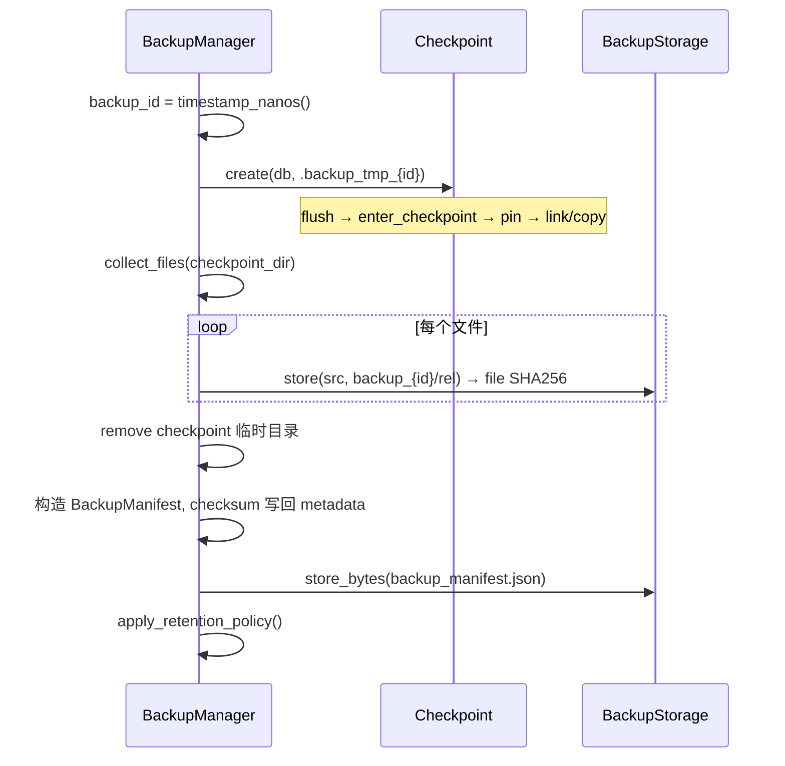
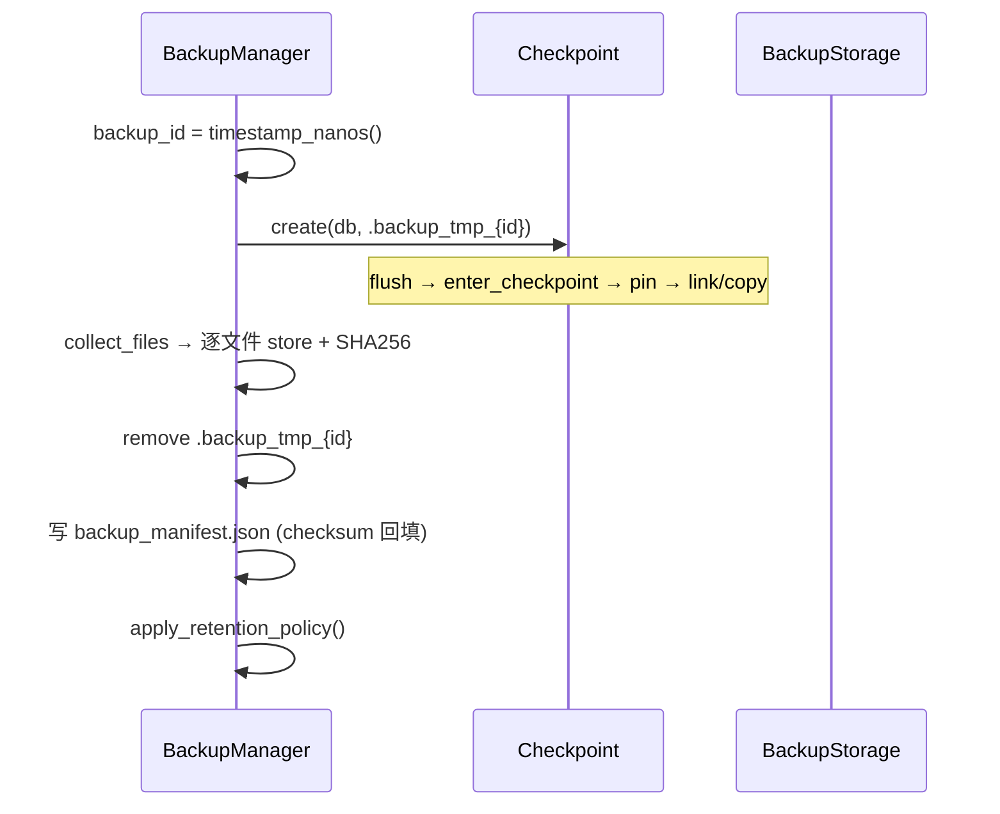

# Cursor transcript

---

## 1. User

## 文档整理 — 新会话

工作目录: `<workspace>` (含 aidb/、aikv/、aifactory/)

请先阅读 (不要跳过):

1. `AiKv-Workflow/backup/design.md` — 总规程
2. `AiKv-Workflow/backup/PROGRESS.md` — 当前进度
3. `AiKv-Workflow/backup/INDEX.md` — 本章索引 (若已有行则更新)

---

### 本次任务

| 项 | 值 |
|----|-----|
| PROGRESS 总步 | 9 |
| 目标文件 | `aidb/docs/modules/backup.md` |
| 本次子步 | 从步 0 开始 |
| 对比深度 | 模块级 (见 `design.md` — aidb `backup` 非加深章) |

### 必须遵守

- **确认门控**: 步 0→1→2→3→4, 每步先讨论, 我确认后再下一步
- **步 4**: 先出 Module Skill 正文 **草稿**, 我确认后再写入 aidb/aikv、更新 INDEX/PROGRESS
- **Module Skill 基础模板**: frontmatter `name` + `description` (含 `Use when`); 见 `design.md`
- **过程只进 backup/**: INDEX; aidb/aikv 不写迁移历史
- **旧文档顺序**: `backup/{aidb,aikv}/` → `*-oldmain` → WiQunTools inventory 段 → wiqun-*
- **待核实**: module 一行引用; 详情写入 **当前仓库** 根目录 `ISSUES.md` (`aidb/ISSUES.md`)
- **步 4 落盘前**: 对照 create-skill Summary Checklist 自检 (见 `design.md`)

### 上下文 (上一章已完成)

- 步 8 ✅ [`aikv/docs/modules/commands-extended.md`](aikv/docs/modules/commands-extended.md) — JSON/Lua/BlockingRegistry/MIGRATE/persistence/server; ISSUE-005~012
- 前置 module: [`engine.md`](aidb/docs/modules/engine.md), [`engine-storage.md`](aidb/docs/modules/engine-storage.md) (尤其 `Checkpoint::create`); [`cluster.md`](aidb/docs/modules/cluster.md) 仅链 slot migration checkpoint, 不重复
- 本章覆盖 `aidb/src/backup/{mod,manager,recovery,storage,util}.rs`; 步 10 observability 会写 `aidb_backup_*` metrics
- WiQunTools 查漏: `13-backup-bench.md` §1 备份/恢复 (§2 Metrics / §3 bench 与 observability/development 分界)

### 边界提示 (步 0 可细化)

- **本章**: `BackupStorage` / `LocalFileStorage`, `BackupManager`, `RecoveryManager`, `RetentionPolicy`; 与 `Checkpoint::create` 的关系; restore 流程 (临时目录 + rename)
- **不重复**: SSTable/checkpoint 内部机制 → engine-storage; slot migration 文件 checkpoint → cluster; Prometheus `/metrics` 暴露 → observability (步 10); criterion bench → development 或 observability 边界

### 本次不要

- 不要跳过未确认的步骤
- 不要一次写多篇 module
- 不要修改 `design.md` / 流程, 除非我明确要求
- 不要 commit, 除非我明确要求

---

请从步 0 开始, 给出本步交付物, 等我确认。

---

## 2. Assistant

先阅读规程、进度与索引，并查看 `design.md` 中步 0 的交付要求。

---

## 3. Assistant

接下来对照 `src/` 与 modules 映射，梳理 `backup` 模块的文件结构与边界。

---

## 4. Assistant

## 步 0 — 定范围

**章节**: PROGRESS 步 9 · `aidb/docs/modules/backup.md`  
**对比深度**: 模块级 (非加深章)  
**状态**: 讨论中, 未写入 INDEX / aidb

---

### 本章覆盖 (`src/backup/*`)

| 路径 | 职责 | 入口 |
|------|------|------|
| `backup/mod.rs` | 模块根, re-export | `#[cfg(feature = "backup")]` via `lib.rs` |
| `backup/manager.rs` | 创建/列举/删除/保留策略 | `BackupManager`, `RetentionPolicy`, `BackupManifest` |
| `backup/recovery.rs` | 恢复与校验 | `RecoveryManager::restore`, `verify_backup` |
| `backup/storage.rs` | 存储抽象 | `BackupStorage` trait, `LocalFileStorage` |
| `backup/util.rs` | SHA256 | `sha256_file`, `sha256_bytes` |

**对外依赖 (只链不展开)**:
- `engine/checkpoint::Checkpoint::create` — `BackupManager` 在 DB 目录下建临时 checkpoint, 再复制到 `BackupStorage`
- `metrics.rs` — `aidb_backup_*` 计数/耗时 (feature `monitoring`)
- `Cargo.toml` — `backup` feature (默认启用), 依赖 `ring`/`hex`/`serde_json`

**公共 API 面 (步 1 细读)**:

```
BackupManager::create_backup[_with_description] / list_backups / get_backup_info
                  / delete_backup / apply_retention_policy
RecoveryManager::restore / verify_backup
BackupStorage + LocalFileStorage
RetentionPolicy + BackupManifest / BackupMetadata / BackupFileEntry
```

---

### 拟读文件列表

#### 步 1 — 新代码 (主)

| 优先级 | 路径 | 目的 |
|--------|------|------|
| P0 | `aidb/src/backup/{mod,manager,recovery,storage,util}.rs` | 职责、主流程、类型 |
| P0 | `aidb/src/engine/checkpoint/mod.rs` | 与 `Checkpoint::create` 的衔接 (不重复内部机制) |
| P1 | `aidb/tests/backup.rs` | 集成场景: 空库、roundtrip、并发 |
| P1 | `aidb/examples/backup.rs` | 端到端用法 |
| P2 | `aidb/src/metrics.rs` (backup 段) | 指标名与触发点, 正文留给 observability |
| P2 | `aidb/Cargo.toml` | `backup` / `monitoring` feature |

#### 步 2 — 旧文档 (按 design.md 顺序)

| 顺序 | 来源 | 路径 |
|------|------|------|
| 1 | backup/aidb | `ARCHITECTURE.md`, `DEPLOYMENT.md`, `CHANGELOG.md`, `CONTRIBUTING.md` |
| 1 | backup/aidb | `docs/observability.md` (backup span 段) |
| 2 | aidb-oldmain | `docs/monitoring/MONITORING_GUIDE.md` (backup metrics) |
| 2 | aidb-oldmain | `docs/monitoring/ADMIN_TOOL_GUIDE.md` (backup CLI — 当前仓库无 `aidb-admin`, 标过时) |
| 3 | WiQunTools | `docs/wiqun-db-inventory/13-backup-bench.md` **§1 备份/恢复** |
| 4 | wiqun-db | 与 backup/aidb 重叠时二选一查漏 |

#### 步 3 — 旧代码对照 (模块级)

| 来源 | 说明 |
|------|------|
| aidb-oldmain | 若有 `src/backup/` 或等价实现, 对照 API/流程 |
| wiqun-db | 中间态查漏 |

#### 关联 module (只引用, 步 1 不展开)

| 文档 | 关系 |
|------|------|
| [engine-storage.md](aidb/docs/modules/engine-storage.md) | `Checkpoint::create` 内部 |
| [cluster.md](aidb/docs/modules/cluster.md) | slot 迁移 **文件 checkpoint** (不同概念) |
| [commands-extended.md](aikv/docs/modules/commands-extended.md) | AiKv BGSAVE 直接调 `Checkpoint`, **不用** `BackupManager` |

---

### 本章边界

#### ✅ 本章写

- `BackupStorage` / `LocalFileStorage` 契约与目录布局 (`backup_manifest.json`, 按 `backup_id` 分目录)
- `BackupManager` 全流程: `Checkpoint::create` → 逐文件 `store` → manifest + checksum → `apply_retention_policy`
- `RetentionPolicy` 四条规则 (`min_age` / `min_count` / `max_count` / `max_age`)
- `RecoveryManager`: manifest 校验 → `restore_tmp_{id}` → 逐文件 SHA256 → `DB::open` 验证 → `rename` (EXDEV 时 `copy_dir_all`)
- `verify_backup` (不恢复)
- `backup` feature gate 与 `examples/backup.rs` 用法
- 与 `Checkpoint::create` 的**组合关系** (一句话 + 链到 engine-storage)

#### ❌ 不重复 (链出去)

| 主题 | 归属 |
|------|------|
| SSTable pin / `enter_checkpoint` / link-or-copy | engine-storage |
| slot 迁移断点文件 | cluster |
| `aidb_backup_*` Prometheus 注册与 `/metrics` HTTP | observability (步 10) |
| `benches/backup_bench.rs` criterion 细节 | development 或 observability 边界 (正文至多一句) |
| AiKv `BGSAVE` / `backup_dir` | aikv commands-extended |
| oldmain `aidb-admin backup` CLI | 已移除, 步 2 标「已过时」 |

---

### 拟 INDEX 行 (确认步 0 后写入)

```
| `docs/modules/backup.md` | 🔄 进行中 | (步 2 填) | | `backup/*`; Checkpoint 组合; RetentionPolicy; restore rename |
```

---

### 步 4 预设 (供后续对齐, 步 0 不落盘)

- **Skill name**: `aidb-backup`
- **description 草案**: `AiDb full backup and restore — BackupManager, RecoveryManager, BackupStorage, RetentionPolicy. Use when changing src/backup/*, debugging backup/restore, retention policy, or Checkpoint-based snapshot packaging.`
- **Mermaid**: create 流程 + restore 五步 (临时目录 + rename)
- **常见任务**: 创建备份、列举/删除、手动 restore、调 RetentionPolicy、`--no-default-features` 禁用 backup

---

请确认步 0: **可以** / **调整…** (例如边界增减、拟读列表优先级). 确认后进入步 1 读新代码.

---

## 5. User

可以

---

## 6. Assistant

步 0 已确认。开始步 1：通读 `backup` 源码并整理职责与主流程要点。

---

## 7. Assistant

## 步 1 — 读新代码

已通读 `aidb/src/backup/*`、与 `Checkpoint::create` 的衔接, 并跑通测试 (`tests/backup.rs` 3 项 + 模块内 13 项, 全部通过). INDEX 已标为 🔄 步 1.

---

### 模块职责 (一句话)

**在 `Checkpoint` 目录快照之上, 加 manifest/校验/保留策略/可插拔存储, 提供全量备份创建、列举、删除与恢复.**

与 AiKv `BGSAVE` 的分工: AiKv 直接调 `Checkpoint::create` 写到 `backup_dir`; **本章** 的 `BackupManager` 是带元数据与远程存储抽象的「备份产品化」层.

---

### 代码地图

| 路径 | 职责 | 入口 |
|------|------|------|
| `backup/mod.rs` | re-export; `#[cfg(feature = "backup")]` | `lib.rs` |
| `backup/manager.rs` | 创建/列举/删除/保留 | `BackupManager`, `RetentionPolicy`, manifest 类型 |
| `backup/recovery.rs` | 恢复/校验 | `RecoveryManager::restore`, `verify_backup` |
| `backup/storage.rs` | 存储抽象 | `BackupStorage`, `LocalFileStorage` |
| `backup/util.rs` | SHA256 (`ring` + `hex`) | `sha256_file`, `sha256_bytes` |

**目录布局** (`LocalFileStorage`):

```shell
{root}/
└── backup_{id}/              # backup_path(backup_id)
    ├── backup_manifest.json  # 元数据 + 文件清单 + manifest checksum
    ├── CURRENT
    ├── MANIFEST-*
    ├── *.sst
    └── wal/ ...
```

**BackupId**: `timestamp_nanos()` (纳秒时间戳, 非顺序 ID).

---

### 主流程

#### 创建 (`create_backup_with_description`)



要点:
- checkpoint 临时目录在 **DB 数据目录内** (`db.path()/.backup_tmp_{id}`), 完成后删除
- `data_size` == `backup_size` (当前无压缩)
- `metadata.db_sequence` = `db.current_sequence()`; `version` = `CARGO_PKG_VERSION`
- 创建结束**自动**跑保留策略

#### 恢复 (`restore`)

1. 目标 `db_path` 若存在且非空 → `InvalidArgument`
2. 读 manifest, 校验 manifest checksum (checksum 字段清零后 SHA256)
3. 在 `db_path` **父目录** 建 `restore_tmp_{id}`
4. 逐文件 `load` + SHA256 校验; 失败则删临时目录
5. `DB::open(tmp_dir, Options::for_testing())` 冒烟; 失败则删临时目录
6. `rename(tmp → db_path)`; `CrossesDevices` 时 `copy_dir_all` + `sync_all`
7. 父目录 / 目标目录 `sync_all`

#### 保留策略 (`RetentionPolicy::select_for_deletion`)

按 `created_at` 升序, 优先级:

1. `min_age` 内 → **young** 组, 不删
2. **old** 组: 保留数 = `min(old.len(), max_count - young).max(min_count - young, 0)` 逻辑
3. `max_age` 硬过期: 超龄**无条件**删 (不受 `min_count` 保护)

默认: `min_count=3`, `max_count=30`, `min_age=1d`, `max_age=30d`.

#### 列举/删除/校验

- `list_backups`: `storage.list("backup_")` → 读各 manifest; 损坏 manifest **warn 跳过**
- `delete_backup`: `remove_dir_all(backup_path(id))`
- `verify_backup`: manifest + 每文件 SHA256; 任一失败返回 `Ok(false)` (不抛错)

---

### 关键类型与 API (pub)

| 类型/API | 说明 |
|----------|------|
| `BackupStorage` | `store`/`store_bytes`/`load`/`list`/`delete`/`backup_path` |
| `LocalFileStorage::new(root)` | 唯一内置实现; `fs::copy` (非 hardlink) |
| `BackupManager::new(storage, policy)` | 持有 `Arc<dyn BackupStorage>` |
| `create_backup` / `create_backup_with_description` | 主入口 |
| `list_backups` / `get_backup_info` / `delete_backup` | CRUD |
| `apply_retention_policy` | 返回被删 ID 列表 |
| `RecoveryManager::restore` / `verify_backup` | 恢复与校验 |

**未使用** `Checkpoint::verify_openable` — restore 直接用 `DB::open` 等价校验.

---

### Feature / 可观测性 (边界)

| 项 | 位置 | 说明 |
|----|------|------|
| `backup` feature | `Cargo.toml` default | 关则整个 `backup` mod 不存在; 依赖 `ring`/`hex`/`serde_json` |
| `monitoring` feature | `manager`/`recovery` | `aidb_backup_total{op}`, `aidb_backup_size_bytes`, `aidb_backup_duration_seconds` |
| tracing span | 各 `#[instrument]` | `backup_create/list/delete/retention/restore/verify` |

指标细节留给 observability (步 10); 本章只记触发点.

---

### 测试覆盖

| 层级 | 文件 | 场景 |
|------|------|------|
| 单元 | `manager.rs` | 保留策略 5 种组合 |
| 单元 | `storage.rs` | store/load/bytes/list/delete |
| 单元 | `recovery.rs` | verify 完整 / 篡改 SST |
| 集成 | `tests/backup.rs` | 空库、roundtrip 10 keys、并发写后 verify |
| 示例 | `examples/backup.rs` | 100 keys 全流程 |

```bash
cargo test --test backup
cargo test -p aidb --lib backup
cargo run --example backup
```

---

### 步 2/3 预备观察 (非 ISSUE, 仅记录)

1. **双重复制**: checkpoint 已 link/copy 到 `.backup_tmp_*`, `BackupManager` 再 `fs::copy` 到 `backup_{id}` — 设计取舍, 非 bug
2. **`list_backups` 容错**: 坏 manifest 静默跳过 (warn), `get_backup_info` 则 `Corruption`
3. **restore 目标**: 允许空目录存在; 非空才拒
4. **无压缩/增量**: WiQunTools §1 终态设计中的 compress 未实现
5. **无集群协调备份**: 单 `DB` 实例; 集群多 group 见 aikv `cluster_adapter::checkpoint_group_storages`

---

请确认步 1: **可以** / **调整…**. 确认后进入步 2 查旧文档.

---

## 8. User

可以

---

## 9. Assistant

步 1 已确认。开始步 2：按规程顺序查阅旧文档并分类。

---

## 10. Assistant

## 步 2 — 查旧文档

按 `design.md` 顺序查阅 backup 相关旧文档, 分类如下. **未写入** INDEX / `ISSUES.md`, 等你确认.

---

### 旧文档清单与分类

| 顺序 | 路径 | 分类 | 说明 |
|------|------|------|------|
| 1 | `backup/aidb/ARCHITECTURE.md` | ✅ 仍有效 | `backup/*` 五文件结构、Checkpoint + 文件复制与现码一致 |
| 1 | `backup/aidb/DESIGN.md` §备份 | ✅ 仍有效 | 「基于 Checkpoint」「临时目录 + rename」理由仍适用 |
| 1 | `backup/aidb/DEPLOYMENT.md` §备份 | ✅ 仍有效 | API 示例、`aidb_backup_*` 指标名与现码一致 |
| 1 | `backup/aidb/CHANGELOG.md` (Phase 18 段) | ✅ 仍有效 | 实现权威记录; 步 4 消化时可归档 |
| 1 | `backup/aidb/CONTRIBUTING.md` | ✅ 仍有效 | 目录树、`cargo run --example backup` |
| 1 | `backup/aidb/README.md` (M5 行) | ✅ 仍有效 | 特性概览一句 |
| 1 | `backup/aidb/docs/observability.md` §Backup | ⚠️ 部分过时 | 仅列 `backup_create`/`backup_restore`; 缺 `list/delete/retention/verify`; 属性写 `path`/`entries`, 现码为 `backup_id`/`file_count`/`total_size` → **步 10 observability** 修, 本章不展开 |
| 1 | `backup/aidb/docs/superpowers/specs/...slot-migration-cli-design.md` | ✅ 仍有效 | 「单节点 backup + Raft 追数据」决策; 集群协调备份不在 scope |
| 2 | `aidb-oldmain/docs/monitoring/ADMIN_TOOL_GUIDE.md` | ❌ 已过时 | `aidb-admin backup {create,list,restore,delete}`、`--compress` — 当前仓库**无此 CLI** |
| 2 | `aidb-oldmain/docs/monitoring/MONITORING_GUIDE.md` §Backup | ❌ 已过时 | `aidb_backups_total{status}`、`aidb_restore_duration_seconds` — 现为 `aidb_backup_total{op=create\|delete\|restore}`, 无独立 restore histogram |
| 2 | `aidb-oldmain/src/backup/*` | 🔄 设计偏离 | 见下「oldmain 差异预览」(步 3 细对照) |
| 2 | `aidb-oldmain/examples/README.md` | ✅ 概念有效 | 「一致性备份」一句; 无实现细节 |
| 3 | `WiQunTools/.../13-backup-bench.md` **§1** | ⚠️ 大部分有效 + 实现偏离 | 数据结构/trait/Recovery/Retention 与现码一致; **创建路径** inventory 写直连 `pin_sstables`, 现码用 `Checkpoint::create` + 二次 `fs::copy`; 「未来考量」增量/S3/加密未实现 |
| 3 | 同文件 **§2** Metrics HTTP | ➡️ 不属本章 | wiqun-kv / aidb observability (步 10) |
| 3 | 同文件 **§3** bench | ➡️ 边界 | `benches/backup_bench.rs` 已实现; 正文至多一句链 development |
| 4 | `wiqun-db/*` | ⏭️ 跳过 | 与 `backup/aidb/` 重叠 (`wiqun_backup_*` 已 rename 为 `aidb_*`) |

---

### oldmain 差异预览 (步 3 细读)

| 维度 | oldmain | 当前 aidb |
|------|---------|-----------|
| 模块文件 | `metadata.rs` 中央索引 | `util.rs` SHA256; 每备份独立 `backup_manifest.json` |
| `BackupManager` | `new(storage)` + `RwLock<BackupMetadata>` | `new(storage, RetentionPolicy)`; policy 内嵌 |
| 创建路径 | `flush` → 逐 SST + WAL 复制 | `Checkpoint::create` → 收集全目录 → `BackupStorage::store` |
| 备份类型 | `BackupType::Full` / 增量预留 | 仅全量 |
| 存储 | 泛型 `BackupManager<S>` | `Arc<dyn BackupStorage>` |
| ID | `generate_backup_id()` (字符串?) | `timestamp_nanos()` u64 |
| CLI | `aidb-admin` | 库 API + `examples/backup.rs` |

---

### 与已完成 module 的交叉引用 (旧文档中的边界)

| 主题 | 旧文档说法 | 处理 |
|------|-----------|------|
| Checkpoint 内部 | ARCHITECTURE/DESIGN/WiQunTools §1 | 链 [engine-storage.md](aidb/docs/modules/engine-storage.md), 不重复 |
| AiKv BGSAVE | WiQunTools 提 checkpoint MVP 供 BGSAVE | 链 [commands-extended.md](aikv/docs/modules/commands-extended.md) |
| slot 迁移 checkpoint | superpowers spec | 链 [cluster.md](aidb/docs/modules/cluster.md) |
| Prometheus 暴露 | DEPLOYMENT + observability | 链 observability (步 10) |

---

### 拟新增 ISSUES (步 2–3 门控讨论)

建议 **3 条 doc-only**, 本章「待核实」可写「无」或仅引用若你倾向留痕:

| 编号 | 标题 | 状态建议 | 现象 | module 影响 |
|------|------|----------|------|-------------|
| **ISSUE-011** | 创建路径为 Checkpoint 组合而非 inventory 直连 pin_sstables | doc-only | WiQunTools §1.3 伪代码逐步 `pin_sstables`; 现码 `Checkpoint::create` 后二次复制到 `backup_{id}` | 正文写实际流程; 已知限制可提双重复制 I/O |
| **ISSUE-012** | 无 backup_id 碰撞重试与压缩/增量/S3 | doc-only | inventory 设计 `while backup_exists`; 「未来考量」增量/远程/加密均未实现; oldmain 有 incremental 类型预留 | 「已知限制」列举; 非 bug |
| **ISSUE-013** | list 与 get 对损坏 manifest 行为不一致 | doc-only | `list_backups` warn 跳过; `get_backup_info` 返回 `Corruption` | 常见任务/已知限制一句 |

**不建议开 ISSUE**:
- restore 用 `Options::for_testing()` 冒烟 — 与 WiQunTools §1.5 一致, 属 deliberate
- observability span 字段漂移 — 归步 10
- oldmain metrics 命名 — 已过时, 不写入 aidb ISSUES

若你同意 **不写 ISSUE、待核实填「无」**, 也可以说一声.

---

### 步 4 文档应如何表述 (基于步 2 结论)

1. **以 CHANGELOG Phase 18 + 现码为准**, 不回迁 oldmain CLI / 中央 metadata.json
2. **吸收** DEPLOYMENT 示例、DESIGN 两条设计理由 (Checkpoint / rename)
3. **吸收** WiQunTools §1 数据结构表、Retention 四条规则、目录布局
4. **明确偏离**: 创建走 `Checkpoint::create` (链 engine-storage); 无 compress/incremental/S3
5. **不重复**: metrics 细节、backup_bench、aidb-admin、§2/§3 WiQunTools

---

### 拟 INDEX 更新 (确认步 2 后写入)

```
| `docs/modules/backup.md` | 🔄 步 3 | backup/aidb {ARCH,DESIGN,DEPLOY,CHANGELOG}; WiQunTools 13 §1; oldmain ADMIN/MONITORING (过时) | | Checkpoint 组合; ISSUE-011~013 (doc-only, 可选) |
```

---

请确认步 2:

1. **分类** 是否 OK?
2. **ISSUE-011~013**: 写入 `aidb/ISSUES.md` / 还是 **待核实写「无」**?
3. 确认后进入 **步 3** oldmain 代码模块级对照.

---

## 11. User

可以，写入 ISSUE

---

## 12. Assistant

步 2 已确认。正在写入 ISSUES，并对照 oldmain 做步 3 模块级代码对比。

---

## 13. Assistant

## 步 2 收尾

已写入 [`aidb/ISSUES.md`](aidb/ISSUES.md) **ISSUE-011 ~ 013** (均为 doc-only), INDEX 已更新为 🔄 步 3.

---

## 步 3 — 对比旧代码 (模块级)

对照 `aidb-oldmain/src/backup/*` 与当前 `aidb/src/backup/*`.

### 差异表

| 维度 | oldmain | 当前 aidb | 主流程等价? | 文档表述建议 |
|------|---------|-----------|-------------|--------------|
| **模块结构** | `manager` + `metadata` + `recovery` + `storage` | `manager` + `recovery` + `storage` + `util` | — | 写现五文件; 不提 metadata.rs |
| **BackupId** | `String` (`backup-{secs}`) | `u64` (纳秒时间戳) | 否 (格式变) | 写 u64 + `backup_{id}/` 目录名 |
| **元数据索引** | 根目录单文件 `metadata.json` + `RwLock` | 每备份 `backup_manifest.json` | 否 (架构变) | 写 per-backup manifest; oldmain 中央索引已废弃 |
| **BackupManager 构造** | `new(storage)` / `with_retention_policy` | `new(Arc<dyn BackupStorage>, RetentionPolicy)` | API 变 | 示例用 `Arc::new(LocalFileStorage::new(...))` |
| **创建路径** | `flush` → `list_sstable_files` + `list_wal_files` 分目录上传 | `Checkpoint::create` → 递归收集 → `store` | **语义等价** (一致性快照) | 链 engine-storage; ISSUE-011 |
| **MANIFEST/CURRENT** | 未显式备份 (仅 SST+WAL 列表) | checkpoint 含全目录 (MANIFEST/CURRENT 等) | **现码更完整** | 强调「目录级一致性」, 优于 oldmain |
| **校验** | 无 per-file SHA256 | 每文件 + manifest SHA256 | 增强 | 写校验链 |
| **RetentionPolicy** | `min_age_seconds` / `max_count` 等秒级字段 | `Duration` + `min_count`/`max_count`/`max_age` | 规则类似 | 写四条优先级 (步 1 已梳理) |
| **list/get** | 内存 metadata; `get` 返回 `Option` | 扫磁盘 manifest; `get` 抛 `Corruption` | 行为变 | ISSUE-013 |
| **RecoveryManager** | 静态方法 `restore(&manager, &id, path)` | 实例 `new(storage)` + `restore(id, path)` | API 变 | 写现 API |
| **恢复流程** | 直接 download 到 target (无 tmp) | tmp → SHA256 → `DB::open` → rename/EXDEV | **现码更安全** | 写五步 + EXDEV fallback |
| **verify_backup** | 检查文件存在; 返回 `Result<()>` | SHA256 全量校验; 返回 `Result<bool>` | 增强 | 写 `Ok(false)` 语义 |
| **BackupStorage** | `write/read/upload/download/exists` (字符串路径) | `store/store_bytes/load/read_to_string/list/delete` (`Path`) | trait 重写 | 写现 trait; S3 为「未来」 |
| **备份类型** | `Full` / `Incremental` 预留 | 仅全量 | 缩减 | ISSUE-012 |
| **错误类型** | `Error::AlreadyExists` (非空目录) | `Error::InvalidArgument` | 映射变 | 写 `InvalidArgument` 文案 |
| **可观测性** | `log::info!` | tracing span + `aidb_backup_*` (monitoring) | 增强 | 链 observability |
| **feature gate** | 无 | `backup` default feature | 新增 | 写 Cargo.toml |
| **CLI** | 设计有 `aidb-admin` | 无; `examples/backup.rs` | — | 不提 CLI |

### 主流程等价性结论

| 流程 | 结论 |
|------|------|
| **创建备份** | **等价意图、实现更强**: oldmain 手工枚举 SST/WAL; 现码经 `Checkpoint` 得完整可 `DB::open` 目录集 |
| **恢复** | **现码严格优于 oldmain**: 原子 rename + 完整性校验; oldmain 直写 target, 中途失败可留脏数据 |
| **保留策略** | **概念等价**: oldmain `get_backups_to_delete` ≈ 现 `select_for_deletion`; 现码多 `max_age` 硬过期 |
| **列举/删除** | **不等价**: 索引从中央 metadata → 分布式 manifest; API 签名也变 |

### 与 WiQunTools §1 设计对照

| 设计项 | 现码 | 备注 |
|--------|------|------|
| 数据结构 (Metadata/Manifest/Retention) | ✅ 一致 | serde JSON 格式 |
| `BackupStorage` trait 核心方法 | ✅ 基本一致 | 多 `read_to_string`; 路径 `Path` 非 `str` |
| Recovery 五步 + EXDEV | ✅ 一致 | |
| 创建: `pin_sstables` 逐步 | ❌ 偏离 | 改用 Checkpoint (ISSUE-011) |
| `backup_exists` 碰撞重试 | ❌ 未实现 | ISSUE-012 |
| `dbsize()` 恢复校验不变式 | ❌ 未实现 | 用 `DB::open` 冒烟替代 |
| 增量/S3/加密 | ❌ 未实现 | ISSUE-012 / 已知限制 |

### 步 4 文档应如何表述 (步 3 建议)

1. **架构**: `Checkpoint::create` → manifest 化 → `BackupStorage` → `RetentionPolicy` 自动清理
2. **与 oldmain 差异**: 不写迁移表; 「已知限制」提无 CLI/增量/S3; restore 更安全
3. **与 engine-storage 分工**: checkpoint 机制一行链出; 本章只写「组合使用」
4. **与 aikv 分工**: `BackupManager` 供库集成; AiKv BGSAVE 直调 `Checkpoint` (链 commands-extended)
5. **待核实**: 三行 ISSUE 引用 (011~013)
6. **不测 oldmain API**: 示例/测试块用现 `Arc` + `examples/backup.rs` / `tests/backup.rs`

### 拟 INDEX 更新 (确认步 3 后)

```
| `docs/modules/backup.md` | 🔄 步 4 草稿 | (同上) | | oldmain 中央 metadata→per-manifest; restore 增强 |
```

---

请确认步 3: **可以** / **调整…**. 确认后进入步 4, 先出 Module Skill **正文草稿** 供你审阅.

---

## 14. User

可以

---

## 15. Assistant

步 3 已确认。对照已完成 module 与 create-skill 清单，起草步 4 正文草稿。

---

## 16. Assistant

## 步 4 — Module Skill 正文草稿

以下为 `aidb/docs/modules/backup.md` 草稿, **尚未落盘**. 请审阅后回复 **可以** / **调整…**.

---

### create-skill 自检 (落盘前)

| 项 | 状态 |
|----|------|
| description 含 WHAT + WHEN, 第三人称 | ✅ |
| 正文 <500 行 (~190 行) | ✅ |
| 术语一致 (manifest / checkpoint / BackupStorage) | ✅ |
| 链接一层深度 (engine-storage / commands-extended / ISSUES) | ✅ |
| 无时间敏感表述 | ✅ |
| 常见任务为步骤列表 | ✅ |

---

### 草稿正文

```markdown
---
name: aidb-backup
description: AiDb full backup and restore — BackupManager, RecoveryManager, BackupStorage, RetentionPolicy, manifest checksums. Use when changing src/backup/*, debugging backup/restore or retention policy, integrating BackupManager with DB, or understanding Checkpoint-based snapshot packaging.
---

# AiDb Backup (备份与恢复)

## 何时读本文

- 改 `src/backup/*` 或集成 `BackupManager` / `RecoveryManager`
- 排查备份创建、manifest 校验、保留策略、restore 失败
- **不覆盖**: `Checkpoint::create` 内部 (pin / link-copy / compaction 互斥) → [engine-storage.md](engine-storage.md)
- **不覆盖**: slot 迁移文件 checkpoint → [cluster.md](cluster.md)
- **不覆盖**: AiKv `BGSAVE` (直调 `Checkpoint`, 不用 `BackupManager`) → aikv [commands-extended.md](../../../aikv/docs/modules/commands-extended.md)
- **不覆盖**: `aidb_backup_*` Prometheus 注册与 HTTP 暴露 → [observability.md](observability.md) (步 10)
- **构建**: 默认启用 `backup` feature; 关则整个 `backup` mod 不存在

## 代码地图

| 路径 | 职责 | 入口 |
|------|------|------|
| `backup/mod.rs` | re-export | `#[cfg(feature = "backup")]` via `lib.rs` |
| `backup/manager.rs` | 创建 / 列举 / 删除 / 保留策略 | `BackupManager`, `RetentionPolicy`, manifest 类型 |
| `backup/recovery.rs` | 恢复 / 校验 | `RecoveryManager::restore`, `verify_backup` |
| `backup/storage.rs` | 存储抽象 | `BackupStorage`, `LocalFileStorage` |
| `backup/util.rs` | SHA256 (`ring` + `hex`) | `sha256_file`, `sha256_bytes` |

**存储目录布局** (`LocalFileStorage`):

```shell
{root}/
└── backup_{id}/              # backup_path(backup_id)
    ├── backup_manifest.json  # 元数据 + 文件清单 + manifest checksum
    ├── CURRENT
    ├── MANIFEST-*
    ├── *.sst
    └── wal/ ...
```

**与 Checkpoint 分工**: `BackupManager` 调用 `Checkpoint::create` 得 DB 目录级快照, 再复制到 `backup_{id}` 并写 manifest; 不重复实现 pin / link-copy.

## 关键 invariant (勿破坏)

- **一致性来源**: 备份数据必须来自 `Checkpoint::create` 输出 (含 MANIFEST/CURRENT/SST/WAL), 不可只复制 SST 列表
- **manifest checksum**: 序列化时 `metadata.checksum` 先为空, SHA256 后回填; restore / verify 须复现同一规则
- **per-file SHA256**: `BackupFileEntry.checksum` 为备份存储中文件的 SHA256; restore 逐文件校验
- **restore 原子性**: 必须先写到 `restore_tmp_{id}`, `DB::open` 冒烟通过后再 `rename` (EXDEV 时 `copy_dir_all`)
- **保留策略**: `max_age` 硬过期不受 `min_count` 保护; `min_age` 内备份归入 young 组不删
- **目标目录**: restore 时 `db_path` 可不存在或**空目录**; 非空 → `Error::InvalidArgument`

## 数据流

### 创建备份



### 恢复

```mermaid
flowchart TD
    A[读 manifest + 校验 checksum] --> B[restore_tmp_{id}]
    B --> C[逐文件 load + SHA256]
    C --> D[DB::open 冒烟]
    D --> E{rename tmp → db_path}
    E -->|ok| F[sync 父目录]
    E -->|EXDEV| G[copy_dir_all + sync]
```

## 关键类型与 API

| 类型 / API | 说明 |
|------------|------|
| `BackupId` | `u64`, 纳秒时间戳 |
| `BackupMetadata` / `BackupManifest` / `BackupFileEntry` | serde JSON; manifest 在 `backup_manifest.json` |
| `RetentionPolicy` | `min_count`/`max_count`/`min_age`/`max_age`; 默认 3/30/1d/30d |
| `BackupStorage` | `store`, `store_bytes`, `load`, `read_to_string`, `list`, `delete`, `backup_path` |
| `LocalFileStorage::new(root)` | 唯一内置实现; `fs::copy` |
| `BackupManager::new(Arc<dyn BackupStorage>, policy)` | 创建后自动 `apply_retention_policy` |
| `create_backup` / `create_backup_with_description` | 主入口 |
| `list_backups` / `get_backup_info` / `delete_backup` | CRUD |
| `RecoveryManager::new(storage)` | 与 Manager 共享同一 `Arc<dyn BackupStorage>` |
| `restore(id, db_path)` | 五步流程 (见上) |
| `verify_backup(id)` | 不恢复; 失败返回 `Ok(false)` |

`RecoveryManager` 冒烟使用 `Options::for_testing()`, 非调用方生产 `Options`.

## 常见任务

### 创建并列举备份

1. `let storage = Arc::new(LocalFileStorage::new(backup_root));`
2. `let manager = BackupManager::new(storage.clone(), RetentionPolicy::default());`
3. `let id = manager.create_backup(&db)?;` (或 `create_backup_with_description`)
4. `manager.list_backups()?` — 按 `created_at` 降序

### 恢复到新目录

1. 确保目标目录不存在或为空
2. `let recovery = RecoveryManager::new(storage);`
3. `recovery.restore(id, &restore_path)?;`
4. `DB::open(&restore_path, options)?` 验证业务数据

### 仅校验备份完整性

```rust
assert!(RecoveryManager::new(storage).verify_backup(id)?);
```

### 调整保留策略

1. 构造 `RetentionPolicy { min_count, max_count, min_age, max_age }`
2. 传入 `BackupManager::new`
3. 每次 `create_backup` 结束自动清理; 也可手动 `apply_retention_policy()`

### 自定义存储后端

1. 实现 `BackupStorage` trait (`Send + Sync`)
2. `BackupManager::new(Arc::new(MyStorage), policy)` — Manager / Recovery 逻辑不变

### 禁用 backup 模块

```bash
cargo build --no-default-features
# 或显式: cargo build --no-default-features --features monitoring,cluster,...
```

## 配置与 feature flags

| 项 | 位置 | 说明 |
|----|------|------|
| `backup` | `Cargo.toml` default | 启用 `src/backup/`; 依赖 `ring`, `hex`, `serde_json` |
| `monitoring` | `manager` / `recovery` | `aidb_backup_total{op}`, `aidb_backup_size_bytes`, `aidb_backup_duration_seconds` |
| tracing span | `#[instrument]` | `backup_create`, `backup_list`, `backup_delete`, `backup_retention`, `backup_restore`, `backup_verify` |

## 测试

```bash
cargo test --test backup
cargo test -p aidb --lib backup
cargo run --example backup
```

| 文件 | 覆盖 |
|------|------|
| `tests/backup.rs` | 空库、roundtrip、并发写后 verify |
| `backup/manager.rs` tests | RetentionPolicy 五条规则 |
| `backup/recovery.rs` tests | verify 完整 / 篡改 SST |
| `benches/backup_bench.rs` | criterion (见 development / observability 边界) |

## 已知限制

- **双重复制 I/O**: checkpoint 已 link/copy 到 `.backup_tmp_*`, 再 `fs::copy` 到 `backup_{id}` (见 ISSUE-011)
- **无增量 / 压缩 / 远程存储**: 仅全量; 无 S3 trait 实现 (见 ISSUE-012)
- **无 backup_id 碰撞重试**: 单次 `timestamp_nanos()` (见 ISSUE-012)
- **`list` vs `get`**: 损坏 manifest 在 list 中 warn 跳过, get 抛 `Corruption` (见 ISSUE-013)
- **无 CLI**: 无 `aidb-admin`; 用库 API 或 `examples/backup.rs`
- **单 DB 实例**: 集群多 group 协调备份不在本章; aikv 集群 checkpoint 见 `storage/cluster_adapter.rs`

## 待核实

- 见 [ISSUES.md](../../ISSUES.md#issue-011--创建路径为-checkpoint-组合而非-inventory-直连-pin_sstables) — 创建路径为 Checkpoint 组合, 非 inventory 直连 pin_sstables
- 见 [ISSUES.md](../../ISSUES.md#issue-012--无-backup_id-碰撞重试与压缩增量s3) — 无碰撞重试、压缩、增量、S3
- 见 [ISSUES.md](../../ISSUES.md#issue-013--list_backups-与-get_backup_info-对损坏-manifest-行为不一致) — list 与 get 对损坏 manifest 行为不一致
```

---

### 步 4 确认后行政动作 (预览)

1. 写入 `aidb/docs/modules/backup.md`
2. INDEX 标 ✅ + 参考路径/处理结论
3. PROGRESS 步 9 标 ✅
4. 消化旧文档: `backup/aidb` 中 DEPLOYMENT §备份、CHANGELOG Phase 18 段等 (按章学习惯, 不删 whole 文件)

---

请确认草稿: **可以** / **调整…** (章节增删、措辞、ISSUE 引用方式等).

---

## 17. User

可以

---

## 18. Assistant

草稿已确认，开始落盘并更新 INDEX/PROGRESS。

---

## 19. Assistant

## 步 4 完成

`aidb/docs/modules/backup.md` 已落盘, 行政收尾如下.

### 写入

- [`aidb/docs/modules/backup.md`](aidb/docs/modules/backup.md) — Module Skill 正文 (frontmatter `aidb-backup`)
- [`aidb/ISSUES.md`](aidb/ISSUES.md) — ISSUE-011 ~ 013 (步 2 已写入)

### 过程文档

- [`PROGRESS.md`](AiKv-Workflow/backup/PROGRESS.md) — 步 9 ✅ (2026-06-18); 当前 **步 10/12**
- [`INDEX.md`](AiKv-Workflow/backup/INDEX.md) — backup 行 ✅; 归档 log 追加 oldmain `ADMIN_TOOL_GUIDE` §Backup → 无有效内容跳过

### 旧文档消化

| 来源 | 处理 |
|------|------|
| `backup/aidb/{ARCHITECTURE,DESIGN,DEPLOYMENT,CHANGELOG}` | 保留于 backup/ 作参考; 内容已吸收进 module |
| `WiQunTools/13-backup-bench.md` §1 | 查漏完成, 不迁入 |
| `aidb-oldmain` ADMIN backup CLI | 已过时, INDEX 标跳过 |
| `aidb-oldmain/src/backup/*` | 步 3 对照完成; 未删 (whole-tree 参考) |

### 下一章

**步 10** · `aidb/docs/modules/observability.md` — `metrics.rs` + monitoring feature, 含 `aidb_backup_*` 指标细节.

新开对话时用 [`SESSION-PROMPT.md`](AiKv-Workflow/backup/SESSION-PROMPT.md) 从步 0 开始即可.

---

## 20. User

使用 vibe-coding/scripts/archive-cursor-session.sh  帮我保存当前对话到 archive 里面 带 tool 和不带 tool 的都保存

---

## 21. Assistant

已归档当前对话 (PROGRESS 步 9 · `backup.md`).

| 类型 | 路径 |
|------|------|
| 纯对话 | [`aidb/archive/09-backup.md`](aidb/archive/09-backup.md) (848 行) |
| 含 tool 调用 | [`aidb/archive/tools/09-backup-with-tools.md`](aidb/archive/tools/09-backup-with-tools.md) (1871 行) |
| 元数据 | [`aidb/archive/09-backup.meta.json`](aidb/archive/09-backup.meta.json) |

- **sessionId**: `993d6957-ce9e-4461-963c-50f57ca2fb41`
- **exportedAt**: `2026-06-18T03:25:15Z`
