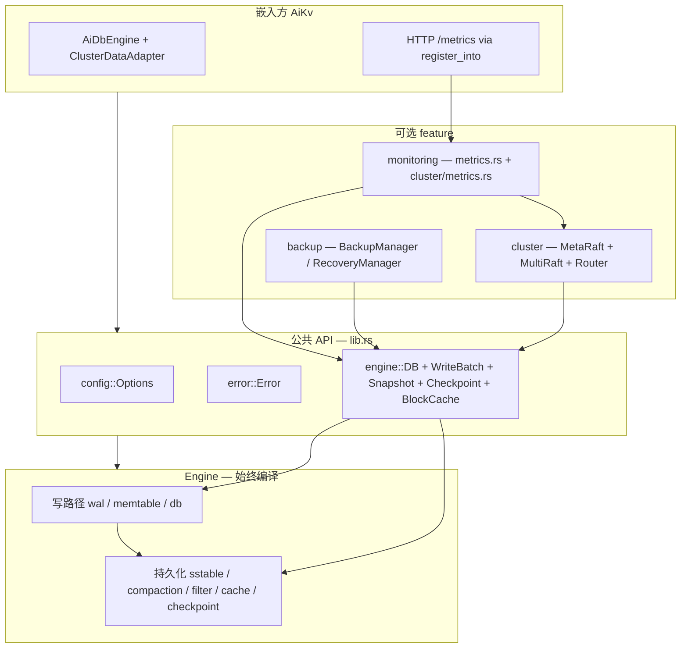
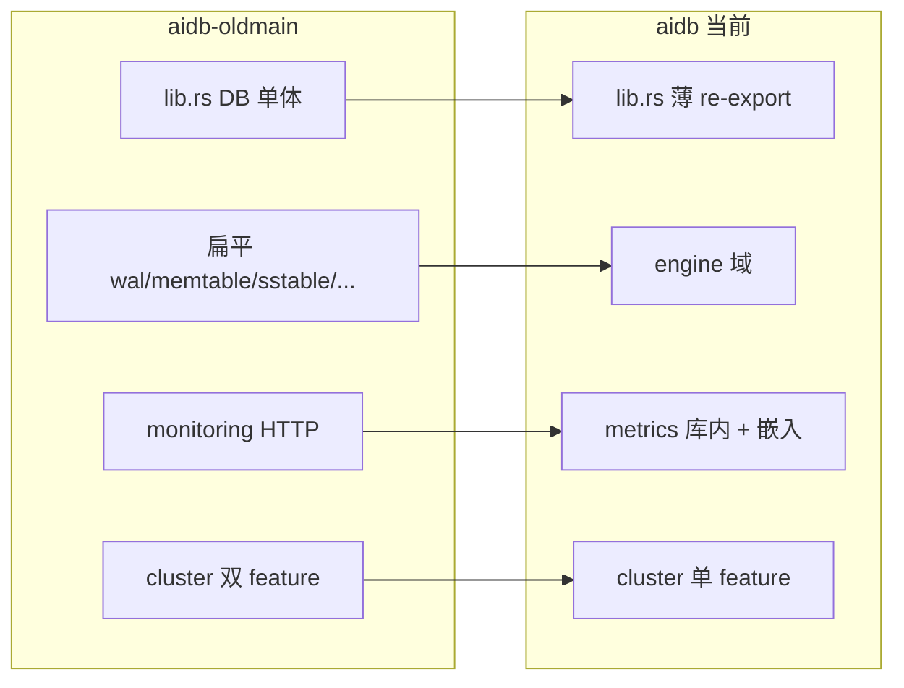
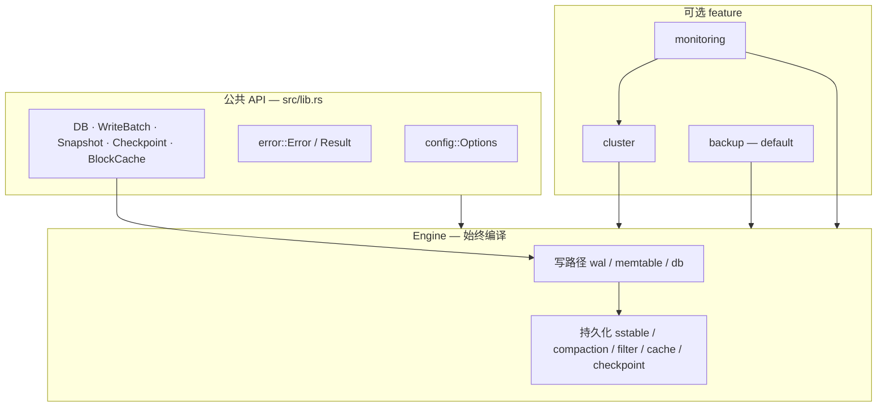
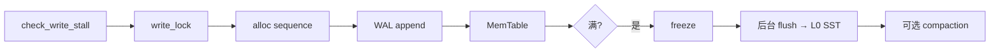
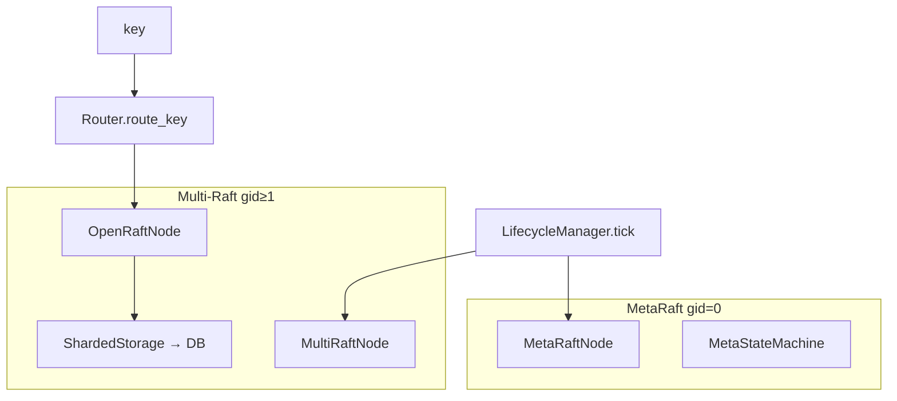

# Cursor transcript

---

## 1. User

## 文档整理 — 新会话

工作目录: `/root/code/database`

请先阅读 (不要跳过):
1. `AiKv-Workflow/backup/design.md` — 总规程
2. `AiKv-Workflow/backup/PROGRESS.md` — 当前进度
3. `AiKv-Workflow/backup/INDEX.md` — 本章索引 (若已有行则更新)

---

### 本次任务

| 项 | 值 |
|----|-----|
| PROGRESS 总步 | 13 (阶段 2a 首篇) |
| 目标文件 | `aidb/ARCHITECTURE.md` |
| 本次子步 | 从步 0 开始 |
| 对比深度 | **模块级** (汇总文档; 从 modules 提炼, 不加深章逐段) |

### 必须遵守

- **确认门控**: 步 0→1→2→3→4, 每步先讨论, 我确认后再下一步
- **步 4**: 先出 **正文草稿**, 我确认后再写入 `aidb/`、更新 INDEX/PROGRESS
- **汇总文档**: **不必** Module Skill frontmatter; 从 modules 提炼架构全景, **不重复** module 正文细节 (链到 `docs/modules/*.md`)
- **过程只进 backup/**: INDEX; aidb 不写迁移历史
- **旧文档顺序**: `backup/aidb/ARCHITECTURE.md` (主) → `aidb-oldmain` → WiQunTools 查漏 → wiqun-db
- **待核实**: 根文档至多简要提及; 详情仍引用 `aidb/ISSUES.md` (不展开排查过程)
- **步 4 落盘前**: 对照 design.md 验收项 — 链接有效、与当前 `src/` 一致、能定位入口

### 上下文 (阶段 1 已完成)

- aidb modules 全部 ✅:
  - [`aidb/docs/modules/engine.md`](aidb/docs/modules/engine.md)
  - [`aidb/docs/modules/engine-storage.md`](aidb/docs/modules/engine-storage.md)
  - [`aidb/docs/modules/cluster.md`](aidb/docs/modules/cluster.md)
  - [`aidb/docs/modules/backup.md`](aidb/docs/modules/backup.md)
  - [`aidb/docs/modules/observability.md`](aidb/docs/modules/observability.md)
- aikv modules 全部 ✅ (2b 再写 aikv ARCHITECTURE; 本篇可一笔带过 **与 aikv 嵌入边界** 若旧稿有)
- 旧稿: [`AiKv-Workflow/backup/aidb/ARCHITECTURE.md`](AiKv-Workflow/backup/aidb/ARCHITECTURE.md) (已移出 aidb 仓库)
- 当前 `aidb/` **尚无** 根目录 `ARCHITECTURE.md` (步 4 新建)

### 边界提示 (步 0 可细化)

- **本章**: 系统分层、模块关系、数据流总览、feature 边界 (`cluster` / `monitoring`)、与 aikv 嵌入关系 (库 vs 服务)
- **不重复**: WAL/MemTable/compaction 细节 → engine / engine-storage modules; Raft/slot 细节 → cluster module
- **宜含**: Mermaid 架构图、目录树 (directory-tree 规范)、指向 modules 的导航表
- **不宜含**: 迁移对照、ISSUES 全文、DEPLOYMENT 运维步骤 (步 15)

### 本次不要

- 不要跳过未确认的步骤
- 不要一次写多篇 (DESIGN/DEPLOYMENT 等留步 14+)
- 不要修改 `design.md` / 流程, 除非我明确要求
- 不要 commit, 除非我明确要求

---

请从步 0 开始, 给出本步交付物, 等我确认。

---

## 2. Assistant

按规程从步 0 开始: 先读 design.md、PROGRESS.md、INDEX.md 及旧稿与 modules 索引, 再给出本步交付物供你确认。

---

## 3. Assistant

继续查看当前 `aidb/src` 结构与各 module 文档边界, 以便准确定义步 0 范围。

---

## 4. Assistant

## 步 0 — 定范围 (PROGRESS 步 13 · `aidb/ARCHITECTURE.md`)

对照 `design.md` 步 0 要求: 本章是**汇总文档**, 覆盖 aidb 全库架构全景, 深度为**模块级** (从 5 篇 modules 提炼, 不逐段展开). 以下为交付物, **尚未写入** `aidb/`、`INDEX.md` 或 `PROGRESS.md`.

---

### 1. 本章定位

| 项 | 说明 |
|----|------|
| 文档类型 | 根目录汇总 (无 Module Skill frontmatter) |
| 读者 | 新人 / 嵌入方 (AiKv) / 跨模块改动前的鸟瞰 |
| 信息源 | 以当前 `src/` + 5 篇 `docs/modules/*.md` 为准; 旧稿 `backup/aidb/ARCHITECTURE.md` 仅作结构参考 |
| 与 AGENTS.md | AGENTS = AI 入口 + CI; ARCHITECTURE = 分层、模块关系、数据流、feature 边界、目录树 |
| 与 DESIGN.md (步 14) | 本篇只**点到**关键决策; 决策表与 trade-off 留给 DESIGN |

---

### 2. 本章边界 (含 / 不含)

**宜含**

- 产品定位: 嵌入式 LSM KV **库** (非独立服务)
- 系统分层: 公共 API → engine (写路径 + 持久化) → 可选 cluster / backup / metrics
- **Mermaid** 架构图 (分层 + 模块依赖) 与 **数据流总览** (写/读/compaction 各 1 段, 不展开 WAL Record / SST Block 格式)
- **目录树** (`src/` 按 domain 聚合, 遵循 directory-tree 规范; 不必列每个 `.rs`)
- **模块导航表**: module ↔ `src/` ↔ 何时深入阅读
- **Cargo feature 边界**: `cluster` / `backup` (默认开) / `monitoring`
- **与 AiKv 嵌入边界** (一笔带过): 库 vs 服务; sync API + `spawn_blocking`; slot/Multi-Raft 在 aidb, RESP/MOVED/ASK 在 aikv; metrics `register_into` 由 aikv HTTP 暴露
- **入口文件**: `lib.rs`, `engine/db/inner.rs` (`DB::open`), `cluster/mod.rs` (feature), `backup/manager.rs` (feature)
- **待核实**: 至多一行指向 `ISSUES.md`, 不展开

**不宜含** (链到 modules 或其它根文档)

| 主题 | 去向 |
|------|------|
| WAL/MemTable/WriteBatch/Snapshot 细节 | [engine.md](aidb/docs/modules/engine.md) |
| SSTable/compaction/Bloom/cache/checkpoint | [engine-storage.md](aidb/docs/modules/engine-storage.md) |
| MetaRaft/MultiRaft/Router/slot 迁移 | [cluster.md](aidb/docs/modules/cluster.md) |
| BackupManager/Recovery 流程 | [backup.md](aidb/docs/modules/backup.md) |
| Prometheus/tracing 接线 | [observability.md](aidb/docs/modules/observability.md) |
| 跨模块设计决策表 (完整) | 步 14 `DESIGN.md` |
| 部署/运维/protoc/端口 | 步 15 `DEPLOYMENT.md` |
| 迁移对照、oldmain 差异 | 仅 `backup/` |
| ISSUES 排查过程 | [ISSUES.md](aidb/ISSUES.md) |

---

### 3. `src/` 范围清单 (对照 modules↔src 表)

| 域 | `src/` 路径 | 入口 / 锚点 | 对应 module |
|----|-------------|-------------|-------------|
| 根 | `lib.rs`, `error.rs`, `config.rs` | `lib.rs` re-export; `Options` in `config.rs` | 各 module 简述 + 步 18 `development.md` |
| Engine 写路径 | `engine/{wal,memtable,db}/` | `DB::open` → `engine/db/inner.rs` | engine.md |
| Engine 持久化 | `engine/{sstable,compaction,filter,cache,checkpoint}/` | flush/compaction 在 `inner.rs` 编排 | engine-storage.md |
| Cluster | `cluster/*` (+ `aidb.raft.rs`) | `cluster/mod.rs`; `MultiRaftNode`, `Router` | cluster.md |
| Backup | `backup/*` | `BackupManager` in `manager.rs` | backup.md |
| Observability | `metrics.rs`, `cluster/metrics.rs` | `metrics::init`, `register_into` | observability.md |

**Feature gating** (`lib.rs`):

- 始终: `config`, `engine`, `error`
- `backup` (默认): `backup` mod
- `cluster`: `cluster` mod
- `monitoring`: `metrics` mod

---

### 4. 拟读文件列表 (步 1–4 用)

**步 1 — 新代码 (主)**

| 优先级 | 路径 | 目的 |
|--------|------|------|
| P0 | `aidb/src/lib.rs` | 公共面、feature、re-export |
| P0 | `aidb/src/engine/mod.rs`, `engine/db/mod.rs`, `engine/db/inner.rs` ( skim ) | 引擎总协调与 API 边界 |
| P0 | 5 × `aidb/docs/modules/*.md` | 提炼架构 (不重写细节) |
| P1 | `aidb/src/config.rs`, `error.rs` | Options / 错误类型在架构中的位置 |
| P1 | `aidb/Cargo.toml` `[features]` | feature 依赖链 |
| P1 | `aidb/AGENTS.md` | 与 ARCHITECTURE 分工, 避免重复 |
| P2 | `aidb/src/cluster/mod.rs` | cluster pub API 一览 |
| P2 | `aidb/src/backup/mod.rs` | backup pub API 一览 |
| P2 | `aikv/docs/modules/storage.md` (嵌入节) | AiKv ↔ AiDb 边界 |

**步 2 — 旧文档 (按 design 顺序)**

| 顺序 | 路径 | 用途 |
|------|------|------|
| 1 | `AiKv-Workflow/backup/aidb/ARCHITECTURE.md` | 结构/数据流/决策表骨架 |
| 2 | `aidb-oldmain` 根 `ARCHITECTURE.md` 或 `docs/` 架构类 (若有) | 查漏 |
| 3 | WiQunTools `wiqun-db-inventory` 总览段 | 查漏 |
| 4 | `wiqun-db` 架构文档 (与 2 重叠则二选一) | 查漏 |

**步 3 — oldmain 代码 (模块级, 不加深)**

- 抽样: `aidb-oldmain/src/lib.rs`、engine/cluster 目录布局 vs 当前 `src/`
- 目的: 分层/API 是否仍成立, 非逐函数对照

**步 4 — 验收对照** (`design.md`)

- 链接有效 (modules、DESIGN、ISSUES)
- 与当前 `src/` 一致
- 能定位 `DB::open`、cluster、backup、metrics 入口

---

### 5. 拟写大纲 (步 4 草稿骨架, 步 0 仅确认范围)

```markdown
# AiDb 架构

## 定位与边界          # 库 vs AiKv; sync API
## 系统分层            # Mermaid flowchart
## 目录结构            # shell tree (domain 级)
## 模块关系与导航      # 表格 → docs/modules/*
## 数据流总览          # 写 / 读 / compaction / (cluster 可选) — 各精简一段 + 可选 Mermaid
## Feature 边界       # cluster / backup / monitoring
## 与 AiKv 的关系      # 嵌入、端口、协议分工
## 进一步阅读          # modules, DESIGN, DEPLOYMENT, AGENTS
## 待核实              # 一行 → ISSUES.md
```

旧稿中的「关键设计决策」表 → **本篇只保留 1–2 句 + 链到 DESIGN**; 完整表放到步 14.

---

### 6. 拟更新 INDEX 行 (确认步 0 后写入 `backup/INDEX.md`)

| 新文档章节 | 状态 | 参考的旧文档 | 处理 | 备注 |
|------------|------|--------------|------|------|
| `ARCHITECTURE.md` (总审) | 🔄 步 0 已定范围 | `backup/aidb/ARCHITECTURE.md`; oldmain/WiQunTools/wiqun-db 查漏 | 待步 4 落盘 | 模块级汇总; 对比深度 B |

---

### 7. 与旧稿主要差异预期 (步 0 预判, 步 2–3 核实)

- 旧稿 `src/` tree **逐文件列举** → 新稿 **domain 聚合 + 链 modules**
- 旧稿含完整写/读/compaction **逐步伪代码** → 新稿 **总览 + 链 engine / engine-storage**
- 旧稿「关键设计决策」表 → 拆到 ARCHITECTURE (摘要) + DESIGN (完整)
- 需补充: **feature 边界**、**AiKv 嵌入**、**observability 双轨** (旧稿 metrics 较弱)
- `cluster/` 文件布局 vs 旧稿 (如 `node.rs` vs `raft_node.rs`) → 步 1 以当前 `src/` 为准

---

请确认步 0: 回复 **「可以」** 进入步 1, 或说明需调整的边界/拟读列表/大纲.

---

## 5. User

可以

---

## 6. Assistant

步 0 已确认, 开始步 1: 以当前 `src/` 与 modules 为准梳理职责、代码地图与主流程要点。

---

## 7. Assistant

## 步 1 — 读新代码 (交付物)

以当前 `aidb/src/` 与 5 篇 modules 为准梳理. **未写入** `aidb/`、`INDEX.md`、`PROGRESS.md`.

---

### 1. 产品职责 (一句话)

**AiDb** 是 Rust **嵌入式 LSM-Tree KV 库**: 单机提供 `DB` 同步 API; 可选 `cluster` feature 提供 MetaRaft + Multi-Raft 分布式存储; 可选 `backup` / `monitoring`. **不是** 网络服务 — AiKv 在其上实现 RESP/Redis Cluster 协议.

---

### 2. 系统分层



| 层 | 职责 | feature |
|----|------|---------|
| `config` / `error` | 打开选项 (~20 项); 类型化错误 (`ClusterError` 仅 cluster) | 始终 |
| `engine` | LSM 读写、MVCC、后台 flush/compaction | 始终 |
| `cluster` | 16384 slot、控制/数据 Raft、gRPC、slot 迁移 | `cluster` |
| `backup` | Checkpoint 打包、manifest、保留策略、restore | `backup` (default) |
| `metrics` | Prometheus 系列 + `register_into` | `monitoring` |

---

### 3. 代码地图 (模块级, ARCHITECTURE 用)

#### 3.1 根与横切

| 路径 | 职责 | 入口 |
|------|------|------|
| `lib.rs` | crate 根; re-export 公共类型; feature gate | `DB`, `WriteBatch`, `Checkpoint`, … |
| `config.rs` | `Options`, `CompressionType`, `validate()` | `Options::default`, `for_testing` |
| `error.rs` | `Error`, `Result`; cluster 时 `ClusterError` | — |

#### 3.2 Engine (→ [engine.md](aidb/docs/modules/engine.md) + [engine-storage.md](aidb/docs/modules/engine-storage.md))

| 子域 | `src/` | 协调点 |
|------|--------|--------|
| 写路径 | `engine/{wal,memtable,db}/` | `DB` in `engine/db/inner.rs` |
| 持久化 | `engine/{sstable,compaction,filter,cache,checkpoint}/` | flush/compaction/checkpoint 由 `inner.rs` 编排 |

**`DB` 公共 API** (18 个 `pub fn`, 符合 lib 注释「≤30 个 pub fn」):

| API | 用途 |
|-----|------|
| `open` | WAL recover → replay → VersionSet → 启 flush/compaction 线程 |
| `put` / `delete` / `write` | 写路径 (WAL → MemTable) |
| `get` | 点查 (MemTable → SST) |
| `delete_range` | range scan + batch (非 RangeTombstone) |
| `snapshot` / `iter` / `scan` | MVCC / 迭代 |
| `flush` / `close` / `drain_compactions` | 运维与测试 |
| `cache_stats`, `level0_sstable_count`, … | 观测辅助 |

#### 3.3 Cluster (→ [cluster.md](aidb/docs/modules/cluster.md), `--features cluster`)

| 组件 | 文件 | 职责 |
|------|------|------|
| 控制面 | `meta_raft_node`, `meta_state_machine`, `meta_types` | `group_id=0`; ClusterMeta / SlotTable / 迁移 |
| 数据面 | `multi_raft_node`, `node`, `sharded_storage`, `storage/*` | 每 Group 独立 `DB` + OpenRaft |
| 路由 | `router` | CRC16 slot + hash tag; `route_key` |
| 协调 | `lifecycle_manager`, `membership_coordinator`, `slot_migration`, `leader_watcher` | Group 生命周期、成员变更、迁移 |
| 网络 | `network` | gRPC; `RaftServiceDispatcher` 按 `group_id` 分发 |

**pub 锚点**: `MetaRaftNode`, `MultiRaftNode`, `Router`, `key_to_slot`, `SlotMigrationManager`.

#### 3.4 Backup (→ [backup.md](aidb/docs/modules/backup.md), default feature)

| 文件 | 入口 |
|------|------|
| `manager.rs` | `BackupManager::create_backup` |
| `recovery.rs` | `RecoveryManager::restore`, `verify_backup` |
| `storage.rs` | `BackupStorage`, `LocalFileStorage` |

#### 3.5 Observability (→ [observability.md](aidb/docs/modules/observability.md))

| 路径 | 说明 |
|------|------|
| `metrics.rs` | 引擎 Prometheus; `init()`, `register_into()` |
| `cluster/metrics.rs` | Raft RPC 计数 (cluster + monitoring) |
| `tracing` | 始终编译; 与 monitoring feature 无关 |

---

### 4. 主流程要点 (汇总级, 细节链 modules)

#### 4.1 单机写 / 读 / Compaction

**写** (`put` / `write`):

1. `check_write_stall` (L0 过多时 stall/stop)
2. `write_lock` → 分配 sequence
3. WAL append → MemTable
4. MemTable 满 → freeze → 后台 flush → L0 SST → MANIFEST
5. Compaction 后台线程 pick → merge / trivial move → 更新 VersionSet

**读** (`get`):

active MemTable → immutable (新→旧) → L0 SST (Bloom) → L1+ (范围 + BlockCache)

**Compaction**: `CompactionPicker` → claim 防重叠 → `CompactionJob` (含 subcompaction); Snapshot 保护旧版本.

→ 逐步细节见 engine / engine-storage modules.

#### 4.2 打开 (recover)

`Options::validate` → `WALManager::recover` + `replay_entries` → `VersionSet::recover` / bootstrap → load SST → `sequence = max(...) + 1` → `WALManager::open` + 目录 `LOCK` → 启 flush/compaction 线程.

#### 4.3 Cluster (feature `cluster`)

1. **MetaRaft** (`gid=0`): `MetaRequest` 共识 → 更新 ClusterMeta / SlotTable / 迁移状态
2. **LifecycleManager::tick**: 对齐本地 Group → `Router.refresh_from_data`
3. **写 key**: `Router.route_key` → 本地 Group → `OpenRaftNode.propose` → apply 到 `sm_key(gid, user_key)` 所在 Group DB
4. **gRPC**: 统一端口, `RaftServiceDispatcher` 按 RPC 内 `group_id` 路由

Redis MOVED/ASK / CLUSTER 命令在 **aikv**; aidb 提供 slot 模型与 Raft 存储.

#### 4.4 Backup (feature `backup`)

`BackupManager::create_backup` → `Checkpoint::create` (flush + pin + link/copy) → 逐文件 SHA256 + manifest → 保留策略.

Restore: manifest 校验 → `restore_tmp_*` → 逐文件校验 → `DB::open` 冒烟 → rename.

#### 4.5 Observability

- **Tracing**: 全路径 span (始终)
- **Prometheus**: `monitoring` feature; `DB::open` 时 `metrics::init()`; 嵌入方 (AiKv) 调用 `register_into` 后 HTTP 暴露 — **aidb 无内置 scrape 端点**

---

### 5. Feature 与依赖边界

| Feature | default | 启用模块 | 关键依赖 |
|---------|---------|----------|----------|
| `backup` | ✅ | `backup::*` | ring, hex, serde_json |
| `cluster` | — | `cluster::*` | openraft, tonic, tokio, prost |
| `monitoring` | — | `metrics`, `cluster/metrics` | prometheus, opentelemetry (OTel 未接线) |
| `compression` | — | Options 占位 | snap, lz4 (**未实现**) |

核心 engine **零** cluster/backup/monitoring 硬依赖.

---

### 6. 与 AiKv 嵌入边界 (ARCHITECTURE 宜含一节)

| 维度 | AiDb | AiKv |
|------|------|------|
| 形态 | lib crate, sync API | 网络服务, async (Tokio) |
| 调用 | `DB::put/get/...` | `AiDbEngine` + `spawn_blocking` 包装 |
| Key 编码 | 原始 bytes | `{db_index}:{user_key}` (AiDbEngine) |
| 集群写 | `MultiRaftNode.propose_key` / Router | `ClusterDataAdapter` 包装 |
| 备份 | `BackupManager` | `BGSAVE` 直调 `Checkpoint`, 不用 BackupManager |
| 指标 | `aidb_*` 系列 | `register_into` + `aikv_*` + HTTP `/metrics` |
| 协议 | slot + Raft | RESP, MOVED/ASK, CLUSTER 子命令 |

数据面 gRPC 端口: `rpc_port + offset` (offset 由 AiKv `--cluster-data-port-offset` 配置, 默认 10000).

---

### 7. 与旧稿 `backup/aidb/ARCHITECTURE.md` 对照 (步 1 初判)

| 项 | 旧稿 | 当前代码 |
|----|------|----------|
| `src/` 树 | 逐文件 listing (含 `raft_node.rs` 等) | `node.rs`, `storage/` 子目录; cluster 结构已演进 |
| 数据流 | 完整 ASCII 逐步伪代码 | 仍成立; 宜改为 Mermaid 总览 + 链 modules |
| 设计决策表 | 5 行 inline | 留步 14 DESIGN; 本篇仅摘要 |
| Feature 边界 | 未强调 | 需新增 |
| AiKv / observability | 弱 | 需新增嵌入节 |
| `snapshot.rs` 根目录 | 旧稿列出 | 已并入 `engine/db/snapshot.rs` |

---

### 8. 步 4 草稿可复用的结构要点 (来自步 1, 非正文)

- **目录树**: domain 级 (engine/cluster/backup), 不逐 `.rs`
- **Mermaid**: 至少 1 张分层图 + 写/读各 1 条简链 (或合并为「数据流总览」)
- **导航表**: 5 modules + 何时深入
- **待核实**: 一行 → `ISSUES.md` (如 cluster WAL 要求、OTel 未接线 — 不展开)

---

请确认步 1: 回复 **「可以」** 进入步 2 (查旧文档), 或指出需补充/修正的地图或流程点.

---

## 8. User

可以

---

## 9. Assistant

步 1 已确认, 开始步 2: 按 design 顺序查阅旧文档并分类。

---

## 10. Assistant

## 步 2 — 查旧文档 (交付物)

按 design 顺序查阅完毕. **未写入** `aidb/`、`INDEX.md`、`PROGRESS.md`、`ISSUES.md`.

---

### 1. 旧文档清单与分类

| # | 路径 | 分类 | 对 ARCHITECTURE 的用途 |
|---|------|------|------------------------|
| **1** | `backup/aidb/ARCHITECTURE.md` | **仍有效 (结构骨架)** + **部分过时 (细节/文件名)** | 主参考: 目录树、四段数据流、设计决策表骨架 |
| **1b** | `backup/aidb/README.md` | **部分过时** | Mermaid 分层图可借鉴; M5「OTel / `:9191/metrics`」属 **aikv 侧**, 不宜写进 aidb ARCHITECTURE |
| **1c** | `backup/aidb/DESIGN.md` | **仍有效 (内容)** | 决策 rationale 留给步 14; 本篇只 1–2 句 + 链接 |
| **1d** | `backup/aidb/DEPLOYMENT.md` | **不适用本篇** | 步 15; 其中 metrics 端口描述已过时 (→ ISSUE-014) |
| **1e** | `backup/aidb/docs/observability.md` | **已过时** | modules 已重写; ARCHITECTURE 只写「双轨 + 嵌入」摘要 |
| **2a** | `aidb-oldmain/docs/ARCHITECTURE.md` | **仍有效 (概念)** + **过时 (实现/文件名/演进叙事)** | 单机/集群 ASCII 分层、Slot/Raft 概念、RocksDB 对比理念 |
| **2b** | `aidb-oldmain/docs/MULTI_RAFT_ARCHITECTURE.md` | **仍有效 (概念图)** + **过时 (冗长/营销语气)** | MetaRaft gid=0、per-Group DB 可视化; **不宜**整段迁入 |
| **2c** | `aidb-oldmain/README.md` | **已过时** | P2P / Coordinator 双模式、100% 完成度等 — **跳过** |
| **2d** | `aidb-oldmain/AIKV_INTEGRATION.md` | **已过时** | v0.6.3 tombstone 排查; 边界以现 `aikv/docs/modules/storage.md` 为准 |
| **2e** | `aidb-oldmain/docs/monitoring/*` | **已过时** | INDEX 已记「无有效内容跳过」 |
| **3** | WiQunTools `docs/implementation-roadmap.md` | **仍有效 (宏观)** | M1–M5 里程碑叙事; 细节已在 modules |
| **3b** | WiQunTools `wiqun-db-inventory/01–13` | **查漏, 不迁入** | 各域「与总览的对齐」; ARCHITECTURE 不复制 inventory 表 |
| **4** | `wiqun-db/ARCHITECTURE.md` | **与 backup/aidb 几乎相同** | 二选一; **以 backup/aidb 为主**, wiqun-db 不另读 |

**superpowers/** (`backup/aidb/docs/superpowers/*`): 端口偏移、failover 等 — **AiKv 运维/集成细节**, ARCHITECTURE 至多一句链 aikv, 不展开.

---

### 2. 仍有效 → 步 4 宜保留/提炼

| 主题 | 来源 | 新稿写法 |
|------|------|----------|
| 嵌入式 lib、API ≤30、`pub(crate)` 隔离 | backup ARCHITECTURE + `lib.rs` | 定位节 |
| LSM 分层: WAL → MemTable → SST → Compaction | 三处旧稿一致 | Mermaid 总览 + 链 engine modules |
| Leveled / SkipMap / Record 分片 / Bloom / LRU | 旧稿决策表 | **摘要一句** + 链 DESIGN |
| MetaRaft (gid=0) + Multi-Raft + 16384 slot | oldmain MULTI_RAFT + cluster module | 集群小节 + 链 cluster.md |
| per-Group 独立 `ShardedStorage` / DB | oldmain + backup | 集群数据流 1 段 |
| Checkpoint + 文件复制备份 | backup ARCHITECTURE | 1 句 + 链 backup.md |
| RocksDB 借鉴/避免 (配置/API 精简) | oldmain ARCHITECTURE §1 | 可选 1 段「设计取向」, 详表留 DESIGN |
| M1–M5 里程碑 (可选) | backup README | **不宜**放 ARCHITECTURE (属 README 步 16) |

---

### 3. 已过时 / 不宜写入 aidb ARCHITECTURE

| 旧内容 | 问题 | 新稿处理 |
|--------|------|----------|
| 逐文件 `src/` 树 (`raft_node.rs`, `raft_storage.rs`, `multi_raft_network.rs`, `compaction/background.rs`, 根 `snapshot.rs`) | 当前为 `node.rs`, `storage/*`, `network.rs`; compaction 在 `inner.rs` | domain 级 tree, 以步 1 为准 |
| `memtable/key.rs` | 现为 `internal_key.rs` 等 | 不写文件名 |
| `Router::refresh_metadata` | 现为 `refresh_from_data` | 用现 API 名 |
| 集群路径「CLUSTER MEET / ADDSLOTS」逐步伪代码 | Redis 命令语义在 **aikv** | 改为 MetaRaft/Lifecycle 库 API 视角 |
| oldmain P2P vs Coordinator | 当前仅 MetaRaft + Multi-Raft | 不写 |
| backup README M5: OTel + `:9191/metrics` | aidb 无 HTTP scrape (ISSUE-014) | 写「metrics 由嵌入方暴露」 |
| backup observability OTel Collector 拓扑 | 未在 aidb/src 接线 | 不写拓扑, 链 observability module |
| oldmain MemTable 默认 4MB | 现 default 64 MiB (`config.rs`) | 不写具体默认值 (步 15/development) |
| wiqun-db ARCHITECTURE 全文 | 与 backup 重复 | 不读 |

---

### 4. 设计偏离 (已知, 不阻塞 ARCHITECTURE)

module 阶段已记入 `ISSUES.md`; 汇总文档 **至多一行** 指向 ISSUES, 不展开.

| ISSUE | ARCHITECTURE 提及方式 |
|-------|----------------------|
| ISSUE-014 | 「无内置 HTTP/OTel; 见 ISSUES.md#ISSUE-014」 |
| ISSUE-005~010, 006 | 集群边界/限制; 可选一句「集群待核实见 ISSUES.md」 |
| ISSUE-001~004 | **不写** (engine 域细节) |
| ISSUE-011~013 | **不写** (backup 域) |

**步 2 结论: 无需新增 ISSUE 条目.** ARCHITECTURE 为汇总层, 沿用 modules 已有引用即可.

---

### 5. 步 4 正文结构建议 (基于旧稿 + 步 1)

| 章节 | 旧稿来源 | 新稿策略 |
|------|----------|----------|
| 定位与边界 | backup README + AGENTS | **新增** (旧 ARCHITECTURE 缺) |
| 系统分层 | backup README Mermaid + oldmain §2.1 | Mermaid flowchart |
| 目录结构 | backup ARCHITECTURE §目录 | domain 级 shell tree |
| 模块导航 | (新) | 5 modules 表格 |
| 数据流总览 | backup §数据流 (4 段) | 各 3–5 步 + 链 modules; **不**复制 ASCII 长链 |
| Feature 边界 | (新) | cluster / backup / monitoring |
| 与 AiKv 关系 | oldmain 无; AGENTS + aikv storage module | **新增** 一节 |
| 关键决策 | backup 决策表 5 行 | **压缩为 2–3 行** + 「详见 DESIGN.md」 |
| 进一步阅读 | backup 链 DESIGN | modules + DESIGN + DEPLOYMENT + AGENTS |
| 待核实 | (新) | 一行 → ISSUES.md |

**明确拆分工**:

- **ARCHITECTURE**: 是什么、怎么分层、数据怎么走、feature/嵌入边界
- **DESIGN (步 14)**: 为什么这样选 (完整决策表 + trade-off)
- **DEPLOYMENT (步 15)**: 怎么跑、端口、protoc

---

### 6. 拟更新 INDEX 行 (确认步 2 后)

| 新文档章节 | 状态 | 参考的旧文档 | 处理 | 备注 |
|------------|------|--------------|------|------|
| `ARCHITECTURE.md` | 🔄 步 2 已查旧 | `backup/aidb/ARCHITECTURE.md`, `README.md`; `aidb-oldmain/docs/{ARCHITECTURE,MULTI_RAFT_ARCHITECTURE}.md`; WiQunTools roadmap (查漏); wiqun-db 与 backup 重复跳过 | 步 4 落盘 | 无新 ISSUE; ISSUE-014 根文档一行 |

---

请确认步 2: 回复 **「可以」** 进入步 3 (oldmain **模块级**代码对比), 或说明需调整的分类/结构建议.

---

## 11. User

可以

---

## 12. Assistant

步 2 已确认, 开始步 3: 对 oldmain 做模块级代码对比。

---

## 13. Assistant

## 步 3 — 对比旧代码 (模块级)

抽样对照 `aidb-oldmain/src/` 与当前 `aidb/src/` (不逐函数). **未写入** 任何仓库文件.

---

### 1. 模块级差异总表

| 域 | oldmain 路径/形态 | 当前路径/形态 | 主流程是否等价 | ARCHITECTURE 表述建议 |
|----|-------------------|---------------|----------------|----------------------|
| **Crate 根** | 扁平: `wal/`, `memtable/`, `sstable/`, … + **`DB` 实现在 `lib.rs`** (~2600 行) | **`engine/`** 命名空间; `DB` 在 `engine/db/inner.rs` | 概念等价, 实现代际不同 | 写「engine 域」; 入口 `lib.rs` → `DB::open` |
| **公共 API** | `Options`, `DB`, `WriteBatch`, `Snapshot`, `DBIterator` 等; 含 `dbsize()`, `get_path()`, `clear_all_data()` 等 | 精简 re-export; **`DB::path`**, 无 `dbsize` / admin 向 API | 核心 put/get/delete/write/flush/close **等价** | 只列对外稳定 API; 不提 oldmain 扩展方法 |
| **WAL** | 文本 `"put:"/`"del:"` 编码; 单文件 `WAL` | `WalEntry` + Record 分片; `WALManager` 轮转/恢复 | **不等价** (格式重写) | 一句「RocksDB 风格 Record WAL」→ engine.md |
| **MemTable / Key** | `internal_key` 有, 但 SST 存 **user_key** 简化版 | **InternalKey** 贯穿 MemTable + SST | 读路径语义升级 | 不写 oldmain 简化模型 |
| **SSTable / Manifest** | 目录扫描加载; VersionSet 较简 | `VersionSet::recover`, MANIFEST, orphan 清理, Bloom meta | **增强** | 「VersionSet + MANIFEST」→ engine-storage.md |
| **Compaction** | `lib.rs` 内联 `compact()`; 无 subcompaction/write stall | 独立 `compaction/*`; 多线程 + subcompaction + stall | **增强** | 总览一句 + 链 engine-storage |
| **Checkpoint** | **无** | `engine/checkpoint/` | **新增** | ARCHITECTURE 点名 checkpoint (backup/BGSAVE 基础) |
| **Snapshot** | 根 `snapshot.rs` | `engine/db/snapshot.rs` + `SnapshotList` | MVCC **等价** (实现更完整) | 归入 engine 域 |
| **Cluster feature** | `cluster` + **`raft-cluster`** 双 feature | 单一 **`cluster`** | MetaRaft + MultiRaft **概念延续** | 写 `--features cluster` 即可 |
| **Cluster 文件** | `raft_node_new`, `raft_storage`, `raft_network`, `multi_raft_network`, `sharded_state_machine`, **`thin_replication`** | `node.rs`, **`storage/`**, **`network.rs`**, `lifecycle_manager`, **`leader_watcher`** | 编排层 **重构**; slot/Router **延续** | 用现模块名; 不写 thin_replication |
| **Cluster 协调** | 无 LifecycleManager / LeaderChangeWatcher | **新增** tick 对齐 + leader→Meta 同步 | **新增能力** | 集群小节必提 LifecycleManager |
| **Backup** | 始终编译; `metadata.rs`; 文档提增量/S3 | **`#[cfg(backup)]`** default; `util.rs`; Checkpoint 打包 | **重写** (Checkpoint 驱动) | 一句 + 链 backup.md |
| **Observability** | `monitoring/` + **`MetricsServer` HTTP** | 根 **`metrics.rs`** + `register_into`; **无 HTTP** | **架构变更** | 双轨 + 嵌入; ISSUE-014 一行 |
| **二进制** | `bin/aidb-admin.rs` | **无** | 移除 | 不写 |
| **错误类型** | `NotFound(String)`, `AlreadyExists` | `NotFound` 单元变体; cluster 时 `ClusterError` | 类型收紧 | 不提 oldmain 变体细节 |

---

### 2. 分层对比 (oldmain → 当前)



**结论**: 分层从「单文件 DB + 扁平模块」演进为 **「薄 lib + engine 域 + 可选 cluster/backup/metrics」**; LSM 主流程 (WAL → MemTable → SST → Compaction) **叙事不变**, 实现与周边能力 **显著增强**.

---

### 3. 主流程等价性 (模块级)

| 流程 | 等价? | 文档写法 |
|------|-------|----------|
| put → WAL → MemTable → (freeze) → flush → L0 | ✅ 等价 | 保留总览链 |
| get: MemTable → immutable → SST (Bloom/Cache) | ✅ 增强 | 保留; 不提 oldmain 无 InternalKey SST |
| 后台 compaction | ✅ 增强 | 「Leveled + 可选多线程/subcompaction」 |
| open/recover | ⚠️ 机制不同 | 写「WAL recover + VersionSet/MANIFEST」; 不对比 oldmain 文本 WAL |
| MVCC Snapshot | ✅ | 一句 |
| MetaRaft + MultiRaft + slot 路由 | ✅ 概念 | 用 LifecycleManager tick 叙事 (非 Redis 命令伪代码) |
| Backup | ⚠️ 重写 | Checkpoint + manifest; 不写 oldmain WAL 归档 |
| Metrics 暴露 | ❌ | 库内指标 + 嵌入方 HTTP; 不写 oldmain MetricsServer |

---

### 4. 抽样入口对照

| 能力 | oldmain 入口 | 当前入口 |
|------|-------------|----------|
| 打开 DB | `DB::open` in `lib.rs` | `engine/db/inner.rs` → `lib.rs` re-export |
| 写路径 | `lib.rs::DB::put` | `inner.rs::put` |
| Flush/Compaction | `lib.rs` 内联 | `inner.rs` 编排 + `compaction/*` |
| MetaRaft | `meta_raft_node.rs` | 同路径 (保留) |
| MultiRaft | `multi_raft_node.rs` | 同路径 + **`lifecycle_manager.rs`** |
| OpenRaft 节点 | `raft_node_new.rs` | **`node.rs`** (`OpenRaftNode`) |
| Raft 存储 | `raft_storage.rs` | **`storage/mod.rs`** (`OpenRaftStorage`) |
| gRPC | `raft_network.rs` + `multi_raft_network.rs` | **`network.rs`** (`RaftServiceDispatcher`) |
| 路由 | `router.rs` | `router.rs` (`refresh_from_data`, 非 `refresh_metadata`) |
| 备份 | `backup/manager.rs` | 同; 依赖 **`Checkpoint::create`** |
| 指标 | `monitoring/metrics.rs` + `server.rs` | **`metrics.rs`** + `cluster/metrics.rs` |

---

### 5. 文档应如何表述 (步 4 指导)

**宜写**

- 嵌入式 **lib crate**; `engine` 为始终编译核心; `cluster` / `backup`(default) / `monitoring` 为 feature
- 系统分层 Mermaid (步 1 图)
- domain 级 `src/` 树 (**engine/**, **cluster/**, **backup/**, 根横切)
- 数据流四段总览 (写/读/compaction/集群) — **各 3–5 步**, 链 modules
- **新增** relative to oldmain 文档: Checkpoint、LifecycleManager、LeaderChangeWatcher、与 AiKv 嵌入边界
- 设计决策 **2–3 行摘要** + 「详见 DESIGN.md」

**不宜写**

- oldmain 扁平目录、`lib.rs` 巨文件、`raft_*` 旧文件名
- 文本 WAL、`thin_replication`、`sharded_state_machine`、`MetricsServer`、`:9191`、aidb-admin
- P2P/Coordinator 双模式 (oldmain README)
- 「与 oldmain 差异」对照表 (过程留在 backup/)

**API 命名**

- 统一 **`Router::refresh_from_data`**, **`DB::path`**, **`MetaRaftNode` / `MultiRaftNode` / `OpenRaftNode`**
- 集群示例用 **库 API** (`propose_key`, `LifecycleManager::tick`), 不用 Redis 命令串

---

### 6. ISSUES

步 3 **无需新增 ISSUE**. 模块级差异已在 modules 步 2–3 覆盖 (ISSUE-001~018).

ARCHITECTURE 根文档仅:

> 可观测性与 HTTP 暴露见 [ISSUES.md](aidb/ISSUES.md#issue-014--httpoteljson-log-运行在嵌入方-aidb-仅库内指标) (一行).

集群边界可选再链 ISSUES.md 索引, 不展开.

---

### 7. 拟更新 INDEX 行 (确认步 3 后)

| 新文档章节 | 状态 | 参考 | 处理 | 备注 |
|------------|------|------|------|------|
| `ARCHITECTURE.md` | 🔄 步 3 已对比 | 上表 + `aidb-oldmain/src/lib.rs`, `cluster/mod.rs`, `monitoring/mod.rs` | 步 4 草稿 | 模块级; engine 域化 + cluster 重组 + metrics 嵌入 |

---

请确认步 3: 回复 **「可以」** 进入步 4 (**正文草稿**, 确认后再落盘).

---

## 14. User

可以

---

## 15. Assistant

步 3 已确认, 开始步 4: 先对照验收项核对链接与入口, 再给出 `ARCHITECTURE.md` 正文草稿供你确认。

---

## 16. Assistant

## 步 4 — 正文草稿 (`aidb/ARCHITECTURE.md`)

以下为完整草稿, **尚未落盘**. 请审阅后回复「可以」或修改意见; 确认后再写入 `aidb/ARCHITECTURE.md` 并更新 `backup/INDEX.md` / `PROGRESS.md`.

---

```markdown
# AiDb 架构

AiDb 是用 Rust 实现的 **嵌入式 LSM-Tree KV 存储库** (lib crate). 单机提供同步 `DB` API; 分布式、备份、Prometheus 通过 Cargo feature 按需启用. **AiDb 不是网络服务** — [AiKv](../aikv/docs/modules/storage.md) 在其上实现 Redis RESP 与 Cluster 协议.

日常改代码优先读 [docs/modules/](docs/modules/) 域文档; 本文提供系统分层、模块关系与数据流总览.

## 定位与边界

| 维度 | AiDb | AiKv (嵌入方) |
|------|------|---------------|
| 形态 | lib crate, **同步** API | 网络服务, async (Tokio) |
| 存储 | `DB::put/get/...`, MVCC, LSM | `AiDbEngine` + `spawn_blocking` |
| 集群 | MetaRaft + Multi-Raft, slot 路由, gRPC | `ClusterDataAdapter`, MOVED/ASK, CLUSTER 命令 |
| 备份 | `BackupManager` / `Checkpoint` | `BGSAVE` 直调 `Checkpoint` |
| 指标 | `aidb_*` 系列, `register_into` | HTTP `/metrics`, `aikv_*` 系列 |

公共 API 刻意精简 (`lib.rs` re-export); 实现细节以 `pub(crate)` 隔离在 `engine/` 与 `cluster/` 内.

## 系统分层



## 目录结构

按域聚合 (非逐文件 listing). 完整路径见各 [module 文档](docs/modules/).

```shell
aidb/src/
├── lib.rs           # crate 根; feature gate; 公共 re-export
├── config.rs        # Options (~20 项)
├── error.rs         # Error; cluster 时 ClusterError
├── engine/          # LSM 核心 (始终编译)
│   ├── wal/         # WAL Record 格式与 WALManager
│   ├── memtable/    # InternalKey, SkipMap MemTable
│   ├── db/          # DB 总协调 (inner.rs); Snapshot, WriteBatch
│   ├── sstable/     # SSTable 布局与读路径
│   ├── compaction/  # Leveled compaction, VersionSet/MANIFEST
│   ├── filter/      # Bloom Filter
│   ├── cache/       # Block Cache (LRU)
│   └── checkpoint/  # 目录一致性快照
├── cluster/         # MetaRaft + Multi-Raft (feature cluster)
├── backup/          # BackupManager, RecoveryManager (feature backup)
└── metrics.rs       # Prometheus 系列 (feature monitoring)
```

## 模块导航

| Module 文档 | 覆盖 `src/` | 何时深入 |
|-------------|-------------|----------|
| [engine.md](docs/modules/engine.md) | `engine/{wal,memtable,db}` | WAL, MemTable, 写路径, `DB::*`, MVCC |
| [engine-storage.md](docs/modules/engine-storage.md) | `engine/{sstable,compaction,filter,cache,checkpoint}` | flush, compaction, Bloom, MANIFEST, Checkpoint |
| [cluster.md](docs/modules/cluster.md) | `cluster/*` | MetaRaft, Multi-Raft, Router, slot 迁移, gRPC |
| [backup.md](docs/modules/backup.md) | `backup/*` | 全量备份, manifest, restore |
| [observability.md](docs/modules/observability.md) | `metrics.rs`, `cluster/metrics.rs` | `aidb_*` 指标, tracing, 嵌入方注册 |

横切类型: `config.rs`, `error.rs` 在各 module 或后续 `docs/development.md` 中说明.

## Feature 边界

| Feature | Default | 启用内容 | 构建注意 |
|---------|---------|----------|----------|
| `backup` | yes | `backup::*` | 关则 mod 不存在 |
| `cluster` | no | `cluster::*` | 需 `protoc`; `cargo build --features cluster` |
| `monitoring` | no | `metrics`, `cluster/metrics` | Prometheus + tracing span 指标 |
| `compression` | no | Options 占位 | Snap/Lz4 **未实现** |

核心 `engine` 不硬依赖 cluster / backup / monitoring 的可选 crate.

## 代码入口

| 能力 | 入口 |
|------|------|
| 打开单机 DB | `DB::open(path, Options)` → `engine/db/inner.rs` |
| 公共 re-export | `src/lib.rs` |
| MetaRaft / Multi-Raft | `cluster/meta_raft_node.rs`, `cluster/multi_raft_node.rs` |
| Slot 路由 | `cluster/router.rs` — `key_to_slot`, `Router::route_key` |
| Group 生命周期 | `cluster/lifecycle_manager.rs` — `LifecycleManager::tick` |
| gRPC 分发 | `cluster/network.rs` — `RaftServiceDispatcher` |
| 全量备份 | `backup/manager.rs` — `BackupManager::create_backup` |
| 指标注册 (嵌入) | `metrics.rs` — `register_into` |

## 数据流总览

### 写入 (put / write)



细节: [engine.md](docs/modules/engine.md), flush/compaction: [engine-storage.md](docs/modules/engine-storage.md).

### 读取 (get)

active MemTable → immutable (新→旧) → L0 SST (Bloom) → L1+ (范围定位 + BlockCache). MVCC 见 `Snapshot`.

### Compaction (后台)

`CompactionPicker` 选取 → claim 防重叠 → `CompactionJob` 归并 (含 trivial move / subcompaction) → `VersionEdit` 写 MANIFEST. Snapshot 保护旧版本.

### 打开 (recover)

`Options::validate` → `WALManager::recover` + replay → `VersionSet` recover / bootstrap → 加载 SST → 分配 sequence → 目录 `LOCK` → 启动 flush / compaction 线程.

### 集群 (feature `cluster`)



- **MetaRaft**: 节点 / Group / SlotTable / 迁移状态 (`MetaRequest` 共识).
- **Multi-Raft**: 每 Group 独立 `ShardedStorage` (目录 `data/group_{id}/`) + `OpenRaftNode`.
- **LifecycleManager::tick**: 对齐本地 Group, `Router.refresh_from_data`.
- **写 key**: 本地 Group → `OpenRaftNode.propose` → apply 到 Group DB 内 `sm_key(gid, user_key)`.
- **gRPC**: 统一端口, `RaftServiceDispatcher` 按 RPC 内 `group_id` 分发.

Redis MOVED/ASK / CLUSTER 子命令在 [aikv cluster.md](../aikv/docs/modules/cluster.md). 数据面端口偏移由 AiKv `--cluster-data-port-offset` 配置 (默认 10000).

### 备份 (feature `backup`)

`BackupManager::create_backup` → `Checkpoint::create` (flush + pin + link/copy) → manifest + 逐文件 SHA256 → 保留策略. Restore 经临时目录 + `DB::open` 冒烟后 rename.

### 可观测性

- **Tracing**: 始终编译; 各路径 `#[instrument]` span.
- **Prometheus**: `monitoring` feature; `DB::open` 时 `metrics::init()`.
- **暴露**: AiDb **无内置 HTTP scrape**; 嵌入方调用 `register_into` 后统一暴露 (见 [observability.md](docs/modules/observability.md)).

## 与 AiKv 的嵌入关系

AiKv 通过 `path = "../aidb"` 依赖本库:

1. **单机**: `AiDbEngine::open` 包装 `DB`, key 编码为 `{db_index}:{user_key}`.
2. **集群**: `ClusterDataAdapter` 包装数据面 Raft 写读; MetaRaft / MultiRaft 由 AiKv 启动流程与 aidb `cluster` API 对接.
3. **持久化**: memory 引擎无 checkpoint; aidb 路径委托 `flush` / `Checkpoint::create`.
4. **指标**: `aikv` 启动时 `aidb::metrics::register_into(&registry)`.

协议与数据结构编码在 AiKv; AiDb 提供 LSM 存储与 Raft/slot 基础设施.

## 设计取向 (摘要)

- **LSM + Leveled Compaction**: 写密集、点查友好; 详见 [DESIGN.md](DESIGN.md) (步 14 定稿).
- **API 精简**: 借鉴 RocksDB/LevelDB 思路, 避免过多配置与 surface area.
- **集群**: OpenRaft + MetaRaft/Multi-Raft 分离控制面与数据面; 16384 slot (CRC16, Redis 兼容槽模型).

完整决策与 trade-off 见 [DESIGN.md](DESIGN.md).

## 进一步阅读

- [AGENTS.md](AGENTS.md) — AI 助手与 CI 入口
- [docs/modules/](docs/modules/) — 域级 Skill 文档
- [DESIGN.md](DESIGN.md) — 设计决策 (汇总)
- [DEPLOYMENT.md](DEPLOYMENT.md) — 构建、feature、运行 (汇总)
- [ISSUES.md](ISSUES.md) — 待核实项

## 待核实

- HTTP `/metrics` 与 OTel 运行在嵌入方 (AiKv), 非 aidb 库内 — 见 [ISSUES.md#ISSUE-014](ISSUES.md#issue-014-httpoteljson-log-运行在嵌入方-aidb-仅库内指标).
```

---

### 验收自检 (design.md)

| 项 | 状态 |
|----|------|
| 链接 `docs/modules/*.md` | ✅ 5 篇均存在 |
| `ISSUES.md#ISSUE-014` | ✅ 锚点与标题一致 |
| `../aikv/docs/modules/{storage,cluster}.md` | ✅ 存在 |
| `DESIGN.md` / `DEPLOYMENT.md` | ⚠️ 尚未创建 (步 14/15); 与 `AGENTS.md` 同样先链占位 |
| 与当前 `src/` 一致 | ✅ domain 树、feature、`inner.rs` 入口 |
| 能定位入口 | ✅ 「代码入口」表 |
| 无迁移对照 / ISSUES 展开 | ✅ |
| 无 Module Skill frontmatter | ✅ |
| directory-tree + Mermaid | ✅ |

---

请确认步 4 草稿: 回复 **「可以」** 落盘并更新 INDEX/PROGRESS, 或指出需修改处.

---

## 17. User

可以

---

## 18. Assistant

草稿已确认, 正在写入 `aidb/ARCHITECTURE.md` 并更新 `INDEX.md` 与 `PROGRESS.md`。

---

## 19. Assistant

## 步 4 已完成

已落盘并更新进度:

| 文件 | 动作 |
|------|------|
| [`aidb/ARCHITECTURE.md`](aidb/ARCHITECTURE.md) | 新建 (汇总: 分层、目录树、模块导航、数据流、feature、AiKv 边界) |
| [`AiKv-Workflow/backup/INDEX.md`](AiKv-Workflow/backup/INDEX.md) | `ARCHITECTURE.md` 行 → ✅ |
| [`AiKv-Workflow/backup/PROGRESS.md`](AiKv-Workflow/backup/PROGRESS.md) | 步 13 → ✅ 完成 (2026-06-18) |

**说明**

- `backup/aidb/ARCHITECTURE.md` 仍保留作过程参考, 未删除 (符合 design: 过程在 backup/).
- `DESIGN.md` / `DEPLOYMENT.md` 链接已预留, 对应步 14 / 15.
- 未做 git commit.

---

**阶段 2a 进度**: 步 13 ✅ · 步 14–18 待开始.

下一步默认是 **步 14 `aidb/DESIGN.md`** (新会话、从步 0 起). 若要继续本篇修订或改顺序, 直接说即可.

---

## 20. User

使用 vibe-coding/scripts/archive-cursor-session.sh  帮我保存当前对话到 archive 里面 带 tool 和不带 tool 的都保存
