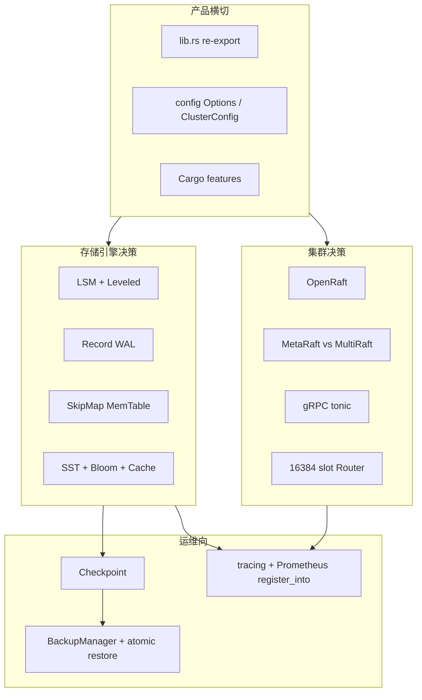
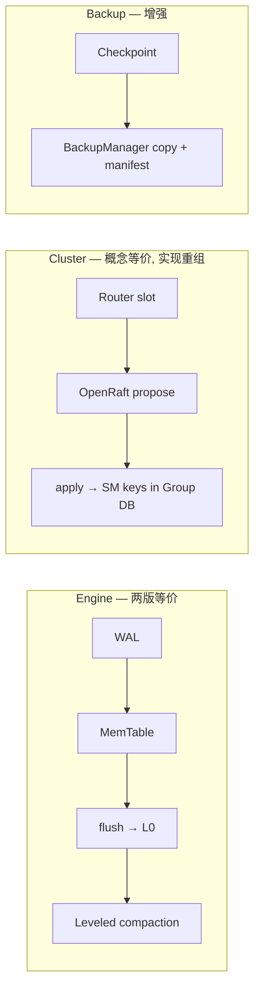

# Cursor transcript

---

## 1. User

## 文档整理 — 新会话

工作目录: `/root/code/database`

请先阅读 (不要跳过):
1. `AiKv-Workflow/backup/design.md` — 总规程
2. `AiKv-Workflow/backup/PROGRESS.md` — 当前进度
3. `AiKv-Workflow/backup/INDEX.md` — 本章索引 (若已有行则更新)

---

### 本次任务

| 项 | 值 |
|----|-----|
| PROGRESS 总步 | 14 (阶段 2a 第 2 篇) |
| 目标文件 | `aidb/DESIGN.md` |
| 本次子步 | 从步 0 开始 |
| 对比深度 | **模块级** (汇总文档; 跨模块设计决策, 不加深章逐段) |

### 必须遵守

- **确认门控**: 步 0→1→2→3→4, 每步先讨论, 我确认后再下一步
- **步 4**: 先出 **正文草稿**, 我确认后再写入 `aidb/`、更新 INDEX/PROGRESS
- **汇总文档**: **不必** Module Skill frontmatter; 提炼 **跨模块 why / trade-off**, **不重复** module 实现细节 (链到 `docs/modules/*.md`)
- **过程只进 backup/**: INDEX; aidb 不写迁移历史
- **旧文档顺序**: `backup/aidb/DESIGN.md` (主) → `aidb-oldmain/docs/DESIGN_DECISIONS.md` 等 → WiQunTools 查漏 → wiqun-db
- **待核实**: 根文档至多简要提及; 详情仍引用 `aidb/ISSUES.md` (不展开排查过程)
- **步 4 落盘前**: 对照 design.md 验收项 — 链接有效、与当前 `src/` 一致、决策与 modules 不矛盾

### 上下文 (上一篇已完成)

- 步 13 ✅: [`aidb/ARCHITECTURE.md`](aidb/ARCHITECTURE.md) 已落盘 (分层、数据流总览、feature 边界、AiKv 嵌入)
- 阶段 1 modules 全部 ✅ (engine / engine-storage / cluster / backup / observability)
- 旧稿: [`AiKv-Workflow/backup/aidb/DESIGN.md`](AiKv-Workflow/backup/aidb/DESIGN.md) (已移出 aidb 仓库)
- 当前 `aidb/` **尚无** 根目录 `DESIGN.md` (步 4 新建)
- 本会话归档 (可选参考): [`aidb/archive/13-architecture.md`](aidb/archive/13-architecture.md)

### 边界提示 (步 0 可细化)

- **本章**: 跨域 **设计决策与 rationale** — LSM/Leveled/WAL/MemTable、MetaRaft vs Multi-Raft、OpenRaft、gRPC、16384 slot、Checkpoint 备份、tracing/Prometheus 选型、API 精简 vs RocksDB 等
- **不重复**: 架构分层与数据流 → [`ARCHITECTURE.md`](aidb/ARCHITECTURE.md); WAL/compaction/Raft 实现细节 → modules
- **宜含**: 按域分节 (存储引擎 / 集群 / 备份 / 可观测性); 决策表或 Q&A 式小节; 链 ARCHITECTURE + modules
- **不宜含**: 迁移对照、ISSUES 全文、DEPLOYMENT 运维步骤 (步 15)、Milestone 版本表 (步 16 README)

### 与 ARCHITECTURE 分工

| 文档 | 回答 |
|------|------|
| ARCHITECTURE | 是什么、怎么分层、数据怎么走 |
| **DESIGN (本篇)** | **为什么这样选、放弃了什么、已知限制** |

### 本次不要

- 不要跳过未确认的步骤
- 不要一次写多篇 (DEPLOYMENT/README 等留步 15+)
- 不要修改 `design.md` / 流程, 除非我明确要求
- 不要 commit, 除非我明确要求

---

请从步 0 开始, 给出本步交付物, 等我确认。

---

## 2. Assistant

先阅读规程、进度与索引，再对照旧稿和现有文档，整理步 0 交付物。

---

## 3. Assistant

继续对照 ARCHITECTURE、旧稿与源码结构，明确步 0 的范围边界。

---

## 4. Assistant

## 步 0 — 定范围 (PROGRESS 步 14 · `aidb/DESIGN.md`)

对照 `design.md` 步 0: 本章是**阶段 2a 汇总文档**, 深度**模块级** (跨域 why / trade-off, 不逐段展开). 以下为交付物, **尚未写入** `aidb/`、`INDEX.md` 或 `PROGRESS.md`.

---

### 1. 本章定位

| 项 | 说明 |
|----|------|
| 文档类型 | 根目录汇总 (无 Module Skill frontmatter) |
| 读者 | 需要理解「为什么这样设计」的开发者 / 嵌入方 (AiKv) / 做架构取舍前 |
| 核心问题 | **为什么选 A 而非 B? 放弃了什么? 已知限制是什么?** |
| 信息源 | 5 篇 `docs/modules/*.md` 的 invariant + 已知限制; 当前 `src/` 验证; 旧稿 `backup/aidb/DESIGN.md` 为骨架 |
| 与 ARCHITECTURE | ARCHITECTURE = 是什么、怎么分层、数据怎么走; **DESIGN = 决策 rationale** (ARCHITECTURE 末「设计取向 (摘要)」链到本篇) |
| 与 modules | modules = 怎么做、入口、常见任务; **DESIGN 不重复** WAL Record 格式、Raft apply 流程等实现细节 |
| 与 AGENTS.md | AGENTS = AI 入口 + 参考项目表; DESIGN 展开 AGENTS 中「自研 vs RocksDB/OpenRaft」的 **why** |

---

### 2. 本章边界 (含 / 不含)

**宜含**

- **按域分节**: 产品/横切 → 存储引擎 → 集群 → 备份 → 可观测性
- **Q&A 或决策表**: 「为什么 X 而非 Y?」+ 简短理由 + **放弃项 / 已知限制** (一行或 bullet, 细节链 module)
- **RocksDB/LevelDB 关系**: 借鉴什么 (LSM/Leveled/WAL/Bloom)、**刻意不做什么** (200+ 配置、Column Family、复杂事务、C++ 绑定)
- **产品形态**: 嵌入式 **lib**、sync API、feature gate; 与 AiKv (async/RESP/MOVED) 的分工 rationale
- **跨 module 决策**: MetaRaft/Multi-Raft 分离、16384 slot、Checkpoint 备份、tracing + 库内 Prometheus (无 HTTP)
- **进一步阅读**: 链 `ARCHITECTURE.md` + 5 篇 modules + `ISSUES.md` (根文档至多一行待核实)

**不宜含**

| 主题 | 去向 |
|------|------|
| 分层图、目录树、数据流 Mermaid | [ARCHITECTURE.md](aidb/ARCHITECTURE.md) |
| WAL/MemTable/flush/compaction 实现步骤 | [engine.md](aidb/docs/modules/engine.md), [engine-storage.md](aidb/docs/modules/engine-storage.md) |
| MetaRaft apply、slot 迁移状态机 | [cluster.md](aidb/docs/modules/cluster.md) |
| BackupManager API、manifest 字段 | [backup.md](aidb/docs/modules/backup.md) |
| 指标名、span 名、register_into 用法 | [observability.md](aidb/docs/modules/observability.md) |
| 部署/protoc/端口/构建命令 | 步 15 `DEPLOYMENT.md` |
| Milestone / 版本特性表 | 步 16 `README.md` |
| oldmain 迁移对照、步 2–3 排查过程 | 仅 `backup/`; ISSUES 一行引用 |
| 性能 benchmark 数字、阶段 A/B/C 路线图 | oldmain `DESIGN_DECISIONS.md` 过时段, 不迁入 |

---

### 3. 决策域 ↔ module ↔ `src/` 锚点

| 决策域 | 主要 module | `src/` 锚点 (步 1 验证用) |
|--------|-------------|---------------------------|
| 产品 / API / Feature | 横切 | `lib.rs`, `config.rs`, `Cargo.toml` `[features]` |
| LSM / WAL / MemTable / MVCC | engine | `engine/wal/`, `engine/memtable/`, `engine/db/inner.rs` |
| SSTable / Leveled / Bloom / Cache / Checkpoint | engine-storage | `engine/compaction/`, `engine/sstable/`, `engine/checkpoint/` |
| OpenRaft / Meta vs Multi / slot / gRPC | cluster | `cluster/meta_raft_node.rs`, `multi_raft_node.rs`, `router.rs`, `network.rs` |
| Checkpoint 备份 / 恢复原子性 | backup | `backup/manager.rs`, `recovery.rs`; `engine/checkpoint/` |
| tracing / Prometheus 选型 | observability | `metrics.rs`, `cluster/metrics.rs` |

对比深度: **模块级** — 旧稿决策是否仍成立、有无新增放弃项 (如 `compression` feature 占位未实现), 不逐函数对照.

---

### 4. 拟读文件列表 (步 1–4)

**步 1 — 新代码与 modules (主)**

| 优先级 | 路径 | 目的 |
|--------|------|------|
| P0 | 5 × `aidb/docs/modules/*.md` — **「已知限制」「关键 invariant」** | 提炼决策与 trade-off, 避免重复正文 |
| P0 | `aidb/ARCHITECTURE.md` — §设计取向 (摘要) | 与 DESIGN 分工, 删重复 |
| P0 | `aidb/src/lib.rs`, `config.rs`, `Cargo.toml` | 公共 API 面、Options 规模、feature |
| P1 | `aidb/AGENTS.md` | 参考项目表 → 展开 why |
| P1 | 抽样 `engine/db/inner.rs`, `compaction/picker.rs`, `cluster/mod.rs` | 验证决策与代码仍一致 |
| P2 | `aikv/docs/modules/storage.md`, `cluster.md` (嵌入/边界节) | lib vs 服务、MOVED/ASK 归属 |

**步 2 — 旧文档 (按 design 顺序)**

| 顺序 | 路径 | 用途 |
|------|------|------|
| 1 | `AiKv-Workflow/backup/aidb/DESIGN.md` | **主骨架** (~95 行 Q&A, 5 域) |
| 2 | `AiKv-Workflow/backup/aidb/ARCHITECTURE.md` §关键设计决策 | 决策表查漏 |
| 3 | `aidb-oldmain/docs/DESIGN_DECISIONS.md` | RocksDB 借鉴/避免; **过滤** 阶段 A/B/C、性能预期、过时路径 |
| 4 | `aidb-oldmain/docs/` 其它 (若有 ADR 类) | 查漏 |
| 5 | WiQunTools `wiqun-db-inventory` 总览 / 相关段 | 查漏 |
| 6 | `wiqun-db/DESIGN.md` (与 1–3 重叠则跳过) | 二选一 |

**步 3 — oldmain 代码 (模块级)**

- 抽样: 配置项数量、是否仍有 Column Family / 独立 monitoring HTTP 等 **已放弃方向**
- 目的: 确认「放弃项」表述与当前实现一致, 非逐文件 diff

**步 4 — 验收对照**

- 链有效: ARCHITECTURE、5 modules、ISSUES
- 与当前 `src/` / features 一致 (含 `compression` 未实现、`cluster` 需 protoc)
- 决策不与 modules「已知限制」矛盾; ISSUES 根文档至多一行

---

### 5. 拟写大纲 (步 4 草稿骨架, 步 0 仅确认范围)

```markdown
# AiDb 设计决策

(开篇 2–3 句: 本文回答 why; 实现细节见 modules; 架构全景见 ARCHITECTURE)

## 阅读导航
(表格: 域 → module 链接)

## 产品形态与横切取舍
- 嵌入式 lib vs 网络服务 (AiKv 嵌入)
- Sync API + feature gate (cluster / backup / monitoring)
- 纯 Rust、API/配置精简 vs RocksDB
-  deliberate 不实现: Column Family、复杂事务、compression 占位、内置 HTTP scrape …

## 存储引擎
### 为什么 LSM-Tree 而非 B-Tree?
### 为什么 Leveled Compaction 而非 Tiered/Universal?
### WAL Record 分片 (Full/First/Middle/Last)
### MemTable: Crossbeam SkipMap
### SSTable / Bloom / Block Cache / restart points (各 1 段 why, 链 engine-storage)
### MVCC / Snapshot 取向与已知语义取舍 (链 engine 已知限制)

## 集群
### 为什么 OpenRaft?
### MetaRaft vs Multi-Raft 分离
### gRPC (tonic) vs 自建协议
### 16384 slot 与 Redis 兼容模型
### aidb 与 aikv 分工 (SlotStatus vs MOVED/ASK)
### 已知限制摘要 (ThinReplication、write_batch 跨 Group … → cluster.md)

## 备份
### 为什么基于 Checkpoint?
### 恢复: 临时目录 + 原子 rename (+ EXDEV fallback)
### 全量-only、无增量/S3 等 trade-off (链 backup.md)

## 可观测性
### tracing vs log crate
### Prometheus Counter/Gauge/Histogram 分工
### 库内指标 vs 嵌入方 HTTP (ISSUE-014 一行)
### 旧设计指标未实现的取舍 (摘要 → observability.md)

## 决策总表 (可选, 旧 ARCHITECTURE 表扩展版)
| 决策 | 选择 | 理由 | 放弃/限制 |

## 进一步阅读
(ARCHITECTURE, modules, DEPLOYMENT, ISSUES)

## 待核实
(至多一行, 如 ISSUE-005 若根文档需提)
```

预估篇幅: **~150–220 行** (旧稿 ~95 行 + 横切/RocksDB 避免/已知限制摘要); 明显短于 oldmain `DESIGN_DECISIONS.md` (~670 行).

---

### 6. INDEX 拟更新行 (步 4 确认后写入)

| 新文档章节 | 状态 | 参考的旧文档 | 处理 | 备注 |
|------------|------|--------------|------|------|
| `DESIGN.md` (总审) | 进行中 | `backup/aidb/DESIGN.md`; `aidb-oldmain/docs/DESIGN_DECISIONS.md`; backup ARCHITECTURE §决策; WiQunTools 查漏 | 待步 4 落盘 | 模块级; 跨域 why |

---

### 7. 步 0 待你确认的点

1. **大纲五域 + 「产品形态与横切取舍」** 是否合适? 是否单独加 **「与 RocksDB/LevelDB 关系」** 小节 (或合并在横切)?
2. **决策总表**: 保留扩展表, 还是全文 Q&A 不设总表?
3. **oldmain `DESIGN_DECISIONS.md`**: 只提炼「借鉴/避免」原则, **不迁入** 阶段 A/B/C 与性能表格 — 是否同意?
4. **待核实**: 根 DESIGN 是否只保留 ISSUE-014 (HTTP 在嵌入方), 其余 ISSUE 仍只在 modules 引用?

请回复 **可以** 或 **调整 …**; 确认后进入 **步 1** (读新代码, 梳理各域决策要点 bullet).

---

## 5. User

可以

---

## 6. Assistant

步 0 已确认，开始步 1：阅读当前代码与 modules，梳理各域设计决策要点。

---

## 7. Assistant

## 步 1 — 读新代码 (PROGRESS 步 14 · `aidb/DESIGN.md`)

以当前 `src/` + 5 篇 modules 为准, 梳理各域**设计决策要点** (why / 放弃项 / 已知限制). **尚未查旧文档** (步 2), **未写正文**.

---

### 1. 产品形态与横切

| 决策 | 代码/文档锚点 | 要点 |
|------|---------------|------|
| **嵌入式 lib, 非网络服务** | `lib.rs` 仅 re-export; 无 listener | AiDb 提供 LSM + 可选 Raft; RESP/MOVED/HTTP 在 AiKv |
| **Sync API** | `DB::*` 同步; cluster 内 tokio 但对外仍库 API | 嵌入方用 `spawn_blocking` 桥接 async |
| **`pub(crate)` 隔离** | `lib.rs` 注释 | 内部 engine/cluster 不暴露; 控制 surface area |
| **API 精简 (目标)** | `lib.rs`: 「公共 API 不超过 30 个函数」 | 实际 `DB` + `WriteBatch` + `Snapshot` + `Checkpoint` 等仍可控; 无 Column Family / 多 DB 句柄 |
| **配置精简 (目标 vs 现实)** | `config.rs` 注释「不超过 20 个」; 实际 `Options` ~25 字段 + preset | **设计取向**仍远小于 RocksDB 200+; Phase 2–6 为 stall/subcompaction 等**有默认值**的调优项, 非强制暴露 |
| **Feature gate** | `Cargo.toml`: `default=["backup"]`; `cluster`/`monitoring`/`compression` 可选 | 核心 engine 零依赖 cluster; 单机可 `--no-default-features` 关 backup |
| **纯 Rust** | 无 C/C++ bind; OpenRaft/tonic/crossbeam | 放弃 RocksDB C++ 绑定; 编译/跨平台简单 |
| **刻意不实现** | `config.rs` L38–39; `compression` feature | Snap/Lz4 **枚举+feature 占位, 实际未实现**; 无 Column Family、复杂事务、aidb-admin CLI |
| **磁盘格式演进** | engine / engine-storage 已知限制 | 与 `aidb-oldmain` **不兼容** (二进制 WAL、InternalKey SST 等) — 设计后果, 非迁移文档 |

**与 ARCHITECTURE 分工**: 本篇展开上表 why; 分层/数据流不重复.

---

### 2. 存储引擎

#### 2.1 架构选型

| 决策 | 选择 | 代码锚点 | 理由 (可写入 DESIGN) |
|------|------|----------|----------------------|
| 存储模型 | **LSM-Tree** | `engine/` 全链 | 写密集顺序 I/O; 后台 compaction; Bloom 控读放大 |
| Compaction | **Leveled only** | `compaction/picker.rs`, L0 overlap + L1+ 不重叠 | 点查读放大可控; 放弃 Tiered/Universal |
| MemTable | **Crossbeam SkipMap** | `memtable/table.rs` | 无锁并发; freeze 后 immutable; 优于 `RwLock<BTreeMap>` |
| WAL 物理格式 | **Record 分片** Full/First/Middle/Last | `wal/record.rs` | 单 record ≤32KB block; 大 value 分片; RocksDB 同款 |
| WAL 逻辑 | CRC32 + WalEntry; BatchStart 原子边界 | `engine.md` invariant | 崩溃恢复丢弃不完整 batch |
| SSTable 键编码 | InternalKey (user_key + seq + type) | `memtable/internal_key.rs` | MVCC; compaction 按 seq 去重 |
| Block 布局 | restart interval 16 (默认) | `Options.block_restart_interval` | 前缀压缩 + restart 点二分 |
| 读路径优化 | 每 SST Bloom; BlockCache LRU 16 shard | `filter/bloom.rs`, `cache/block_cache.rs` | 减少无效磁盘读 |
| MVCC | sequence + SnapshotList | `db/snapshot.rs`, `inner.rs` | Snapshot 在 write_lock 下注册; **iter/scan 用 K_MAX_SEQUENCE** 为 intentional 取舍 |

#### 2.2 写路径语义 (设计后果, 非实现步骤)

- **WAL 先于 MemTable** — 持久化顺序 invariant.
- **WriteBatch 部分可见** — 并发 `get` 无锁读 MemTable 时可能见 batch 中间态 (LevelDB 一致); Snapshot 无此问题.
- **Write stall** — L0 文件数超阈值 slowdown/stop writes; 用 sleep 背压而非无限堆 L0.
- **单进程 LOCK** — 多进程打开 → `Busy`; 集群每 Group 独立目录.

#### 2.3 放弃 / 限制 (链 modules, DESIGN 只摘要)

- Block/Data 压缩未实现; Index block 固定 `CompressionType::None`.
- Subcompaction 按 `file_size/100` 估条目 — 大 value 可能偏斜.
- Checkpoint 非增量; cross-device hard_link → copy fallback.
- ISSUE-001/002: WriteBatch 与 WAL rotate 边界 (根 DESIGN 可不展开, 或一行链 ISSUES).

---

### 3. 集群

| 决策 | 选择 | 代码锚点 | 理由 |
|------|------|----------|------|
| 共识库 | **OpenRaft 0.9** | `cluster/node.rs`, `Cargo.toml` | Rust 生态成熟; joint consensus; snapshot |
| 控制/数据分离 | **MetaRaft (gid=0)** + **Multi-Raft (gid≥1)** | `meta_types.rs` `METARAFT_GROUP_ID`; `multi_raft_node.rs` | 元数据低频 vs KV 高吞吐; 避免控制面争用数据面 |
| 每 Group 存储 | **ShardedStorage → 独立 `DB` 目录** | `sharded_storage.rs`, `data/group_{id}/` | 故障/扩容隔离; key 前缀 `sm_key(gid, user_key)` |
| RPC | **gRPC (tonic + prost)** | `network.rs`, `proto/raft.proto` | 标准序列化; async; 未来跨语言 |
| Slot | **固定 16384** | `meta_types.rs` `SLOT_COUNT`; `router.rs` `crc16 % 16384` | Redis Cluster 槽模型; hash tag `{...}` |
| 路由 | **Router** 读 MetaRaft SlotTable + 本地 observed leader | `router.rs` | MOVED 用 `client_addr`; Raft 用 `rpc_addr` |
| 生命周期 | **LifecycleManager::tick** | `lifecycle_manager.rs` | 对齐本地 Group、刷新 Router |
| WAL 前置条件 | 集群模式 **必须** `use_wal=true` | cluster invariant | Raft log 与 engine WAL 分工: 数据经 propose → apply 写 Group DB |

#### 放弃 / 边界

- **无 ThinReplication** — 全量 Raft log (虽有 `ThinWriteBatch` 类型, 无跨 Group batch API).
- **MOVED/ASK 在 aikv** — aidb 只提供 `SlotStatus` + `ClusterError::NotLeader`.
- **Migrating = slot 级 ASK**, 非 per-key.
- **无 MultiRaftNode::write_batch** — 调用方 `Router::group_ops` 分组.
- ISSUE-005: apply 逐 entry 写 `last_applied` (DESIGN 可一句 trade-off: 简单 vs 原子 batch 目标).

---

### 4. 备份

| 决策 | 选择 | 代码锚点 | 理由 |
|------|------|----------|------|
| 快照机制 | **Checkpoint** (flush + pin SST + link/copy) | `checkpoint/mod.rs`; backup 依赖之 | 与 LSM flush 对齐; SST 不可变; compaction 可继续 (pin) |
| 备份内容 | MANIFEST + SST + WAL + CURRENT; manifest/per-file SHA256 | `backup/manager.rs` | 可验证; 非仅 SST 列表 |
| 恢复 | **临时目录 → `DB::open` 冒烟 → atomic rename** | `recovery.rs` | 中途失败不毁现有数据; EXDEV → `copy_dir_all` |
| 范围 | **全量 only** | backup 已知限制 | 实现简单; 与 LSM checkpoint 自然对齐 |

#### 放弃

- 无增量 / 压缩 / S3 / backup_id 碰撞重试.
- 无 `aidb-admin` CLI.
- 集群多 Group 协调备份在 aikv `cluster_adapter`, 非 aidb 单库 API.

---

### 5. 可观测性

| 决策 | 选择 | 代码锚点 | 理由 |
|------|------|----------|------|
| 日志/追踪 | **tracing** (始终编译) | 全库 `#[instrument]` | span 上下文; 结构化; 未启用零开销 |
| 指标 | **Prometheus** (`monitoring` feature) | `metrics.rs` | Counter/Gauge/Histogram 分工; 集中 `register_into` |
| 暴露方式 | **库内注册, 无 HTTP** | `metrics::register_into`; observability 已知限制 | 嵌入方 (AiKv) 统一 `/metrics`; 职责分离 |
| cluster 指标 | `aidb_raft_*` 叠加注册 | `cluster/metrics.rs` | 与 engine 指标同 registry |
| 无 monitoring | cluster metrics **no-op stub** | `cluster/metrics.rs` | 不强制 Prometheus 依赖 |

#### 放弃 / 限制

- 无内置 OTel exporter / JSON log 开关 (ISSUE-014).
- 旧设计多项指标未实现 (ISSUE-016); scan/close 无 operations_total (ISSUE-018).
- 移除 oldmain 独立 `monitoring` HTTP 模块.

---

### 6. 决策域代码地图 (步 1 汇总)



---

### 7. 步 1 结论 (供步 2–4 用)

1. **旧稿 `backup/aidb/DESIGN.md` (~95 行 Q&A) 与现码仍高度一致** — 步 4 可沿用结构, 需补充: 横切/RocksDB 避免、Options 规模说明、compression 占位、AiKv 分工、已知限制摘要.
2. **`config.rs` 注释「≤20 项」已过时** — DESIGN 宜写「相对 RocksDB 精简 + preset」, 不声称精确 20.
3. **无新发现与 modules 矛盾的决策** — modules 已知限制均可上升为 DESIGN「放弃/限制」bullet.
4. **步 2 重点**: oldmain `DESIGN_DECISIONS.md` 提炼借鉴/避免; 过滤阶段 A/B/C 与性能表; 查 backup ARCHITECTURE 决策表是否遗漏 (如 subcompaction、write stall).

---

### 8. 步 1 待你确认

1. **Options 字段数**: 是否在 DESIGN 中如实写「~25 可调项 + preset, 注释目标 20 已滞后」?
2. **ISSUE 根文档**: 仍仅 ISSUE-014 一行, 还是 DESIGN「已知限制」顺带提 ISSUE-001/005 (各一行)?
3. **决策总表**: 步 4 是否采用旧 ARCHITECTURE 6 行表 **扩展至 ~15 行** (含横切/放弃列)?

请回复 **可以** 或 **调整 …**; 确认后进入 **步 2** (查旧文档, 分类仍有效/过时/设计偏离).

---

## 8. User

可以

---

## 9. Assistant

步 1 已确认，开始步 2：按规程顺序查阅旧文档并分类。

---

## 10. Assistant

## 步 2 — 查旧文档 (PROGRESS 步 14 · `aidb/DESIGN.md`)

按 `design.md` 旧文档顺序查阅完毕. 以下为分类结论与步 4 写法建议; **未新增 ISSUES 条目** (现有 ISSUE-001~018 已覆盖偏离点).

---

### 1. 旧文档清单与分类

| 顺序 | 路径 | 分类 | 处理建议 |
|------|------|------|----------|
| 1 | `backup/aidb/DESIGN.md` | **仍有效** | 步 4 **主骨架** (~95 行 Q&A, 5 域); 与现码一致 |
| 2 | `backup/aidb/ARCHITECTURE.md` §关键设计决策 | **仍有效 (不完整)** | 6 行决策表 → 扩展为 ~15 行总表; 缺 subcompaction / write stall / sharded LRU |
| 3 | `aidb-oldmain/docs/DESIGN_DECISIONS.md` | **部分仍有效** | 只提炼「借鉴 RocksDB / 避免 RocksDB」; **不迁入** 阶段 A/B/C、性能表、行数目标、过时 defaults |
| 4 | `aidb-oldmain/docs/ARCHITECTURE.md` §5 | **部分仍有效** | 可补: Multi-Raft vs 单 Raft 对比、节点多 Group 共享、**sm_key 前缀隔离**; §5.5 gRPC 与 backup DESIGN 重复 |
| 5 | `aidb-oldmain/docs/THIN_REPLICATION_PLAN.md` | **已过时 / 未实现** | DESIGN「放弃/未来」一句: 当前全量 Raft 复制; ThinReplication 仅 inventory 未来考量 |
| 6 | `aidb-oldmain/docs/REDIS_CLUSTER_COMPATIBILITY.md` | **概念仍有效** | 16384/Meta+Data 映射已在 backup DESIGN; MOVED/ASK 归属 aikv — 不展开 |
| 7 | `aidb-oldmain/docs/monitoring/*` | **已过时** | INDEX 已记「无有效内容跳过」; 独立 MetricsServer 已移除 → ISSUE-014 |
| 8 | `backup/aidb/DEPLOYMENT.md` §metrics | **设计偏离** | 写 aidb 自带 `:9191/metrics` — 现码无 HTTP → ISSUE-014 (已有) |
| 9 | `backup/aidb/docs/observability.md` | **部分过时** | 指标/span 名 → ISSUE-015/016 (已有); DESIGN 只写「库内 register_into」原则 |
| 10 | `backup/aidb/CHANGELOG.md` + superpowers specs | **仍有效 (查漏)** | subcompaction / write stall / sharded LRU / trivial move — **引擎层新增决策**, 旧 DESIGN 未写 |
| 11 | WiQunTools `wiqun-db-inventory/` | **查漏** | 09–13 确认 ThinReplication=未来; 13 §Metrics HTTP 归嵌入方 — 与步 1 一致 |
| 12 | `wiqun-db/DESIGN.md` | **与 1 重复** | 跳过 (二选一) |

---

### 2. 仍有效 → 步 4 应保留/迁移的内容

**来自 `backup/aidb/DESIGN.md` (几乎全文)**

- LSM vs B-Tree; Leveled vs Tiered; WAL Record 分片; SkipMap MemTable; restart points
- OpenRaft; MetaRaft/Multi-Raft 分离; gRPC; 16384 slot + hash tag
- Checkpoint 备份; restore 临时目录 + rename + EXDEV
- tracing vs log; Prometheus Counter/Gauge/Histogram

**来自 oldmain / ARCHITECTURE / DESIGN_DECISIONS (需提炼, 不照搬)**

| 主题 | 要点 | 写入位置 |
|------|------|----------|
| RocksDB 借鉴 | LSM 分层、WAL Record、Bloom、Leveled、WriteBatch、Block 二级索引 | §存储引擎 或 §与 RocksDB 关系 |
| RocksDB 避免 | 200+ 配置、100+ API、Column Family、复杂事务、C++ 依赖、过度抽象 | §产品形态与横切 |
| Multi-Raft why | vs 单 Raft / P2P / Paxos 表 (简化为 3–4 行) | §集群 |
| 节点多 Group | 3 节点各 Leader 不同 Group, 提高利用率 | §集群 (1 段) |
| sm_key 前缀 | `sm:` 与用户 key 隔离; 每 Group 独立 DB | §集群 (1 段, 链 cluster.md) |
| 渐进式演进 | 单机 engine → cluster feature → 嵌入 AiKv | §产品形态 (1 句) |

**来自 CHANGELOG / superpowers (旧 DESIGN 缺失, 步 4 应补)**

| 决策 | 选择 | 理由 (简述) |
|------|------|-------------|
| Write stall | L0 slowdown/stop writes + sleep | 控制 L0 堆积, 避免读放大失控 |
| Subcompaction | 大 job 按 key range 并行 (`thread::scope`) | 缩短大 compaction 墙钟时间 |
| Block Cache | 16 shard LRU | 降低锁竞争; 接受 hash 偏斜时不跨 shard 借配额 |
| Trivial move | L+1 无 overlap 时 rename | 避免无意义归并 I/O |

---

### 3. 已过时 / 不应写入 DESIGN 的内容

| 来源 | 过时点 | 现况 |
|------|--------|------|
| `DESIGN_DECISIONS.md` | 阶段 A/B/C、性能 15%–70% 表 | 里程碑文档, 非设计决策 |
| 同上 | `Options` <20 项、`use_bloom_filter`、`memtable 4MB` | 现 ~25 字段 + preset; Bloom 用 `bloom_false_positive_rate` |
| 同上 | MemTable `RwLock<BTreeMap>` 示例 | 已改为 SkipMap |
| 同上 | `max_background_jobs` | 现为 `compaction_threads` + subcompaction 参数 |
| `THIN_REPLICATION_PLAN.md` | 「1 周实施、降低 90% 复制」 | **未实现**; cluster.md 明确无 ThinReplication |
| `DESIGN_DECISIONS.md` | `compact_range` 等 API 列表 | 现无 `compact_range` 公共 API — 不写进「已实现 API」 |
| `backup/DEPLOYMENT.md` | aidb 进程暴露 metrics 端口 | HTTP 在 AiKv — ISSUE-014 |
| oldmain monitoring | MetricsServer/Collector | 模块已删 |
| inventory Phase 标注 | Phase5/6/7 施工顺序 | 过程文档, 不进 aidb |

---

### 4. 设计偏离 (已有 ISSUES, 步 4 写法)

| 偏离 | ISSUE | DESIGN 根文档处理 (步 1 已确认) |
|------|-------|--------------------------------|
| HTTP/OTel 在嵌入方 | ISSUE-014 | **待核实** 一行 |
| WriteBatch 与 WAL rotate | ISSUE-001 | 「已知限制」一行 |
| Group apply 逐 entry | ISSUE-005 | 「已知限制」一行 |
| 备份双重复制 I/O、无增量等 | ISSUE-011~013 | 备份 §trade-off bullet, 不展开 |
| 旧指标未实现 / label 不一致 | ISSUE-016~018 | 可观测性 §放弃项 bullet, 链 observability.md |
| `Options` 注释「≤20」滞后 | — | 横切节如实写「相对 RocksDB 精简 + preset」, 不新建 ISSUE |
| `compression` Snap/Lz4 占位 | — | 横切「刻意不实现」bullet, 不新建 ISSUE |

**拟新增 ISSUES: 无.** 步 2 未发现需阻塞文档的新 open 项.

---

### 5. 步 4 文档应如何表述 (相对旧稿差异)

| 维度 | 旧稿 | 新 DESIGN 建议 |
|------|------|----------------|
| 结构 | 5 域 Q&A only | 保留 Q&A + 新增 **§产品形态与横切** + **§决策总表 (~15 行)** |
| 篇幅 | ~95 行 | ~150–220 行 |
| RocksDB | 仅 LSM 段一句 | 独立小节「借鉴 vs 避免」(来自 oldmain, 压缩) |
| 引擎 | 无 stall/subcompaction/sharded cache | 各 1–2 句 why, 细节链 engine-storage |
| 集群 | 无 Multi-Raft 方案对比 / sm_key | 补简短对比 + 前缀存储; ThinReplication=未实现 |
| 可观测性 | 仅 tracing/Prom 类型 | 补「库内 register_into、无 HTTP」+ ISSUE-014 |
| AiKv | 仅「适合 AiKv 写负载」 | 明确 MOVED/ASK/metrics HTTP 在 aikv |
| 链接 | 无 | 开篇导航 + 文末 ARCHITECTURE / modules / ISSUES |

---

### 6. INDEX 拟追加备注 (步 4 落盘时)

`DESIGN.md (总审)` 行更新为:

- **参考**: `backup/aidb/DESIGN.md`, `ARCHITECTURE.md` §决策, `oldmain/DESIGN_DECISIONS.md` (原则 only), `oldmain/ARCHITECTURE.md` §5, WiQunTools 09–13 查漏, CHANGELOG/superpowers (subcompaction/stall)
- **跳过**: `wiqun-db/DESIGN.md` (重复), oldmain monitoring, THIN_REPLICATION 全文
- **备注**: 模块级; 无新 ISSUE

---

### 7. 步 2 待你确认

1. **ThinReplication**: 写「当前未实现 + inventory 列为未来考量」一句即可, 不链 oldmain 计划全文 — 是否同意?
2. **oldmain §5.1 Multi-Raft 对比表**: 压缩为 4 行 markdown 表放入 §集群 — 是否同意?
3. **无新 ISSUE**: 维持 ISSUE 列表不变 — 是否同意?

请回复 **可以** 或 **调整 …**; 确认后进入 **步 3** (oldmain 代码模块级对照, 差异表 + 文档表述建议).

---

## 11. User

可以

---

## 12. Assistant

步 2 已确认，开始步 3：对 oldmain 做模块级代码对照。

---

## 13. Assistant

## 步 3 — 对比旧代码 (PROGRESS 步 14 · `aidb/DESIGN.md`)

对 `aidb-oldmain/src/` 与当前 `aidb/src/` 做**模块级**对照 (抽样入口, 不逐函数). 以下为差异表与步 4 表述建议.

---

### 1. 模块布局对照

| 域 | oldmain (`aidb-oldmain/src/`) | 当前 (`aidb/src/`) | 主流程是否等价 | 对 DESIGN 的影响 |
|----|-------------------------------|---------------------|----------------|------------------|
| **根 / API** | 扁平 mod; **`lib.rs` ~2604 行** 内嵌 `DB` | `engine/` 域聚合; `engine/db/inner.rs` ~1284 行 | ✅ put/get/write/flush 语义同 | 写「模块化 + `pub(crate)` 隔离」, 不写行数目标 |
| **WAL** | `wal/` | `engine/wal/` | ✅ Record 分片 (Full/First/Middle/Last) | **决策不变** |
| **MemTable** | `memtable/` (SkipMap) | `engine/memtable/` (SkipMap) | ✅ | **决策不变** |
| **SSTable / Compaction** | `sstable/`, `compaction/` | `engine/sstable/`, `engine/compaction/` | ✅ Leveled | **决策不变** |
| **Bloom / Cache** | `filter/`, `cache/lru.rs` (单 LRU + RwLock) | `engine/filter/`, `engine/cache/block_cache.rs` (**16 shard LRU**) | ✅ 用途同 | DESIGN **补** sharded LRU why |
| **Checkpoint** | 无独立 mod; backup 直拷贝 SST/WAL | `engine/checkpoint/` + backup 调用 `Checkpoint::create` | ⚡ 机制增强 | **决策仍成立**, 可写「显式 Checkpoint 模块」 |
| **Cluster 编排** | `raft_node_new`, `raft_storage`, `raft_network`, `multi_raft_network`, `sharded_state_machine` | `node.rs`, `storage/`, `network.rs`, `lifecycle_manager`, `leader_watcher` | ✅ MetaRaft + Multi-Raft + Router | 文档用**现模块名**; 不写 oldmain 文件名 |
| **ThinReplication** | `cluster/thin_replication.rs` (**存在**) | **已移除**; 仅 `ThinWriteBatch` 类型 | ❌ 未走薄复制路径 | DESIGN: 「当前全量复制; 未来考量」 |
| **SM key 编码** | `sm:{user_key}` 字符串前缀 | `\x01sm/{gid_be}/` + user_key; Raft meta `\x00raft/{gid}/` | ✅ apply→DB 同构 | DESIGN **补** 命名空间隔离 (演进自 oldmain `sm:`) |
| **Slot / Router** | `SLOT_COUNT=16384`, crc16, hash tag | 同 | ✅ | **决策不变** |
| **Backup** | `backup/` (无 Checkpoint 抽象) | `backup/` + `Checkpoint` | ✅ 全量备份意图同 | Checkpoint rationale **加强** |
| **Observability** | `monitoring/` (`MetricsServer` HTTP) | `metrics.rs` + `register_into`; tracing 始终编译 | ⚡ 暴露方式变 | DESIGN: **库内指标、HTTP 在嵌入方** |
| **CLI** | `bin/aidb-admin.rs` | 无 | — | 「无 CLI」列入放弃项 |
| **文件数** | 54 `.rs` | 71 `.rs` | — | 不写 oldmain「<10K 行」目标 |

`wiqun-db/src/` 与当前 `aidb` **同构**, 无额外设计差异.

---

### 2. 核心设计决策: 等价 vs 演进 vs 放弃

| 决策 | oldmain | 当前 | 步 4 表述 |
|------|---------|------|-----------|
| LSM + Leveled | ✅ | ✅ | 保留 Q&A |
| WAL Record 分片 | ✅ | ✅ | 保留 |
| SkipMap MemTable | ✅ | ✅ | 保留 (oldmain 已是 SkipMap, 纠正 DESIGN_DECISIONS 里 RwLock 示例) |
| Bloom per SST | `use_bloom_filter: bool` | `bloom_false_positive_rate: f64` | 写「可禁用 (0.0)」, 不提旧字段名 |
| OpenRaft + Meta/Multi 分离 | ✅ (feature 名 `raft-cluster` 等) | ✅ (`cluster` 统一) | 保留; feature 名用现 `Cargo.toml` |
| 16384 slot + Redis 槽模型 | ✅ | ✅ | 保留 |
| gRPC tonic | ✅ (`rpc.rs` 等) | ✅ (`network.rs`) | 保留 |
| Checkpoint 备份 | 隐式 (直拷) | 显式 `Checkpoint::create` | 保留 why + 一句「重构后显式模块」 |
| restore 原子 rename | ✅ | ✅ + EXDEV fallback | 保留 |
| tracing / Prometheus 类型分工 | 部分 (独立 monitoring) | `metrics.rs` 集中注册 | 保留 tracing/Prom 类型; **改** HTTP 归属 |
| **Write stall** | ❌ 无 | ✅ L0 slowdown/stop | **新增** 决策 bullet |
| **Subcompaction** | ❌ 无 | ✅ `subcompaction_min_size` | **新增** 决策 bullet |
| **Sharded BlockCache** | 单 LRU | 16 shard | **新增** 决策 bullet |
| **ThinReplication** | 有模块/类型 | 移除 | **放弃** + inventory 未来考量 |
| **MetricsServer** | `:9191` 可选 | 无 | **放弃** → 嵌入方 (ISSUE-014) |
| **aidb-admin** | 有 | 无 | **放弃** |
| **磁盘格式** | 旧 InternalKey/WAL 语义 | 演进 | 一句「与 oldmain 不兼容」, 不展开迁移 |
| **Options 规模** | ~15 字段 | ~25 字段 + preset | 「相对 RocksDB 仍精简」, 不写「≤20」 |

---

### 3. 主流程等价性 (模块级)



| 流程 | 等价? | 备注 |
|------|-------|------|
| put/get/delete | ✅ | WAL 先于 MemTable 不变 |
| MVCC Snapshot | ✅ | 现 `engine/db/snapshot.rs` |
| 集群写 key | ✅ | key 编码 `sm:` → `\x01sm/{gid}/` |
| slot 迁移 | ✅ | Manager/Executor 仍在 |
| 全量备份 | ✅ | 现强制经 Checkpoint (更严格) |
| 指标暴露 | ❌ | oldmain 进程内 HTTP → 现嵌入方注册 |

---

### 4. 文档应如何表述 (步 3 → 步 4)

**应写 (新内容或加强)**

1. **§产品形态**: 重构后 `engine/` 域 + feature gate; 去除 `monitoring` HTTP 与 admin CLI.
2. **§与 RocksDB**: oldmain DESIGN_DECISIONS 的「避免」仍成立; **纠正** MemTable 示例为 SkipMap; Options 写「preset + 调优项」, 不写精确 20.
3. **§存储引擎**: 新增 write stall / subcompaction / sharded LRU 三行决策 (oldmain 无, 属 refactor **新决策**).
4. **§集群**: Multi-Raft 方案对比表 (oldmain ARCHITECTURE §5.1 压缩); `\x01sm/` + `\x00raft/` 前缀隔离; ThinReplication **未实现**.
5. **§备份**: Checkpoint 从隐式变为一等模块 — rationale 不变, 实现更明确.
6. **§可观测性**: 「tracing 始终 + Prometheus 可选 + `register_into`」; 不写 MetricsServer.

**不应写**

- oldmain 路径对照 (`raft_node_new`, `thin_replication.rs`, …).
- 性能百分比、阶段 A/B/C、代码行数 KPI.
- `wiqun-db` 重复内容.

**决策总表 (~15 行) 建议列**

| # | 决策 | 选择 | 相对 oldmain |
|---|------|------|--------------|
| 1 | 存储模型 | LSM | 同 |
| 2 | Compaction | Leveled | 同 |
| 3 | MemTable | SkipMap | 同 |
| 4 | WAL | Record 分片 | 同 |
| 5 | Block Cache | 16-shard LRU | **新** |
| 6 | L0 背压 | write stall | **新** |
| 7 | 大 compaction | subcompaction | **新** |
| 8 | 共识 | OpenRaft | 同 |
| 9 | 集群拓扑 | MetaRaft + Multi-Raft | 同 |
| 10 | RPC | gRPC | 同 |
| 11 | 分片 | 16384 slot | 同 |
| 12 | SM 隔离 | `\x01sm/{gid}/` 前缀 | **演进** |
| 13 | 复制 | 全量 Raft log | ThinRepl **移除** |
| 14 | 备份 | Checkpoint + 全量 | **显式化** |
| 15 | 指标 | 库内 Prom + 嵌入方 HTTP | **变更** |

---

### 5. ISSUES (步 3)

| 项 | 结论 |
|----|------|
| 新 open ISSUE | **无** |
| ThinReplication 移除 | inventory 已标未来; cluster.md 已知限制 — 不新建 |
| sm_key 编码变更 | 实现演进, 非 bug |
| MetricsServer 移除 | ISSUE-014 已覆盖 |

根 DESIGN **待核实**: ISSUE-014 一行; **已知限制**: ISSUE-001、ISSUE-005 各一行 (步 1 已确认).

---

### 6. 步 3 待你确认

1. **SM key 演进**: DESIGN 写「自 oldmain `sm:` 演进为 `\x01sm/{gid}/` + 独立 Group DB 目录」一句 — 是否同意?
2. **决策总表 15 行**: 是否作为步 4 草稿固定结构?
3. **仍无新 ISSUE** — 是否同意?

请回复 **可以** 或 **调整 …**; 确认后进入 **步 4 正文草稿** (讨论确认后再落盘 `aidb/DESIGN.md`、更新 INDEX/PROGRESS).

---

## 14. User

可以

---

## 15. Assistant

步 3 已确认。下面是 **步 4 正文草稿** (尚未写入 `aidb/`). 请审阅后回复 **可以落盘** 或 **调整 …**.

---

```markdown
# AiDb 设计决策

本文回答 **为什么** 这样设计: 选型理由、放弃的替代方案、已知限制. **是什么、怎么分层、数据怎么走** 见 [ARCHITECTURE.md](ARCHITECTURE.md); 实现细节与入口见 [docs/modules/](docs/modules/).

## 阅读导航

| 域 | 深入阅读 |
|----|----------|
| 写路径 / WAL / MemTable / MVCC | [engine.md](docs/modules/engine.md) |
| SSTable / compaction / Bloom / cache / checkpoint | [engine-storage.md](docs/modules/engine-storage.md) |
| MetaRaft / Multi-Raft / Router / 迁移 | [cluster.md](docs/modules/cluster.md) |
| 全量备份 / 恢复 | [backup.md](docs/modules/backup.md) |
| tracing / Prometheus | [observability.md](docs/modules/observability.md) |

## 产品形态与横切取舍

### 为什么是嵌入式 lib, 而不是独立服务?

AiDb 是 **lib crate**: 同步 `DB` API, 无网络 listener. [AiKv](../aikv/docs/modules/storage.md) 在其上实现 RESP、Cluster 重定向与 HTTP `/metrics`. 这样 LSM 与 Raft 基础设施可复用, 协议层独立演进.

### 为什么 sync API + feature gate?

- **Sync**: 存储路径以 `parking_lot` / 后台线程为主; 嵌入方 (AiKv) 用 `spawn_blocking` 桥接 async.
- **Feature**: `backup` (默认)、`cluster`、`monitoring` 按需启用; 核心 `engine` 不硬依赖 tonic/OpenRaft/Prometheus.

### 与 RocksDB / LevelDB: 借鉴什么, 避免什么?

**借鉴** (思路与算法, 非 C++ 绑定):

- LSM 分层、Leveled compaction、WAL Record 分片、MemTable flush、SSTable 块索引 + Bloom、WriteBatch 原子写、MVCC snapshot.

**避免**:

- 200+ 配置项与庞大 API surface (Column Family、多 `Get` 重载等).
- 复杂事务、特性膨胀、C++ 编译链.
- 过度抽象层 (Env/FileSystem 多级包装).

**现况**: `Options` 约 25 个可调字段 + `for_testing` / `for_high_*` preset — 相对 RocksDB 仍精简; 注释「≤20 项」为早期目标, 已随 stall/subcompaction 等调优项扩展. 公共 API 控制在较小 surface (`lib.rs` 注释: ≤30 函数量级).

### 刻意不实现 (YAGNI)

| 项 | 说明 |
|----|------|
| Column Family / 多 CF | 单 keyspace; aikv 用 `{db_index}:` 前缀区分逻辑库 |
| 复杂事务 | 仅 WriteBatch + Snapshot MVCC |
| Block 压缩 | `compression` feature 与 `CompressionType::Snap/Lz4` 为占位, **未实现** |
| ThinReplication | oldmain 曾探索; **当前全量 Raft log 复制**; inventory 列为未来考量 |
| 内置 HTTP `/metrics` | 见 [可观测性](#可观测性) 与 ISSUE-014 |
| `aidb-admin` CLI | 用库 API 或 `examples/` |

### 磁盘格式

与早期 `aidb-oldmain` **不兼容** (WAL 逻辑、InternalKey SST、Bloom/Block CRC 语义等已演进). 不做向后读取; 详情见 engine / engine-storage 模块「已知限制」.

---

## 存储引擎

### 为什么选择 LSM-Tree 而非 B-Tree?

写密集场景下顺序写 (WAL + MemTable) 优于随机写; 后台 compaction 异步整理; Bloom Filter 控制读放大. 与 LevelDB/RocksDB 路线一致, 适合 AiKv 等高写负载嵌入.

### 为什么选择 Leveled Compaction 而非 Tiered/Universal?

- Leveled 点查读放大可控 (O(log N) 层次).
- 空间放大相对 Tiered 更小.
- LevelDB 生态验证充分. **放弃** Universal/Tiered 多种策略并存 — 只维护一种 compaction.

### WAL 格式: 为什么使用 Record 分片?

物理 record 含 CRC32 + length + type + data. 超过 block size (~32KB) 时拆为 First/Middle/Last, 兼容大 value. RocksDB 同款, 工程验证充分. 逻辑层 `WalEntry` + `BatchStart` 保证 batch 崩溃原子性 (见 [engine.md](docs/modules/engine.md)).

### MemTable: 为什么选择 Crossbeam SkipMap?

无锁并发读写; freeze 后 immutable 可安全共享; 相比 `RwLock<BTreeMap>` 写路径更轻. oldmain 已采用 SkipMap; 重构延续该决策.

### SSTable Block: restart points 的作用

默认每 16 个 key 一个 restart point (完整 key), 其余存前缀差量 — 省空间; restart 点上二分 + 块内线性扫描, cache locality 好. 细节见 [engine-storage.md](docs/modules/engine-storage.md).

### Block Cache: 为什么 16-shard LRU?

重构新增: 总容量均分 16 shard, hash 选 shard, 降低单锁竞争. **trade-off**: hash 偏斜时单 shard 先满, 不借用其它 shard 配额.

### Write stall: 为什么 L0 堆积时 sleep / 停写?

重构新增: `level0_slowdown_writes_trigger` / `level0_stop_writes_trigger` 在 L0 文件过多时渐进 sleep 或轮询等待 compaction — 避免 L0 无限增长导致读放大失控. **放弃** 无界堆 L0.

### Subcompaction: 为什么大 job 按 key range 并行?

重构新增: 输入超过 `subcompaction_min_size` (默认 64MB) 且多线程可用时, `std::thread::scope` 分裂子任务 — 缩短大 compaction 墙钟时间. `0` 禁用.

### MVCC 与语义取舍

- `get` 用当前 sequence; `iter`/`scan` 用 `K_MAX_SEQUENCE` — ** intentional**, 见 engine 模块.
- 并发 `get` 可能在 WriteBatch 写入 MemTable 期间看到 batch **部分** 效果 (LevelDB 一致); Snapshot 在 `write_lock` 下创建, 无此问题.

---

## 集群

### 为什么 Multi-Raft, 而非单 Raft / P2P / Paxos?

| 方案 | 一致性 | 扩展性 | 复杂度 | 结论 |
|------|--------|--------|--------|------|
| 单 Raft | 强一致 | 差 (单 Leader 瓶颈) | 低 | 不适合水平扩展 |
| **Multi-Raft** | 强一致 | 好 (多 Group 并行 Leader) | 中 | **选用** |
| 无共识 P2P | 最终一致 | 好 | 低 | 不满足强一致目标 |
| Paxos | 强一致 | 中 | 高 | Rust 生态与工程成本偏高 |

OpenRaft 提供成熟 Raft + joint consensus + snapshot; 与 16384 slot 分片模型配合, 兼容 Redis Cluster **槽** 语义 (协议命令在 AiKv).

### 为什么 OpenRaft?

Rust 生态最成熟的 Raft 实现之一; joint consensus 安全成员变更; 内置 snapshot; API 与社区活跃.

### 为什么控制平面 (MetaRaft) 和数据平面 (Multi-Raft) 分离?

- MetaRaft (`group_id = 0`): 节点、Group、SlotTable、迁移状态 — 变更低频.
- Multi-Raft (`group_id ≥ 1`): 每 Group 独立 `ShardedStorage` + `OpenRaftNode`, 目录 `data/group_{id}/` — 数据面高吞吐.
- 分离避免元数据写入与 KV propose 争用同一 Raft 队列.

### 为什么每个节点可参与多个 Group?

3 节点 × 3 Group 时, Leader 可分布在不同节点 — 提高 CPU/磁盘利用率; 单节点故障只影响其 Leader 的 Group, 非整集群瘫痪. 见 oldmain 架构文档 §5.3 思路.

### 状态机 key: 为什么前缀隔离?

用户 key 经 `sm_key(group_id, user_key)` 编码为 `\x01sm/{gid}/...`; Raft 元数据 `\x00raft/{gid}/...`. 与用户 keyspace、Raft 日志键分离, 便于 scan/snapshot/调试. 演进自 oldmain 的 `sm:` 字符串前缀, 现按 Group 二进制隔离.

### 为什么 gRPC (tonic) 而非自建协议?

protobuf + HTTP/2 成熟; tonic 与 tokio 集成; grpcurl 等工具可调试; 跨语言节点扩展成本低. 自定义二进制协议的性能优势不足以抵消开发与生态成本.

### 为什么 slot 数量固定为 16384?

Redis Cluster 兼容槽模型 (`CLUSTER SLOTS` / hash tag `{...}`); 槽数远大于典型节点数, 支持细粒度迁移; CRC16 `% 16384` 计算高效.

### aidb 与 AiKv 分工

| 能力 | AiDb | AiKv |
|------|------|------|
| Slot 路由 / Raft propose | ✅ | 调用 aidb cluster API |
| `SlotStatus` / `NotLeader` | ✅ | — |
| MOVED / ASK / CLUSTER 子命令 | — | ✅ |
| HTTP `/metrics` | `register_into` only | ✅ 暴露 |

### 已知限制 (摘要)

- **无 ThinReplication**: 全量 Raft log 复制.
- **无跨 Group `write_batch`**: 调用方 `Router::group_ops` 分组后逐 Group `propose`.
- **Migrating 为 slot 级 ASK**, 非 per-key.
- 数据 Group apply 逐 entry 更新 `last_applied` — 见 [ISSUES.md#ISSUE-005](ISSUES.md#issue-005--数据-group-apply-仍逐-entry-写-last_applied).

---

## 备份

### 为什么基于 Checkpoint?

LSM flush 后 SST 不可变; `Checkpoint::create` 在 flush + pin SST 后 link/copy 目录快照 — 与 compaction 协议对齐 (checkpoint 期间阻止危险 compaction). 重构将 Checkpoint 提升为一等模块; oldmain 备份直拷贝, 现强制经 Checkpoint, 一致性边界更清晰.

### 为什么恢复用临时目录 + 原子 rename?

写到 `restore_tmp_*` → 逐文件 SHA256 → `DB::open` 冒烟 → `rename` 到目标 — 中途失败不损坏已有数据. 跨文件系统 `rename` 失败 (EXDEV) 时 fallback `copy_dir_all`.

### trade-off: 全量 only

**放弃** 增量、压缩、远程 S3、backup_id 碰撞重试 — 实现与运维简单; 大库备份 I/O 成本高 (含 checkpoint 后二次 copy, 见 backup 模块). 集群多 Group 协调备份在 AiKv `cluster_adapter`, 非 aidb 单 `DB` API.

---

## 可观测性

### 为什么选择 tracing 而非 log crate?

`#[instrument]` 传递 span 上下文; 结构化 field; 与 `tracing-subscriber` 统一; 未订阅时零开销. **始终编译**, 不依赖 `monitoring` feature.

### 为什么 Prometheus 区分 Counter / Gauge / Histogram?

- **Counter**: 只增 (操作次数, flush/compaction 次数).
- **Gauge**: 可增减 (memtable/SST 大小, WAL 字节).
- **Histogram**: 延迟分布 (操作/compaction/备份耗时); bucket 需控制 cardinality.

### 为什么库内注册、无内置 HTTP?

`monitoring` feature 启用 `aidb::metrics` 与 `register_into(registry)` — 嵌入方 (AiKv) 将 aidb 系列挂到同一 Prometheus registry 并在 HTTP 暴露. oldmain 的 `MetricsServer` 已移除; **职责分离**: 库只产出指标, 进程决定 scrape 端点.

**放弃 / 精简**: 旧设计多项指标未实现 (`wal_sync_duration`, `cache_hit_rate` gauge 等); 无进程级 memory/disk — 见 [observability.md](docs/modules/observability.md).

---

## 决策总表

| 决策 | 选择 | 理由 | 放弃 / 限制 |
|------|------|------|-------------|
| 产品形态 | 嵌入式 lib | 复用 LSM/Raft; 协议在 AiKv | 非独立 DB 服务 |
| 存储模型 | LSM-Tree | 写密集、顺序 I/O | B-Tree 随机写 |
| Compaction | Leveled | 点查读放大可控 | Tiered/Universal |
| MemTable | Crossbeam SkipMap | 无锁并发 | RwLock+BTreeMap |
| WAL | Record 分片 | 大 value | 单 record 上限 |
| Block Cache | 16-shard LRU | 降锁竞争 | 跨 shard 不借配额 |
| L0 背压 | write stall | 控 L0 堆积 | 无界 L0 |
| 大 compaction | subcompaction | 并行缩短耗时 | `min_size=0` 禁用 |
| 共识 | OpenRaft | 成熟 Raft + snapshot | 自研 Paxos |
| 集群拓扑 | MetaRaft + Multi-Raft | 控制/数据分离 | 单全局 Raft |
| RPC | gRPC (tonic) | 生态与工具 | 自建二进制 |
| 分片 | 16384 slot | Redis 槽兼容 | 动态改槽数 |
| SM 隔离 | `\x01sm/{gid}/` 前缀 | 命名空间 + 多 Group DB | 裸 user key 进 Raft DB |
| 复制 | 全量 Raft log | 实现简单、正确性优先 | ThinReplication |
| 备份 | Checkpoint 全量 | 与 LSM 对齐 | 增量/S3/CLI |
| 指标 | tracing + Prom 注册 | 库进程分离 | 内置 HTTP scrape |

---

## 进一步阅读

- [ARCHITECTURE.md](ARCHITECTURE.md) — 分层、数据流、feature 边界
- [AGENTS.md](AGENTS.md) — AI 助手入口与参考项目
- [docs/modules/](docs/modules/) — 域级实现与常见任务
- [DEPLOYMENT.md](DEPLOYMENT.md) — 构建、feature、运行 (步 15)
- [ISSUES.md](ISSUES.md) — 待核实与跟踪

## 已知限制 (根文档摘要)

- WriteBatch 写入期间 WAL 可能 mid-batch rotate — 见 [ISSUES.md#ISSUE-001](ISSUES.md#issue-001-writebatch-可能跨-wal-文件边界).
- 数据 Group apply 逐 entry 写 `last_applied` — 见 [ISSUES.md#ISSUE-005](ISSUES.md#issue-005--数据-group-apply-仍逐-entry-写-last_applied).

## 待核实

- HTTP `/metrics` 与 OTel 运行在嵌入方 (AiKv), 非 aidb 库内 — 见 [ISSUES.md#ISSUE-014](ISSUES.md#issue-014--httpoteljson-log-运行在嵌入方-aidb-仅库内指标).
```

---

### 草稿说明

| 项 | 值 |
|----|-----|
| 篇幅 | ~210 行 (含表) |
| 结构 | 步 0 大纲 + 步 3 决策总表 15 行 |
| 新增 vs 旧 `backup/aidb/DESIGN.md` | 横切/RocksDB、write stall/subcompaction/sharded cache、Multi-Raft 对比表、sm_key 演进、ThinReplication/MetricsServer 放弃、MVCC 取舍 |
| ISSUES | 根文档: 014 (待核实) + 001/005 (已知限制各一行) |
| 未写 | Module frontmatter、迁移对照、DEPLOYMENT 运维、Milestone 表 |

### 落盘计划 (你确认后执行)

1. 写入 `aidb/DESIGN.md`
2. 更新 `AiKv-Workflow/backup/INDEX.md` — `DESIGN.md` 行 ✅
3. 更新 `AiKv-Workflow/backup/PROGRESS.md` — 步 14 ✅

请回复 **可以落盘** 或 **调整 …**.

---

## 16. User

可以

---

## 17. Assistant

正在将草稿写入 `aidb/DESIGN.md`，并更新 INDEX 与 PROGRESS。

---

## 18. Assistant

**步 14 已完成.**

### 落盘

- 新建 [`aidb/DESIGN.md`](aidb/DESIGN.md) (~210 行)
  - 横切 / RocksDB 借鉴与避免 / YAGNI
  - 5 域 Q&A + 15 行决策总表
  - 链到 ARCHITECTURE、5 篇 modules、ISSUES

### 过程文档

- [`AiKv-Workflow/backup/INDEX.md`](AiKv-Workflow/backup/INDEX.md) — `DESIGN.md` 行 ✅
- [`AiKv-Workflow/backup/PROGRESS.md`](AiKv-Workflow/backup/PROGRESS.md) — 步 14 ✅ (2026-06-18)

### 与现有文档关系

[`aidb/ARCHITECTURE.md`](aidb/ARCHITECTURE.md) 末「设计取向 (摘要)」→ `DESIGN.md` 链接现已有效.

### 未做

- 未 commit (按你的要求)
- 旧文档未删除 (`backup/aidb/DESIGN.md` 仍作参考)

---

**下一步 (PROGRESS 步 15)**: `aidb/DEPLOYMENT.md`. 新开对话或本线程继续均可 — 从步 0 开始、逐步确认门控.

---

## 19. User

使用 vibe-coding/scripts/archive-cursor-session.sh  帮我保存当前对话到 archive 里面 带 tool 和不带 tool 的都保存
