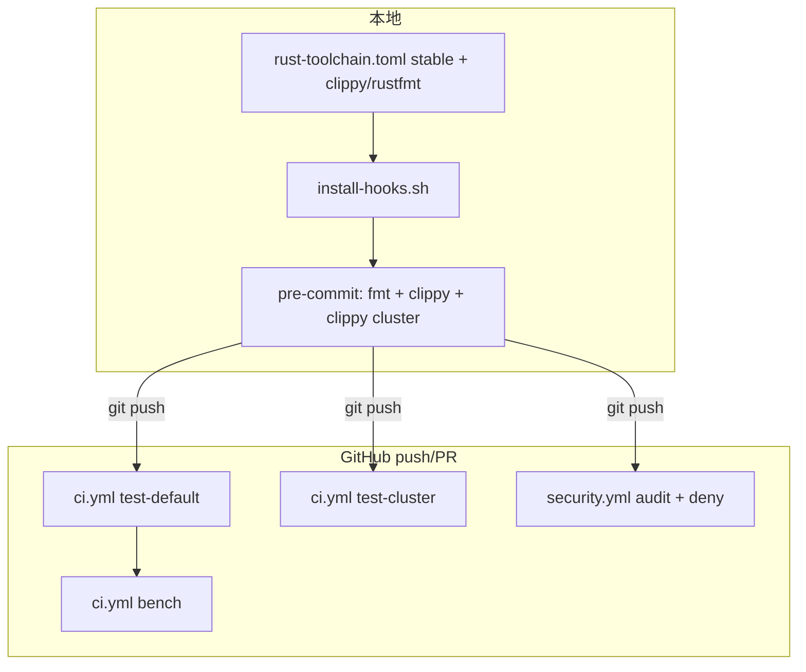

# Cursor transcript

---

## 1. User

## 文档整理 — 新会话

工作目录: `/root/code/database`

请先阅读 (不要跳过):
1. `AiKv-Workflow/backup/design.md` — 总规程
2. `AiKv-Workflow/backup/PROGRESS.md` — 当前进度
3. `AiKv-Workflow/backup/INDEX.md` — 本章索引 (若已有行则更新)

---

### 本次任务

| 项 | 值 |
|----|-----|
| PROGRESS 总步 | 17 (阶段 2a 第 5 篇) |
| 目标文件 | `aidb/CONTRIBUTING.md` + `aidb/CHANGELOG.md` |
| 本次子步 | 从步 0 开始 |
| 对比深度 | **模块级** (汇总文档; 贡献流程与版本记录, 不加深章逐段) |

### 必须遵守

- **确认门控**: 步 0→1→2→3→4, 每步先讨论, 我确认后再下一步
- **步 4**: 先出 **两篇正文草稿** (CONTRIBUTING + CHANGELOG), 我确认后再写入 `aidb/`、更新 INDEX/PROGRESS
- **汇总文档**: **不必** Module Skill frontmatter
- **过程只进 backup/**: INDEX; aidb 不写迁移历史
- **旧文档顺序**: `backup/aidb/CONTRIBUTING.md` / `backup/aidb/CHANGELOG.md` (主) → `aidb-oldmain` 根目录/CI 类 → WiQunTools 查漏 → `wiqun-db`
- **待核实**: 根文档至多简要提及; 详情仍引用 `aidb/ISSUES.md` (不展开排查过程)
- **步 4 落盘前**: 对照 design.md 验收项 — CI/hooks 与当前 `.github/workflows/`、`install-hooks.sh`、`tests/` 一致; CHANGELOG 版本与 `Cargo.toml` 对齐; 与 README/DEPLOYMENT/AGENTS 不矛盾

### 上下文 (上一篇已完成)

- 步 16 ✅: [`aidb/README.md`](aidb/README.md) — 项目入口; 测试矩阵一句链 DEPLOYMENT/CONTRIBUTING
- 步 13–15 ✅: ARCHITECTURE / DESIGN / DEPLOYMENT
- 阶段 1 modules 全部 ✅
- 旧稿: [`AiKv-Workflow/backup/aidb/CONTRIBUTING.md`](AiKv-Workflow/backup/aidb/CONTRIBUTING.md)、[`CHANGELOG.md`](AiKv-Workflow/backup/aidb/CHANGELOG.md) (已移出 aidb)
- 当前 `aidb/` **尚无** 上述两篇根文档
- CI 详述在 [`aidb/.github/README.md`](aidb/.github/README.md); AGENTS 有精简 CI 块
- `docs/development.md` **尚未**创建 (本步可不写; 步 18 为 `docs/README.md` 导航)
- 本会话归档 (可选参考): [`aidb/archive/16-readme.md`](aidb/archive/16-readme.md)

### 边界提示 (步 0 可细化)

**CONTRIBUTING.md** — 回答「怎么贡献、怎么过门禁」:

- 宜含: 工具链 (`rust-toolchain.toml`)、`install-hooks.sh`、pre-commit 范围、与 CI 分工 (链 `.github/README.md` 详表)、**完整测试矩阵** (README 未写的那张)、commit message 约定、PR/CI 要求、测试目录分层 (链 `tests/README.md`)、回归测试规范
- 不重复: feature 矩阵与嵌入用法 → DEPLOYMENT; 架构/设计 → ARCHITECTURE/DESIGN; 项目入口 → README
- 旧 CONTRIBUTING **可能过时**: 目录树 (`snapshot.rs` 等)、覆盖率 80% 目标、llvm-cov — 以当前仓库为准核实

**CHANGELOG.md** — 回答「版本变了什么」:

- 宜含: Keep a Changelog 格式说明、`[Unreleased]`、**保留** backup 旧稿历史条目 (按需续写至当前 `0.14.10`)
- 不写: 迁移对照、ISSUES 全文、Milestone 叙事
- 新版本条目须与 git tag / `Cargo.toml` 一致, 不臆造未发布版本

### 与相邻根文档分工

| 文档 | 回答 |
|------|------|
| README | 30 秒入门、文档导航 |
| DEPLOYMENT | 构建、feature、嵌入、bench 命令 |
| **CONTRIBUTING (本篇)** | hooks、CI、测试矩阵、提交/PR 规范 |
| **CHANGELOG (本篇)** | 版本变更记录 |
| AGENTS | AI 助手入口 (可链 CONTRIBUTING, 不重复长命令块) |

### 本次不要

- 不要跳过未确认的步骤
- 不要一步写步 18 (`docs/README.md`) 或 `docs/development.md` (除非步 0 你我建议并入且我确认)
- 不要修改 `design.md` / 流程, 除非我明确要求
- 不要 commit, 除非我明确要求

---

请从步 0 开始, 给出本步交付物, 等我确认。

---

## 2. Assistant

先阅读规程、进度与索引，并收集 CONTRIBUTING/CHANGELOG 相关现状，以便给出步 0 交付物。

---

## 3. Assistant

继续收集步 0 所需的边界与现状信息。

---

## 4. Assistant

## 步 0 — 定范围 (步 17: `CONTRIBUTING.md` + `CHANGELOG.md`)

已阅读 `design.md`、`PROGRESS.md`、`INDEX.md`, 并对照当前 `aidb/` 仓库与 `backup/aidb/` 旧稿. 以下为 **步 0 交付物**, 等你确认后再进入步 1.

---

### 1. 本章定位

| 项 | 说明 |
|----|------|
| PROGRESS 步号 | **17** (阶段 2a 第 5 篇) |
| 目标产出 | `aidb/CONTRIBUTING.md` + `aidb/CHANGELOG.md` (当前 **均不存在**) |
| 对比深度 | **模块级** — 汇总贡献流程与版本记录, 不做 oldmain 逐段对照 |
| 格式 | **无** Module Skill frontmatter (汇总根文档) |
| 特殊点 | 一篇会话写 **两篇** 文档, 但共享步 0–3; 步 4 先出 **两篇草稿** 一并确认 |

**本章不覆盖 `src/` 某一域**, 而是回答:

- **CONTRIBUTING**: 怎么贡献、本地门禁、完整测试矩阵、提交/PR 规范
- **CHANGELOG**: 版本变了什么 (Keep a Changelog, 对齐 `Cargo.toml`)

---

### 2. 与相邻根文档边界

| 文档 | 本篇关系 |
|------|----------|
| [README.md](aidb/README.md) | 30 秒入门; 步 4 落盘时 **补链** CONTRIBUTING/CHANGELOG (当前未链) |
| [DEPLOYMENT.md](aidb/DEPLOYMENT.md) | 构建/feature/嵌入/bench; 已写「完整测试矩阵 → CONTRIBUTING」 |
| [AGENTS.md](aidb/AGENTS.md) | AI 入口 + CI 速查; 链 CONTRIBUTING, **不重复** 长命令块 |
| [.github/README.md](aidb/.github/README.md) | CI/security **详表**; CONTRIBUTING 摘要 + 链过去 |
| [tests/README.md](aidb/tests/README.md) | 测试分层 L0–L4; CONTRIBUTING 链过去, 补 **完整矩阵表** |
| [ARCHITECTURE/DESIGN](aidb/ARCHITECTURE.md) | 架构/设计 why — **不重复** |
| [ISSUES.md](aidb/ISSUES.md) | 待核实至多一行引用, 不展开 |
| `docs/development.md` | **尚未创建** (步 18 导航相关); 见下文 §6 建议 |

---

### 3. 拟读文件清单 (步 1–4 依据)

#### 3a. 当前仓库 (步 1 主读 — 「现在怎么跑」)

| 路径 | 用途 |
|------|------|
| `.github/workflows/ci.yml` | job: `test-default` / `test-cluster` / `bench` |
| `.github/workflows/security.yml` | audit + deny |
| `.github/README.md` | CI 流程图与分工 |
| `hooks/pre-commit` + `install-hooks.sh` | 本地门禁范围 (fmt + clippy×2, **无 test**) |
| `rust-toolchain.toml`, `rustfmt.toml`, `deny.toml`, `.editorconfig` | 工具链/格式 |
| `tests/README.md` | L0–L4 分层与常用命令 |
| `tests/regression.rs` + `tests/regression/` | 回归规范样例 |
| `Cargo.toml` | 当前版本 **0.14.10** |
| `README.md`, `DEPLOYMENT.md`, `AGENTS.md` | 边界核对, 避免矛盾 |
| `build.rs` | cluster/protoc 行为 (DEPLOYMENT 已述, Contributing 可一句链) |

#### 3b. 旧文档 (步 2 按序)

| 优先级 | 路径 | 预期 |
|--------|------|------|
| 1 (主) | `backup/aidb/CONTRIBUTING.md` | 骨架可用; **目录树、`snapshot.rs` 根路径、llvm-cov 80%** 可能过时 |
| 1 (主) | `backup/aidb/CHANGELOG.md` | 历史条目保留至 **0.14.10**, 与 `Cargo.toml` 一致 |
| 2 | `aidb-oldmain/CONTRIBUTING.md` | Fork/Issue 流程、通用 Rust 惯例 — **查漏**, 多半过时 |
| 2 | `aidb-oldmain/docs/DEVELOPMENT.md` | 步 15 已判「无有效内容 — 跳过」 |
| 3 | WiQunTools `wiqun-db-inventory` | CI/测试查漏, 不迁入表格 |
| 4 | `wiqun-db` | 与 backup 重叠则跳过 |

#### 3c. 步 3 oldmain 对照 (模块级, 抽样)

- CI: 旧 `all-features` clippy vs 现 **双 job (default + cluster)**
- 测试布局: 旧 flat `tests/*.rs` vs 现 `tests/modules/` + L0–L4
- 覆盖率政策: 旧稿 **≥80% llvm-cov** — 步 1 核实仓库是否仍强制执行 (CI 当前 **无** coverage job)

---

### 4. 两篇文档拟写范围 (步 4 骨架预览, 非正文)

#### `CONTRIBUTING.md` — 宜含

1. **开篇**: 链 README / DEPLOYMENT / `.github/README.md`
2. **工具链**: `rust-toolchain.toml` (stable + clippy/rustfmt)
3. **Git hooks**: `./install-hooks.sh`; pre-commit 做什么 / **不做什么**; protoc 要求
4. **本地 vs CI 分工** (摘要表 + 链 `.github/README.md`)
5. **完整测试矩阵** (DEPLOYMENT/README **未写** 的那张):
   - 默认 feature / `cluster` / `monitoring` (本地)
   - 各 `--test` 入口与 `--test-threads=1` 约定
   - `regression` / `proptest` / bench
6. **测试目录**: 链 `tests/README.md`; 回归命名与 PR 要求 (沿用 backup 旧稿规范)
7. **提交约定**: `type: 中文描述` (feat/fix/…)
8. **PR 要求**: CI + security 须绿; 修 bug 须加 regression
9. **可选短节**: 仓库 `src/` 顶层地图 (**修正** 旧稿 `snapshot.rs` 位置), 链 modules 而非展开

#### `CONTRIBUTING.md` — 明确不写

- Feature 矩阵、嵌入示例、bench 参数 → DEPLOYMENT
- 架构/设计决策 → ARCHITECTURE/DESIGN
- Milestone 叙事、迁移对照、ISSUES 全文
- CI mermaid 全文复制 → 链 `.github/README.md`
- **llvm-cov 80%** — 仅当步 1 确认仍为团队政策才保留; 否则删除或改为「可选本地工具」

#### `CHANGELOG.md` — 宜含

1. Keep a Changelog + SemVer 说明 (中文)
2. `[Unreleased]` (空或仅已确认未发版变更)
3. **保留** `backup/aidb/CHANGELOG.md` 自 `[0.14.10]` 向下全部历史 (按需微调措辞, 不删版本)
4. 最新发布版本与 `Cargo.toml` **0.14.10** 对齐

#### `CHANGELOG.md` — 明确不写

- 文档迁移对照、ISSUES、Milestone 表
- 未在 git/CHANGELOG 出现的臆造版本

**已知事实**: git tag 最高 `v0.7.0`, 但 `Cargo.toml` / backup CHANGELOG 已到 **0.14.10** — 步 4 以 **Cargo.toml + backup CHANGELOG** 为准, 不强行补 tag.

---

### 5. 步 4 落盘前验收清单 (预先约定)

- [ ] hooks 描述 = 实际 `hooks/pre-commit`
- [ ] CI job 描述 = 实际 `ci.yml` + `security.yml`
- [ ] 测试命令 = `tests/README.md` + 实际 `tests/*.rs` 入口
- [ ] CHANGELOG 最新版 = `Cargo.toml` `version`
- [ ] 与 README / DEPLOYMENT / AGENTS 无矛盾; README 补导航链
- [ ] INDEX 两行 ✅; PROGRESS 步 17 ✅

---

### 6. `docs/development.md` 是否并入本篇?

| 选项 | 说明 |
|------|------|
| **A (推荐)** | 步 17 把 **完整测试矩阵 + hooks** 写进 CONTRIBUTING; `docs/development.md` **留步 18 或另开**, 仅做导航/重复链 |
| B | 步 17 同时创建 `docs/development.md` 承载测试矩阵, CONTRIBUTING 只链过去 |
| C | 步 17 不写测试矩阵, 全部留给 `development.md` (与 DEPLOYMENT 已写「留 CONTRIBUTING」不一致) |

**建议选 A**: 与 DEPLOYMENT §「完整测试矩阵留 CONTRIBUTING」一致, 步 18 `docs/README.md` 再链两篇根文档即可.

---

### 7. 拟更新 INDEX (确认后步 4 再写)

| 新文档 | 状态 | 参考 | 备注 |
|--------|------|------|------|
| `CONTRIBUTING.md` | 步 0 ✅ | backup/aidb/CONTRIBUTING; oldmain CONTRIBUTING (查漏); `.github/*`, `tests/README.md` | 修正目录树; 核实覆盖率政策 |
| `CHANGELOG.md` | 步 0 ✅ | backup/aidb/CHANGELOG.md | 保留历史; 对齐 0.14.10 |

---

### 8. 步 0 结论摘要

- **范围**: 两篇根汇总文档, 模块级对比, 无 Skill frontmatter
- **主参考**: `backup/aidb/{CONTRIBUTING,CHANGELOG}.md`
- **必须以当前仓库为准核实**: CI/hooks、测试入口、`src/` 树、覆盖率是否仍为 80% 硬指标
- **边界**: CONTRIBUTING = 门禁 + 测试矩阵 + 提交规范; CHANGELOG = 版本史; 不抢 DEPLOYMENT/ARCHITECTURE 篇幅
- **步 1 下一步**: 读 §3a 新代码清单, 产出职责/流程 bullet (hooks↔CI↔tests 关系图)

---

请确认:

1. 边界与 §4 拟写范围是否 OK?
2. `docs/development.md` 选 **A / B / C**? (默认按 **A** 继续)
3. 有无要增删的「必含/必不含」项?

回复 **可以** 或具体调整后, 我进入 **步 1**.

---

## 5. User

可以

---

## 6. Assistant

步 0 已确认，开始步 1：对照当前仓库梳理 CI、hooks 与测试矩阵。

---

## 7. Assistant

## 步 1 — 读新代码 (当前 `aidb/` 为准)

已对照 §3a 清单阅读并跑通 `cargo test -- --list` (默认 **375** 项, `--features cluster` **551** 项). 以下为 **步 1 交付物**, 等你确认后进入步 2.

---

### 1. 贡献流程总览



| 层级 | 做什么 | 失败时机 | 与 CONTRIBUTING 分工 |
|------|--------|----------|----------------------|
| 工具链 | `rust-toolchain.toml` 固定 stable | 进入目录自动切换 | 简述 + 链文件 |
| pre-commit | `fmt --check` → clippy 默认 → clippy `--features cluster` | `git commit` | **详述**; 强调 **不跑 test** |
| CI `test-default` | fmt → clippy → `cargo test -- --test-threads=1` | push/PR | 摘要 + 链 `.github/README.md` |
| CI `test-cluster` | 装 protoc → clippy cluster → test cluster | push/PR | 同上 |
| CI `bench` | write/read/backup bench | `test-default` 通过后 | 一句「CI 跑, 本地可选」 |
| Security | `cargo audit` + `cargo deny check` | push/PR/每日 cron | 摘要; 与 CI **并行、互不阻塞** |

**关键 invariant (文档勿写错):**

- 全局 `RUSTFLAGS='-D warnings'` (CI env + hook 内 export)
- 集成测 **必须** `--test-threads=1` (Raft/文件锁)
- `monitoring` **无独立 CI job** — 本地: `cargo test --test metrics --features monitoring -- --test-threads=1`
- pre-commit **强制 protoc** (与 CI cluster job 一致); 无 protoc 则 hook 失败
- `build.rs`: 无 protoc 时用 checked-in 生成代码 + warning; **hook/CI cluster 仍要 protoc**

---

### 2. 测试体系代码地图

#### 2a. 分层 (以 `tests/README.md` 为主, 补全 cluster 入口)

| 层级 | Cargo 入口 | 源码 | 说明 |
|------|------------|------|------|
| **L0** | `cargo test --lib` | `src/**` `#[cfg(test)]` | 单元测试 (含 backup 等模块内测) |
| **L1** | `tests/{wal,memtable,filter,cache,sstable,db,compaction,snapshot}.rs` | `tests/modules/{mod}/` | 单模块; 含 dataflow tracing |
| **L2** | `tests/pipeline.rs`, `tests/engine.rs` | `tests/pipeline/`, `tests/engine/` | 子系统直连 / `DB` 黑盒 |
| **L3** | `tests/proptest.rs` | `tests/proptest/` | 随机操作 + 不变式 (`PROPTEST_CASES` 可调) |
| **L4** | `tests/regression.rs` | `tests/regression/` | 已修 bug 固化 (当前 2 场景) |
| **feature** | 见下表 | — | 非 L0–L4 标准层, 按 feature 跑 |

#### 2b. Feature / 专项入口 (README 未列全, CONTRIBUTING 矩阵需补)

| 入口 | Feature | 典型命令 |
|------|---------|----------|
| `backup.rs` | `backup` (默认) | `cargo test --test backup -- --test-threads=1` |
| `metrics.rs` | `monitoring` | `cargo test --test metrics --features monitoring -- --test-threads=1` |
| `raft.rs` | `cluster` | `cargo test --features cluster --test raft -- --test-threads=1` |
| `meta.rs` | `cluster` | `cargo test --features cluster --test meta -- --test-threads=1` |
| `multi_raft.rs` | `cluster` | `cargo test --features cluster --test multi_raft -- --test-threads=1` |
| `cluster_ops.rs` | `cluster` | `cargo test --features cluster --test cluster_ops -- --test-threads=1` |
| `cluster_replica_reconcile.rs` | `cluster` | `cargo test --features cluster --test cluster_replica_reconcile -- --test-threads=1` |

**CI 实际跑法:** `cargo test -- --test-threads=1` / `cargo test --features cluster -- --test-threads=1` — 即 **全量** L0–L4 + feature 入口 (受 `#![cfg(feature = "cluster")]` 门控).

#### 2c. 共享测试基础设施

- `tests/common/`: `dataflow.rs` (span 树), `observability.rs` (`EventCatcher`)
- 模式 A–E 速查见 `tests/common/mod.rs` 文档注释
- L5+ (协议/E2E) 在 **aikv**; bench 在 `benches/`

#### 2d. 回归测试现状

| 文件 | 内容 | 命名 |
|------|------|------|
| `regression/empty_value_compaction.rs` | 空值 compaction 回归 | 描述性 `test_*`, **非** `test_issue_NNN` |
| `regression/bloom.rs` | Bloom FPR 统计回归 | 同上 |

→ 步 4 写规范时: **保留「修 bug 须加 regression」原则**, 命名规则改为「描述性 `test_*` + 注释说明 bug/修复」, 不强推旧稿 `test_issue_*` (仓库内无先例).

---

### 3. 仓库结构 (CONTRIBUTING 短地图, 修正 backup 旧稿)

```shell
src/
├── lib.rs           # 公共 API 入口 (< 30 pub fn)
├── config.rs        # Options
├── error.rs         # Error / Result
├── engine/          # LSM 核心 (始终编译)
│   ├── wal/
│   ├── memtable/
│   ├── sstable/
│   ├── compaction/
│   ├── filter/
│   ├── cache/
│   ├── checkpoint/
│   └── db/          # DB, WriteBatch, Snapshot (MVCC)
├── backup/          # backup feature (默认)
├── cluster/         # cluster feature
└── metrics.rs       # monitoring feature
```

- **无** 根级 `snapshot.rs` — MVCC 在 `engine/db/snapshot.rs`; Raft 快照在 `cluster/storage/snapshot.rs`
- 详细架构 → 链 `ARCHITECTURE.md` / `docs/modules/`

---

### 4. 版本与 CHANGELOG 锚点 (步 1 核实)

| 项 | 值 |
|----|-----|
| `Cargo.toml` version | **0.14.10** |
| backup CHANGELOG 最新 | **[0.14.10] - 2026-06-10** (Raft Prometheus metrics) |
| `[Unreleased]` | 空 |
| git tag 最高 | `v0.7.0` (CHANGELOG 0.8–0.14 无对应 tag) |
| 0.14.10 以来 commit | 以 **docs/chore** 为主 (modules 文档、AGENTS、CI README), **无** version bump |

→ 步 4 CHANGELOG: **原样保留** backup 历史; `[Unreleased]` 保持空 (或仅 docs 一句, 不虚构发版); 不补未发布版本.

---

### 5. 步 1 已核实 / 淘汰项 (相对 backup CONTRIBUTING)

| 旧稿内容 | 步 1 结论 |
|----------|-----------|
| 根级 `snapshot.rs` | ❌ 已移除, 见 §3 |
| `llvm-cov` / 覆盖率 ≥80% | ❌ 仓库 **无** coverage 工具/CI/hook — **步 4 删除** 硬指标 |
| `cargo llvm-cov --html` | ❌ 不写, 或可选一句「团队未强制」 |
| TDD 四步 | ✅ 可保留为 **软建议** |
| commit `type: description` | ✅ 与仓库惯例一致 |
| pre-commit 不含 test | ✅ 与 `hooks/pre-commit` 一致 |
| 测试矩阵命令 | ✅ 以 `tests/README.md` 为准, **补 cluster 四入口** |

---

### 6. 与相邻文档一致性 (步 1 核对)

| 文档 | 状态 |
|------|------|
| `DEPLOYMENT.md` | 已链 CONTRIBUTING 待写; CI 两 job 描述 **一致** |
| `AGENTS.md` | CI 速查块 **一致**; 步 4 补链 CONTRIBUTING |
| `.github/README.md` | job/流程 **一致**; CONTRIBUTING 摘要不复制 mermaid |
| `README.md` | **尚无** CONTRIBUTING/CHANGELOG 链 — 步 4 补 |
| `tests/README.md` | L0–L4 **有效**; cluster 专项入口 **略缺** — CONTRIBUTING 矩阵补全并链回 |

---

### 7. 步 2 预告 (待你确认后执行)

按 design 顺序读旧文档并分类:

1. `backup/aidb/CONTRIBUTING.md` + `CHANGELOG.md`
2. `aidb-oldmain/CONTRIBUTING.md` (查漏)
3. WiQunTools / wiqun-db (CI/测试查漏)

---

请确认步 1 结论是否 OK (尤其: **删除 80% 覆盖率**、**回归命名改为描述性**、**cluster 测试入口补全**). 回复 **可以** 后进入 **步 2**.

---

## 8. User

可以

---

## 9. Assistant

步 1 已确认，开始步 2：按旧文档顺序查阅并分类。

---

## 10. Assistant

## 步 2 — 查旧文档

已按 `backup/aidb/` → `aidb-oldmain` → WiQunTools → `wiqun-db` 顺序查阅. 以下为 **步 2 交付物**, 等你确认后进入 **步 3**.

---

### 1. 旧文档清单与分类

#### 1a. `backup/aidb/CONTRIBUTING.md` (主参考)

| 段落 | 分类 | 步 4 处理 |
|------|------|-----------|
| 仓库结构树 | **已过时** | 重写: 去掉根级 `snapshot.rs`; 补 `checkpoint/`、`metrics.rs`; Snapshot 在 `engine/db/` |
| 工具链 + `install-hooks.sh` | **仍有效** | 保留; 与步 1 一致 |
| pre-commit = fmt + clippy×2, 不含 test | **仍有效** | 保留并强调 |
| protoc / cluster clippy | **仍有效** | 保留 |
| 构建命令块 (build/test/clippy/cluster/monitoring/examples) | **大部分仍有效** | 保留; `cargo test` 补 `--test-threads=1`; 删 `llvm-cov` |
| TDD 四步 | **仍有效 (软建议)** | 保留, 非强制 |
| 覆盖率 ≥80% + 验证表第 2 步 | **已过时** | **删除** (仓库无 coverage 工具/CI) |
| commit `type: description` | **仍有效** | 保留 (不扩成 oldmain 的 scope/body 全文) |
| PR: CI 必须通过 | **仍有效** | 扩展: + security.yml |
| 共享测试基础设施 `tests/common/` | **仍有效** | 保留 |
| 测试目录树 | **部分过时** | 补 `snapshot.rs`、`backup.rs`、cluster 五入口 |
| 回归规范 `test_issue_*` | **部分过时** | 保留原则; 命名改为描述性 `test_*` (步 1 已核实) |

#### 1b. `backup/aidb/CHANGELOG.md` (主参考)

| 项 | 分类 | 步 4 处理 |
|----|------|-----------|
| Keep a Changelog + SemVer 前言 | **仍有效** | 原样保留 |
| `[Unreleased]` 空 | **仍有效** | 保持空 (0.14.10 后无 version bump; 近期为 docs/chore) |
| `[0.14.10]` … `[0.0.1]` 全历史 | **仍有效** | **整段迁入** aidb, 不改写历史措辞 |
| 条目中 `docs/observability.md`、`CLAUDE.md`、AiKv 交叉描述 | **历史记录** | **保留** (发版时点事实, 非当前文档路径指南) |
| 条目中旧测试用例数 (如「16 用例」) | **历史记录** | **保留** (CHANGELOG 不 retroactive 修正) |
| 最新版 `[0.14.10]` | **仍有效** | 与 `Cargo.toml` **0.14.10** 一致; 0.14.10 测试路径 `tests/modules/cluster/metrics.rs` **存在** ✓ |

**版本覆盖**: 共 **30** 个发布段 (0.0.1 → 0.14.10). git tag 仅至 `v0.7.0` — CHANGELOG 为 0.8+ 权威, 步 4 不补 tag.

#### 1c. `aidb-oldmain/CONTRIBUTING.md`

| 内容 | 分类 |
|------|------|
| Fork / clone / GitHub PR 模板流程 | **已过时** — 不写 (monorepo 内开发, 无对外仓库模板) |
| `docs/DEVELOPMENT.md` / `docs/CICD.md` 链 | **已过时** — 路径不存在 |
| `cargo clippy --all-features` | **已过时** — 现 CI 分 default + cluster |
| Conventional Commits 多行 body/footer | **设计偏离** — 现惯例为单行 `type: description` |
| PR checklist (测试/clippy/fmt/文档/CHANGELOG) | **仍有效 (精简)** — 吸收为 PR 检查清单 |
| Issue/Discussion 模板、行为准则 | **跳过** — 非项目特有 |
| `TODO.md` 工作流 | **已过时** — 文件不存在 |

#### 1d. `aidb-oldmain/docs/DEVELOPMENT.md`

| 分类 | 说明 |
|------|------|
| **无有效内容 — 跳过** | 与步 15 结论一致: 通用 Rust 入门、旧 flat `src/wal/` 结构、`tests/basic_test.rs` 均不存在 |

#### 1e. `aidb-oldmain/docs/CICD.md`

| 内容 | 分类 |
|------|------|
| Codecov / Release pipeline / 多平台 / Auto-Format CI | **已过时** — 当前 `.github/workflows/` **无** 这些 |
| 文档-only PR 跳过测试 | **已过时** — 现 `ci.yml` 无此逻辑 |
| Draft PR 不触发 | **已过时** |
| Test + Clippy + Security 概念 | **仍有效 (概念)** — 细节以 `.github/README.md` + 步 1 为准 |

→ **不迁入**; 仅作「旧 CI 膨胀」反例.

#### 1f. `wiqun-db/CONTRIBUTING.md`

| 对比 backup/aidb | 分类 |
|----------------|------|
| 主体与 backup 几乎相同 | 与 1a 同结论 |
| **独有**: WiQunTools `acceptance.py` + JSON 映射 + 验证表第 5 步 | **已过时 — 删除** (当前 `aidb/` 无引用) |
| pre-commit 未写「不含 test」 | backup 版更准 |

→ **wiqun-db 跳过** (与 backup 重复且多过时外链).

#### 1g. WiQunTools `wiqun-db-inventory`

| 结果 | 说明 |
|------|------|
| **无 CONTRIBUTING/CI 专章 — 跳过** | 仅 `Options::for_testing()` 等配置描述, 已在 modules/DEPLOYMENT 覆盖 |

---

### 2. 拟写 ISSUES

**无新 ISSUE.** 本章为流程/版本汇总文档; 旧稿差异均为「文档过时」或「历史 CHANGELOG 保留」, 不阻塞步 4.

根文档 **待核实**: 仍仅 ISSUE-014 一行 (HTTP metrics 在嵌入方), 与步 13–16 一致 — **CONTRIBUTING/CHANGELOG 不展开**.

---

### 3. 步 4 正文策略 (基于步 1 + 步 2)

#### `CONTRIBUTING.md` 建议章节

1. **开篇** — 链 README / DEPLOYMENT / `.github/README.md` / AGENTS  
2. **仓库结构** — 修正后短树 (§1a)  
3. **工具链与 Git hooks** — 吸收 backup 有效段  
4. **本地验证 vs CI** — 摘要表 (pre-commit / test-default / test-cluster / bench / security)  
5. **完整测试矩阵** — 步 1 补全表 (L0–L4 + backup/metrics/cluster 入口); 链 `tests/README.md`  
6. **开发与 PR 规范** — TDD (软)、commit 类型、PR checklist (含 regression + CHANGELOG 何时更新)  
7. **共享测试基础设施** — backup 有效段  
8. **回归测试规范** — 更新命名规则  
9. **示例** — 链 `examples/README.md`, 不重复 DEPLOYMENT 构建节  

**明确删除**: llvm-cov/80%、WiQunTools acceptance、oldmain Fork 流程、CICD.md /release/codecov 叙述.

#### `CHANGELOG.md` 建议策略

- **迁移**: backup 全文 → `aidb/CHANGELOG.md` (仅必要时微调格式, 不改历史条目语义)  
- **`[Unreleased]`**: 保持空 (可选: 不写 docs 整理 — 非用户面向发版)  
- **不新增** 0.14.11 或虚构条目  
- **不写** 迁移对照 / Milestone / ISSUES  

#### 步 4 连带更新 (行政)

| 文件 | 动作 |
|------|------|
| `README.md` §文档 | 补 CONTRIBUTING + CHANGELOG 两行 |
| `AGENTS.md` | 补链 CONTRIBUTING (一行) |
| `DEPLOYMENT.md` | 已有链 CONTRIBUTING — 确认有效即可 |

---

### 4. 拟更新 INDEX (步 4 落盘时写入)

| 新文档 | 状态 | 参考的旧文档 | 处理 | 备注 |
|--------|------|--------------|------|------|
| `CONTRIBUTING.md` | 步 2 ✅ | backup/aidb/CONTRIBUTING (主); wiqun-db CONTRIBUTING (重复+acceptance 过时); oldmain CONTRIBUTING/CICD/DEVELOPMENT (跳过) | 待步 4 落盘 | 删覆盖率/WiQunTools; 补测试矩阵与 cluster 入口 |
| `CHANGELOG.md` | 步 2 ✅ | backup/aidb/CHANGELOG.md | 待步 4 落盘 | 保留 0.0.1–0.14.10 历史; [Unreleased] 空 |

---

### 5. 步 3 预告 (待确认后执行)

模块级 oldmain 对照, 聚焦 **CI/测试演进** (非 engine/cluster 代码):

- oldmain `CICD.md` vs 现 `ci.yml` / `security.yml` — job 精简、无 release/codecov  
- oldmain flat tests vs 现 L0–L4 + `tests/modules/`  
- wiqun-db acceptance 体系 vs 现 `cargo test` 全量门禁  
- 产出: 简短差异表 + 「CONTRIBUTING 应如何表述」建议 (多半已在步 1–2 覆盖)

---

请确认步 2 分类与步 4 策略是否 OK. 回复 **可以** 后进入 **步 3**.

---

## 11. User

可以

---

## 12. Assistant

步 2 已确认，开始步 3：模块级对照 oldmain 的 CI 与测试演进。

---

## 13. Assistant

## 步 3 — 对比旧代码 (模块级: CI / 测试 / 贡献流程)

已对照 `aidb-oldmain`、中间态 `wiqun-db` 与当前 `aidb/` 的 workflow、hooks、测试布局. 以下为 **步 3 交付物**, 等你确认后进入 **步 4 (两篇正文草稿)**.

---

### 1. CI / 门禁演进差异表

| 维度 | aidb-oldmain | wiqun-db (中间态) | 当前 aidb | 文档应如何写 |
|------|--------------|-------------------|-----------|--------------|
| **触发** | 仅 PR → `main`; draft 跳过 | push + PR → `main` | push/PR → `main`, `new/main`, `new/wiqun` | 写当前三分支; 不提 draft/docs-only 特例 |
| **变更检测** | `paths-filter` 分 code/docs; docs-only 跳过测试 | 无 | 无 — 每次全跑 | 不写 smart skip |
| **Job 结构** | 6+ job: changes → test/clippy/build/bench/docs-check → ci-success | `test-default` + `test-cluster` + `bench` | 同 wiqun-db 结构 + 独立 `security.yml` | 摘要三 job + security; 详表链 `.github/README.md` |
| **Feature 策略** | `--all-features` 单 job | default / cluster **分拆** | 同 wiqun-db | 强调 **非** `--all-features`; cluster 需 protoc |
| **测试命令** | `cargo test --all-features` (无单线程) | `--test-threads=1` | 同 wiqun-db | **必须**写单线程约定 |
| **Clippy** | 独立 job; `--all-features -D warnings` | 各 job 内; `RUSTFLAGS=-D warnings` | 同 wiqun-db | 写 `RUSTFLAGS`; 不写 pedantic 额外 flag |
| **Fmt** | 独立 build job; `cargo fmt --all --check` | `cargo fmt --check` | 同 wiqun-db | 写 `cargo fmt --check` (无 `--all`) |
| **Bench** | `cargo bench --no-run` (仅编译) | **实际运行** 3 个 bench | 同 wiqun-db; 依赖 `test-default` | 写 CI 跑 write/read/backup bench |
| **Security** | 独立 workflow; PR only + cron; `cargo install` | deny **在** `test-default` 内 | audit + deny **独立** `security.yml`; push/PR/cron | 写 security 与 CI **并行、互不阻塞** |
| **Release** | `release.yml` tag 触发 | 无 | **无** | CONTRIBUTING **不提** release 流水线 |
| **Codecov / 覆盖率** | CICD.md 声称有 | 无 | 无 | **不写** |
| **Stress / benchmark workflow** | 独立 `stress-test.yml`, 手动 `benchmark.yml` | 无 | 无 | **不写** |
| **Concurrency** | 无 cancel | 无 | `cancel-in-progress: true` | 可选一句「同分支新 push 取消旧 run」 |
| **工具链 pin** | 无 `rust-toolchain.toml`; CI 用 dtolnay | 有 `rust-toolchain.toml` | 有; 与 CI 对齐 | CONTRIBUTING 强调 rust-toolchain |

---

### 2. 本地 hooks 演进差异表

| 维度 | oldmain | 当前 aidb | 文档应如何写 |
|------|---------|-----------|--------------|
| 安装方式 | `cp` hooks | `ln -sf` 软链 | 写 `./install-hooks.sh` |
| fmt | `cargo fmt --all --check` | `cargo fmt --check` | 写后者 |
| clippy | 一次 `--all-features --lib --examples` + pedantic flags | 两次: 默认 + `--features cluster` (需 protoc) | 写双 pass; **不写** pedantic 列表 |
| 跑 test | 否 | 否 | 强调 hook **不跑 test** |
| 与 CI 对齐 | hook 用 all-features; CI 也 all-features | hook 双 pass ≈ CI 两 job 的 clippy 部分 | 写「hook clippy ≈ CI clippy; test 仅 CI」 |

---

### 3. 测试布局演进 (模块级)

| 维度 | oldmain | 当前 aidb | 文档应如何写 |
|------|---------|-----------|--------------|
| 组织 | ~25 个 flat `tests/*_tests.rs` / `*_test.rs` | L0–L4 分层 + `tests/modules/{mod}/` + 少量根入口 | 链 `tests/README.md`; CONTRIBUTING 给 **完整矩阵表** |
| 命名 | `integration_tests`, `raft_chaos_tests` 等 | `wal.rs` → `modules/wal/`, `engine.rs` → `engine/` | 不写 oldmain 文件名 |
| Raft/集群 | 分散多文件 (`openraft_integration`, `raft_multi_node`, …) | 收敛: `raft`, `meta`, `multi_raft`, `cluster_ops`, `cluster_replica_reconcile` | 矩阵列出 5 个 cluster 入口 |
| 回归 | 散落 (如 `sstable_management_bugfix_test`) | 统一 `tests/regression/` | 写 regression 规范 |
| 验收 | 无 (oldmain) | wiqun-db 有 WiQunTools `acceptance.py` | **删除** — 现仓库无此脚本 |
| Doc test | CI 跑 `cargo test --doc --all-features` | CI **不**单独跑 doc test | 不写 doc test 为门禁 (可选本地 `cargo test --doc`) |

**能力映射 (一句, 不展开):** oldmain 集成/混沌/故障注入测例 → 现 L2 `engine/` + L1 `modules/cluster/` + L4 `regression/`; 行为等价性不在本章证明.

---

### 4. 贡献流程 / 规范演进

| 维度 | oldmain | backup/wiqun-db | 当前应写 |
|------|---------|-----------------|----------|
| Commit | Conventional Commits 多行 (scope/body/footer) | 单行 `type: description` | **单行** + 类型列表 |
| PR 模板 / Issue 模板 | `.github/ISSUE_TEMPLATE/*`, PR template | 无 | **不写** (文件不存在) |
| CHANGELOG 更新 | oldmain PR checklist 要求 | backup 隐含 | PR checklist 一条: 用户面向变更须更新 CHANGELOG |
| Fork 流程 | oldmain 详述 | 无 | **不写** |
| 覆盖率 80% | wiqun-db/backup CONTRIBUTING | 无工具 | **删除** |
| TDD | backup 四步 | — | 软建议保留 |

---

### 5. CHANGELOG 对比结论 (模块级)

| 项 | 结论 |
|----|------|
| backup CHANGELOG 0.0.1–0.14.10 | 与现 `Cargo.toml` 一致; **整段保留** |
| oldmain 时代 tag (`v0.7.0` 等) | 仅覆盖 CHANGELOG 前半; 0.8+ 无 tag — **不在 CHANGELOG 补 tag 说明** |
| 0.14.10 后 | docs/chore commits; `[Unreleased]` **保持空** |
| 条目中 AiKv / 已移路径 (`docs/observability.md`) | **历史事实, 不改** |
| oldmain `release.yml` 发版 | 当前无 release workflow — CHANGELOG **不**写发版流程 |

---

### 6. 步 4 文档表述建议 (汇总)

#### `CONTRIBUTING.md`

1. **以当前 `aidb/` 为唯一真相** — 不描述 oldmain 的 all-features / paths-filter / release.
2. **核心新增**: 「完整测试矩阵」表 (步 1 的 L0–L4 + backup/metrics/cluster 五入口 + 常用 filter 命令).
3. **CI 分工**: 本地 pre-commit (clippy only) vs CI (test + bench) vs security (audit/deny) — 三列表格.
4. **短链**: DEPLOYMENT (构建/feature), `.github/README.md` (CI 详图), `tests/README.md` (分层), `examples/README.md`.
5. **PR checklist** (5–6 条): fmt/clippy 本地或 hook、test 两 pass、regression (若 fix)、文档、CHANGELOG (若用户面向变更).
6. **删除**: llvm-cov、WiQunTools acceptance、Fork、release/codecov/stress workflow.

#### `CHANGELOG.md`

1. backup 全文迁入 (459 行量级).
2. 前言 + `[Unreleased]` 空 + 0.14.10 … 0.0.1 不动.
3. 不写迁移/Milestone/ISSUES.

#### 连带 (步 4 落盘时)

- `README.md` §文档: 加 CONTRIBUTING + CHANGELOG 两行.
- `AGENTS.md`: 「开发与 CI」下加链 CONTRIBUTING (一行).

---

### 7. 新 ISSUE

**无.** 步 3 差异均为流程演进或文档过时, 不构成待核实 bug.

---

### 8. 拟更新 INDEX (步 4 落盘)

| 新文档 | 状态 | 备注 |
|--------|------|------|
| `CONTRIBUTING.md` | 步 3 ✅ | oldmain CI 从 all-features 多 job → 现双 feature job + security 分拆; 测试 flat → L0–L4 |
| `CHANGELOG.md` | 步 3 ✅ | 保留 backup 全历史; 无 release workflow 续写 |

---

请确认步 3 差异表与步 4 表述建议. 回复 **可以** 后, 我将给出 **两篇正文草稿** (`CONTRIBUTING.md` + `CHANGELOG.md` 全文), **不落盘**, 等你确认后再写入 `aidb/` 并更新 INDEX/PROGRESS/README/AGENTS.

---

## 14. User

可以

---

## 15. Assistant

步 4 先出两篇全文草稿；正在读取 backup CHANGELOG 全文并核对测试入口，确保草稿与仓库一致。

---

## 16. Assistant

## 步 4 — 正文草稿 (未落盘)

以下为 **`aidb/CONTRIBUTING.md`** 全文草稿 + **`aidb/CHANGELOG.md`** 策略说明. 确认后再写入仓库并更新 README / AGENTS / INDEX / PROGRESS.

---

### 草稿 A: `aidb/CONTRIBUTING.md`

```markdown
# 贡献指南

本文说明 **如何本地验证、通过门禁、运行测试与提交 PR**. 项目概览见 [README.md](README.md); 构建与 feature 见 [DEPLOYMENT.md](DEPLOYMENT.md); CI 流程图与 job 详表见 [.github/README.md](.github/README.md).

## 仓库结构

```shell
src/
├── lib.rs           # 公共 API 入口 (< 30 个 pub fn)
├── config.rs        # Options
├── error.rs         # Error / Result
├── engine/          # LSM 核心 (始终编译)
│   ├── wal/
│   ├── memtable/
│   ├── sstable/
│   ├── compaction/
│   ├── filter/
│   ├── cache/
│   ├── checkpoint/
│   └── db/          # DB, WriteBatch, Snapshot (MVCC)
├── backup/          # backup feature (默认)
├── cluster/         # cluster feature
└── metrics.rs       # monitoring feature
```

实现细节见 [docs/modules/](docs/modules/); 分层架构见 [ARCHITECTURE.md](ARCHITECTURE.md).

## 工具链

[`rust-toolchain.toml`](rust-toolchain.toml) 固定 **stable**, 含 `clippy` / `rustfmt`, 与 GitHub Actions 一致. 进入仓库目录后 `rustup` 会自动切换; 可用 `rustup show` 确认.

## Git hooks

推送前建议安装 pre-commit (fmt + clippy, **不含 test**):

```bash
./install-hooks.sh   # 软链 hooks/* → .git/hooks/
```

[`hooks/pre-commit`](hooks/pre-commit) 依次执行:

1. `cargo fmt --check`
2. `cargo clippy --all-targets` (`RUSTFLAGS='-D warnings'`)
3. `cargo clippy --all-targets --features cluster` (需本机 `protoc`)

cluster clippy 与 CI `test-cluster` job 一致:

```bash
# Debian/Ubuntu
sudo apt-get install -y protobuf-compiler
```

**注意**: hook **不跑** `cargo test`; 测试在 CI (或 push 前手动) 执行.

## 本地验证 vs CI

| 层级 | 做什么 | 何时失败 |
|------|--------|----------|
| pre-commit | fmt + clippy (默认 + cluster) | `git commit` |
| CI `test-default` | fmt → clippy → test (默认 feature) | push / PR |
| CI `test-cluster` | clippy + test (`--features cluster`, 装 protoc) | push / PR |
| CI `bench` | `write_bench` / `read_bench` / `backup_bench` | `test-default` 通过后 |
| Security | `cargo audit` + `cargo deny check` | push / PR / 每日 cron |

Security ([`.github/workflows/security.yml`](.github/workflows/security.yml)) 与主 CI **并行、互不阻塞**. 同一分支新 push 会 cancel 未完成的旧 CI run.

触发分支: `main`, `new/main`, `new/wiqun` (见 [`.github/workflows/ci.yml`](.github/workflows/ci.yml)).

### 推送前推荐命令

```bash
export RUSTFLAGS='-D warnings'
cargo fmt --check
cargo clippy --all-targets
cargo clippy --all-targets --features cluster   # 需 protoc
cargo test -- --test-threads=1
cargo test --features cluster -- --test-threads=1
```

与 [AGENTS.md](AGENTS.md) 速查块相同; job 细节见 [.github/README.md](.github/README.md).

## 完整测试矩阵

集成测与 Raft 相关用例 **必须** `--test-threads=1`. 分层说明见 [`tests/README.md`](tests/README.md).

### 按层级

| 层级 | 命令 | 说明 |
|------|------|------|
| **L0** | `cargo test --lib` | `src/**` 单元测试 |
| **L1** | `cargo test --test wal -- --test-threads=1` | 单模块 (wal, memtable, filter, cache, sstable, db, compaction, snapshot) |
| **L2** | `cargo test --test pipeline -- --test-threads=1` | 子系统直连 (不经 `DB::open`) |
| **L2** | `cargo test --test engine -- --test-threads=1` | `DB` 公共 API 黑盒 (崩溃恢复, compaction 集成, dataflow) |
| **L3** | `PROPTEST_CASES=100 cargo test --test proptest -- --test-threads=1` | 随机操作 + 引擎不变式 |
| **L4** | `cargo test --test regression -- --test-threads=1` | 已修 bug 固化 |

### L1 模块入口

```bash
cargo test --test wal -- --test-threads=1
cargo test --test memtable -- --test-threads=1
cargo test --test filter -- --test-threads=1
cargo test --test cache -- --test-threads=1
cargo test --test sstable -- --test-threads=1
cargo test --test db -- --test-threads=1
cargo test --test compaction -- --test-threads=1
cargo test --test snapshot -- --test-threads=1
```

可观测性 dataflow 子集示例:

```bash
cargo test --test db dataflow -- --test-threads=1
cargo test --test engine dataflow -- --test-threads=1
```

### Feature 专项

| Feature | 命令 | CI |
|---------|------|-----|
| `backup` (默认) | `cargo test --test backup -- --test-threads=1` | `test-default` 内含 |
| `monitoring` | `cargo test --test metrics --features monitoring -- --test-threads=1` | **无独立 job** (本地) |
| `cluster` | 见下表 | `test-cluster` 全量 `--features cluster` |

### Cluster 入口 (`--features cluster`)

```bash
cargo test --features cluster --test raft -- --test-threads=1
cargo test --features cluster --test meta -- --test-threads=1
cargo test --features cluster --test multi_raft -- --test-threads=1
cargo test --features cluster --test cluster_ops -- --test-threads=1
cargo test --features cluster --test cluster_replica_reconcile -- --test-threads=1
```

CI 等价于:

```bash
cargo test --features cluster -- --test-threads=1
```

### CI 全量 (与 push 门禁一致)

```bash
cargo test -- --test-threads=1                    # 默认 feature, ~375 项
cargo test --features cluster -- --test-threads=1 # 含 cluster, ~551 项
```

### 基准测试 (可选)

```bash
cargo bench --bench write_bench
cargo bench --bench read_bench
cargo bench --bench backup_bench
# read_bench 预填充: AIDB_BENCH_PRELOAD=100000 cargo bench --bench read_bench
```

CI 在 `test-default` 通过后运行上述 bench. 详见 [DEPLOYMENT.md §构建与验证](DEPLOYMENT.md#构建与验证).

### 示例

| 示例 | 命令 |
|------|------|
| basic | `cargo run --example basic` |
| backup | `cargo run --example backup` |
| cluster | `cargo run --features cluster --example cluster` |

见 [examples/README.md](examples/README.md).

## 开发与 PR 规范

1. **TDD (建议)**: 先写测试 → 实现 → 重构.
2. **提交格式**: `type: 中文描述` — `feat`, `fix`, `refactor`, `test`, `docs`, `chore`, `perf`.
3. **修 bug**: 同一 PR 在 `tests/regression/` 添加复现测试 (见下节).
4. **用户面向变更**: 更新 [CHANGELOG.md](CHANGELOG.md) 对应版本或 `[Unreleased]`.
5. **PR**: CI + Security 须绿; 相关文档一并更新.

### PR 检查清单

- [ ] `cargo fmt --check` 通过 (或已跑 `./install-hooks.sh`)
- [ ] clippy 默认 + cluster 无警告 (`RUSTFLAGS='-D warnings'`)
- [ ] `cargo test -- --test-threads=1` 通过
- [ ] 若改 cluster: `cargo test --features cluster -- --test-threads=1` 通过
- [ ] 若修 bug: `cargo test --test regression -- --test-threads=1` 含新用例
- [ ] 用户面向 API/行为变更已写 CHANGELOG
- [ ] 模块文档或根文档已更新 (若适用)

## 共享测试基础设施

`tests/common/` 供跨模块测试引用:

| 文件 | 用途 |
|------|------|
| `dataflow.rs` | Span 树、调用顺序 (模式 A/B) |
| `observability.rs` | `EventCatcher`, event 时序 (模式 C) |

用法与模式速查见 [`tests/common/mod.rs`](tests/common/mod.rs) 模块注释.

## 回归测试规范

入口: [`tests/regression.rs`](tests/regression.rs) → `tests/regression/`.

| 规则 | 说明 |
|------|------|
| 命名 | 描述性 `test_*` (如 `test_bloom_fpr_*`); 注释写明 bug 现象与修复 |
| 每次修复 | 同一 PR 添加复现测试 |
| 运行 | `cargo test --test regression -- --test-threads=1` |

现有场景: `empty_value_compaction`, `bloom` (长期 FPR 统计).

## 相关文档

| 文档 | 内容 |
|------|------|
| [DEPLOYMENT.md](DEPLOYMENT.md) | 构建、feature、嵌入 |
| [.github/README.md](.github/README.md) | CI / Security 详表 |
| [tests/README.md](tests/README.md) | 测试分层与新增约定 |
| [CHANGELOG.md](CHANGELOG.md) | 版本变更记录 |
| [ISSUES.md](ISSUES.md) | 待核实项 |
```

---

### 草稿 B: `aidb/CHANGELOG.md`

**策略**: 与 [`AiKv-Workflow/backup/aidb/CHANGELOG.md`](AiKv-Workflow/backup/aidb/CHANGELOG.md) **逐字相同** (459 行), 落盘时整文件复制.

| 验收项 | 状态 |
|--------|------|
| 前言 (Keep a Changelog + SemVer) | ✅ 不变 |
| `[Unreleased]` | ✅ 空 |
| 最新 `[0.14.10] - 2026-06-10` | ✅ 与 `Cargo.toml` 一致 |
| `[0.0.1]` … 全历史 | ✅ 原样保留 (含 AiKv 交叉、旧路径如 `docs/observability.md` — 发版时点记录) |
| 新增 0.14.11 或虚构条目 | ❌ 不写 |

**不重复粘贴 450+ 行历史**; 确认即表示同意 backup 全文迁入. 锚点:

```markdown
# Changelog

本项目的所有重要变更都会记录在此文件中.

格式基于 [Keep a Changelog](https://keepachangelog.com/zh-CN/1.1.0/),
版本号遵循 [语义化版本](https://semver.org/lang/zh-CN/).

## [Unreleased]

## [0.14.10] - 2026-06-10
… (中间 0.14.9 → 0.0.1 与 backup 相同) …
## [0.0.1] - 2026-05-18
…
```

---

### 步 4 落盘时连带改动 (预览)

**README.md** §文档 增两行:

| [CONTRIBUTING.md](CONTRIBUTING.md) | hooks、CI、测试矩阵、提交/PR 规范 |
| [CHANGELOG.md](CHANGELOG.md) | 版本变更记录 |

**AGENTS.md** §开发与 CI 首行后增:

```markdown
贡献流程与完整测试矩阵见 [CONTRIBUTING.md](CONTRIBUTING.md).
```

**DEPLOYMENT.md**: 已有 CONTRIBUTING 链 — 无需改.

**INDEX / PROGRESS**: 步 17 ✅.

---

### 验收自检 (落盘前)

| 项 | 草稿 |
|----|------|
| hooks = `hooks/pre-commit` | ✅ |
| CI jobs = `ci.yml` + `security.yml` | ✅ |
| 测试入口 = `tests/*.rs` + `tests/README.md` | ✅ (含 cluster 五入口) |
| CHANGELOG 版本 = `Cargo.toml` 0.14.10 | ✅ |
| 无 llvm-cov / WiQunTools / release workflow | ✅ |
| 与 README/DEPLOYMENT/AGENTS 不矛盾 | ✅ |

---

请确认:

1. **CONTRIBUTING** 全文是否 OK (或指出需改段落)?
2. **CHANGELOG** 是否同意 backup **原样复制**?
3. README / AGENTS 连带改动是否 OK?

回复 **可以** 或具体修改意见后, 我再 **落盘** 并更新 INDEX / PROGRESS.

---

## 17. User

可以

---

## 18. Assistant

正在落盘两篇文档，并更新 README、AGENTS、INDEX 与 PROGRESS。

---

## 19. Assistant

## 步 17 已完成

两篇根文档已写入 `aidb/`, 并完成连带更新.

### 新增文件

| 文件 | 说明 |
|------|------|
| [`aidb/CONTRIBUTING.md`](aidb/CONTRIBUTING.md) | hooks、CI 分工、完整测试矩阵 (L0–L4 + cluster 五入口)、PR 规范 |
| [`aidb/CHANGELOG.md`](aidb/CHANGELOG.md) | 自 backup 原样迁入; `[Unreleased]` 空; 最新 **0.14.10** 与 `Cargo.toml` 一致 |

### 连带更新

- [`aidb/README.md`](aidb/README.md) — §文档 增加 CONTRIBUTING / CHANGELOG 两行
- [`aidb/AGENTS.md`](aidb/AGENTS.md) — §开发与 CI 链到 CONTRIBUTING
- [`AiKv-Workflow/backup/INDEX.md`](AiKv-Workflow/backup/INDEX.md) — 步 17 两行 ✅
- [`AiKv-Workflow/backup/PROGRESS.md`](AiKv-Workflow/backup/PROGRESS.md) — 步 17 ✅ (2026-06-18)

### 相对旧稿的主要修正

- 删除 `llvm-cov` / 80% 覆盖率、WiQunTools acceptance
- 修正 `src/` 树 (无根级 `snapshot.rs`)
- 补全 cluster 测试入口与 CI/security 分工
- 回归命名改为描述性 `test_*`

---

**下一步**: 步 18 — `aidb/docs/README.md` (文档导航). 需要的话开新会话从步 0 继续即可.

---

## 20. User

使用 vibe-coding/scripts/archive-cursor-session.sh  帮我保存当前对话到 archive 里面 带 tool 和不带 tool 的都保存
