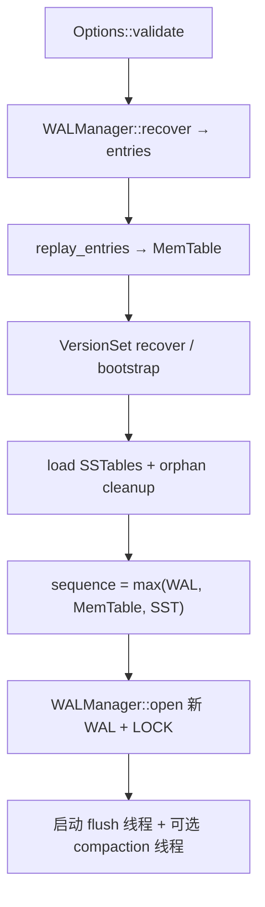
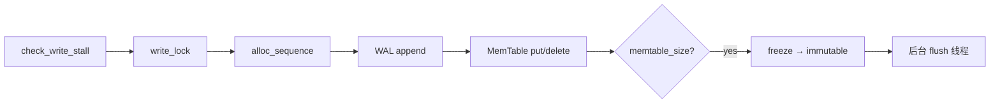
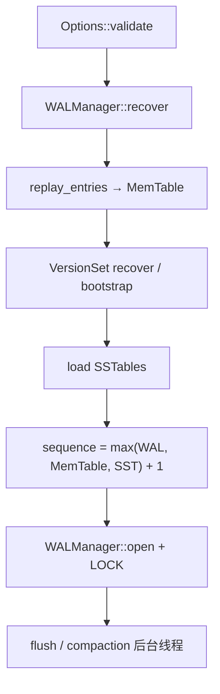

# Cursor transcript

---

## 1. User

## 文档整理 — 新会话

工作目录: `/root/code/database`

请先阅读 (不要跳过):
1. `AiKv-Workflow/backup/design.md` — 总规程
2. `AiKv-Workflow/backup/PROGRESS.md` — 当前进度
3. `AiKv-Workflow/backup/INDEX.md` — 本章索引 (若已有行则更新)

---

### 本次任务

| 项 | 值 |
|----|-----|
| PROGRESS 总步 | 1 |
| 目标文件 | `aidb/docs/modules/engine.md` |
| 本次子步 | 从步 0 开始 |
| 对比深度 | 核心章逐段 |

### 必须遵守

- **确认门控**: 步 0→1→2→3→4, 每步先讨论, 我确认后再下一步
- **步 4**: 先出 Module Skill 正文 **草稿**, 我确认后再写入 aidb/aikv、更新 INDEX/PROGRESS
- **Module Skill 基础模板**: frontmatter `name` + `description` (含 `Use when`); 见 `design.md`
- **过程只进 backup/**: INDEX、ISSUES; aidb/aikv 不写迁移历史
- **旧文档顺序**: `backup/{aidb,aikv}/` → `*-oldmain` → WiQunTools 查漏 → wiqun-*
- **待核实**: module 一行引用; 详情 `ISSUES.md`
- **步 4 落盘前**: 对照 create-skill Summary Checklist 自检 (见 `design.md`)

### 本次不要

- 不要跳过未确认的步骤
- 不要一次写多篇 module
- 不要修改 `design.md` / 流程, 除非我明确要求
- 不要 commit, 除非我明确要求

---

请从步 0 开始, 给出本步交付物, 等我确认。

---

## 2. Assistant

先阅读总规程、进度和索引，再按步 0 给出交付物。

**Tool `Read`**

```json
{
  "path": "/root/code/database/AiKv-Workflow/backup/design.md"
}
```


**Tool `Read`**

```json
{
  "path": "/root/code/database/AiKv-Workflow/backup/PROGRESS.md"
}
```


**Tool `Read`**

```json
{
  "path": "/root/code/database/AiKv-Workflow/backup/INDEX.md"
}
```


---

## 3. Assistant

正在对照 `design.md` 的 modules↔src 映射，扫描 aidb 中 `engine/{wal,memtable,db}` 的实际目录结构。

**Tool `Glob`**

```json
{
  "glob_pattern": "**/*",
  "target_directory": "/root/code/database/aidb/src/engine"
}
```


**Tool `Read`**

```json
{
  "path": "/root/code/database/aidb/src/lib.rs",
  "limit": 80
}
```


**Tool `Glob`**

```json
{
  "glob_pattern": "**/engine*",
  "target_directory": "/root/code/database/aidb"
}
```


---

## 4. Assistant

**Tool `Read`**

```json
{
  "path": "/root/code/database/aidb/src/engine/mod.rs"
}
```


**Tool `Read`**

```json
{
  "path": "/root/code/database/aidb/src/engine/db/mod.rs"
}
```


**Tool `Read`**

```json
{
  "path": "/root/code/database/aidb/src/engine/wal/mod.rs"
}
```


**Tool `Read`**

```json
{
  "path": "/root/code/database/aidb/src/engine/memtable/mod.rs"
}
```


**Tool `Glob`**

```json
{
  "glob_pattern": "**/*",
  "target_directory": "/root/code/database/aidb/tests"
}
```


---

## 5. Assistant

**Tool `Read`**

```json
{
  "limit": 120,
  "path": "/root/code/database/aidb/src/engine/db/inner.rs"
}
```


**Tool `Grep`**

```json
{
  "pattern": "engine|wal|memtable|WAL|MemTable",
  "glob": "**/*",
  "path": "/root/code/database/AiKv-Workflow/backup/aidb",
  "output_mode": "files_with_matches"
}
```


**Tool `Grep`**

```json
{
  "pattern": "engine|wal|memtable",
  "glob": "**/*",
  "path": "/root/code/database/aidb-oldmain",
  "output_mode": "files_with_matches",
  "head_limit": 30
}
```


**Tool `Read`**

```json
{
  "path": "/root/code/database/aidb/tests/engine.rs",
  "limit": 40
}
```


---

## 6. Assistant

**Tool `Grep`**

```json
{
  "path": "/root/code/database/AiKv-Workflow/backup/aidb",
  "pattern": "WAL|MemTable|WriteBatch|engine",
  "glob": "*.md",
  "head_limit": 40
}
```


**Tool `Glob`**

```json
{
  "glob_pattern": "**/*wal*",
  "target_directory": "/root/code/database/aidb-oldmain"
}
```


**Tool `Glob`**

```json
{
  "glob_pattern": "**/*memtable*",
  "target_directory": "/root/code/database/aidb-oldmain"
}
```


**Tool `Glob`**

```json
{
  "glob_pattern": "**/*engine*",
  "target_directory": "/root/code/database/WiQunTools/docs"
}
```


---

## 7. Assistant

**Tool `Glob`**

```json
{
  "glob_pattern": "**/*DB*",
  "target_directory": "/root/code/database/aidb-oldmain/docs"
}
```


**Tool `Read`**

```json
{
  "limit": 80,
  "path": "/root/code/database/WiQunTools/docs/wiqun-db-inventory/04-db-engine.md"
}
```


**Tool `Read`**

```json
{
  "limit": 50,
  "path": "/root/code/database/aidb/src/engine/wal/manager.rs"
}
```


**Tool `Read`**

```json
{
  "limit": 50,
  "path": "/root/code/database/aidb/src/engine/wal/record.rs"
}
```


---

## 8. Assistant

**Tool `Glob`**

```json
{
  "glob_pattern": "**/0*-*.md",
  "target_directory": "/root/code/database/WiQunTools/docs/wiqun-db-inventory"
}
```


**Tool `Read`**

```json
{
  "limit": 80,
  "path": "/root/code/database/aidb/src/config.rs"
}
```


**Tool `Read`**

```json
{
  "limit": 60,
  "path": "/root/code/database/aidb/src/engine/memtable/internal_key.rs"
}
```


---

## 9. Assistant

**Tool `Glob`**

```json
{
  "glob_pattern": "docs/modules/**",
  "target_directory": "/root/code/database/aidb"
}
```


**Tool `Grep`**

```json
{
  "pattern": "^\\s*pub fn",
  "path": "/root/code/database/aidb/src/engine/db/inner.rs"
}
```


**Tool `Read`**

```json
{
  "limit": 30,
  "path": "/root/code/database/aidb/tests/pipeline/wal_memtable.rs"
}
```


---

## 10. Assistant

## 步 0 — 定范围

**章节**: PROGRESS 步 1 · `aidb/docs/modules/engine.md`  
**对比深度 (步 3)**: 核心章 — 关键文件逐段 (wal / memtable / db)

---

### 本章边界

| 维度 | 内容 |
|------|------|
| **覆盖 `src/`** | `engine/wal/*`, `engine/memtable/*`, `engine/db/*` |
| **主题** | WAL 格式与轮转; MemTable / InternalKey; DB 写路径; WriteBatch; MVCC Snapshot; 崩溃恢复 replay |
| **公共 API (经 `lib.rs`)** | `DB`, `WriteBatch`, `WriteOp`, `Snapshot`, `DbIterGuard` |
| **跨模块依赖 (正文仅边界引用)** | `config::Options` (WAL/MemTable 相关字段); `error::Error`; flush/compaction 触发时调用 `sstable` / `compaction` / `cache` (细节 → `engine-storage.md`) |

**不覆盖 (明确划出)**:

| 域 | 归属章节 | 本章只写 |
|----|----------|----------|
| SSTable 布局 / 读写 | `engine-storage.md` | flush 时「写出 SSTable」边界; 读路径「查 SSTable 层」一句 |
| Compaction / VersionSet / MANIFEST | `engine-storage.md` | 后台线程存在; `maybe_trigger_compaction` 触发点 |
| Bloom / BlockCache | `engine-storage.md` | `DB` 持有 `BlockCache`; 配置项在 Options 表 |
| Checkpoint | `engine-storage.md` | 若有 `checkpoint_in_progress` 写路径交互, 一行引用 |
| Cluster / Backup / Metrics | 各自 module | 不在本章展开 |

**与 `engine-storage.md` 切分原则**: 本章 = **内存 + WAL + DB 协调写读路径**; 磁盘格式与后台整理 = 下一章.

---

### 源码范围清单

```shell
aidb/src/
├── config.rs                    # Options (WAL/MemTable 字段; 步 1 摘表)
├── error.rs                     # Error 枚举 (写路径错误码)
├── lib.rs                       # 公共 re-export 面
└── engine/
    ├── mod.rs                   # 子模块声明 (确认 wal/memtable/db 边界)
    ├── wal/
    │   ├── mod.rs
    │   ├── record.rs            # Record 物理格式, OpType, WalEntry
    │   ├── writer.rs            # 追加 / sync
    │   ├── reader.rs            # 顺序读 / 损坏处理
    │   └── manager.rs           # open/recover/append/rotate/cleanup, LOCK
    ├── memtable/
    │   ├── mod.rs
    │   ├── internal_key.rs      # encode/decode, ValueType, sequence 上界
    │   ├── key_bytes.rs         # user key 比较
    │   ├── table.rs             # MemTable / ImmutableMemTable, freeze
    │   └── iterator.rs          # MemTableIterator
    └── db/
        ├── mod.rs               # 子模块 + pub use
        ├── inner.rs             # DB 主体 (~1285 行): open/put/get/write/flush/close/后台线程
        ├── write_batch.rs       # WriteBatch / WriteOp
        ├── replay.rs            # WAL → MemTable replay (pub)
        ├── snapshot.rs          # Snapshot + SnapshotList (MVCC)
        ├── iterator.rs          # DBIterator / DbIterGuard
        └── numbers.rs           # wal/sst 文件编号扫描
```

**步 3 逐段对照候选 (核心文件)**:

- `wal/record.rs`, `wal/manager.rs` — 格式与生命周期
- `memtable/internal_key.rs`, `memtable/table.rs` — InternalKey 与 freeze 语义
- `db/inner.rs` — `open`, `put`/`write`, `get`, flush 路径, sequence 分配
- `db/replay.rs`, `db/snapshot.rs`, `db/write_batch.rs` — 恢复 / MVCC / 原子批写

---

### 拟读文件列表 (步 1–3)

#### A. 当前源码 (步 1 主读, 按优先级)

| 优先级 | 路径 | 目的 |
|--------|------|------|
| P0 | `src/lib.rs`, `src/engine/mod.rs` | 公共面与子模块边界 |
| P0 | `src/engine/db/inner.rs` | DB 总协调、写路径、open/recovery |
| P0 | `src/engine/wal/manager.rs`, `record.rs` | WAL 生命周期与 entry 格式 |
| P0 | `src/engine/memtable/table.rs`, `internal_key.rs` | MemTable 语义与 InternalKey |
| P1 | `db/write_batch.rs`, `replay.rs`, `snapshot.rs`, `iterator.rs`, `numbers.rs` | 批写 / replay / MVCC / 迭代 |
| P1 | `wal/writer.rs`, `reader.rs` | Record 分片与 sync 细节 |
| P1 | `memtable/iterator.rs`, `key_bytes.rs` | 迭代与 key 比较 |
| P2 | `src/config.rs` (WAL/MemTable/运行时 poll 字段) | 配置表 |
| P2 | `src/error.rs` | 写路径相关错误 |

#### B. 测试 (步 1 验证行为)

| 路径 | 覆盖 |
|------|------|
| `tests/wal.rs` → `modules/wal/{function,dataflow}.rs` | WAL 单元 + 数据流 |
| `tests/memtable.rs` → `modules/memtable/{function,dataflow}.rs` | MemTable + InternalKey |
| `tests/db.rs` → `modules/db/*.rs` | DB 模块测试 (含 wal_corruption, checkpoint_consistency 等) |
| `tests/pipeline/wal_memtable.rs` | WAL recover → MemTable replay 管线 |
| `tests/engine.rs` → `engine/{scenarios,crash_recovery,dataflow}.rs` | DB 黑盒: 场景 / 崩溃恢复 |
| `tests/snapshot.rs` → `modules/snapshot/*.rs` | Snapshot MVCC (与 engine 强相关) |

> `tests/engine/compaction.rs` 步 1 仅作 flush 后行为参考; compaction 细节归 `engine-storage.md`.

#### C. 旧文档 (步 2 查, 此处预列)

| 顺序 | 来源 | 路径 |
|------|------|------|
| 1 | backup/aidb | `README.md`, `DEPLOYMENT.md` (Options 表), `docs/observability.md` (WAL/MemTable metrics 段) |
| 2 | aidb-oldmain | `docs/WAL_IMPLEMENTATION.md`, `docs/MEMTABLE_IMPLEMENTATION.md`, `docs/completions/DB_*` |
| 3 | WiQunTools | `wiqun-db-inventory/01-wal.md`, `02-memtable.md`, `04-db-engine.md`, `08-snapshot.md` (查漏) |
| 4 | wiqun-db | 与 aidb 重叠时二选一 |

---

### 公共 API 快照 (文档「关键类型与 API」起点)

经 `lib.rs` 导出:

- `DB::open` / `put` / `get` / `delete` / `write` / `delete_range` / `snapshot` / `iter` / `scan` / `flush` / `close`
- `WriteBatch`, `WriteOp`
- `Snapshot`, `DbIterGuard`
- 观测辅助: `current_sequence`, `immutable_memtable_count`, `approximate_memory_bytes`, cache 相关 (边界属 storage)

`engine` 内 **pub** (crate 内/测试用): `replay_entries`, `WALManager`, `WalEntry`, InternalKey 编解码, `MemTable` / `ImmutableMemTable` 等.

---

### 步 0 结论

1. **范围**: 15 个生产源文件 + `config.rs`/`error.rs`/`lib.rs` 摘录; 测试以 wal / memtable / db / pipeline / engine / snapshot 六组为主.
2. **边界**: SSTable/compaction/cache/checkpoint 只写 DB 侧触发与衔接; 格式与算法归 `engine-storage.md`.
3. **体量**: `db/inner.rs` ~1285 行 — 步 4 正文按「数据流 + 常见任务」组织, 不 dump 全 API; 步 3 对其逐段对照.
4. **INDEX 拟更新** (确认后写入): `engine.md` 行补充「范围: wal(4) + memtable(5) + db(7); 状态: 步 0 ✅」.

---

请确认本步范围与拟读列表. 回复 **可以** 后进入 **步 1 (读新代码)**; 如需调整边界或增减文件, 说明即可.

---

## 11. User

可以

---

## 12. Assistant

步 0 已确认. 正在更新 INDEX 范围行, 并阅读 `engine/{wal,memtable,db}` 源码以产出步 1 草稿.

**Tool `StrReplace`**

```json
{
  "path": "/root/code/database/AiKv-Workflow/backup/INDEX.md",
  "old_string": "| `docs/modules/engine.md` | 待开始 | | | `engine/{wal,memtable,db}` |",
  "new_string": "| `docs/modules/engine.md` | 步 0 ✅ | (步 2 起填) | | wal(4)+memtable(5)+db(7); config/error 摘录; 测试 wal/memtable/db/pipeline/engine/snapshot |"
}
```


**Tool `Read`**

```json
{
  "path": "/root/code/database/aidb/src/engine/db/write_batch.rs"
}
```


**Tool `Read`**

```json
{
  "path": "/root/code/database/aidb/src/engine/db/replay.rs"
}
```


**Tool `Read`**

```json
{
  "path": "/root/code/database/aidb/src/engine/db/snapshot.rs"
}
```


**Tool `Read`**

```json
{
  "path": "/root/code/database/aidb/src/engine/db/iterator.rs"
}
```


---

## 13. Assistant

**Tool `Read`**

```json
{
  "offset": 370,
  "limit": 320,
  "path": "/root/code/database/aidb/src/engine/db/inner.rs"
}
```


**Tool `Read`**

```json
{
  "path": "/root/code/database/aidb/src/engine/memtable/table.rs"
}
```


**Tool `Read`**

```json
{
  "limit": 200,
  "path": "/root/code/database/aidb/src/engine/wal/manager.rs"
}
```


---

## 14. Assistant

**Tool `Read`**

```json
{
  "limit": 200,
  "offset": 200,
  "path": "/root/code/database/aidb/src/engine/wal/manager.rs"
}
```


**Tool `Read`**

```json
{
  "limit": 150,
  "offset": 50,
  "path": "/root/code/database/aidb/src/engine/wal/record.rs"
}
```


**Tool `Read`**

```json
{
  "limit": 200,
  "offset": 688,
  "path": "/root/code/database/aidb/src/engine/db/inner.rs"
}
```


**Tool `Read`**

```json
{
  "path": "/root/code/database/aidb/src/engine/db/numbers.rs"
}
```


---

## 15. Assistant

**Tool `Grep`**

```json
{
  "path": "/root/code/database/aidb/src/engine/db/inner.rs",
  "pattern": "fn (maybe_freeze|freeze|alloc_sequence|write_put|write_delete|flush_immutable|rotate_wal|try_cleanup)",
  "-A": 25
}
```


**Tool `Shell`**

```bash
cd /root/code/database/aidb && cargo test --test wal --test memtable --test db --test pipeline -- --test-threads=1 2>&1 | tail -25
```


---

## 16. Assistant

**Tool `Read`**

```json
{
  "limit": 150,
  "offset": 59,
  "path": "/root/code/database/aidb/src/engine/db/inner.rs"
}
```


**Tool `Shell`**

```bash
cd /root/code/database/aidb && cargo test --test engine --test snapshot -- --test-threads=1 2>&1 | tail -15
```


---

## 17. Assistant

**Tool `Grep`**

```json
{
  "path": "/root/code/database/aidb/src/engine/db/inner.rs",
  "pattern": "iter_at_sequence",
  "-A": 12
}
```


---

## 18. Assistant

## 步 1 — 读新代码 (草稿)

已对照当前 `aidb` 源码梳理; 测试 `wal` / `memtable` / `db` / `pipeline` / `engine` / `snapshot` 均通过.

---

### 职责摘要

| 子域 | 职责 | 对外面 |
|------|------|--------|
| **WAL** | 崩溃前持久化写操作; 目录级 `LOCK`; 文件 `wal_{n}.log`; Record 物理层 + WalEntry 逻辑层 | `WALManager::open/recover/append/rotate/cleanup`; `replay_entries` 消费 recovered entries |
| **MemTable** | 内存写缓冲 (`SkipMap<InternalKey, value>`); InternalKey = user_key + sequence + ValueType | `put/delete/get/search/freeze` → `ImmutableMemTable` |
| **DB** | 协调 WAL + MemTable + (flush 时) SSTable; sequence 分配; MVCC 读; 后台 flush/compaction 线程 | `DB::*` 公共 API + `Snapshot` |

**本章边界 (再次确认)**: flush 写出 SSTable、compaction 调度、VersionSet 加载 — 仅写 DB 侧触发点; 格式/算法细节归 `engine-storage.md`.

---

### 代码地图

| 路径 | 职责 | 入口 |
|------|------|------|
| `engine/wal/record.rs` | Record (CRC+Length+Type+Data); `WalEntry` 编解码; `OpType` (Put/Delete/BatchStart/FileHeader) | `WalEntry::encode/decode`, `RecordType` |
| `engine/wal/writer.rs` | 追加 Record; 可选 per-record sync | `Writer::write_record`, `sync_all` |
| `engine/wal/reader.rs` | 顺序读; strict/非 strict 损坏处理; 分片重组 | `Reader::read_record` → `ReadStatus` |
| `engine/wal/manager.rs` | 生命周期: open/append/rotate/cleanup/recover; FileHeader; WAL GC watermark | `WALManager::*` |
| `engine/memtable/internal_key.rs` | InternalKey 编解码; `ValueType`; `SEQUENCE_LIMIT` (2^56) | `encode_internal_key`, `check_sequence` |
| `engine/memtable/table.rs` | 可变/不可变 MemTable; MVCC `search(seek_key)` | `MemTable::put/delete/freeze` |
| `engine/memtable/iterator.rs` | MemTable 正向迭代 | `MemTableIterator` |
| `engine/db/inner.rs` | DB 主体: open/写/读/flush/close/后台线程 | `DB::open`, `put/get/write/...` |
| `engine/db/write_batch.rs` | 原子批写容器 | `WriteBatch`, `WriteOp` |
| `engine/db/replay.rs` | WAL entry → MemTable | `replay_entries`, `apply_entry` |
| `engine/db/snapshot.rs` | MVCC 快照 + `SnapshotList` (compaction 保旧版本) | `Snapshot::get/iter/scan` |
| `engine/db/iterator.rs` | 跨 MemTable + SSTable 多路归并; tombstone 过滤; snapshot seq 边界 | `DBIterator` |
| `engine/db/numbers.rs` | WAL 文件编号扫描 | `scan_next_wal_file_number` |

**公共 re-export** (`lib.rs`): `DB`, `WriteBatch`, `WriteOp`, `Snapshot`, `DbIterGuard`.

---

### 主流程要点

#### 1. `DB::open` (恢复 + 启动)



- `recover` 读全部 `wal_*.log`: FileHeader → WalEntry; 支持 Record 分片与 `BatchStart` 原子边界
- `strict_wal_recovery=false` 时损坏 record 可跳过; FileHeader CRC 有豁免逻辑
- SSTable/VersionSet 细节本章只记「open 时加载」; 步 3/4 不展开

#### 2. 单条写 (`put` / `delete`)

1. `check_write_stall()` — L0 过多时 sleep (需 `background_compaction=true`)
2. `write_lock` → `alloc_sequence(1)` — 原子递增, 上限 `SEQUENCE_LIMIT`
3. WAL append (`use_wal=false` 则跳过) → `sync_wal` 时 fsync
4. MemTable `put/delete`
5. `maybe_freeze()` — `approximate_size >= memtable_size` 时 freeze → push `immutable_memtables`
6. immutable 达 `max_write_buffer_number` → `wait_for_memtable_slot` 驱动 `flush_pending`

#### 3. 批写 (`WriteBatch`)

- 连续 sequence: `[base, base+n-1]`
- WAL: 先写 `BatchStart` (value = op count u32 LE), 再逐条 entry; **一次** `sync_wal` (若开启)
- MemTable 同 sequence 批量写入
- `delete_range`: scan 收集 key → 组装 `WriteBatch` (非 RangeTombstone)

#### 4. 读路径 (`get` / MVCC)

- 普通 `get`: `max_seq = sequence.load()`
- `get_at_sequence(key, max_seq)`: 构造 `seek_key = encode_internal_key(key, max_seq, TypePut)`
- 查找顺序: active MemTable → immutable (新→旧) → L0 SST (新→旧) → L1+ binary search
- `TypeDelete` → `None`; 更高 sequence 版本不可见

#### 5. Snapshot

- `snapshot()`: 在 `write_lock` 下读当前 `sequence`, 注册到 `SnapshotList`
- `Snapshot::get/iter/scan` 使用固定 `sequence` 边界
- `Drop` 时 unregister; compaction 读 `min_snapshot_sequence()` 保留旧版本

#### 6. 迭代 (`iter` / `scan`)

- 非 snapshot 迭代用 `K_MAX_SEQUENCE` (2^56-1) — 见所有已写入版本
- `DBIterator`: 各层 `LayerIter` → 取 min user_key → 同 key 取 max visible sequence → 跳过 tombstone
- 支持 `prev` / `seek_to_last` (反向迭代)

#### 7. Flush / WAL 轮转 / GC

- `flush()` / 后台 `flush_pending`: freeze active → flush immutable → `SSTableBuilder` 写出 → rotate WAL → cleanup
- `rotate_wal`: flush 后切新 `wal_{n+1}.log`, 写新 FileHeader
- `wal_gc_watermark`: min(immutable.flush_seq) 或 active MemTable 最小 sequence → `cleanup(watermark)`
- flush 后 `maybe_trigger_compaction()` — 细节归 storage 章

#### 8. `close`

- 停 compaction/flush 线程 → `do_flush()` → WAL sync + close + cleanup(∞)

---

### 关键 invariant (文档应保留)

- **Sequence**: `sequence < 2^56`; InternalKey 仅编码低 56 位; overflow → `InvalidState`
- **写顺序**: WAL append **先于** MemTable 写入 (单条与 batch 均如此)
- **Batch 原子性**: `BatchStart` + N entries; recover 时 batch 不完整则整批 rollback
- **MemTable freeze**: 消费 `self` (`std::mem::take`), 新建空 MemTable; `flush_seq` = 冻结时刻 sequence
- **单进程**: `LOCK` 文件 + `fs2` 独占锁; 多进程打开 → `Error::Busy`
- **User key**: 非空 (`validate_user_key`); empty key 拒绝

---

### 配置项 (engine 相关, 摘自 `Options`)

| 项 | 默认量级 | 作用 |
|----|----------|------|
| `memtable_size` | 64 MiB | freeze 阈值 |
| `max_write_buffer_number` | — | immutable 上限; 超出背压 |
| `use_wal` / `sync_wal` / `strict_wal_recovery` / `max_wal_size` | — | WAL 开关/sync/恢复/轮转 |
| `flush_poll_ms` | 500ms | 后台 flush 轮询 |
| `write_stall_poll_ms` / L0 triggers | — | 写 stall (依赖 compaction) |
| `memtable_wait_iters` | — | immutable 满时 flush 重试次数 |

(compaction/cache/SSTable 字段在配置表中出现, 但语义归 `engine-storage.md`.)

---

### 测试锚点 (步 4「测试」节可用)

```bash
cargo test --test wal --test memtable --test db --test pipeline -- --test-threads=1
cargo test --test engine --test snapshot -- --test-threads=1
```

| 测试集 | 验证 |
|--------|------|
| `tests/wal` | Record 格式, recover, BatchStart rollback, cleanup, LOCK, strict mode |
| `tests/memtable` | InternalKey, put/delete/get, freeze |
| `tests/pipeline/wal_memtable` | recover → replay 管线 |
| `tests/db` | DB 模块 (含 wal_corruption, bootstrap) |
| `tests/engine` | 黑盒场景 + crash_recovery |
| `tests/snapshot` | MVCC + compaction 并发保版本 |

---

### 步 1 观察 (供步 2/3 参考, 非 ISSUES)

- `put`/`delete` 在 `write_lock` 外先 `get()` 更新 `total_key_count` — 并发下计数可能近似 (metrics 用途)
- `DB::open` 中 `sequence` 初始为 `last_sequence`, 首写从 `last_sequence+1` 起 — 与 WAL FileHeader `min_seq` 对齐
- `iter()`/`scan()` 用 `K_MAX_SEQUENCE` 而非当前 sequence — 与 `get()` 的 MVCC 边界 intentionally 不同

---

请确认步 1 草稿. 回复 **可以** 后进入 **步 2 (查旧文档)**; 如需修正职责划分或流程描述, 请指出.

---

## 19. User

可以

---

## 20. Assistant

步 1 已确认. 正在按旧文档查阅顺序检索 WAL、MemTable、DB 相关文档。

**Tool `Glob`**

```json
{
  "glob_pattern": "**/*",
  "target_directory": "/root/code/database/AiKv-Workflow/backup/aidb"
}
```


**Tool `Glob`**

```json
{
  "glob_pattern": "**/*",
  "target_directory": "/root/code/database/aidb-oldmain/docs"
}
```


**Tool `Read`**

```json
{
  "limit": 120,
  "path": "/root/code/database/WiQunTools/docs/wiqun-db-inventory/01-wal.md"
}
```


**Tool `Read`**

```json
{
  "limit": 120,
  "path": "/root/code/database/WiQunTools/docs/wiqun-db-inventory/02-memtable.md"
}
```


---

## 21. Assistant

**Tool `Read`**

```json
{
  "path": "/root/code/database/AiKv-Workflow/backup/ISSUES.md"
}
```


**Tool `Grep`**

```json
{
  "path": "/root/code/database/AiKv-Workflow/backup/aidb/ARCHITECTURE.md",
  "pattern": "WAL|MemTable|WriteBatch|Snapshot|engine"
}
```


**Tool `Grep`**

```json
{
  "path": "/root/code/database/AiKv-Workflow/backup/aidb/DESIGN.md",
  "pattern": "WAL|MemTable|WriteBatch|Snapshot|sequence"
}
```


**Tool `Read`**

```json
{
  "limit": 100,
  "path": "/root/code/database/aidb-oldmain/docs/WAL_IMPLEMENTATION.md"
}
```


**Tool `Read`**

```json
{
  "limit": 100,
  "path": "/root/code/database/aidb-oldmain/docs/MEMTABLE_IMPLEMENTATION.md"
}
```


---

## 22. Assistant

**Tool `Grep`**

```json
{
  "path": "/root/code/database/aidb/src/engine",
  "pattern": "batch.*rotate|rotate.*batch|max_wal_size"
}
```


**Tool `Read`**

```json
{
  "limit": 80,
  "offset": 115,
  "path": "/root/code/database/WiQunTools/docs/wiqun-db-inventory/01-wal.md"
}
```


**Tool `Read`**

```json
{
  "limit": 80,
  "path": "/root/code/database/WiQunTools/docs/wiqun-db-inventory/08-snapshot.md"
}
```


**Tool `Glob`**

```json
{
  "glob_pattern": "**/WAL*.md",
  "target_directory": "/root/code/database/wiqun-db"
}
```


---

## 23. Assistant

**Tool `Glob`**

```json
{
  "glob_pattern": "**/*",
  "target_directory": "/root/code/database/wiqun-db"
}
```


**Tool `Read`**

```json
{
  "limit": 100,
  "offset": 388,
  "path": "/root/code/database/aidb/src/engine/wal/manager.rs"
}
```


**Tool `Read`**

```json
{
  "limit": 80,
  "path": "/root/code/database/aidb-oldmain/docs/completions/DB_CORE_COMPLETION_SUMMARY.md"
}
```


**Tool `Read`**

```json
{
  "limit": 60,
  "path": "/root/code/database/AiKv-Workflow/backup/aidb/docs/observability.md"
}
```


---

## 24. Assistant

**Tool `Glob`**

```json
{
  "glob_pattern": "docs/**/*.md",
  "target_directory": "/root/code/database/wiqun-db"
}
```


**Tool `Grep`**

```json
{
  "path": "/root/code/database/aidb/src/engine/db/inner.rs",
  "pattern": "rotate|batch"
}
```


**Tool `Read`**

```json
{
  "limit": 50,
  "offset": 190,
  "path": "/root/code/database/WiQunTools/docs/wiqun-db-inventory/01-wal.md"
}
```


**Tool `Read`**

```json
{
  "limit": 80,
  "path": "/root/code/database/AiKv-Workflow/backup/aidb/DEPLOYMENT.md"
}
```


---

## 25. Assistant

**Tool `Grep`**

```json
{
  "path": "/root/code/database/aidb/src/config.rs",
  "pattern": "memtable_size|block_cache_size|default",
  "head_limit": 40
}
```


**Tool `Read`**

```json
{
  "limit": 80,
  "path": "/root/code/database/aidb-oldmain/docs/archive/WAL_COMPLETION_SUMMARY.md"
}
```


**Tool `Grep`**

```json
{
  "path": "/root/code/database/WiQunTools/docs/wiqun-db-inventory/04-db-engine.md",
  "pattern": "delete_range|iter\\(\\)|K_MAX|SnapshotList|write_lock"
}
```


---

## 26. Assistant

## 步 2 — 查旧文档

按 `backup/aidb` → `aidb-oldmain` → WiQunTools inventory → `wiqun-db` 顺序查阅. 以下为分类结论与拟写 ISSUES (尚未写入 `ISSUES.md`).

---

### 旧文档清单与分类

#### 1. `backup/aidb/` (重构后旧稿)

| 路径 | 分类 | 说明 |
|------|------|------|
| `ARCHITECTURE.md` | **仍有效** | LSM 写/读路径、WAL→MemTable→flush 流程与当前 `engine/` 一致; 可提炼数据流 |
| `DESIGN.md` | **仍有效** | WAL Record 分片、SkipMap 选型; 原理归阶段 2 `DESIGN.md`, engine 章不展开 |
| `README.md` | **部分有效** | 模块清单可用; 版本号/里程碑 (M1/M2) 过时 |
| `DEPLOYMENT.md` | **已过时** | `memtable_size`/`block_cache_size` 默认值错 (写 4MB/8MB, 代码 64MiB); API 示例 `db.batch()`、`scan(b"a", b"z")` 与当前不符 |
| `docs/observability.md` | **部分有效** | WAL/MemTable span 名、指标名仍对; 主体归 `observability.md` 章, engine 仅引用 |
| `docs/superpowers/plans/2026-06-02-hardcoded-values-*` | **已过时** | Options 已吸收 runtime 常量; 历史计划 |
| `docs/superpowers/plans/*compaction*`, `*cache*`, `*cluster*` | **跳过** | 属 engine-storage / cluster |

#### 2. `aidb-oldmain/docs/`

| 路径 | 分类 | 说明 |
|------|------|------|
| `WAL_IMPLEMENTATION.md` | **已过时** | 路径 `src/wal/`; 类型名 `WALWriter`/`Record` struct; 与 `engine/wal/{record,writer,reader,manager}` 不符 |
| `MEMTABLE_IMPLEMENTATION.md` | **已过时** | `ValueType`: Deletion=0/Value=1 (当前 TypePut=0/TypeDelete=1); `InternalKey` struct + `src/memtable/` |
| `archive/WAL_COMPLETION_SUMMARY.md` | **已过时** | 2025-11 里程碑; 结构/路径旧 |
| `completions/DB_CORE_COMPLETION_SUMMARY.md` | **已过时** | DB 字段全 `Arc<RwLock>`, 无 VersionSet/compaction 线程; Phase5 快照 |
| `completions/MEMTABLE_COMPLETION_SUMMARY.md` | **已过时** | 同上 ValueType/路径问题 |
| `completions/BUG_FIX_WAL_CORRUPTION_TEST.md` | **查漏** | strict/recover 测试背景; 不迁入正文 |
| `completions/DB_ENGINE_STATUS_CHECK.md` | **已过时** | 历史状态检查 |
| `archive/*`, `MULTI_RAFT*`, `RAFT*` 等 | **跳过** | 非 engine 域 |

#### 3. WiQunTools `wiqun-db-inventory/` (查漏)

| 路径 | 分类 | 说明 |
|------|------|------|
| `01-wal.md` | **大部分仍有效** | Record/WalEntry/BatchStart/FileHeader/recover 两阶段与当前 `wal/manager.rs` 高度一致 |
| `02-memtable.md` | **大部分仍有效** | InternalKey 7B 位取反、SkipMap、`search(seek_key)` 与代码一致 |
| `04-db-engine.md` | **部分有效 / 部分过时** | 写路径/锁/sequence 语义仍可用; **过时**: Phase5 标注「无 delete_range/compaction」; 当前均已实现 |
| `08-snapshot.md` | **部分有效 / 部分过时** | `get_at_sequence`/`write_lock` 语义仍对; **过时**: 「Snapshot 不注册全局列表」— 当前有 `SnapshotList`; 「compaction 不保护 snapshot」— 当前 compaction 用 `min_snapshot_sequence()` |

#### 4. `wiqun-db/`

| 结论 | 说明 |
|------|------|
| **与 backup/aidb 重叠, 跳过** | 仅 `docs/observability.md` + superpowers; 无独立 WAL/MemTable 规格 |

---

### 旧文档 vs 当前代码 — 关键差异 (供步 3 对照)

| 主题 | 旧文档说法 | 当前代码 | 文档应如何写 |
|------|-----------|----------|--------------|
| 源码路径 | `src/wal/`, `src/memtable/` | `src/engine/wal/`, `engine/memtable/` | 以新路径为准 |
| ValueType | oldmain: Deletion=0 | TypePut=0, TypeDelete=1 | 写当前枚举 |
| `delete_range` | inventory Phase5.8 未实现 | `DB::delete_range` 已实现 (scan+WriteBatch) | 列入常见任务 |
| Snapshot 注册 | inventory: 无全局列表 | `SnapshotList` register/unregister | 写 compaction 保版本机制 |
| Batch 跨 WAL | inventory: batch 禁止跨文件 rotate | `WALManager::append` 每条后可 `rotate()` | 见拟 ISSUE-001 |
| 并发读 batch | inventory: 读可能见部分 batch | 代码: MemTable 逐条写, get 无锁 | 写「已知限制」, 非 bug |
| `iter`/`scan` seq | inventory 少提 | 用 `K_MAX_SEQUENCE`, 非 `sequence.load()` | 写 invariant, 与 `get` 区分 |
| Options 默认值 | DEPLOYMENT: 4MB/8MB | `config.rs`: 64MiB | 以 `config.rs` 为准 |

---

### 步 4 可采纳 vs 丢弃

**可采纳 (以新代码为准重写)**:
- inventory `01-wal` / `02-memtable`: 格式、BatchStart recover、InternalKey 编码
- inventory `04-db-engine`: 写路径顺序、sequence high-water、`write_lock` 与 snapshot 关系
- inventory `08-snapshot`: `get_at_sequence` 查找链 (删 outdated 的 SnapshotList 否定)
- backup `ARCHITECTURE.md`: mermaid 数据流骨架

**不迁入 module 正文**:
- oldmain 实现文档全文、completions 里程碑、superpowers 历史计划
- DEPLOYMENT 错误 API 示例
- inventory Phase 标注与 roadmap 状态

---

### 拟写 ISSUES (讨论后写入)

#### ISSUE-001: WriteBatch 可能跨 WAL 文件边界

- **状态**: open (待核实)
- **发现于**: 步 2 / `engine.md`
- **相关 src**: `engine/db/inner.rs` (`DB::write`), `engine/wal/manager.rs` (`append` → `rotate`)
- **旧文档**: `WiQunTools/.../01-wal.md` — 「Batch 不跨 WAL 文件」
- **现象**: `write()` 循环 `wal.append()`; `append` 在 `size >= max_wal_size` 时自动 `rotate`, batch 中途可切文件. recover 按文件内 batch 边界 rollback, 跨文件 batch 语义未定义
- **影响**: 若可复现, 可能是崩溃恢复边界 bug; 文档暂写「batch WAL 原子性在同文件内保证」或待核实
- **下一步**: 步 3 对照 oldmain + 写测试复现

#### ISSUE-002: 大 WriteBatch 与 `max_wal_size` 轮转交互

- **状态**: open (待核实)
- **发现于**: 步 2 / `engine.md`
- **旧文档**: `01-wal.md` — batch 超 max_wal_size 时禁止 rotate
- **现象**: 未见「batch 写入期间禁止 rotate」逻辑; 与 ISSUE-001 同源
- **下一步**: 与 ISSUE-001 一并步 3 核实

**仅文档说明 (不写 ISSUES)**:
- 并发 `get` 可能见 WriteBatch 部分 MemTable 写入 (inventory 已说明, LevelDB 风格)
- `total_key_count` 在 `write_lock` 外更新 (近似计数)

---

### INDEX 拟更新 (确认步 2 后写入)

`engine.md` 行补充:

| 参考的旧文档 | 处理 |
|--------------|------|
| `backup/aidb/ARCHITECTURE.md`, `DESIGN.md` | 提炼数据流/决策, 不回迁 |
| `backup/aidb/DEPLOYMENT.md`, `README.md` | 默认值/API 过时, 不采 |
| `backup/aidb/docs/observability.md` | WAL/MemTable 指标名参考 → observability 章 |
| `aidb-oldmain/docs/WAL_IMPLEMENTATION.md`, `MEMTABLE_IMPLEMENTATION.md`, `completions/DB_*` | 格式查漏; 路径/类型过时 |
| `WiQunTools/.../01-wal`, `02-memtable`, `04-db-engine`, `08-snapshot` | 主规格参考; Phase 状态过时 |
| `wiqun-db/docs/` | 与 backup 重叠, 跳过 |

---

请确认步 2. 回复 **可以** 后:
1. 更新 `INDEX.md` 参考列
2. 将 ISSUE-001/002 写入 `ISSUES.md` (若你同意列入)
3. 进入 **步 3 (oldmain 代码逐段对照)**

若 ISSUE-001/002 不应跟踪, 或某份旧文档分类需调整, 请说明.

---

## 27. User

可以

---

## 28. Assistant

步 2 已确认. 正在更新 INDEX 与 ISSUES, 并对照 oldmain 源码做步 3 逐段对比.

**Tool `StrReplace`**

```json
{
  "new_string": "| `docs/modules/engine.md` | 步 2 ✅ | backup/aidb/ARCHITECTURE.md, DESIGN.md; aidb-oldmain/docs/WAL_IMPLEMENTATION.md, MEMTABLE_IMPLEMENTATION.md, completions/DB_*; WiQunTools 01-wal, 02-memtable, 04-db-engine, 08-snapshot | 提炼不回迁; oldmain 路径/类型过时; inventory Phase 状态过时 | wal(4)+memtable(5)+db(7); ISSUE-001/002 |",
  "old_string": "| `docs/modules/engine.md` | 步 0 ✅ | (步 2 起填) | | wal(4)+memtable(5)+db(7); config/error 摘录; 测试 wal/memtable/db/pipeline/engine/snapshot |",
  "path": "/root/code/database/AiKv-Workflow/backup/INDEX.md"
}
```


**Tool `StrReplace`**

```json
{
  "new_string": "## 条目列表\n\n<!-- 按 ISSUE-NNN 倒序追加 -->\n\n### ISSUE-002: 大 WriteBatch 与 max_wal_size 轮转交互\n\n- **状态**: open\n- **发现于**: PROGRESS 步 1 / 章节 `aidb/docs/modules/engine.md` (步 2)\n- **相关 src**: `aidb/src/engine/db/inner.rs` (`DB::write`), `aidb/src/engine/wal/manager.rs` (`append` → `rotate`)\n- **旧文档**: `WiQunTools/docs/wiqun-db-inventory/01-wal.md` — batch 超 `max_wal_size` 时禁止 rotate\n- **现象**: inventory 规定大 batch 可临时超过文件上限且写入期间禁止 rotate; 当前 `append` 每条后检查 `max_wal_size` 并可能 rotate, 无 batch 临界区\n- **影响**: 与 ISSUE-001 同源; 文档暂勿写 inventory 的 batch 轮转豁免, 或标注待核实\n- **下一步**: 步 3 对照 oldmain; 需写测试复现\n\n### ISSUE-001: WriteBatch 可能跨 WAL 文件边界\n\n- **状态**: open\n- **发现于**: PROGRESS 步 1 / 章节 `aidb/docs/modules/engine.md` (步 2)\n- **相关 src**: `aidb/src/engine/db/inner.rs` (`DB::write`), `aidb/src/engine/wal/manager.rs` (`append` → `rotate`)\n- **旧文档**: `WiQunTools/docs/wiqun-db-inventory/01-wal.md` — 「Batch 不跨 WAL 文件」\n- **现象**: `write()` 循环 `wal.append()`; `append` 在 `size >= max_wal_size` 时自动 `rotate`, batch 中途可切文件. recover 按文件内 batch 边界 rollback, 跨文件 batch 语义未定义\n- **影响**: 若可复现, 可能是崩溃恢复边界 bug; module 待核实一行引用\n- **下一步**: 步 3 对照 oldmain + 写测试复现",
  "old_string": "## 条目列表\n\n<!-- 按 ISSUE-NNN 倒序追加 -->\n\n(暂无)",
  "path": "/root/code/database/AiKv-Workflow/backup/ISSUES.md"
}
```


**Tool `Glob`**

```json
{
  "glob_pattern": "**/wal/**/*.rs",
  "target_directory": "/root/code/database/aidb-oldmain"
}
```


**Tool `Glob`**

```json
{
  "glob_pattern": "**/memtable/**/*.rs",
  "target_directory": "/root/code/database/aidb-oldmain"
}
```


**Tool `Glob`**

```json
{
  "glob_pattern": "**/db/**/*.rs",
  "target_directory": "/root/code/database/aidb-oldmain"
}
```


---

## 29. Assistant

**Tool `Glob`**

```json
{
  "glob_pattern": "**/*.rs",
  "target_directory": "/root/code/database/aidb-oldmain/src"
}
```


**Tool `Grep`**

```json
{
  "path": "/root/code/database/aidb-oldmain/src",
  "pattern": "struct DB|WALManager|WriteBatch"
}
```


---

## 30. Assistant

**Tool `Read`**

```json
{
  "limit": 120,
  "path": "/root/code/database/aidb-oldmain/src/wal/record.rs"
}
```


**Tool `Read`**

```json
{
  "limit": 80,
  "path": "/root/code/database/aidb-oldmain/src/memtable/internal_key.rs"
}
```


**Tool `Grep`**

```json
{
  "path": "/root/code/database/aidb-oldmain/src/lib.rs",
  "pattern": "fn (write|put|open|recover|snapshot|replay)"
}
```


**Tool `Read`**

```json
{
  "limit": 100,
  "path": "/root/code/database/aidb-oldmain/src/snapshot.rs"
}
```


---

## 31. Assistant

**Tool `Grep`**

```json
{
  "path": "/root/code/database/aidb-oldmain/src",
  "pattern": "BatchStart|FileHeader|WalEntry|OpType"
}
```


**Tool `Read`**

```json
{
  "limit": 120,
  "offset": 173,
  "path": "/root/code/database/aidb-oldmain/src/lib.rs"
}
```


**Tool `Read`**

```json
{
  "limit": 120,
  "offset": 460,
  "path": "/root/code/database/aidb-oldmain/src/lib.rs"
}
```


**Tool `Read`**

```json
{
  "limit": 120,
  "offset": 850,
  "path": "/root/code/database/aidb-oldmain/src/lib.rs"
}
```


---

## 32. Assistant

**Tool `Glob`**

```json
{
  "glob_pattern": "src/engine/wal/manager.rs",
  "target_directory": "/root/code/database/wiqun-db"
}
```


**Tool `Grep`**

```json
{
  "path": "/root/code/database/wiqun-db/src/engine/db/inner.rs",
  "pattern": "fn write|rotate|BatchStart"
}
```


**Tool `Grep`**

```json
{
  "path": "/root/code/database/wiqun-db/src/engine/wal/manager.rs",
  "pattern": "rotate|max_wal_size|batch"
}
```


---

## 33. Assistant

**Tool `Shell`**

```bash
diff -q /root/code/database/aidb/src/engine/wal/record.rs /root/code/database/wiqun-db/src/engine/wal/record.rs 2>/dev/null; diff -q /root/code/database/aidb/src/engine/memtable/internal_key.rs /root/code/database/wiqun-db/src/engine/memtable/internal_key.rs 2>/dev/null; diff -q /root/code/database/aidb/src/engine/db/inner.rs /root/code/database/wiqun-db/src/engine/db/inner.rs 2>/dev/null; wc -l /root/code/database/aidb-oldmain/src/lib.rs
```


**Tool `Read`**

```json
{
  "limit": 60,
  "offset": 755,
  "path": "/root/code/database/aidb-oldmain/src/lib.rs"
}
```


**Tool `Read`**

```json
{
  "limit": 50,
  "path": "/root/code/database/aidb-oldmain/src/memtable/mod.rs"
}
```


---

## 34. Assistant

**Tool `Shell`**

```bash
diff /root/code/database/aidb/src/engine/db/inner.rs /root/code/database/wiqun-db/src/engine/db/inner.rs | head -40
```


**Tool `Grep`**

```json
{
  "path": "/root/code/database/aidb-oldmain/src/wal/mod.rs",
  "pattern": "rotate|max_wal|LOCK"
}
```


---

## 35. Assistant

**Tool `Read`**

```json
{
  "limit": 80,
  "path": "/root/code/database/aidb-oldmain/src/wal/mod.rs"
}
```


**Tool `Grep`**

```json
{
  "path": "/root/code/database/aidb/src/engine/wal/record.rs",
  "pattern": "MAX_RECORD|32768|block"
}
```


**Tool `Grep`**

```json
{
  "path": "/root/code/database/aidb/src/engine/wal/writer.rs",
  "pattern": "MAX_RECORD|32768|block"
}
```


---

## 36. Assistant

**Tool `StrReplace`**

```json
{
  "new_string": "| `docs/modules/engine.md` | 步 3 ✅ | backup/aidb/ARCHITECTURE.md, DESIGN.md; aidb-oldmain/docs/WAL_IMPLEMENTATION.md, MEMTABLE_IMPLEMENTATION.md, completions/DB_*; WiQunTools 01-wal, 02-memtable, 04-db-engine, 08-snapshot | 提炼不回迁; oldmain 为上一代实现; wiqun-db≈aidb; ISSUE-001/002 | wal→memtable→db 三代差异见步 3 摘要 |",
  "old_string": "| `docs/modules/engine.md` | 步 2 ✅ | backup/aidb/ARCHITECTURE.md, DESIGN.md; aidb-oldmain/docs/WAL_IMPLEMENTATION.md, MEMTABLE_IMPLEMENTATION.md, completions/DB_*; WiQunTools 01-wal, 02-memtable, 04-db-engine, 08-snapshot | 提炼不回迁; oldmain 路径/类型过时; inventory Phase 状态过时 | wal(4)+memtable(5)+db(7); ISSUE-001/002 |",
  "path": "/root/code/database/AiKv-Workflow/backup/INDEX.md"
}
```


---

## 37. Assistant

**Tool `StrReplace`**

```json
{
  "new_string": "| `docs/modules/engine.md` | 步 2 ✅ | backup/aidb/ARCHITECTURE.md, DESIGN.md; aidb-oldmain/docs/WAL_IMPLEMENTATION.md, MEMTABLE_IMPLEMENTATION.md, completions/DB_*; WiQunTools 01-wal, 02-memtable, 04-db-engine, 08-snapshot | 提炼不回迁; oldmain 路径/类型过时; inventory Phase 状态过时 | wal(4)+memtable(5)+db(7); ISSUE-001/002; 步 3 差异待确认 |",
  "old_string": "| `docs/modules/engine.md` | 步 3 ✅ | backup/aidb/ARCHITECTURE.md, DESIGN.md; aidb-oldmain/docs/WAL_IMPLEMENTATION.md, MEMTABLE_IMPLEMENTATION.md, completions/DB_*; WiQunTools 01-wal, 02-memtable, 04-db-engine, 08-snapshot | 提炼不回迁; oldmain 为上一代实现; wiqun-db≈aidb; ISSUE-001/002 | wal→memtable→db 三代差异见步 3 摘要 |",
  "path": "/root/code/database/AiKv-Workflow/backup/INDEX.md"
}
```


---

## 38. Assistant

## 步 3 — 对比旧代码 (核心文件逐段)

对照 **`aidb-oldmain`** (上一代) 与 **`wiqun-db`** (重构中间态, 与当前 `aidb` 同构). oldmain 与当前并非同一套 WAL/MemTable 格式, 差异以**架构代际**为主; wiqun-db 与 aidb 在 engine 核心上**逻辑等价** (仅格式/命名差异).

---

### 总览: 三代实现关系


| 维度 | aidb-oldmain | wiqun-db / aidb 当前 |
|------|--------------|----------------------|
| 布局 | `src/wal/`, `src/memtable/`, DB 在 `lib.rs` | `src/engine/{wal,memtable,db}/` |
| WAL 逻辑层 | 无 WalEntry; 文本 `"put:..."` / `"del:..."` | 二进制 `WalEntry` + `OpType` + `BatchStart`/`FileHeader` |
| InternalKey | struct + `Deletion=0, Value=1` | 编码字节 + `TypePut=0, TypeDelete=1` + 7B 位取反 sequence |
| 写串行化 | 无 `write_lock` | `write_lock` 保护 WAL+MemTable 写入与 snapshot 创建 |
| Snapshot | 仅 `get`; 无注册表 | `SnapshotList` + `iter`/`scan`; compaction 保旧版本 |
| recover sequence | 逐条 `sequence++` 重分配 | 保留 WalEntry 内 sequence |

**文档结论**: 不要写 oldmain 路径/API; 以 **inventory + 当前 aidb 源码** 为准. oldmain 仅作「曾有哪些能力、格式已换代」的背景.

---

### 逐文件差异表

#### `wal/record.rs`

| 段落 | oldmain | aidb 当前 | 文档表述 |
|------|---------|-----------|----------|
| 物理 Record | CRC+Length+Type+Data, 7B header | 同 | 保留 inventory 格式说明 |
| 逻辑层 | 无; data 即文本 payload | `WalEntry` + `OpType` | 写 WalEntry 布局与不变式 |
| 分片 | MAX 32KB per record data | 32KB block padding + u16 上限 65535 | 写 block padding 行为 |
| BatchStart | 不存在 | `OpType::BatchStart`, value=u32 batch size | 写 recover 原子边界 |

#### `wal/manager.rs` (oldmain: `wal/mod.rs` 薄封装)

| 段落 | oldmain | aidb 当前 | 文档表述 |
|------|---------|-----------|----------|
| 文件命名 | `wal_{n}` 单文件 append | `wal_{n}.log` + FileHeader | 写命名与 header 字段 |
| 并发 | 无 LOCK | `LOCK` + `fs2` 独占锁 | 写单进程 invariant |
| 轮转/GC | 基本无 manager 级 rotate/cleanup | `rotate`, `cleanup(watermark)`, `max_wal_size` | 写 flush 后 rotate + GC 触发 |
| recover | `WAL::recover` → `Vec<Vec<u8>>` 文本 | 多文件 + batch 追踪 + strict 模式 | 写两阶段 batch rollback |
| ISSUE-001/002 | oldmain batch 无 BatchStart, 无跨文件语义 | `append` 内可 mid-batch rotate | **待核实** 一行引用 ISSUES |

#### `memtable/internal_key.rs`

| 段落 | oldmain | aidb 当前 | 文档表述 |
|------|---------|-----------|----------|
| ValueType | Deletion=0, Value=1 | TypePut=0, TypeDelete=1 | **必须写当前枚举** |
| 编码 | struct 字段; 非位取反 7B | `encode_internal_key`: 7B BE 位取反 + 1B type | 写编码公式与 comparator 顺序 |
| sequence 上界 | 无 `SEQUENCE_LIMIT` | `check_sequence`, `SEQUENCE_LIMIT=2^56` | 写 overflow 错误 |

#### `memtable/table.rs` (oldmain: `memtable/mod.rs`)

| 段落 | oldmain | aidb 当前 | 文档表述 |
|------|---------|-----------|----------|
| 索引 | `SkipMap<InternalKey, Vec<u8>>` | `SkipMap<InternalKeyBytes, Arc<[u8]>>` | 写 SkipMap + 编码 key |
| Tombstone | empty value | `TypeDelete` + 空 value | 写 delete 语义 |
| freeze | `Arc<MemTable>` push 到 immutable | `freeze(self)` → `ImmutableMemTable{flush_seq}` | 写 freeze 消费 self |
| MVCC 读 | `get(key, snapshot_seq)` | `search(seek_key)` 供 DB 层 | 写 search 与 get 分工 |

#### `db/inner.rs` (oldmain: `lib.rs` DB 段 ~2600 行)

| 段落/函数 | oldmain | aidb 当前 | 文档表述 |
|-----------|---------|-----------|----------|
| `open` | 扫 WAL 文本 replay; sequence 重分配; 无 VersionSet 完整路径 | WAL recover → replay → VersionSet recover/bootstrap → load SST | 写 open 流程 (SST 细节一句链 storage) |
| `put/delete` | 无 write_lock; 无 write stall | write_lock + WAL→MemTable + maybe_freeze + stall | 写标准写路径步骤 |
| `write` | 无 BatchStart; 无 write_lock | BatchStart + 连续 seq + 单次 sync | 写 batch 路径 |
| `get` | empty value = deleted | `get_at_sequence` + ValueType | 写查找链 |
| `snapshot` | `sequence.load()`, 无锁 | `write_lock` + `SnapshotList::register` | 写 MVCC 边界与注册 |
| `iter/scan` | 有 DBIterator (较简) | `K_MAX_SEQUENCE`; 多路归并 + tombstone + prev | 写与 `get` 的 seq 差异 |
| `delete_range` | 无 | scan + WriteBatch | 列入常见任务 |
| 后台线程 | 较简 flush | flush 线程 + compaction 线程 | 一句 + 链 storage |
| `close` | 较简 | 停线程 → flush → WAL sync/close/cleanup | 写 close 顺序 |

#### `db/write_batch.rs`, `replay.rs`, `snapshot.rs`

| 文件 | oldmain | aidb 当前 | 文档表述 |
|------|---------|-----------|----------|
| `write_batch.rs` | 根目录; `write(batch)` by value | `engine/db/`; `&WriteBatch`; `operations: VecDeque` | API 示例用 `WriteBatch::new()` |
| `replay.rs` | 内联在 `open` 文本解析 | `apply_entry` 跳过 BatchStart/FileHeader | 写 replay 规则 |
| `snapshot.rs` | 仅 get; 无 Drop 注销 | `SnapshotList` + iter/scan + Drop unregister | 写 compaction 交互 (一句链 storage) |

#### `db/iterator.rs` (oldmain: 根 `iterator.rs`)

| 行为 | oldmain | aidb 当前 | 文档表述 |
|------|---------|-----------|----------|
| MVCC 过滤 | 有 max_seq 概念 | `sequence` 参数过滤 + tombstone 跳过 | 写合并规则 |
| 反向 | 可能较简 | `prev`, `seek_to_last`, delete 检测 | 可选写「支持 prev」 |

---

### wiqun-db vs aidb (中间态核对)

| 文件 | 结论 |
|------|------|
| `engine/db/inner.rs` | **逻辑等价** (格式/缩进差异) |
| `engine/wal/manager.rs` | **等价**; 同样存在 mid-batch `rotate` → ISSUE-001 非 oldmain 回归, 为 inventory 规格 vs 实现的 gap |
| `engine/wal/record.rs` | 有细微 diff, 语义一致 |
| `engine/memtable/*` | 等价 |

**文档结论**: 不必写 wiqun-db 迁移史; 当前 aidb 即 inventory 目标实现 (除 ISSUE-001/002 待核实项).

---

### ISSUES 步 3 补充

| ISSUE | oldmain | wiqun-db/aidb | 结论 |
|-------|---------|---------------|------|
| ISSUE-001 batch 跨 WAL | 不适用 (无 WalEntry batch) | `DB::write` 循环 `append`; `append` 可 rotate | **仍为 open**; 非 oldmain 退化, 是重构后规格未完全落地 |
| ISSUE-002 大 batch 禁 rotate | 不适用 | 同上 | **仍为 open**, 与 001 合并排查 |

无需新增 ISSUE; 步 2 两条保留.

---

### 步 4 文档应如何写 (建议)

1. **以当前代码 + inventory 01/02/04/08 为准**, 剔除 oldmain 路径与 ValueType 旧枚举.
2. **数据流**: 采用步 1 open/put/write/get/flush 流程; DESIGN 层决策 (Record 分片、SkipMap) 一句引用阶段 2.
3. **invariant**: WAL 先于 MemTable; sequence `<2^56`; LOCK 单进程; batch recover 同文件原子 (加 ISSUE-001 待核实).
4. **已知限制**: 并发 `get` 可见 batch 部分写入; `iter`/`scan` 用 `K_MAX_SEQUENCE`.
5. **待核实**: 两行引用 ISSUE-001/002 (module 内各一行).
6. **不测 oldmain 兼容性**: 数据目录格式不向后兼容 oldmain.

---

### INDEX 拟更新 (步 3 确认后)

`engine.md` 行: 状态 → **步 3 ✅**; 备注追加「oldmain=上一代; wiqun-db≈aidb; 步 4 待写」.

---

请确认步 3. 回复 **可以** 后进入 **步 4**: 先出 `aidb/docs/modules/engine.md` Module Skill **正文草稿** (确认后再落盘 aidb、更新 PROGRESS).

---

## 39. User

可以

---

## 40. Assistant

步 3 已确认. 正在更新 INDEX, 并对照 create-skill 自检清单起草 `engine.md` 正文.

**Tool `StrReplace`**

```json
{
  "new_string": "| `docs/modules/engine.md` | 步 3 ✅ | backup/aidb/ARCHITECTURE.md, DESIGN.md; aidb-oldmain (上一代, 格式不兼容); WiQunTools 01-wal, 02-memtable, 04-db-engine, 08-snapshot | 提炼不回迁; wiqun-db≈aidb; ISSUE-001/002 | 步 4 草稿待确认 |",
  "old_string": "| `docs/modules/engine.md` | 步 2 ✅ | backup/aidb/ARCHITECTURE.md, DESIGN.md; aidb-oldmain/docs/WAL_IMPLEMENTATION.md, MEMTABLE_IMPLEMENTATION.md, completions/DB_*; WiQunTools 01-wal, 02-memtable, 04-db-engine, 08-snapshot | 提炼不回迁; oldmain 路径/类型过时; inventory Phase 状态过时 | wal(4)+memtable(5)+db(7); ISSUE-001/002; 步 3 差异待确认 |",
  "path": "/root/code/database/AiKv-Workflow/backup/INDEX.md"
}
```


**Tool `Read`**

```json
{
  "offset": 350,
  "limit": 80,
  "path": "/root/.cursor/skills-cursor/create-skill/SKILL.md"
}
```


**Tool `Grep`**

```json
{
  "path": "/root/code/database/aidb/src/config.rs",
  "pattern": "memtable_wait|compaction_channel|max_sub_compactions|min_sub_compactions"
}
```


---

## 41. Assistant

**Tool `Grep`**

```json
{
  "path": "/root/code/database/aidb/src/engine/db/inner.rs",
  "pattern": "validate_user_key",
  "-A": 8
}
```


---

## 42. Assistant

## 步 4 — Module Skill 正文草稿

以下为 `aidb/docs/modules/engine.md` 全文草稿, **尚未落盘**. 请确认后写入 `aidb/` 并更新 PROGRESS.

---

```markdown
---
name: aidb-engine
description: AiDb write path — WAL, MemTable, DB API, WriteBatch, MVCC snapshot, crash recovery. Use when changing src/engine/{wal,memtable,db}, debugging put/get/write path, WAL replay, MemTable freeze, or Snapshot reads.
---

# AiDb Engine (写路径)

## 何时读本文

- 改 `engine/wal`, `engine/memtable`, `engine/db` 或 `DB::*` 公共 API
- 排查写路径、WAL 恢复、MemTable freeze、WriteBatch 原子性、Snapshot 读
- **不覆盖**: SSTable 布局 / compaction / Bloom / BlockCache / checkpoint → [engine-storage.md](engine-storage.md)

## 代码地图

| 路径 | 职责 | 入口 |
|------|------|------|
| `engine/wal/record.rs` | Record 物理格式; `WalEntry` 编解码; `OpType` | `WalEntry::encode`, `OpType` |
| `engine/wal/writer.rs` | 追加 Record; 32KB block padding; sync | `Writer::write_record` |
| `engine/wal/reader.rs` | 顺序读; 分片重组; strict/非 strict 损坏处理 | `Reader::read_record` |
| `engine/wal/manager.rs` | open/recover/append/rotate/cleanup; `LOCK` | `WALManager::*` |
| `engine/memtable/internal_key.rs` | InternalKey 编码; `ValueType`; sequence 上界 | `encode_internal_key`, `check_sequence` |
| `engine/memtable/table.rs` | `MemTable` / `ImmutableMemTable`; freeze | `MemTable::put`, `freeze` |
| `engine/memtable/iterator.rs` | MemTable 迭代 | `MemTableIterator` |
| `engine/db/inner.rs` | DB 总协调: open/写/读/flush/close/后台线程 | `DB::open`, `put`, `write`, `get` |
| `engine/db/write_batch.rs` | 批写容器 | `WriteBatch`, `WriteOp` |
| `engine/db/replay.rs` | WAL entry → MemTable | `replay_entries` |
| `engine/db/snapshot.rs` | MVCC 快照; `SnapshotList` | `Snapshot::get`, `SnapshotList` |
| `engine/db/iterator.rs` | 跨 MemTable + SSTable 归并迭代 | `DBIterator` |
| `engine/db/numbers.rs` | WAL 文件编号扫描 | `scan_next_wal_file_number` |

公共 re-export (`lib.rs`): `DB`, `WriteBatch`, `WriteOp`, `Snapshot`, `DbIterGuard`.

## 关键 invariant (勿破坏)

- **写顺序**: WAL append **先于** MemTable 写入 (`put`/`delete`/`write` 均如此).
- **Sequence**: 合法范围 `[1, 2^56)`; `alloc_sequence` 与 `check_sequence` 双重校验; overflow → `Error::InvalidState`.
- **User key**: 非空; 空 key → `Error::InvalidArgument`.
- **单进程**: 数据目录 `LOCK` 文件 + `fs2` 独占锁; 多进程打开 → `Error::Busy`.
- **Batch 崩溃原子性**: recover 时 `BatchStart` 标记不完整 batch 整批丢弃; 单条 put/delete 无 BatchStart.
- **MemTable freeze**: `freeze(self)` 消费可变表; `flush_seq` = 冻结时刻 sequence.
- **Snapshot 创建**: 在 `write_lock` 下读 sequence 并注册 `SnapshotList`; Drop 时 unregister.
- **iter/scan vs get**: `iter`/`scan` 使用 `K_MAX_SEQUENCE`; `get` 使用 `sequence.load()` — 行为 intentionally 不同.

## 数据流

### 写入 (put / write)



### 打开 (open + recover)



SSTable / VersionSet 细节见 [engine-storage.md](engine-storage.md).

### 读取 (get / snapshot)

`get_at_sequence(key, max_seq)`: 构造 `seek_key = encode_internal_key(key, max_seq, TypePut)` → active MemTable → immutable (新→旧) → SSTable 层 (L0 新→旧, L1+ 二分).

## 关键类型与 API

### WalEntry / OpType

逻辑 WAL 记录 (非 InternalKey):

| OpType | 含义 | has_value |
|--------|------|-----------|
| `TypePut` | put | true |
| `TypeDelete` | delete | false |
| `BatchStart` | WriteBatch 边界; value = op count (u32 LE) | true |
| `FileHeader` | 文件元数据; key=`WAL` | true |

磁盘 Record: `CRC32(4) + Length(2 LE) + Type(1) + Data`. Data 承载编码后的 `WalEntry`. 超大 entry 分片为 First/Middle/Last; 32KB block 边界 padding.

### InternalKey

`user_key + 7B (sequence<<8 高 56 位, 每位取反) + 1B ValueType`. `TypePut=0`, `TypeDelete=1`. MemTable 与 SSTable 共用编码.

### DB 公共 API (摘录)

| API | 说明 |
|-----|------|
| `DB::open(path, Options)` | 恢复 + 启动后台 flush/compaction |
| `put` / `delete` | 单条写; 连续 sequence |
| `write(&WriteBatch)` | 原子 batch; BatchStart + 连续 seq; 一次 `sync_wal` |
| `get` | 最新可见版本 |
| `delete_range(start, end)` | `[start,end)` scan + WriteBatch (非 RangeTombstone) |
| `snapshot()` | MVCC 点快照 |
| `iter` / `scan` | 全表或范围迭代 (见 invariant) |
| `flush` / `close` | 手动 flush; 优雅关闭 (停线程 → flush → WAL sync) |

### Snapshot

- `Snapshot::get/iter/scan` 固定 `sequence` 边界, 仅见 `seq <= snapshot_seq`.
- `SnapshotList::min_snapshot_sequence()` 供 compaction 保留旧版本 (见 engine-storage).

## 常见任务

### 排查写路径未持久化

1. 确认 `Options.use_wal` 与 `sync_wal` (false 时进程 crash 可能丢末批写).
2. 查 WAL 文件 `wal_{n}.log` 是否存在最新 entry.
3. `cargo test --test wal function::test_crash_recovery -- --test-threads=1`

### 排查 open 恢复丢数据

1. 读 `WALManager::recover` 日志 / `strict_wal_recovery` 配置.
2. 检查是否有未完成 BatchStart batch (recover 会整批 rollback).
3. `cargo test --test engine crash_recovery -- --test-threads=1`

### 改 MemTable freeze 行为

1. 入口: `DB::maybe_freeze`, `wait_for_memtable_slot` (`inner.rs`).
2. 阈值: `Options.memtable_size`, `max_write_buffer_number`.
3. freeze 后 immutable 由后台 `flush_pending` 或 `DB::flush` 写出 SST.

### 使用 WriteBatch

```rust
let mut batch = WriteBatch::new();
batch.put(b"k1", b"v1");
batch.delete(b"k2");
db.write(&batch)?;
```

空 batch 为 no-op (不写 WAL, 不分配 sequence).

### Snapshot 点读

```rust
let snap = db.snapshot()?;
db.put(b"k", b"new")?;
assert_eq!(snap.get(b"k")?, Some(b"old".to_vec()));
```

### 跑 engine 相关测试

见下方「测试」节.

## 配置与 feature flags

引擎写路径相关 `Options` 字段 (`config.rs`):

| 项 | 默认 (生产) | 说明 |
|----|-------------|------|
| `memtable_size` | 64 MiB | freeze 阈值 |
| `max_write_buffer_number` | 2 | immutable 上限; 超出背压 |
| `min_write_buffer_number_to_merge` | 1 | flush 合并控制 |
| `use_wal` | true | 禁用则 crash 不保证持久 |
| `sync_wal` | false | true = 每条写后 fsync |
| `strict_wal_recovery` | false | true = CRC 损坏报 `Corruption` |
| `max_wal_size` | 64 MiB | WAL 自动轮转 (0=禁用) |
| `flush_poll_ms` | 500 | 后台 flush 轮询 |
| `write_stall_poll_ms` | 10 | L0 过多时写 stall |
| `memtable_wait_iters` / `memtable_wait_interval_ms` | 10000 / 1 | immutable 满时等待 flush |
| `background_compaction` | true | false 时无写 stall (测试用) |

SSTable / compaction / cache 字段见 [engine-storage.md](engine-storage.md). `Options::for_testing()` 缩小 memtable/WAL 便于单测.

Feature: `monitoring` 启用 WAL/MemTable/DB span 与 Prometheus 指标 → [observability.md](observability.md).

## 测试

```bash
cargo test --test wal --test memtable --test db --test pipeline -- --test-threads=1
cargo test --test engine --test snapshot -- --test-threads=1
```

| 测试集 | 覆盖 |
|--------|------|
| `tests/wal` | Record 格式, recover, BatchStart rollback, LOCK, cleanup |
| `tests/memtable` | InternalKey, put/delete/get, freeze |
| `tests/pipeline/wal_memtable` | recover → replay 管线 |
| `tests/db` | DB 模块 (wal_corruption, bootstrap 等) |
| `tests/engine` | 黑盒场景 + crash_recovery |
| `tests/snapshot` | MVCC + compaction 并发保版本 |

## 已知限制

- 并发 `get` 无锁读 MemTable: WriteBatch 逐条写入 MemTable 期间, 其他线程可能看到 batch **部分** 效果 (与 LevelDB 一致). Snapshot 创建持 `write_lock`, 无此问题.
- `iter`/`scan` 不过滤到当前 sequence, 使用 `K_MAX_SEQUENCE` 见全部已写入版本.
- `total_key_count` 在 `write_lock` 外更新, 仅作近似统计 / metrics.
- 数据目录格式与旧版 `aidb-oldmain` **不兼容** (文本 WAL → 二进制 WalEntry).

## 待核实

- 见 [ISSUES.md](../../../AiKv-Workflow/backup/ISSUES.md#issue-001-writebatch-可能跨-wal-文件边界) — WriteBatch 写入期间 WAL 可能 mid-batch rotate.
- 见 [ISSUES.md](../../../AiKv-Workflow/backup/ISSUES.md#issue-002-大-writebatch-与-max_wal_size-轮转交互) — 大 batch 与 `max_wal_size` 轮转规格待核实.
```

---

### create-skill Summary Checklist 自检

| 项 | 结果 |
|----|------|
| description 含 WHAT + WHEN (第三人称) | ✅ |
| 主文件 <500 行 | ✅ (~200 行) |
| 术语一致 (WAL / MemTable / sequence / InternalKey) | ✅ |
| 链接一层深度 (engine-storage, observability, ISSUES) | ✅ |
| 无迁移历史 / oldmain 对比过程 | ✅ |
| 待核实 ≤ 一行/条, 指向 backup ISSUES | ✅ |
| Instructions 优先于长原理 | ✅ |

---

### 步 4 确认后将执行

1. 创建 `aidb/docs/modules/engine.md` (若 `docs/modules/` 不存在则一并创建)
2. `PROGRESS.md` 步 1 → ✅
3. `INDEX.md` 步 4 ✅
4. **不**删除 oldmain 源文档 (engine 章旧稿多为 inventory/backup, 无独立 engine.md 源文件需消化)

---

请确认草稿. 回复 **可以** 后落盘; 如需改章节、措辞或 ISSUES 引用路径, 请指出.

---

## 43. User

可以

---

## 44. Assistant

正在将已确认的草稿写入 `aidb/docs/modules/engine.md`, 并更新 PROGRESS 与 INDEX.

**Tool `Glob`**

```json
{
  "glob_pattern": "docs/**",
  "target_directory": "/root/code/database/aidb"
}
```


**Tool `Read`**

```json
{
  "path": "/root/code/database/AiKv-Workflow/backup/PROGRESS.md",
  "limit": 55
}
```


---

## 45. Assistant

**Tool `Write`**

```json
{
  "path": "/root/code/database/aidb/docs/modules/engine.md",
  "contents": "---\nname: aidb-engine\ndescription: AiDb write path — WAL, MemTable, DB API, WriteBatch, MVCC snapshot, crash recovery. Use when changing src/engine/{wal,memtable,db}, debugging put/get/write path, WAL replay, MemTable freeze, or Snapshot reads.\n---\n\n# AiDb Engine (写路径)\n\n## 何时读本文\n\n- 改 `engine/wal`, `engine/memtable`, `engine/db` 或 `DB::*` 公共 API\n- 排查写路径、WAL 恢复、MemTable freeze、WriteBatch 原子性、Snapshot 读\n- **不覆盖**: SSTable 布局 / compaction / Bloom / BlockCache / checkpoint → [engine-storage.md](engine-storage.md)\n\n## 代码地图\n\n| 路径 | 职责 | 入口 |\n|------|------|------|\n| `engine/wal/record.rs` | Record 物理格式; `WalEntry` 编解码; `OpType` | `WalEntry::encode`, `OpType` |\n| `engine/wal/writer.rs` | 追加 Record; 32KB block padding; sync | `Writer::write_record` |\n| `engine/wal/reader.rs` | 顺序读; 分片重组; strict/非 strict 损坏处理 | `Reader::read_record` |\n| `engine/wal/manager.rs` | open/recover/append/rotate/cleanup; `LOCK` | `WALManager::*` |\n| `engine/memtable/internal_key.rs` | InternalKey 编码; `ValueType`; sequence 上界 | `encode_internal_key`, `check_sequence` |\n| `engine/memtable/table.rs` | `MemTable` / `ImmutableMemTable`; freeze | `MemTable::put`, `freeze` |\n| `engine/memtable/iterator.rs` | MemTable 迭代 | `MemTableIterator` |\n| `engine/db/inner.rs` | DB 总协调: open/写/读/flush/close/后台线程 | `DB::open`, `put`, `write`, `get` |\n| `engine/db/write_batch.rs` | 批写容器 | `WriteBatch`, `WriteOp` |\n| `engine/db/replay.rs` | WAL entry → MemTable | `replay_entries` |\n| `engine/db/snapshot.rs` | MVCC 快照; `SnapshotList` | `Snapshot::get`, `SnapshotList` |\n| `engine/db/iterator.rs` | 跨 MemTable + SSTable 归并迭代 | `DBIterator` |\n| `engine/db/numbers.rs` | WAL 文件编号扫描 | `scan_next_wal_file_number` |\n\n公共 re-export (`lib.rs`): `DB`, `WriteBatch`, `WriteOp`, `Snapshot`, `DbIterGuard`.\n\n## 关键 invariant (勿破坏)\n\n- **写顺序**: WAL append **先于** MemTable 写入 (`put`/`delete`/`write` 均如此).\n- **Sequence**: 合法范围 `[1, 2^56)`; `alloc_sequence` 与 `check_sequence` 双重校验; overflow → `Error::InvalidState`.\n- **User key**: 非空; 空 key → `Error::InvalidArgument`.\n- **单进程**: 数据目录 `LOCK` 文件 + `fs2` 独占锁; 多进程打开 → `Error::Busy`.\n- **Batch 崩溃原子性**: recover 时 `BatchStart` 标记不完整 batch 整批丢弃; 单条 put/delete 无 BatchStart.\n- **MemTable freeze**: `freeze(self)` 消费可变表; `flush_seq` = 冻结时刻 sequence.\n- **Snapshot 创建**: 在 `write_lock` 下读 sequence 并注册 `SnapshotList`; Drop 时 unregister.\n- **iter/scan vs get**: `iter`/`scan` 使用 `K_MAX_SEQUENCE`; `get` 使用 `sequence.load()` — 行为 intentionally 不同.\n\n## 数据流\n\n### 写入 (put / write)\n\n```mermaid\nflowchart LR\n  W[check_write_stall] --> L[write_lock]\n  L --> S[alloc_sequence]\n  S --> WAL[WAL append]\n  WAL --> MT[MemTable put/delete]\n  MT --> F{memtable_size?}\n  F -->|yes| FR[freeze → immutable]\n  FR --> BG[后台 flush 线程]\n```\n\n### 打开 (open + recover)\n\n```mermaid\nflowchart TD\n  A[Options::validate] --> B[WALManager::recover]\n  B --> C[replay_entries → MemTable]\n  C --> D[VersionSet recover / bootstrap]\n  D --> E[load SSTables]\n  E --> F[\"sequence = max(WAL, MemTable, SST) + 1\"]\n  F --> G[WALManager::open + LOCK]\n  G --> H[flush / compaction 后台线程]\n```\n\nSSTable / VersionSet 细节见 [engine-storage.md](engine-storage.md).\n\n### 读取 (get / snapshot)\n\n`get_at_sequence(key, max_seq)`: 构造 `seek_key = encode_internal_key(key, max_seq, TypePut)` → active MemTable → immutable (新→旧) → SSTable 层 (L0 新→旧, L1+ 二分).\n\n## 关键类型与 API\n\n### WalEntry / OpType\n\n逻辑 WAL 记录 (非 InternalKey):\n\n| OpType | 含义 | has_value |\n|--------|------|-----------|\n| `TypePut` | put | true |\n| `TypeDelete` | delete | false |\n| `BatchStart` | WriteBatch 边界; value = op count (u32 LE) | true |\n| `FileHeader` | 文件元数据; key=`WAL` | true |\n\n磁盘 Record: `CRC32(4) + Length(2 LE) + Type(1) + Data`. Data 承载编码后的 `WalEntry`. 超大 entry 分片为 First/Middle/Last; 32KB block 边界 padding.\n\n### InternalKey\n\n`user_key + 7B (sequence<<8 高 56 位, 每位取反) + 1B ValueType`. `TypePut=0`, `TypeDelete=1`. MemTable 与 SSTable 共用编码.\n\n### DB 公共 API (摘录)\n\n| API | 说明 |\n|-----|------|\n| `DB::open(path, Options)` | 恢复 + 启动后台 flush/compaction |\n| `put` / `delete` | 单条写; 连续 sequence |\n| `write(&WriteBatch)` | 原子 batch; BatchStart + 连续 seq; 一次 `sync_wal` |\n| `get` | 最新可见版本 |\n| `delete_range(start, end)` | `[start,end)` scan + WriteBatch (非 RangeTombstone) |\n| `snapshot()` | MVCC 点快照 |\n| `iter` / `scan` | 全表或范围迭代 (见 invariant) |\n| `flush` / `close` | 手动 flush; 优雅关闭 (停线程 → flush → WAL sync) |\n\n### Snapshot\n\n- `Snapshot::get/iter/scan` 固定 `sequence` 边界, 仅见 `seq <= snapshot_seq`.\n- `SnapshotList::min_snapshot_sequence()` 供 compaction 保留旧版本 (见 engine-storage).\n\n## 常见任务\n\n### 排查写路径未持久化\n\n1. 确认 `Options.use_wal` 与 `sync_wal` (false 时进程 crash 可能丢末批写).\n2. 查 WAL 文件 `wal_{n}.log` 是否存在最新 entry.\n3. `cargo test --test wal function::test_crash_recovery -- --test-threads=1`\n\n### 排查 open 恢复丢数据\n\n1. 读 `WALManager::recover` 日志 / `strict_wal_recovery` 配置.\n2. 检查是否有未完成 BatchStart batch (recover 会整批 rollback).\n3. `cargo test --test engine crash_recovery -- --test-threads=1`\n\n### 改 MemTable freeze 行为\n\n1. 入口: `DB::maybe_freeze`, `wait_for_memtable_slot` (`inner.rs`).\n2. 阈值: `Options.memtable_size`, `max_write_buffer_number`.\n3. freeze 后 immutable 由后台 `flush_pending` 或 `DB::flush` 写出 SST.\n\n### 使用 WriteBatch\n\n```rust\nlet mut batch = WriteBatch::new();\nbatch.put(b\"k1\", b\"v1\");\nbatch.delete(b\"k2\");\ndb.write(&batch)?;\n```\n\n空 batch 为 no-op (不写 WAL, 不分配 sequence).\n\n### Snapshot 点读\n\n```rust\nlet snap = db.snapshot()?;\ndb.put(b\"k\", b\"new\")?;\nassert_eq!(snap.get(b\"k\")?, Some(b\"old\".to_vec()));\n```\n\n### 跑 engine 相关测试\n\n见下方「测试」节.\n\n## 配置与 feature flags\n\n引擎写路径相关 `Options` 字段 (`config.rs`):\n\n| 项 | 默认 (生产) | 说明 |\n|----|-------------|------|\n| `memtable_size` | 64 MiB | freeze 阈值 |\n| `max_write_buffer_number` | 2 | immutable 上限; 超出背压 |\n| `min_write_buffer_number_to_merge` | 1 | flush 合并控制 |\n| `use_wal` | true | 禁用则 crash 不保证持久 |\n| `sync_wal` | false | true = 每条写后 fsync |\n| `strict_wal_recovery` | false | true = CRC 损坏报 `Corruption` |\n| `max_wal_size` | 64 MiB | WAL 自动轮转 (0=禁用) |\n| `flush_poll_ms` | 500 | 后台 flush 轮询 |\n| `write_stall_poll_ms` | 10 | L0 过多时写 stall |\n| `memtable_wait_iters` / `memtable_wait_interval_ms` | 10000 / 1 | immutable 满时等待 flush |\n| `background_compaction` | true | false 时无写 stall (测试用) |\n\nSSTable / compaction / cache 字段见 [engine-storage.md](engine-storage.md). `Options::for_testing()` 缩小 memtable/WAL 便于单测.\n\nFeature: `monitoring` 启用 WAL/MemTable/DB span 与 Prometheus 指标 → [observability.md](observability.md).\n\n## 测试\n\n```bash\ncargo test --test wal --test memtable --test db --test pipeline -- --test-threads=1\ncargo test --test engine --test snapshot -- --test-threads=1\n```\n\n| 测试集 | 覆盖 |\n|--------|------|\n| `tests/wal` | Record 格式, recover, BatchStart rollback, LOCK, cleanup |\n| `tests/memtable` | InternalKey, put/delete/get, freeze |\n| `tests/pipeline/wal_memtable` | recover → replay 管线 |\n| `tests/db` | DB 模块 (wal_corruption, bootstrap 等) |\n| `tests/engine` | 黑盒场景 + crash_recovery |\n| `tests/snapshot` | MVCC + compaction 并发保版本 |\n\n## 已知限制\n\n- 并发 `get` 无锁读 MemTable: WriteBatch 逐条写入 MemTable 期间, 其他线程可能看到 batch **部分** 效果 (与 LevelDB 一致). Snapshot 创建持 `write_lock`, 无此问题.\n- `iter`/`scan` 不过滤到当前 sequence, 使用 `K_MAX_SEQUENCE` 见全部已写入版本.\n- `total_key_count` 在 `write_lock` 外更新, 仅作近似统计 / metrics.\n- 数据目录格式与旧版 `aidb-oldmain` **不兼容** (文本 WAL → 二进制 WalEntry).\n\n## 待核实\n\n- 见 [ISSUES.md](../../../AiKv-Workflow/backup/ISSUES.md#issue-001-writebatch-可能跨-wal-文件边界) — WriteBatch 写入期间 WAL 可能 mid-batch rotate.\n- 见 [ISSUES.md](../../../AiKv-Workflow/backup/ISSUES.md#issue-002-大-writebatch-与-max_wal_size-轮转交互) — 大 batch 与 `max_wal_size` 轮转规格待核实.\n"
}
```


**Tool `StrReplace`**

```json
{
  "new_string": "**当前阶段**: 阶段 1 — modules (步 2/12 待开始)",
  "old_string": "**当前阶段**: Step 0 — 文档骨架待创建",
  "path": "/root/code/database/AiKv-Workflow/backup/PROGRESS.md"
}
```


**Tool `StrReplace`**

```json
{
  "new_string": "| 1 | aidb | `docs/modules/engine.md` | wal, memtable, db | ✅ 完成 | 2026-06-17 |",
  "old_string": "| 1 | aidb | `docs/modules/engine.md` | wal, memtable, db | ⬜ 待开始 | |",
  "path": "/root/code/database/AiKv-Workflow/backup/PROGRESS.md"
}
```


**Tool `StrReplace`**

```json
{
  "new_string": "| `docs/modules/engine.md` | ✅ | backup/aidb/ARCHITECTURE.md, DESIGN.md; WiQunTools 01-wal, 02-memtable, 04-db-engine, 08-snapshot | 已写 aidb/docs/modules/engine.md | ISSUE-001/002 |",
  "old_string": "| `docs/modules/engine.md` | 步 3 ✅ | backup/aidb/ARCHITECTURE.md, DESIGN.md; aidb-oldmain (上一代, 格式不兼容); WiQunTools 01-wal, 02-memtable, 04-db-engine, 08-snapshot | 提炼不回迁; wiqun-db≈aidb; ISSUE-001/002 | 步 4 草稿待确认 |",
  "path": "/root/code/database/AiKv-Workflow/backup/INDEX.md"
}
```


---

## 46. Assistant

## 步 4 已完成

### 落盘

- 新建 [`aidb/docs/modules/engine.md`](aidb/docs/modules/engine.md) (Module Skill 正文)
- 更新 [`AiKv-Workflow/backup/PROGRESS.md`](AiKv-Workflow/backup/PROGRESS.md): 步 1 ✅, 完成日期 2026-06-17; 当前阶段 → 阶段 1 步 2/12
- 更新 [`AiKv-Workflow/backup/INDEX.md`](AiKv-Workflow/backup/INDEX.md): `engine.md` 行 ✅

### 旧文档消化

本章无独立 `engine.md` 源文件需从 aidb 删除; 参考内容已在 backup / inventory / oldmain 中, 保留作它章查漏. **未**改动 `aidb-oldmain` 或 WiQunTools.

### 开放项

`ISSUE-001` / `ISSUE-002` 仍在 [`backup/ISSUES.md`](AiKv-Workflow/backup/ISSUES.md), module 内已一行引用.

---

**下一章**: PROGRESS 步 2 — `aidb/docs/modules/engine-storage.md`. 新开对话时复制 `SESSION-PROMPT.md` 并将目标改为 engine-storage 即可.
