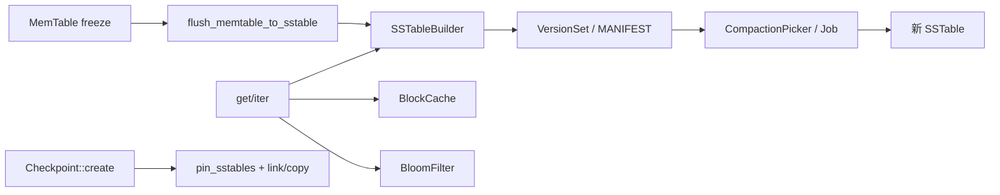
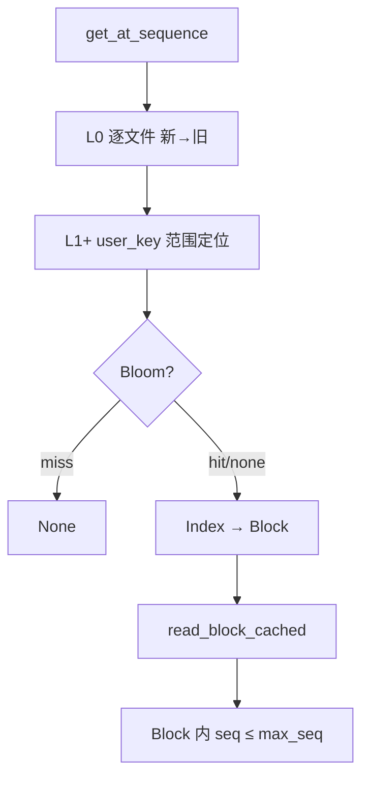
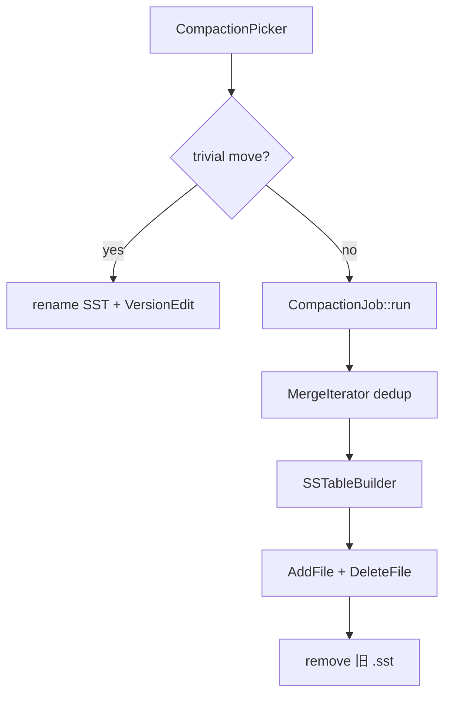
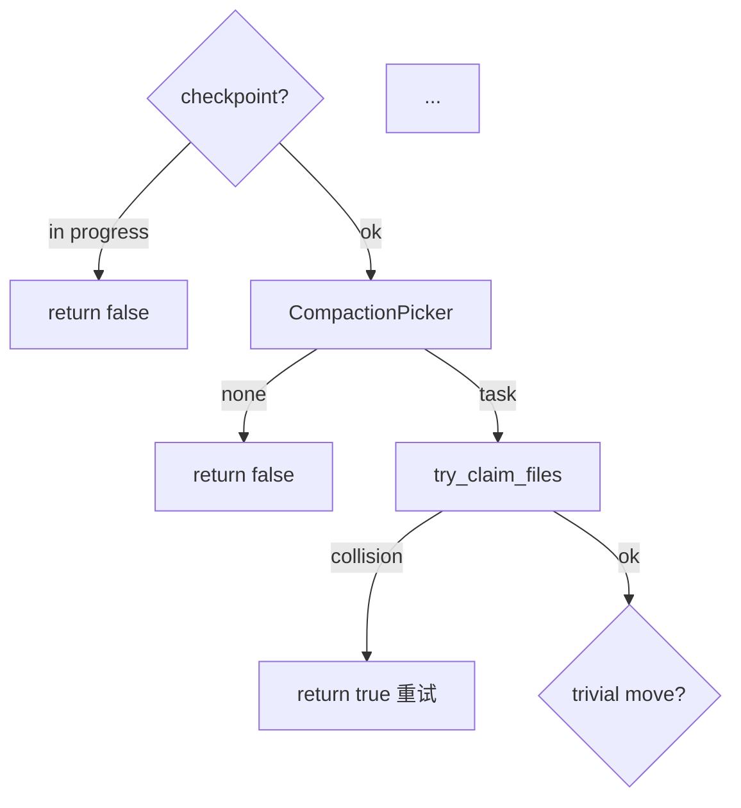

# Cursor transcript

---

## 1. User

## 文档整理 — 新会话

工作目录: `<workspace>` (含 aidb/、aikv/、aifactory/)

请先阅读 (不要跳过):
1. `AiKv-Workflow/backup/design.md` — 总规程
2. `AiKv-Workflow/backup/PROGRESS.md` — 当前进度
3. `AiKv-Workflow/backup/INDEX.md` — 本章索引 (若已有行则更新)

---

### 本次任务

| 项 | 值 |
|----|-----|
| PROGRESS 总步 | 2 |
| 目标文件 | `aidb/docs/modules/engine-storage.md` |
| 本次子步 | 从步 0 开始 |
| 对比深度 | 核心章逐段 |

### 必须遵守

- **确认门控**: 步 0→1→2→3→4, 每步先讨论, 我确认后再下一步
- **步 4**: 先出 Module Skill 正文 **草稿**, 我确认后再写入 aidb/aikv、更新 INDEX/PROGRESS
- **Module Skill 基础模板**: frontmatter `name` + `description` (含 `Use when`); 见 `design.md`
- **过程只进 backup/**: INDEX; aidb/aikv 不写迁移历史
- **旧文档顺序**: `backup/{aidb,aikv}/` → `*-oldmain` → WiQunTools 查漏 → wiqun-*
- **待核实**: module 一行引用; 详情写入 **当前仓库** 根目录 `ISSUES.md` (`aidb/ISSUES.md` 或 `aikv/ISSUES.md`)
- **步 4 落盘前**: 对照 create-skill Summary Checklist 自检 (见 `design.md`)

### 本次不要

- 不要跳过未确认的步骤
- 不要一次写多篇 module
- 不要修改 `design.md` / 流程, 除非我明确要求
- 不要 commit, 除非我明确要求

---

请从步 0 开始, 给出本步交付物, 等我确认。

---

## 2. Assistant

先阅读规程、进度与索引，再按步 0 给出本步交付物。

**Tool `Read`**

```json
{
  "path": "../../../AiKv-Workflow/backup/design.md"
}
```


**Tool `Read`**

```json
{
  "path": "../../../AiKv-Workflow/backup/PROGRESS.md"
}
```


**Tool `Read`**

```json
{
  "path": "../../../AiKv-Workflow/backup/INDEX.md"
}
```


---

## 3. Assistant

对照 `design.md` 的 modules↔src 映射，梳理 `engine-storage` 章节的源码范围与入口文件。

**Tool `Glob`**

```json
{
  "glob_pattern": "**/*",
  "target_directory": "../../src/engine"
}
```


**Tool `Read`**

```json
{
  "path": "../../docs/modules/engine-storage.md"
}
```


**Tool `Grep`**

```json
{
  "pattern": "engine-storage|sstable|compaction|filter|cache|checkpoint",
  "path": "../../src/engine",
  "glob": "mod.rs"
}
```


---

## 4. Assistant

**Tool `Read`**

```json
{
  "path": "../../src/engine/mod.rs"
}
```


**Tool `Read`**

```json
{
  "path": "../../src/engine/sstable/mod.rs"
}
```


**Tool `Read`**

```json
{
  "path": "../../src/engine/compaction/mod.rs"
}
```


**Tool `Read`**

```json
{
  "path": "../../src/engine/filter/mod.rs"
}
```


**Tool `Read`**

```json
{
  "path": "../../src/engine/cache/mod.rs"
}
```


**Tool `Read`**

```json
{
  "path": "../../src/engine/checkpoint/mod.rs",
  "limit": 50
}
```


**Tool `Read`**

```json
{
  "path": "../../docs/modules/engine.md",
  "limit": 80
}
```


---

## 5. Assistant

**Tool `Grep`**

```json
{
  "pattern": "pub (use|mod)|sstable|compaction|filter|cache|checkpoint|BlockCache|BloomFilter|VersionSet|SSTable",
  "path": "../../src/lib.rs"
}
```


**Tool `Grep`**

```json
{
  "pattern": "sstable|compaction|filter|cache|checkpoint|VersionSet|flush|BlockCache|BloomFilter",
  "path": "../../src/engine/db/inner.rs",
  "head_limit": 60
}
```


**Tool `Glob`**

```json
{
  "glob_pattern": "**/*",
  "target_directory": "../../tests"
}
```


**Tool `Grep`**

```json
{
  "pattern": "sstable|compaction|filter|cache|checkpoint|bloom",
  "path": "../../../WiQunTools/docs/wiqun-db-inventory",
  "output_mode": "files_with_matches"
}
```


---

## 6. Assistant

**Tool `Grep`**

```json
{
  "path": "../../src/engine/db",
  "pattern": "fn (flush|compact|build_sst|pin_sst|collect_checkpoint)"
}
```


**Tool `Grep`**

```json
{
  "path": "../../src/config.rs",
  "pattern": "block_cache|compaction|level|bloom|filter|checkpoint",
  "head_limit": 40
}
```


**Tool `Grep`**

```json
{
  "path": "../../../AiKv-Workflow/backup/aidb",
  "pattern": "sstable|compaction|bloom|cache|checkpoint",
  "output_mode": "files_with_matches"
}
```


---

## 7. Assistant

**Tool `Shell`**

```bash
wc -l ../../src/engine/sstable/*.rs ../../src/engine/compaction/*.rs ../../src/engine/filter/*.rs ../../src/engine/cache/*.rs ../../src/engine/checkpoint/mod.rs 2>/dev/null | sort -n
```


**Tool `Grep`**

```json
{
  "head_limit": 30,
  "path": "../../../aidb-oldmain",
  "pattern": "sstable|compaction|bloom|block.cache|checkpoint",
  "glob": "*.md",
  "output_mode": "files_with_matches"
}
```


---

## 8. Assistant

**Tool `Grep`**

```json
{
  "path": "../../src/engine",
  "pattern": "BloomFilter|Filter|block_cache|read_block_cached",
  "glob": "*.rs",
  "head_limit": 25
}
```


**Tool `Read`**

```json
{
  "path": "../../src/engine/db/mod.rs"
}
```


---

## 9. Assistant

## 步 0 — 定范围

**章节**: PROGRESS 步 2 · `aidb/docs/modules/engine-storage.md`  
**对比深度**: 核心章逐段 (步 3 执行)  
**状态**: 仅讨论, 未改 `backup/INDEX.md` 或 aidb 仓库

---

### 1. 本章定位

`engine-storage` 覆盖 LSM **读路径持久化层**: MemTable flush 产出的 SSTable、Leveled compaction、Bloom 负向过滤、Block cache、目录级 checkpoint。与已完成的 [engine.md](aidb/docs/modules/engine.md) 衔接 — 写路径 (WAL/MemTable/DB API) 在 engine, flush 之后到磁盘整理在本章。

**Skill 预设** (步 4 用):

- `name`: `aidb-engine-storage`
- `description` 方向: SSTable layout, leveled compaction, Bloom, block cache, checkpoint; `Use when` 改 `src/engine/{sstable,compaction,filter,cache,checkpoint}` 或排查 flush/compaction/读放大/checkpoint 一致性

---

### 2. 本章边界

| 归属 | 路径 / 主题 | 说明 |
|------|-------------|------|
| **本章** | `engine/sstable/*` | 文件布局, Block/Index/Footer, Builder/Reader/Iterator |
| **本章** | `engine/compaction/*` | VersionSet/Manifest, Picker, Job, MergeIterator |
| **本章** | `engine/filter/bloom.rs` | Bloom 编解码与查询 |
| **本章** | `engine/cache/block_cache.rs` | 分片 LRU Block cache |
| **本章** | `engine/checkpoint/mod.rs` | `Checkpoint::create` 目录快照 |
| **衔接 (只读)** | `engine/db/inner.rs` 片段 | flush→SST、compaction 后台循环、checkpoint pin、读路径 SST 层遍历 |
| **衔接 (只读)** | `engine/db/iterator.rs` | `DBIterator` 使用 `MergeIterator` |
| **不覆盖** | `engine/{wal,memtable,db}` 写路径 | → [engine.md](aidb/docs/modules/engine.md) |
| **不覆盖** | `backup/*` | → `backup.md` (与 checkpoint 关系在彼章展开) |
| **不覆盖** | `config.rs` / `error.rs` | 各 module 或 `development.md` 简要引用 |

**数据流边界** (文档应画清):



---

### 3. `src/` 范围清单

```shell
aidb/src/engine/
├── cache/
│   ├── block_cache.rs   # 分片 LRU; CacheKey = file_number + block_offset
│   └── mod.rs
├── checkpoint/
│   └── mod.rs           # Checkpoint::create; enter/leave_checkpoint 协议
├── compaction/
│   ├── helpers.rs       # key range 重叠; user_key 提取
│   ├── job.rs           # CompactionJob 执行; 多路归并写 SST
│   ├── merge.rs         # MergeIterator (跨 SST/MemTable)
│   ├── picker.rs        # L0/Ln 选取; trivial move; subcompaction 分裂
│   ├── version.rs       # Version/VersionSet/MANIFEST; orphan 清理
│   └── mod.rs
├── filter/
│   ├── bloom.rs         # BloomFilter encode/decode/query
│   └── mod.rs
└── sstable/
    ├── block.rs         # Block/BlockBuilder/BlockIterator
    ├── block_io.rs      # read/write block; read_block_cached
    ├── builder.rs       # SSTableBuilder; 含 Bloom 嵌入
    ├── filename.rs      # 命名解析
    ├── footer.rs        # Footer + MAGIC
    ├── handle.rs        # BlockHandle
    ├── index.rs         # IndexBlock; find_block_handle
    ├── iterator.rs      # SSTableIterator
    ├── meta.rs          # FileMeta / key range
    ├── reader.rs        # SSTableReader::open/get/iter
    └── mod.rs
```

**公共 API** (`lib.rs` re-export): `BlockCache`, `CacheStats`, `Checkpoint` — 其余经 `DB` 或 `pub(crate)` 内部使用.

**源码规模**: 约 4200 行 (compaction ~1900, sstable ~1700, 其余 ~600).

---

### 4. 拟读文件列表 (步 1→3)

#### A. 必读 — 步 1 代码地图

| 优先级 | 文件 | 理由 |
|--------|------|------|
| P0 | `sstable/{mod,block,builder,reader,iterator,index,footer,block_io}.rs` | SST 格式与读写主链 |
| P0 | `compaction/{mod,version,job,picker,merge}.rs` | Version 生命周期 + compaction 执行 |
| P0 | `filter/bloom.rs` | Builder/Reader 均依赖 |
| P0 | `cache/block_cache.rs` | `read_block_cached` 热路径 |
| P0 | `checkpoint/mod.rs` | 独立公共 API |
| P1 | `compaction/helpers.rs` | Picker/Job 辅助 |
| P1 | `sstable/{meta,handle,filename}.rs` | 元数据与命名 |
| P1 | `engine/db/inner.rs` (节选) | `flush_*`, `compaction_background_loop`, `pin_sstables`, `collect_checkpoint_file_paths`, `enter_checkpoint`, SST 读层 |
| P1 | `engine/db/iterator.rs` | 跨层归并 |
| P2 | `config.rs` (storage 相关字段) | 文档「配置」节 |
| P2 | `lib.rs` | 对外 re-export 边界 |

#### B. 必读 — 步 1 测试锚点

| 测试入口 | 覆盖 |
|----------|------|
| `tests/sstable.rs` + `tests/modules/sstable/{function,dataflow,cache,bloom}.rs` | SST 格式/迭代/cache/bloom |
| `tests/compaction.rs` + `tests/modules/compaction/{function,version_extra}.rs` | compaction 选取与 version |
| `tests/filter.rs` + `tests/modules/filter/*` | Bloom 单元 |
| `tests/cache.rs` + `tests/modules/cache/*` | Block cache |
| `tests/engine/compaction.rs` | DB 级 compaction 黑盒 |
| `tests/modules/db/{checkpoint_consistency,cache,bloom}.rs` | DB 集成 |
| `tests/regression/{bloom,empty_value_compaction}.rs` | 回归 |

#### C. 步 2 旧文档 (仅列路径, 步 2 再分类)

1. `backup/aidb/{ARCHITECTURE,DESIGN}.md` + `docs/superpowers/specs/*{subcompaction,sharded-lru,multi-threaded-compaction,trivial-move}*`
2. `aidb-oldmain/docs/completions/{SSTABLE,COMPACTION,BLOOM_FILTER,BLOCK_CACHE,FLUSH}_*.md`
3. WiQunTools: `03-sstable`, `05-compaction`, `06-bloom-filter`, `07-block-cache`, `08-snapshot` (inventory 查漏)
4. `wiqun-db` (与 aidb 重叠, 二选一)

#### D. 步 3 逐段对照核心文件 (已确认加深)

| 子域 | 核心文件 | 行数 |
|------|----------|------|
| SSTable | `block.rs`, `builder.rs`, `reader.rs` | 436 / 242 / 244 |
| Compaction | `version.rs`, `job.rs`, `picker.rs` | 556 / 618 / 367 |
| Filter | `bloom.rs` | 258 |
| Cache | `block_cache.rs` | 276 |
| Checkpoint | `mod.rs` | 224 |

`db/inner.rs` 仅对照 flush/compaction/checkpoint **衔接函数**, 不整文件逐段.

---

### 5. 拟更新 `backup/INDEX.md` 行 (确认后写入)

当前行:

```text
| `docs/modules/engine-storage.md` | 待开始 | | | `engine/{sstable,compaction,filter,cache,checkpoint}` |
```

确认后拟改为:

```text
| `docs/modules/engine-storage.md` | 步 0 ✅ | | | 范围: sstable(11), compaction(6), filter(1), cache(1), checkpoint(1); 衔接 db/inner+iterator; 对比深度: 核心文件逐段 |
```

---

### 6. 步 0 小结

| 项 | 结论 |
|----|------|
| 覆盖 `src/` | `engine/{sstable,compaction,filter,cache,checkpoint}` — 与 `design.md` / PROGRESS 步 2 一致 |
| 目标文件 | `aidb/docs/modules/engine-storage.md` (当前不存在, 步 4 创建) |
| 上游依赖 | `engine.md` ✅ 已完成; 本章承接 flush 之后 |
| 下游引用 | `aikv/storage.md` (AiDbEngine), `backup.md` (checkpoint) 将引用本章 |

---

请确认步 0: 回复 **可以** 进入步 1, 或指出需调整的边界/拟读列表. 确认后我会更新 `backup/INDEX.md` 本章行, 再开始读新代码.

---

## 10. User

可以

---

## 11. User

可以

---

## 12. Assistant

步 0 已确认。正在更新 `INDEX.md`，并阅读新代码以产出步 1 交付物。

**Tool `StrReplace`**

```json
{
  "path": "../../../AiKv-Workflow/backup/INDEX.md",
  "old_string": "| `docs/modules/engine-storage.md` | 待开始 | | | `engine/{sstable,compaction,filter,cache,checkpoint}` |",
  "new_string": "| `docs/modules/engine-storage.md` | 步 0 ✅ | | | 范围: sstable(11), compaction(6), filter(1), cache(1), checkpoint(1); 衔接 db/inner+iterator; 对比深度: 核心文件逐段 |"
}
```


**Tool `Read`**

```json
{
  "path": "../../src/engine/sstable/block.rs",
  "limit": 120
}
```


**Tool `Read`**

```json
{
  "path": "../../src/engine/sstable/builder.rs"
}
```


**Tool `Read`**

```json
{
  "path": "../../src/engine/sstable/reader.rs"
}
```


**Tool `Read`**

```json
{
  "path": "../../src/engine/sstable/footer.rs"
}
```


**Tool `Read`**

```json
{
  "path": "../../src/engine/sstable/index.rs",
  "limit": 80
}
```


---

## 13. Assistant

**Tool `Read`**

```json
{
  "limit": 150,
  "path": "../../src/engine/compaction/version.rs"
}
```


**Tool `Read`**

```json
{
  "limit": 150,
  "path": "../../src/engine/compaction/job.rs"
}
```


**Tool `Read`**

```json
{
  "limit": 120,
  "path": "../../src/engine/compaction/picker.rs"
}
```


**Tool `Read`**

```json
{
  "path": "../../src/engine/compaction/merge.rs"
}
```


**Tool `Read`**

```json
{
  "path": "../../src/engine/filter/bloom.rs"
}
```


**Tool `Read`**

```json
{
  "path": "../../src/engine/cache/block_cache.rs"
}
```


---

## 14. Assistant

**Tool `Read`**

```json
{
  "offset": 620,
  "limit": 120,
  "path": "../../src/engine/db/inner.rs"
}
```


**Tool `Read`**

```json
{
  "offset": 1000,
  "limit": 250,
  "path": "../../src/engine/db/inner.rs"
}
```


**Tool `Read`**

```json
{
  "path": "../../src/engine/sstable/block_io.rs"
}
```


**Tool `Read`**

```json
{
  "path": "../../src/engine/sstable/filename.rs"
}
```


**Tool `Read`**

```json
{
  "path": "../../src/engine/checkpoint/mod.rs",
  "limit": 100
}
```


---

## 15. Assistant

**Tool `Read`**

```json
{
  "limit": 200,
  "offset": 726,
  "path": "../../src/engine/db/inner.rs"
}
```


**Tool `Read`**

```json
{
  "limit": 150,
  "offset": 200,
  "path": "../../src/engine/compaction/version.rs"
}
```


**Tool `Read`**

```json
{
  "limit": 100,
  "offset": 150,
  "path": "../../src/engine/compaction/job.rs"
}
```


**Tool `Read`**

```json
{
  "limit": 80,
  "path": "../../src/engine/db/iterator.rs"
}
```


---

## 16. Assistant

**Tool `Grep`**

```json
{
  "path": "../../src/engine/db/inner.rs",
  "pattern": "check_write_stall|get_at_sequence|level0_"
}
```


**Tool `Read`**

```json
{
  "limit": 60,
  "path": "../../src/engine/sstable/meta.rs"
}
```


---

## 17. Assistant

**Tool `Read`**

```json
{
  "limit": 80,
  "offset": 415,
  "path": "../../src/engine/db/inner.rs"
}
```


**Tool `Read`**

```json
{
  "limit": 50,
  "offset": 200,
  "path": "../../src/engine/db/inner.rs"
}
```


---

## 18. Assistant

## 步 0 收尾

`backup/INDEX.md` 中 `engine-storage.md` 行已是 **步 0 ✅** (无需再改).

---

## 步 1 — 读新代码 (草稿)

以当前 `aidb/src/engine/{sstable,compaction,filter,cache,checkpoint}` 及 `db/inner.rs` 衔接段为准.

---

### 1. 子模块职责

| 子域 | 职责 | 关键类型 |
|------|------|----------|
| **sstable** | InternalKey 有序落盘; Block/Index/Meta/Footer 布局; 点查与全文件迭代 | `SSTableBuilder`, `SSTableReader`, `SSTableIterator`, `Block`, `Footer` |
| **compaction** | Leveled 文件选取; 多路归并 dedup; Version/MANIFEST 持久化 | `CompactionPicker`, `CompactionJob`, `MergeIterator`, `VersionSet`, `VersionEdit` |
| **filter** | SST 级 Bloom (user_key); 读路径负向过滤 | `BloomFilter`, `Filter` trait |
| **cache** | Data Block payload 分片 LRU | `BlockCache`, `CacheKey`, `CacheStats` |
| **checkpoint** | 目录级一致性快照 (BGSAVE 语义) | `Checkpoint::create`, `Checkpoint::verify_openable` |

**DB 衔接** (`engine/db/inner.rs`): 持有 `sstables`, `version_set`, `block_cache`, `compaction_picker`; 负责 flush→L0、后台 compaction、trivial move、L0 write stall、读路径 SST 层、`enter_checkpoint` / `pin_sstables`.

---

### 2. 代码地图 (拟写入 module)

| 路径 | 职责 | 入口 |
|------|------|------|
| `sstable/block.rs` | prefix compression + restart points | `BlockBuilder::add`, `Block::iter` |
| `sstable/block_io.rs` | 压缩 + CRC trailer; cache 读写 | `write_block`, `read_block_cached` |
| `sstable/builder.rs` | MemTable/compaction 输出 → `.sst.tmp` → rename | `SSTableBuilder::add`, `finish` |
| `sstable/reader.rs` | Footer→Index→Bloom→Block 点查 | `SSTableReader::open`, `get` |
| `sstable/iterator.rs` | 跨 Block 顺序迭代 | `SSTableIterator` |
| `sstable/index.rs` | Data Block 最大 key → `BlockHandle` | `find_block_handle` |
| `sstable/footer.rs` | 48B Footer + MAGIC | `Footer::encode/decode` |
| `sstable/filename.rs` | `{num:06}_L{level}.sst` | `sstable_path`, `parse_sstable_filename` |
| `sstable/meta.rs` | Bloom meta 裸块 | `BLOOM_META_NAME`, `write_raw_block` |
| `compaction/version.rs` | `CURRENT` + `MANIFEST-*`; recover/bootstrap | `VersionSet::recover`, `apply_edit`, `load_sstables_from_version` |
| `compaction/picker.rs` | L0 触发 + Ln 超容; trivial move 判定 | `CompactionPicker::pick_compaction` |
| `compaction/job.rs` | MergeIterator 归并 dedup; subcompaction 并行 | `CompactionJob::run` |
| `compaction/merge.rs` | 多 SST 堆归并 (compaction 用) | `MergeIterator::new`, `with_range` |
| `compaction/helpers.rs` | key range 重叠 | `key_ranges_overlap_by_meta_raw` |
| `filter/bloom.rs` | FNV-1a 双哈希 Bloom + CRC | `BloomFilter`, `Filter` |
| `cache/block_cache.rs` | 16 分片 LRU + stats | `BlockCache::get/insert` |
| `checkpoint/mod.rs` | flush → pin → link/copy 目录 | `Checkpoint::create` |
| `db/inner.rs` (节选) | flush/compaction/checkpoint/读 SST | `flush_memtable_to_sstable`, `run_compaction_once`, `get_from_sstables` |

**对外 API** (`lib.rs`): `BlockCache`, `CacheStats`, `Checkpoint`; SST/compaction 类型多为 `pub(crate)` 或模块内 `pub use`.

---

### 3. 主流程要点

#### 3.1 SSTable 文件布局

```shell
[ Data Blocks... ]  # 可选 Snap/LZ4 + 5B trailer (type + CRC)
[ Bloom raw block ] # meta index 指向, 非标准 Block trailer
[ Meta Index Block ]
[ Index Block ]     # 各 Block 最大 InternalKey → BlockHandle
[ Footer 48B ]      # meta_index_handle + index_handle + MAGIC
```

- 写入: `.sst.tmp` → `sync_all` → `rename` 原子可见.
- `bloom_false_positive_rate == 0` → 不写 Bloom.
- 空 SST (`num_entries == 0`) → `finish` 报错; flush 路径用 `abandon`.

#### 3.2 Flush (MemTable → L0)

1. `flush_immutable_memtables` 取 immutable 队首.
2. `SSTableBuilder` 遍历 MemTable InternalKey; `set_expected_keys` 预分配 Bloom.
3. `VersionEdit::AddFile { level: 0 }` + `sstables[0].insert(0, reader)` (新文件在 L0 **头部**).
4. flush 后 `rotate_wal` + `maybe_trigger_compaction`.

#### 3.3 读路径 (get)

1. MemTable → immutable (新→旧) → **L0 全表扫描** (新→旧, 可能 overlap).
2. **L1+**: `find_sstable_for_key` 按 user_key 范围二分定位单文件.
3. `SSTableReader::get`: Bloom 负向过滤 → `find_block_handle` → `read_block_cached` → Block 内 scan (同 user_key 取 `seq <= max_seq` 最新).
4. Bloom 通过但未命中 → `record_bloom_false_positive()`.

#### 3.4 Compaction

**选取** (`CompactionPicker`):

- L0 文件数 ≥ `level0_compaction_trigger` → L0→L1 (+ L1 overlap 扩展).
- Ln 总字节 > `target_size_for_level(n)` → Ln→L(n+1).
- **Trivial move**: 无 overlap 且 (L0 单文件 或 Ln 种子与 L(n+1) 无 overlap) → 仅 rename + manifest, 不重写.

**执行** (`run_compaction_once`):

1. `checkpoint_in_progress` 时跳过.
2. `try_claim_files` 防并发重叠.
3. Trivial move 或 `CompactionJob::run` (可 subcompaction 分裂 + `std::thread::scope`).
4. Dedup: 同 user_key 保留最高 seq; L1+ 丢弃 `TypeDelete` tombstone; 快照保护 (`min_snapshot_sequence`) 保留旧版本.
5. `VersionEdit` Add/Delete + 删旧 `.sst` 文件.

**Write stall** (`check_write_stall`): L0 达 `slowdown`/`stop` 阈值 → sleep/阻塞等待 compaction.

#### 3.5 Version / MANIFEST

- `CURRENT` 指向活跃 `MANIFEST-NNNNNN`; 每条 `VersionEdit` 追加 JSON line + sync.
- 超 `max_manifest_size` → `rotate_manifest` (快照全量 rewrite 新 MANIFEST).
- 无 `CURRENT` 遗留库 → `scan_version_edits_from_dir` bootstrap.

#### 3.6 Block Cache

- Key: `(file_number, block_offset)`.
- 16 分片独立 LRU; `capacity_per_shard = total / 16`.
- 仅缓存 **解压后** Data Block bytes (`read_block_cached` miss 时 insert).

#### 3.7 Checkpoint

1. `db.flush()` 清空 immutable.
2. `enter_checkpoint` → compaction 暂停; `pin_sstables` 持有 `Arc<SSTableReader>`.
3. 收集 `CURRENT`, MANIFEST, WAL, 全部 SST → `link_or_copy` 到 `{dest}.tmp` → `rename`.
4. **非** Redis RDB; 是完整数据目录副本, 可 `DB::open` 验证.

---

### 4. 关键 invariant (文档应强调)

- InternalKey 在 SST 内 **严格递增**; Block restart point 存完整 key (`shared=0`).
- L0 **允许 overlap**; L1+ 按 user_key 范围不重叠 (picker 用 meta raw range).
- L0 SST 顺序: 新 flush / load 的文件在 vector **前端** (读时优先).
- Compaction 输出 L0 也 `insert(0)`; L1+ `push`.
- Bloom 损坏/缺失 → **降级** 为无 filter (warn, 不 fail open).
- Checkpoint 期间 compaction **不运行**; pin 防止 unlink.
- `MergeIterator` 排序: user_key 降序, 同 user_key 按 InternalKey 降序 (高 seq 先出).

---

### 5. 配置项 (本章相关)

| 项 | 默认 (prod) | 作用 |
|----|-------------|------|
| `block_size` | 4KB | Data Block 切分 |
| `block_restart_interval` | 16 | restart point 间隔 |
| `compression` | None | Snap/LZ4 需 `compression` feature |
| `bloom_false_positive_rate` | 0.01 (0=关闭) | SST Bloom |
| `block_cache_size` | 64MB | Block cache |
| `level0_compaction_trigger` | 4 | L0 compaction |
| `level0_slowdown/stop_writes_trigger` | 8 / 16 | write stall |
| `max_bytes_for_level_base/multiplier` | 256MB / 10 | Ln 容量目标 |
| `compaction_threads`, `subcompaction_min_size` | 1 / 64MB | 并行 subcompaction |
| `background_compaction` | true | 测试可关 |
| `max_manifest_size` | — | MANIFEST 轮转 |

测试默认 (`Options::for_test`) 更小 trigger/cache, 便于触发 compaction.

---

### 6. 测试锚点 (步 4 引用)

```bash
cargo test sstable compaction filter cache checkpoint -- --test-threads=1
cargo test --test engine compaction -- --test-threads=1
cargo test --test modules db::checkpoint_consistency db::cache db::bloom -- --test-threads=1
```

---

### 7. 步 1 小结

- 五子域边界清晰; **编排集中在 `db/inner.rs`**, 本章文档需单列「与 DB 衔接」节.
- SST 格式 LevelDB 风格 (Block restart + Footer); Bloom 在 meta index, 非 Block trailer.
- Compaction 含 trivial move、subcompaction、快照保护、L0 write stall — 比 generic LSM 文档多几处 **本项目特有** 行为.
- `DBIterator` 在 `db/iterator.rs`, 用 MemTable + SST 层归并 (非 `compaction::MergeIterator`) — 文档须区分两者.

---

请确认步 1: 回复 **可以** 进入步 2 (查旧文档), 或指出需补充/修正的点.

---

## 19. User

可以

---

## 20. Assistant

步 1 已确认。按旧文档查阅顺序检索并分类 engine-storage 相关参考。

**Tool `Grep`**

```json
{
  "pattern": "sstable|SSTable|compaction|bloom|block.?cache|checkpoint|MANIFEST|VersionSet",
  "glob": "*.md",
  "path": "../../../AiKv-Workflow/backup/aidb",
  "output_mode": "files_with_matches",
  "-i": true
}
```


**Tool `Grep`**

```json
{
  "pattern": "sstable|SSTable|compaction|bloom|block.?cache|checkpoint",
  "glob": "*.md",
  "path": "../../../aidb-oldmain",
  "output_mode": "files_with_matches",
  "-i": true,
  "head_limit": 40
}
```


**Tool `Glob`**

```json
{
  "glob_pattern": "**/*",
  "target_directory": "../../../WiQunTools/docs/wiqun-db-inventory"
}
```


**Tool `Grep`**

```json
{
  "pattern": "sstable|compaction|bloom|cache|checkpoint",
  "glob": "*.md",
  "path": "../../../wiqun-db",
  "output_mode": "files_with_matches",
  "-i": true,
  "head_limit": 30
}
```


---

## 21. Assistant

**Tool `Grep`**

```json
{
  "path": "../../../AiKv-Workflow/backup/aidb/ARCHITECTURE.md",
  "pattern": "SSTable|Compaction|Bloom|Block Cache|checkpoint|MANIFEST|Version"
}
```


**Tool `Grep`**

```json
{
  "path": "../../../AiKv-Workflow/backup/aidb/DESIGN.md",
  "pattern": "SSTable|Compaction|Bloom|Block Cache|checkpoint|MANIFEST|Version|trivial|subcompaction"
}
```


**Tool `Read`**

```json
{
  "path": "../../../WiQunTools/docs/wiqun-db-inventory/03-sstable.md",
  "limit": 80
}
```


**Tool `Read`**

```json
{
  "path": "../../../WiQunTools/docs/wiqun-db-inventory/05-compaction.md",
  "limit": 80
}
```


**Tool `Read`**

```json
{
  "path": "../../../WiQunTools/docs/wiqun-db-inventory/06-bloom-filter.md",
  "limit": 60
}
```


**Tool `Read`**

```json
{
  "path": "../../../WiQunTools/docs/wiqun-db-inventory/07-block-cache.md",
  "limit": 60
}
```


**Tool `Read`**

```json
{
  "path": "../../../WiQunTools/docs/wiqun-db-inventory/08-snapshot.md",
  "limit": 80
}
```


---

## 22. Assistant

**Tool `Grep`**

```json
{
  "path": "<workspace>",
  "pattern": "checkpoint|Checkpoint|BGSAVE",
  "glob": "**/wiqun-db-inventory/*.md"
}
```


**Tool `Grep`**

```json
{
  "path": "../../../AiKv-Workflow/backup/aidb",
  "pattern": "checkpoint|Checkpoint"
}
```


**Tool `Read`**

```json
{
  "path": "../../ISSUES.md"
}
```


**Tool `Read`**

```json
{
  "limit": 80,
  "path": "../../../aidb-oldmain/docs/completions/SSTABLE_COMPLETION_SUMMARY.md"
}
```


**Tool `Read`**

```json
{
  "limit": 80,
  "path": "../../../aidb-oldmain/docs/completions/COMPACTION_COMPLETION_SUMMARY.md"
}
```


**Tool `Grep`**

```json
{
  "path": "../../../WiQunTools/docs/wiqun-db-inventory/03-sstable.md",
  "pattern": "compression|Snap|LZ4|known"
}
```


---

## 23. Assistant

**Tool `Grep`**

```json
{
  "path": "../../src",
  "pattern": "min_snapshot_sequence|SnapshotList"
}
```


**Tool `Grep`**

```json
{
  "path": "../../../WiQunTools/docs/wiqun-db-inventory/05-compaction.md",
  "pattern": "snapshot|Snapshot"
}
```


**Tool `Read`**

```json
{
  "limit": 50,
  "path": "../../../AiKv-Workflow/backup/aidb/docs/superpowers/specs/2026-05-29-trivial-move-design.md"
}
```


**Tool `Read`**

```json
{
  "limit": 40,
  "path": "../../../aidb-oldmain/docs/completions/BLOCK_CACHE_COMPLETION_SUMMARY.md"
}
```


**Tool `Read`**

```json
{
  "limit": 40,
  "path": "../../../aidb-oldmain/docs/completions/BLOOM_FILTER_COMPLETION_SUMMARY.md"
}
```


---

## 24. Assistant

**Tool `Grep`**

```json
{
  "path": "../../../aidb",
  "pattern": "CompressionType::Snap|compression.*feature|test_compression",
  "glob": "*.rs",
  "head_limit": 20
}
```


**Tool `Grep`**

```json
{
  "path": "../../src/engine/db",
  "pattern": "drain_compactions"
}
```


**Tool `Read`**

```json
{
  "limit": 50,
  "path": "../../../AiKv-Workflow/backup/aidb/docs/superpowers/specs/2026-05-29-sharded-lru-design.md"
}
```


---

## 25. Assistant

**Tool `Grep`**

```json
{
  "glob": "*.md",
  "head_limit": 15,
  "output_mode": "files_with_matches",
  "path": "../../../aidb-oldmain",
  "pattern": "checkpoint|Checkpoint|BGSAVE"
}
```


**Tool `Read`**

```json
{
  "limit": 60,
  "path": "../../../WiQunTools/docs/wiqun-db-inventory/13-backup-bench.md"
}
```


---

## 26. Assistant

**Tool `Glob`**

```json
{
  "glob_pattern": "**/*",
  "target_directory": "../../src/backup"
}
```


---

## 27. Assistant

## 步 2 — 查旧文档 (草稿)

已按 `backup/aidb` → `aidb-oldmain` → WiQunTools inventory → `wiqun-db`(二选一跳过详读) 查阅. **未改** `backup/INDEX.md` 与 `aidb/ISSUES.md`, 等你确认后再落盘.

---

### 1. 旧文档清单与分类

#### A. `backup/aidb/` (优先)

| 路径 | 分类 | 说明 |
|------|------|------|
| `ARCHITECTURE.md` | **仍有效** | SST flush/读/compaction 主路径与当前代码一致; 目录树可引用 |
| `DESIGN.md` | **仍有效** | Leveled、restart points、Checkpoint 动机; 不含过时 snapshot 弱化语义 |
| `CHANGELOG.md` | **查漏** | checkpoint MVP、trivial move/subcompaction/sharded LRU、BackupManager 时间线 |
| `docs/superpowers/specs/2026-05-29-{trivial-move,subcompaction,multi-threaded-compaction,sharded-lru}-design.md` | **仍有效** | 与 `picker.rs` / `job.rs` / `block_cache.rs` / `inner.rs` 一致 |
| 对应 `plans/*.md` | **查漏** | 施工记录, 细节以 spec + 源码为准 |
| `docs/observability.md` | **部分有效** | bloom FP / block cache metrics 边界 → 归 `observability.md`, 本章只交叉引用 |
| `README.md`, `DEPLOYMENT.md`, `CONTRIBUTING.md` | **跳过** | 与本章核心格式/流程无关 |
| `docs/superpowers/specs/2026-06-02-hardcoded-values-*` | **跳过** | 配置治理, 非 engine-storage 主叙事 |

#### B. `aidb-oldmain/`

| 路径 | 分类 | 说明 |
|------|------|------|
| `docs/completions/SSTABLE_COMPLETION_SUMMARY.md` | **已过时** | 路径 `src/sstable/`; 无 Bloom/cache; 格式描述大体仍对 |
| `docs/completions/COMPACTION_COMPLETION_SUMMARY.md` | **已过时** | 路径 `src/compaction/`; 简化 picker; tombstone「空 Vec」; 无 trivial move/subcompaction/snapshot 保护 |
| `docs/completions/BLOOM_FILTER_COMPLETION_SUMMARY.md` | **已过时** | 路径 `src/filter/`; 核心算法仍可参考 |
| `docs/completions/BLOCK_CACHE_COMPLETION_SUMMARY.md` | **已过时** | 单分片 `src/cache/lru.rs`; 现为 16 分片 `engine/cache/block_cache.rs` |
| `docs/completions/FLUSH_*`, `BUG_FIX_EMPTY_SSTABLE`, `BUG_FIX_SSTABLE_MANAGEMENT` | **已过时** | 历史 bug/施工, 以当前测试为准 |
| `docs/archive/*`, `docs/completions/STAGE*.md` | **已过时** | 规划/里程碑, 不作实现依据 |
| `docs/monitoring/*` | **跳过** | → observability 章 |

**结论**: oldmain **completion 文档不可信**, 步 3 以 **oldmain 源码** 逐段对照 (design.md 已规定).

#### C. WiQunTools inventory (查漏)

| 段 | 分类 | 说明 |
|----|------|------|
| `03-sstable.md` | **大部分仍有效** | Block/Footer/Index/Bloom meta 格式、测试矩阵与源码高度一致 |
| `03-sstable.md` § Snap/LZ4 | **已过时** | 写「未接线 known_limitation」; 当前 `block_io.rs` 在 **`compression` feature** 下已实现 Snap/LZ4 |
| `05-compaction.md` | **大部分仍有效** | Version/MANIFEST/picker/job/subcompaction/trivial move 与源码一致 |
| `05-compaction.md` § Snapshot 交互 | **已过时** | 写「不保护活跃 Snapshot / 预留分支」; 当前已有 `SnapshotList` + `CompactionJob::with_snapshot_threshold` |
| `06-bloom-filter.md` | **仍有效** | FNV 双哈希、meta 裸块、decode 降级、FPR 配置 — 与 `bloom.rs` 一致 |
| `07-block-cache.md` | **仍有效** | 含 Phase20 16 分片; CacheKey、不缓存 Index/Bloom — 一致 |
| `08-snapshot.md` | **部分有效** | MVCC/get_at_sequence 仍对; § compaction 弱化语义 **已过时** (同上) |
| `13-backup-bench.md` § checkpoint | **仍有效** | `Checkpoint::create` 协议、pin/compaction 暂停 — 与 `checkpoint/mod.rs` 一致 |
| `13-backup-bench.md` § `src/backup/` 不存在 | **已过时** | 属 `backup.md` 范围; 当前 `src/backup/` 已存在 |
| `04-db-engine.md` | **衔接参考** | flush、`maybe_trigger_compaction`、`drain_compactions` — 与 `engine.md` 分工, 本章只引衔接 |

#### D. `wiqun-db`

与 `backup/aidb/` 高度重叠, **未单独精读** (规程: 二选一).

---

### 2. 与当前实现的关键偏差 (文档写作指引)

| 主题 | 旧文档说法 | 当前代码 | 步 4 应写 |
|------|-----------|----------|-----------|
| Block 压缩 | inventory: 未实现 | `compression` feature → Snap/LZ4 | feature gate + 默认 None |
| Compaction vs Snapshot | inventory: 不保护, 弱化语义 | `min_snapshot_sequence` dedup 保留 | 写现行保护; 不抄 inventory 设计决策 |
| Block Cache | oldmain: 单 LRU | 16 分片 `parking_lot::Mutex` | 写分片 LRU |
| 路径前缀 | oldmain: `src/sstable/` | `src/engine/sstable/` | 统一 engine 路径 |
| Checkpoint | 仅 CHANGELOG/13-backup | MVP 完整 | BGSAVE 目录快照, 非 RDB; 链 `backup.md` |
| Bloom 损坏 | 06-bloom / 代码 | open 降级 warn | 写 degrade 行为 |
| 环境变量 | 无旧文档 | `AIDB_SKIP_CHECKSUM=1` | 「已知限制/调试」一句即可 |

**未发现** 需阻塞步 4 的 **confirmed-bug** (步 3 再对照 oldmain 代码核实).

---

### 3. 拟写入 `aidb/ISSUES.md` 的条目 (确认后追加)

#### ISSUE-003: inventory 仍写 Block 压缩未实现

- **状态**: doc-only
- **发现于**: PROGRESS 步 2 / `docs/modules/engine-storage.md`
- **相关 src**: `src/engine/sstable/block_io.rs`, `Cargo.toml` feature `compression`
- **旧文档**: `WiQunTools/.../03-sstable.md` — `known_limitation`
- **现象**: inventory 称 Snap/LZ4 未接线; 源码在 feature 下已实现读写
- **影响**: module 勿抄 limitation; 写 `compression` feature 与默认 `None`
- **下一步**: 步 4 正文修正; 不需改代码

#### ISSUE-004: inventory 称 compaction 不保护 Snapshot

- **状态**: doc-only
- **发现于**: PROGRESS 步 2 / `docs/modules/engine-storage.md`
- **相关 src**: `compaction/job.rs`, `db/snapshot.rs`, `db/inner.rs` (`run_compaction_once`)
- **旧文档**: `05-compaction.md`, `08-snapshot.md` — 「不保护 / 弱化语义 / 预留分支」
- **现象**: 当前 `SnapshotList::min_snapshot_sequence` → `CompactionJob::with_snapshot_threshold`, dedup 时 `snapshot_protected` 保留旧版本
- **影响**: module 写现行语义; 与 `engine.md` snapshot 节一致
- **下一步**: 步 3 对照 oldmain 代码确认行为等价性; 步 4 文档表述

**不新增 ISSUE** 的事项: oldmain completion 路径过时 (纯历史); `13-backup` 说 backup 模块缺失 (属 `backup.md`).

---

### 4. 步 4 文档应优先吸收的内容

| 来源 | 吸收什么 |
|------|----------|
| `backup/aidb/ARCHITECTURE.md` | 三节数据流 (flush / get / compaction) mermaid 骨架 |
| `WiQunTools/03–07` | 格式细节、配置表、测试命令、Bloom/Cache 行为 |
| `backup/aidb/docs/superpowers/specs/*` | trivial move / subcompaction / sharded LRU 的 **WHEN/约束** |
| `WiQunTools/13-backup-bench` § checkpoint | checkpoint 并发协议 (pin + compaction 暂停) |
| `engine.md` (已完成) | 边界句 + 链接; 不重复 WAL/MemTable |

**不吸收**: oldmain completions 的路径与 tombstone 描述; inventory 的 compression limitation 与 snapshot 弱化设计决策.

---

### 5. 拟更新 `backup/INDEX.md` (确认后写入)

```text
| `docs/modules/engine-storage.md` | 步 2 ✅ | backup/aidb/ARCHITECTURE,DESIGN + superpowers specs (trivial/subcomp/sharded); WiQunTools 03–07, 13 §checkpoint; oldmain completions/* (已过时, 步3用代码) | | ISSUE-003/004 (doc-only); 对比深度: 核心文件逐段 |
```

---

### 6. 步 2 小结

- **可信旧文档**: `backup/aidb` 架构/设计 + superpowers specs + WiQunTools 03/05/06/07 + 13 checkpoint 段.
- **明确过时**: oldmain completions; inventory 压缩 limitation; inventory compaction/snapshot 弱化语义.
- **待核实 (doc-only)**: ISSUE-003、ISSUE-004 — 步 3 用 oldmain **代码** 复核 snapshot/压缩行为后, 步 4 落文档.

---

请确认步 2: 回复 **可以** 进入步 3 (oldmain 核心文件逐段对照), 或调整分类/ISSUE 条目. 确认后我会更新 `backup/INDEX.md`, 并将 ISSUE-003/004 写入 `aidb/ISSUES.md`.

---

## 28. User

可以

---

## 29. Assistant

步 2 已确认。正在更新 INDEX 与 ISSUES，并对照 oldmain 核心文件做逐段对比。

**Tool `StrReplace`**

```json
{
  "path": "../../../AiKv-Workflow/backup/INDEX.md",
  "old_string": "| `docs/modules/engine-storage.md` | 步 0 ✅ | | | 范围: sstable(11), compaction(6), filter(1), cache(1), checkpoint(1); 衔接 db/inner+iterator; 对比深度: 核心文件逐段 |",
  "new_string": "| `docs/modules/engine-storage.md` | 步 2 ✅ | backup/aidb/ARCHITECTURE,DESIGN + superpowers specs (trivial/subcomp/sharded); WiQunTools 03–07, 13 §checkpoint; oldmain completions/* (已过时, 步3用代码) | | ISSUE-003/004 (doc-only); 对比深度: 核心文件逐段 |"
}
```


**Tool `StrReplace`**

```json
{
  "path": "../../ISSUES.md",
  "old_string": "## 条目列表\n\n<!-- 按 ISSUE-NNN 倒序追加 -->\n\n### ISSUE-002: 大 WriteBatch 与 max_wal_size 轮转交互",
  "new_string": "## 条目列表\n\n<!-- 按 ISSUE-NNN 倒序追加 -->\n\n### ISSUE-004: inventory 称 compaction 不保护 Snapshot\n\n- **状态**: doc-only\n- **发现于**: PROGRESS 步 2 / 章节 `docs/modules/engine-storage.md`\n- **相关 src**: `src/engine/compaction/job.rs`, `src/engine/db/snapshot.rs`, `src/engine/db/inner.rs` (`run_compaction_once`)\n- **旧文档**: `WiQunTools/docs/wiqun-db-inventory/05-compaction.md`, `08-snapshot.md` — 「不保护 / 弱化语义 / 预留分支」\n- **现象**: 当前 `SnapshotList::min_snapshot_sequence` → `CompactionJob::with_snapshot_threshold`, dedup 时 `snapshot_protected` 保留旧版本\n- **影响**: module 写现行保护语义; 与 `engine.md` snapshot 节一致; 勿抄 inventory 设计决策\n- **下一步**: 步 3 对照 oldmain 代码; 步 4 文档表述\n\n### ISSUE-003: inventory 仍写 Block 压缩未实现\n\n- **状态**: doc-only\n- **发现于**: PROGRESS 步 2 / 章节 `docs/modules/engine-storage.md`\n- **相关 src**: `src/engine/sstable/block_io.rs`, `Cargo.toml` feature `compression`\n- **旧文档**: `WiQunTools/docs/wiqun-db-inventory/03-sstable.md` — `known_limitation`\n- **现象**: inventory 称 Snap/LZ4 未接线; 源码在 `compression` feature 下已实现读写\n- **影响**: module 勿抄 limitation; 写 `compression` feature 与默认 `None`\n- **下一步**: 步 4 正文修正; 不需改代码\n\n### ISSUE-002: 大 WriteBatch 与 max_wal_size 轮转交互"
}
```


**Tool `Glob`**

```json
{
  "glob_pattern": "**/*",
  "target_directory": "../../../aidb-oldmain/src"
}
```


---

## 30. Assistant

**Tool `Glob`**

```json
{
  "glob_pattern": "**/checkpoint/**",
  "target_directory": "../../../aidb-oldmain"
}
```


**Tool `Read`**

```json
{
  "path": "../../../aidb-oldmain/src/compaction/mod.rs",
  "limit": 80
}
```


**Tool `Read`**

```json
{
  "path": "../../../aidb-oldmain/src/sstable/builder.rs",
  "limit": 80
}
```


**Tool `Read`**

```json
{
  "path": "../../../aidb-oldmain/src/sstable/reader.rs",
  "limit": 100
}
```


**Tool `Grep`**

```json
{
  "path": "../../../aidb-oldmain/src",
  "pattern": "trivial|subcompaction|snapshot|checkpoint|BlockCache|read_block"
}
```


---

## 31. Assistant

**Tool `Read`**

```json
{
  "limit": 120,
  "offset": 78,
  "path": "../../../aidb-oldmain/src/compaction/mod.rs"
}
```


**Tool `Read`**

```json
{
  "limit": 120,
  "path": "../../../aidb-oldmain/src/compaction/picker.rs"
}
```


**Tool `Read`**

```json
{
  "limit": 80,
  "path": "../../../aidb-oldmain/src/filter/bloom.rs"
}
```


**Tool `Read`**

```json
{
  "limit": 100,
  "path": "../../../aidb-oldmain/src/backup/manager.rs"
}
```


**Tool `Grep`**

```json
{
  "path": "../../../aidb-oldmain/src/lib.rs",
  "pattern": "compact|CompactionJob|run_compaction|trivial|expanded"
}
```


---

## 32. Assistant

**Tool `Read`**

```json
{
  "limit": 100,
  "offset": 150,
  "path": "../../../aidb-oldmain/src/sstable/reader.rs"
}
```


**Tool `Read`**

```json
{
  "limit": 80,
  "path": "../../../aidb-oldmain/src/sstable/block.rs"
}
```


**Tool `Grep`**

```json
{
  "path": "../../../aidb-oldmain/src/sstable",
  "pattern": "write_block|compression|CRC|trailer"
}
```


**Tool `Read`**

```json
{
  "limit": 50,
  "path": "../../src/engine/compaction/picker.rs",
  "offset": 115
}
```


---

## 33. Assistant

**Tool `Grep`**

```json
{
  "path": "../../../aidb-oldmain/src/lib.rs",
  "pattern": "flush|builder\\.add|encode_internal",
  "head_limit": 30
}
```


**Tool `Read`**

```json
{
  "limit": 50,
  "path": "../../../aidb-oldmain/src/compaction/merge.rs"
}
```


**Tool `Read`**

```json
{
  "limit": 60,
  "path": "../../../aidb-oldmain/src/compaction/version.rs"
}
```


---

## 34. Assistant

**Tool `Grep`**

```json
{
  "path": "../../src/backup",
  "pattern": "Checkpoint"
}
```


**Tool `Read`**

```json
{
  "limit": 40,
  "path": "../../../aidb-oldmain/src/filter/bloom.rs",
  "offset": 100
}
```


**Tool `Grep`**

```json
{
  "path": "../../../aidb-oldmain/src/filter/bloom.rs",
  "pattern": "fnv|hash|encode"
}
```


---

## 35. Assistant

**Tool `Read`**

```json
{
  "limit": 40,
  "offset": 210,
  "path": "../../../aidb-oldmain/src/filter/bloom.rs"
}
```


**Tool `Read`**

```json
{
  "limit": 50,
  "path": "../../src/engine/sstable/builder.rs",
  "offset": 155
}
```


---

## 36. Assistant

## 步 3 — 对比 oldmain 代码 (草稿)

已对照 `aidb-oldmain/src/{sstable,compaction,filter,cache}` 与 `lib.rs` 编排, 并核对当前 `aidb`. **未改** `INDEX` (仍为步 2 ✅), 等你确认后再标步 3 ✅ 并进入步 4 草稿.

---

### 1. 模块级路径对照

| 能力 | oldmain | 当前 aidb | 文档表述 |
|------|---------|-----------|----------|
| 模块根 | `src/sstable/` 等 (无 `engine/`) | `src/engine/{sstable,compaction,...}` | 统一 `engine/` 前缀 |
| CompactionJob | `compaction/mod.rs` 内嵌 | `compaction/job.rs` 独立 | 入口 `CompactionJob::run` |
| Block cache | `cache/lru.rs` 单锁 | `cache/block_cache.rs` 16 分片 | 写 sharded LRU |
| Checkpoint | **无**; `backup/manager` 手抄 SST/WAL | `engine/checkpoint/` + `BackupManager` 调 `Checkpoint::create` | checkpoint 在本章; backup 链 `backup.md` |
| SST 键类型 | **user key** (`flush` 写 `user_key`) | **InternalKey** (MVCC) | 必须写 InternalKey; 与 `engine.md` 一致 |
| 后台 compaction | `lib.rs::compact()` 同步链式 | 多线程 + signal + `try_claim_files` | 写线程模型与 trivial move |

**结论**: oldmain 与当前 aidb **不是同一磁盘格式/语义**; 步 4 以 WiQunTools 03–07 + 当前源码为准, **勿**引用 oldmain completion 的实现细节.

---

### 2. 核心文件逐段差异表

#### SSTable — `block.rs`

| 维度 | oldmain | 当前 | 文档建议 |
|------|---------|------|----------|
| Block 布局 | prefix + restart | 同 | 保留 WiQunTools 03 格式图 |
| Restart point | 有 | restart 点 `shared=0` (对齐 LevelDB) | 一句 invariant |

#### SSTable — `builder.rs`

| 维度 | oldmain | 当前 | 文档建议 |
|------|---------|------|----------|
| 构造 | `new(path)` + setter | `new(path, block_size, restart, compression, bloom_fp)` | 列 Options 参数 |
| 键 | user key | InternalKey 严格递增 | 强调 MVCC |
| 原子写 | 直写目标文件 | `.sst.tmp` → rename | 写 crash-safe |
| Bloom | 默认 enable + `set_expected_keys` | `bloom_fp_rate>0` 才 enable | 写 `0.0` 禁用 |
| Meta 布局 | Bloom 走 block trailer | Bloom `write_raw_block`; Index/MetaIndex 用 `write_block` | 保留 03 的「Bloom 例外」 |

#### SSTable — `reader.rs` + `block_io.rs`

| 维度 | oldmain | 当前 | 文档建议 |
|------|---------|------|----------|
| Open API | `open` / `open_with_cache` | `open(path, Option<Arc<BlockCache>>)` | 单签名 |
| `get` 键 | user key 精确匹配 | InternalKey + `seq <= seek_seq` | 与 engine MVCC 衔接 |
| Bloom 查询 | `may_contain(user_key)` | `extract_user_key` 后查 | 一致 |
| CRC | **覆盖压缩后** raw | **覆盖解压后** payload | 写现行规则; 不提 oldmain |
| 压缩 | Snappy + `lz4-compression` feature | `compression` feature → Snap/Lz4 | 对应 ISSUE-003 |
| 读盘 | `Seek+Read` | `read_at` (并发) | 可选一句 |
| key range | 无 `smallest/largest` 字段 | open 时读首末 block 填 meta | 写 FileMeta 来源 |

#### Compaction — `picker.rs`

| 维度 | oldmain | 当前 | 文档建议 |
|------|---------|------|----------|
| L0 触发 | 常量 `MAX_LEVEL0_FILES=4` | `Options.level0_compaction_trigger` | 写 Options |
| Ln 容量 | 硬编码 `10^level MB` | `max_bytes_for_level_base * mult^(n-1)` | 写 Options |
| L0→L1 | 仅 L0 全量 | + L1 **overlap 扩展** (`expanded_inputs`) | 写 expanded |
| Ln 选取 | 只取首个文件 | seed + overlap 扩展 + 同层 overlap 合并 | 写 picker 策略 |
| Trivial move | **无** | `is_trivial_move` + rename | 写 fast path |
| Task 字段 | 3 字段 | + `expanded_inputs`, `is_trivial_move` | 表格列出 |

#### Compaction — `job.rs` / old `mod.rs`

| 维度 | oldmain | 当前 | 文档建议 |
|------|---------|------|----------|
| 输入 | 仅 `inputs` | `inputs` + `expanded_inputs` | 写 `all_inputs()` |
| Dedup | 全 key 相等则 skip | **user_key** dedup; 高 seq 先 (MergeIterator) | 写 dedup 规则 |
| Tombstone | `value.is_empty()` | `ValueType::TypeDelete`; L1+ 丢弃 | 写 TypeDelete |
| Snapshot | **无**; 旧版全 dedup | `min_snapshot_sequence` + `snapshot_protected` | 写现行保护 (ISSUE-004 ✅) |
| 并行 | 单线程 | subcompaction + `thread::scope` | 写分裂条件 |
| 空输出 | 删文件, `file_number=0` | 同 + `abandon` builder | 一句 |
| Bloom/压缩 | builder 默认 bloom | 传 `bloom_false_positive_rate` | 与 flush 一致 |

#### Compaction — `merge.rs`

| 维度 | oldmain | 当前 | 文档建议 |
|------|---------|------|----------|
| 堆序 | 全 key 升序; 同 key 小 index 优先 | user_key **降序**, 再 InternalKey 降序 | 写 MVCC 序 |
| 范围 | 无 | `with_range` (subcompaction) | 一句 |

#### Compaction — `version.rs`

| 维度 | oldmain | 当前 | 文档建议 |
|------|---------|------|----------|
| VersionEdit | 含 `SetNextFileNumber` / `SetSequenceNumber` | 仅 Add/Delete | 写现行 enum |
| 文件号 | manifest 可 Set | `AtomicU64 allocate_file_number` | 一句 |
| Manifest 轮转 | 未见 | `max_manifest_size` → `rotate_manifest` | 写轮转 |
| Bootstrap | 较弱 | `scan_version_edits_from_dir` + `bootstrap_from_scan` | 与 engine open 链 |

#### Filter — `bloom.rs`

| 维度 | oldmain | 当前 | 文档建议 |
|------|---------|------|----------|
| 哈希 | `Hash` trait + FnvHasher seed | `fnv1a_like` 逐字节 | 不写 old 细节 |
| 默认 sizing | `default_with_keys` → 10 bits/key | `new(n, 0.01)` 最优 m/k | 写 `set_expected_keys` |
| 磁盘格式 | 12+ bits, **无 CRC** | 12+ bits + **CRC32** | Bloom decode 失败 → 降级 |
| FP 计数 | 无 | `record_bloom_false_positive` | 链 observability |

#### Cache — `lru.rs` vs `block_cache.rs`

| 维度 | oldmain | 当前 | 文档建议 |
|------|---------|------|----------|
| 结构 | 全局 `RwLock` + LRU | 16 shard + `Mutex` | 写分片 |
| CacheKey | `file_number, offset` | 同 | 不变 |
| 缓存内容 | 解压后 block | 同 (`read_block_cached`) | 不变 |
| Stats | 有 | 同 + monitoring hooks | observability 交叉引用 |

#### Checkpoint — (oldmain 无)

| 维度 | oldmain | 当前 | 文档建议 |
|------|---------|------|----------|
| 一致性 | `flush` + 遍历拷 SST/WAL | `flush` → `enter_checkpoint` → `pin_sstables` → link/copy | 写并发协议 |
| compaction | 无 pin; 可能竞态 | `checkpoint_in_progress` 暂停 compaction | 写 invariant |
| 公共 API | 无 | `Checkpoint::create`, `verify_openable` | Skill 常见任务 |

#### DB 衔接 — `lib.rs` vs `db/inner.rs`

| 维度 | oldmain | 当前 | 文档建议 |
|------|---------|------|----------|
| Compaction 触发 | flush 后同步 `compact()` | 后台线程 + `maybe_trigger_compaction` signal | 写线程名/poll |
| Write stall | 未见 L0 stop/slowdown | `check_write_stall` | 写三档阈值 |
| Trivial move | 无 | `run_trivial_move` rename | 写 fast path |
| 测试 hook | 无 `drain_compactions`? | `drain_compactions()` | 写 `background_compaction=false` 测试模式 |

---

### 3. ISSUE 步 3 复核

| ISSUE | 步 3 结论 |
|-------|-----------|
| **ISSUE-003** (压缩) | **确认 doc-only**. oldmain 已有 Snappy/LZ4 (旧 feature 名); 当前统一 `compression` feature + CRC 语义变更. module 写 feature gate, 不抄 inventory limitation. |
| **ISSUE-004** (Snapshot) | **确认 doc-only**. oldmain `CompactionJob::run` **无** snapshot 保护; 当前 `SnapshotList` + `snapshot_protected` 为**新增行为**. module 写保护语义; 可注明「较 inventory/oldmain 已增强」. |

**不新增 bug ISSUE**: 步 3 未发现需 `confirmed-bug` 的 engine-storage 问题 (oldmain 差异属重构/格式演进, 非当前代码回归).

---

### 4. 步 4 文档应如何表述 (摘要)

1. **锚点**: InternalKey SST + Leveled compaction + Options 驱动 (非 oldmain 硬编码).
2. **格式**: 跟 WiQunTools 03–07; 强调 Bloom 裸块 + Block CRC 对**解压后**数据.
3. **Compaction**: expanded_inputs、trivial move、subcompaction、snapshot 保护、L0 write stall — 标为 **AiDb 特有**, 不抄 inventory「不保护 snapshot」.
4. **Checkpoint**: 目录快照 MVP; 与 `backup.md` 分工 (BackupManager 组合 `Checkpoint::create`).
5. **MergeIterator 区分**: `compaction::MergeIterator` (SST 间) vs `db/iterator` (MemTable+SST 读路径).
6. **兼容性**: 一句「与 aidb-oldmain 磁盘格式不兼容; 仅 forward 文档」— 放「已知限制」, 不进 ISSUES 除非你要单独跟踪迁移.

---

### 5. 拟更新 `backup/INDEX.md` (确认后)

```text
| `docs/modules/engine-storage.md` | 步 3 ✅ | (步2 参考) + oldmain src 逐段对照 | | ISSUE-003/004 已确认; 步4 草稿待确认 |
```

---

请确认步 3: 回复 **可以** 进入步 4 (Module Skill **正文草稿**), 或指出需补充的对照点. 确认后我会更新 `INDEX`, 并给出 `aidb/docs/modules/engine-storage.md` 完整草稿供讨论 (仍不落盘).

---

## 37. User

可以
所有其实 ISSUE-003 和 ISSUE-004 都没有问题是吗

---

## 38. Assistant

步 3 已确认。先澄清 ISSUE-003/004，再更新 INDEX 并给出步 4 正文草稿。

**Tool `StrReplace`**

```json
{
  "new_string": "| `docs/modules/engine-storage.md` | 步 3 ✅ | (步2 参考) + oldmain src 逐段对照 | | ISSUE-003/004 doc-only (旧文档过时, 代码无 bug); 步4 草稿待确认 |",
  "old_string": "| `docs/modules/engine-storage.md` | 步 2 ✅ | backup/aidb/ARCHITECTURE,DESIGN + superpowers specs (trivial/subcomp/sharded); WiQunTools 03–07, 13 §checkpoint; oldmain completions/* (已过时, 步3用代码) | | ISSUE-003/004 (doc-only); 对比深度: 核心文件逐段 |",
  "path": "../../../AiKv-Workflow/backup/INDEX.md"
}
```


**Tool `Read`**

```json
{
  "limit": 50,
  "path": "../../docs/modules/engine.md"
}
```


**Tool `Grep`**

```json
{
  "path": "../../src/config.rs",
  "pattern": "block_size|block_restart|bloom_false|level0_|max_bytes|subcompaction|max_manifest|background_compaction|compaction_threads"
}
```


---

## 39. Assistant

## 关于 ISSUE-003 / ISSUE-004

**对, 当前代码没有问题.** 这两条都是 **doc-only**, 跟踪的是「旧文档写错了, 别抄进 module」, 不是 engine-storage 的 bug.

| ISSUE | 问题在谁 | 当前代码 |
|-------|----------|----------|
| **ISSUE-003** | WiQunTools `03-sstable.md` 仍写 Snap/LZ4「未接线」 | `block_io.rs` 在 **`compression` feature** 下已实现; 默认 `CompressionType::None` |
| **ISSUE-004** | inventory `05-compaction` / `08-snapshot` 写「compaction 不保护 Snapshot」 | 已有 `SnapshotList::min_snapshot_sequence` → `CompactionJob::with_snapshot_threshold` |

步 4 落盘时 module 会写**现行行为**; ISSUE 可在落盘后标 **`closed`** (或删 module 一行引用), 保留条目作整理记录即可.

---

## 步 4 — Module Skill 正文草稿 (未落盘)

确认后写入 `aidb/docs/modules/engine-storage.md`, 并更新 PROGRESS/INDEX.

---

```markdown
---
name: aidb-engine-storage
description: AiDb LSM persistence layer — SSTable layout, leveled compaction, Bloom filter, block cache, directory checkpoint. Use when changing src/engine/{sstable,compaction,filter,cache,checkpoint}, debugging flush/compaction/read amplification, MANIFEST/VersionSet, or Checkpoint::create.
---

# AiDb Engine Storage (持久化层)

## 何时读本文

- 改 `engine/sstable`, `compaction`, `filter`, `cache`, `checkpoint`
- 排查 flush→SST、compaction 不触发/卡住、get 读放大、Bloom/BlockCache、MANIFEST、目录 checkpoint
- **不覆盖**: WAL / MemTable / 写路径 / `DB::put` → [engine.md](engine.md)
- **衔接**: flush/compaction/checkpoint 编排见 `engine/db/inner.rs`; 全量备份见 [backup.md](backup.md)

## 代码地图

| 路径 | 职责 | 入口 |
|------|------|------|
| `sstable/block.rs` | Data Block: prefix compression + restart points | `BlockBuilder::add`, `Block::iter` |
| `sstable/block_io.rs` | Block trailer (压缩类型 + CRC); cache 读写 | `write_block`, `read_block_cached` |
| `sstable/builder.rs` | InternalKey 有序写盘; `.sst.tmp` → rename | `SSTableBuilder::add`, `finish` |
| `sstable/reader.rs` | Footer → Index → Bloom → Block 点查 | `SSTableReader::open`, `get` |
| `sstable/iterator.rs` | 单文件顺序迭代 | `SSTableIterator` |
| `sstable/index.rs` | Block 最大 InternalKey → `BlockHandle` | `find_block_handle` |
| `sstable/footer.rs` | 48B Footer + MAGIC | `Footer::encode/decode` |
| `sstable/filename.rs` | `{num:06}_L{level}.sst` | `sstable_path`, `parse_sstable_filename` |
| `sstable/meta.rs` | Bloom meta 裸块 | `BLOOM_META_NAME`, `write_raw_block` |
| `compaction/version.rs` | `CURRENT` + `MANIFEST-*`; recover/bootstrap | `VersionSet::recover`, `apply_edit` |
| `compaction/picker.rs` | L0/Ln 选取; trivial move | `CompactionPicker::pick_compaction` |
| `compaction/job.rs` | 归并 dedup; subcompaction | `CompactionJob::run` |
| `compaction/merge.rs` | 多 SST 堆归并 (compaction 专用) | `MergeIterator` |
| `filter/bloom.rs` | SST 级 Bloom (user_key) | `BloomFilter`, `Filter` |
| `cache/block_cache.rs` | 16 分片 LRU Data Block cache | `BlockCache::get/insert` |
| `checkpoint/mod.rs` | 目录一致性快照 | `Checkpoint::create` |
| `db/inner.rs` (节选) | flush、后台 compaction、读 SST 层 | `flush_memtable_to_sstable`, `run_compaction_once`, `get_from_sstables` |

公共 re-export (`lib.rs`): `BlockCache`, `CacheStats`, `Checkpoint`. SST/compaction 类型多为内部 API.

## 关键 invariant (勿破坏)

- **SST 键**: 文件内 InternalKey **严格递增**; restart point 存完整 key (`shared=0`).
- **L0 overlap**: L0 允许多文件 overlap; 新 flush 的文件在 `sstables[0]` **头部** (读时优先).
- **L1+**: 按 user_key 范围定位单文件 (`find_sstable_for_key`); picker 用 meta raw range 扩展 overlap.
- **Block CRC**: 校验 **解压后** payload; trailer = `[compressed_data][type:1][crc:4]`.
- **Bloom meta**: 裸字节 + 内嵌 CRC; **无** 5B block trailer. decode 失败 → open **降级**为无 filter (warn).
- **Compaction dedup**: 同 user_key 保留最高 seq; L1+ 丢弃 `TypeDelete` tombstone; **活跃 Snapshot** 保护 (`min_snapshot_sequence`).
- **Checkpoint**: `enter_checkpoint` 期间 compaction **暂停**; `pin_sstables` 防止 unlink.
- **MergeIterator 勿混用**: compaction 用 `compaction::MergeIterator`; 读路径用 `db/iterator::DBIterator`.

## 数据流

### Flush (MemTable → L0)


### 点查 (get → SST)



### Compaction



## 关键类型与 API

### SSTable 文件布局 (自上而下)

Data Blocks → (optional) Bloom raw → Meta Index Block → Index Block → Footer (48B).

- 命名: `{file_number:06}_L{level}.sst`
- 空 SST: `finish` 报错; flush 路径 `count==0` 时 `abandon`

### VersionSet

- `CURRENT` 指向活跃 `MANIFEST-NNNNNN`
- `VersionEdit`: `AddFile` / `DeleteFile` (JSON line + sync)
- 超 `max_manifest_size` → `rotate_manifest`
- 无 `CURRENT` 遗留库: `scan_version_edits_from_dir` → `bootstrap_from_scan`

### CompactionTask

- `inputs` + `expanded_inputs` (L1 overlap)
- `is_trivial_move`: 无 overlap 时 rename 提升, 不重写

### Checkpoint

- `Checkpoint::create(db, dest)`: flush → pin → link/copy 全目录
- **非** Redis RDB; 完整数据目录副本, 可 `DB::open`
- `BackupManager` 基于此后处理 → [backup.md](backup.md)

## 常见任务

### 排查 compaction 不前进

1. 看 L0 文件数 vs `level0_compaction_trigger`
2. 确认 `background_compaction=true` 或测试里 `drain_compactions()`
3. 查是否卡在 `checkpoint_in_progress` 或 `try_claim_files` 冲突
4. `RUST_LOG=aidb=debug` 看 `cmp_*` span

### 排查 get 慢 / 读放大

1. L0 文件过多 → 触发 compaction 或调低 trigger
2. Bloom 关闭 (`bloom_false_positive_rate=0`) → 每文件读 Block
3. `block_cache_size=0` → 无 Data Block 缓存
4. `--features monitoring` 看 bloom FP / cache hit

### 改 SST 格式或 Block 大小

1. 改 `Options.block_size` / `block_restart_interval` (≥256 / ≥1)
2. 同步 `SSTableBuilder` 与 `CompactionJob` 构造参数 (经 `db/inner.rs`)
3. 跑 `cargo test sstable -- --test-threads=1`

### 验证 checkpoint 一致性

1. `Checkpoint::create` 后 `Checkpoint::verify_openable`
2. 测试: `cargo test checkpoint_consistency -- --test-threads=1`

## 配置与 feature flags

| 项 | 默认 (prod) | 说明 |
|----|-------------|------|
| `block_size` | 4KB | Data Block 切分 |
| `block_restart_interval` | 16 | restart 间隔 |
| `compression` | `None` | Snap/Lz4 需 crate feature `compression` |
| `bloom_false_positive_rate` | 0.01 | `0.0` = 不写 Bloom |
| `block_cache_size` | 64MB | `0` = 禁用 |
| `level0_compaction_trigger` | 4 | L0 compaction |
| `level0_slowdown/stop_writes_trigger` | 8 / 16 | write stall |
| `max_bytes_for_level_base` | 256MB | Ln 容量 |
| `max_bytes_for_level_multiplier` | 10 | 每层 ×10 |
| `compaction_threads` | 1 | 1–4; 配合 subcompaction |
| `subcompaction_min_size` | 64MB | `0` = 禁用分裂 |
| `background_compaction` | true | 测试常用 `for_testing()` → false |
| `max_manifest_size` | 64MB | MANIFEST 轮转 |

调试: `AIDB_SKIP_CHECKSUM=1` 跳过 Block CRC (勿用于生产).

## 测试

```bash
cargo test sstable compaction filter cache -- --test-threads=1
cargo test --test engine compaction -- --test-threads=1
cargo test --test modules db::checkpoint_consistency db::cache db::bloom -- --test-threads=1
```

## 已知限制

- 与 **aidb-oldmain** 磁盘格式不兼容 (InternalKey SST、Bloom CRC、Block CRC 语义等均已演进).
- Index/Meta Index Block 固定 `CompressionType::None`.
- Checkpoint 复制当前 MANIFEST + 现存 SST/WAL, 非增量备份.

## 待核实

- 无.
```

---

### create-skill 自检 (摘要)

- `description` 含 WHAT + `Use when` ✅
- 与 `engine.md` 边界清晰 ✅
- 未展开 ISSUE 排查过程 ✅
- 篇幅 <500 行 ✅

---

请确认步 4 草稿: 回复 **可以落盘** (或指出修改点). 落盘时我会:

1. 写入 `aidb/docs/modules/engine-storage.md`
2. 将 ISSUE-003/004 标为 **closed** (doc-only, 无代码问题)
3. PROGRESS 步 2 ✅ + INDEX 步 4 ✅

---

## 40. User

可以

---

## 41. Assistant

正在落盘 module 正文，并更新 ISSUES、INDEX 与 PROGRESS。

**Tool `Glob`**

```json
{
  "glob_pattern": "**/*",
  "target_directory": "../../docs"
}
```


**Tool `Read`**

```json
{
  "path": "../../../AiKv-Workflow/backup/PROGRESS.md",
  "limit": 50
}
```


**Tool `Read`**

```json
{
  "path": "../../ISSUES.md"
}
```


---

## 42. Assistant

**Tool `Write`**

```json
{
  "path": "../../docs/modules/engine-storage.md",
  "contents": "---\nname: aidb-engine-storage\ndescription: AiDb LSM persistence layer — SSTable layout, leveled compaction, Bloom filter, block cache, directory checkpoint. Use when changing src/engine/{sstable,compaction,filter,cache,checkpoint}, debugging flush/compaction/read amplification, MANIFEST/VersionSet, or Checkpoint::create.\n---\n\n# AiDb Engine Storage (持久化层)\n\n## 何时读本文\n\n- 改 `engine/sstable`, `compaction`, `filter`, `cache`, `checkpoint`\n- 排查 flush→SST、compaction 不触发/卡住、get 读放大、Bloom/BlockCache、MANIFEST、目录 checkpoint\n- **不覆盖**: WAL / MemTable / 写路径 / `DB::put` → [engine.md](engine.md)\n- **衔接**: flush/compaction/checkpoint 编排见 `engine/db/inner.rs`; 全量备份见 [backup.md](backup.md)\n\n## 代码地图\n\n| 路径 | 职责 | 入口 |\n|------|------|------|\n| `sstable/block.rs` | Data Block: prefix compression + restart points | `BlockBuilder::add`, `Block::iter` |\n| `sstable/block_io.rs` | Block trailer (压缩类型 + CRC); cache 读写 | `write_block`, `read_block_cached` |\n| `sstable/builder.rs` | InternalKey 有序写盘; `.sst.tmp` → rename | `SSTableBuilder::add`, `finish` |\n| `sstable/reader.rs` | Footer → Index → Bloom → Block 点查 | `SSTableReader::open`, `get` |\n| `sstable/iterator.rs` | 单文件顺序迭代 | `SSTableIterator` |\n| `sstable/index.rs` | Block 最大 InternalKey → `BlockHandle` | `find_block_handle` |\n| `sstable/footer.rs` | 48B Footer + MAGIC | `Footer::encode/decode` |\n| `sstable/filename.rs` | `{num:06}_L{level}.sst` | `sstable_path`, `parse_sstable_filename` |\n| `sstable/meta.rs` | Bloom meta 裸块 | `BLOOM_META_NAME`, `write_raw_block` |\n| `compaction/version.rs` | `CURRENT` + `MANIFEST-*`; recover/bootstrap | `VersionSet::recover`, `apply_edit` |\n| `compaction/picker.rs` | L0/Ln 选取; trivial move | `CompactionPicker::pick_compaction` |\n| `compaction/job.rs` | 归并 dedup; subcompaction | `CompactionJob::run` |\n| `compaction/merge.rs` | 多 SST 堆归并 (compaction 专用) | `MergeIterator` |\n| `filter/bloom.rs` | SST 级 Bloom (user_key) | `BloomFilter`, `Filter` |\n| `cache/block_cache.rs` | 16 分片 LRU Data Block cache | `BlockCache::get/insert` |\n| `checkpoint/mod.rs` | 目录一致性快照 | `Checkpoint::create` |\n| `db/inner.rs` (节选) | flush、后台 compaction、读 SST 层 | `flush_memtable_to_sstable`, `run_compaction_once`, `get_from_sstables` |\n\n公共 re-export (`lib.rs`): `BlockCache`, `CacheStats`, `Checkpoint`. SST/compaction 类型多为内部 API.\n\n## 关键 invariant (勿破坏)\n\n- **SST 键**: 文件内 InternalKey **严格递增**; restart point 存完整 key (`shared=0`).\n- **L0 overlap**: L0 允许多文件 overlap; 新 flush 的文件在 `sstables[0]` **头部** (读时优先).\n- **L1+**: 按 user_key 范围定位单文件 (`find_sstable_for_key`); picker 用 meta raw range 扩展 overlap.\n- **Block CRC**: 校验 **解压后** payload; trailer = `[compressed_data][type:1][crc:4]`.\n- **Bloom meta**: 裸字节 + 内嵌 CRC; **无** 5B block trailer. decode 失败 → open **降级**为无 filter (warn).\n- **Compaction dedup**: 同 user_key 保留最高 seq; L1+ 丢弃 `TypeDelete` tombstone; **活跃 Snapshot** 保护 (`min_snapshot_sequence`).\n- **Checkpoint**: `enter_checkpoint` 期间 compaction **暂停**; `pin_sstables` 防止 unlink.\n- **MergeIterator 勿混用**: compaction 用 `compaction::MergeIterator`; 读路径用 `db/iterator::DBIterator`.\n\n## 数据流\n\n### Flush (MemTable → L0)\n\n```mermaid\nflowchart LR\n  IM[immutable MemTable] --> B[SSTableBuilder]\n  B --> TMP[.sst.tmp]\n  TMP --> R[rename .sst]\n  R --> VS[VersionEdit AddFile L0]\n  VS --> M[MANIFEST append]\n  M --> SIG[maybe_trigger_compaction]\n```\n\n### 点查 (get → SST)\n\n```mermaid\nflowchart TD\n  G[get_at_sequence] --> L0[L0 逐文件 新→旧]\n  L0 --> LN[L1+ user_key 范围定位]\n  LN --> BF{Bloom?}\n  BF -->|miss| X[None]\n  BF -->|hit/none| IDX[Index → Block]\n  IDX --> BC[read_block_cached]\n  BC --> SCAN[Block 内 seq ≤ max_seq]\n```\n\n### Compaction\n\n```mermaid\nflowchart TD\n  P[CompactionPicker] --> TM{trivial move?}\n  TM -->|yes| RN[rename SST + VersionEdit]\n  TM -->|no| J[CompactionJob::run]\n  J --> MI[MergeIterator dedup]\n  MI --> NB[SSTableBuilder]\n  NB --> VS2[AddFile + DeleteFile]\n  VS2 --> RM[remove 旧 .sst]\n```\n\n## 关键类型与 API\n\n### SSTable 文件布局 (自上而下)\n\nData Blocks → (optional) Bloom raw → Meta Index Block → Index Block → Footer (48B).\n\n- 命名: `{file_number:06}_L{level}.sst`\n- 空 SST: `finish` 报错; flush 路径 `count==0` 时 `abandon`\n\n### VersionSet\n\n- `CURRENT` 指向活跃 `MANIFEST-NNNNNN`\n- `VersionEdit`: `AddFile` / `DeleteFile` (JSON line + sync)\n- 超 `max_manifest_size` → `rotate_manifest`\n- 无 `CURRENT` 遗留库: `scan_version_edits_from_dir` → `bootstrap_from_scan`\n\n### CompactionTask\n\n- `inputs` + `expanded_inputs` (L1 overlap)\n- `is_trivial_move`: 无 overlap 时 rename 提升, 不重写\n\n### Checkpoint\n\n- `Checkpoint::create(db, dest)`: flush → pin → link/copy 全目录\n- **非** Redis RDB; 完整数据目录副本, 可 `DB::open`\n- `BackupManager` 基于此后处理 → [backup.md](backup.md)\n\n## 常见任务\n\n### 排查 compaction 不前进\n\n1. 看 L0 文件数 vs `level0_compaction_trigger`\n2. 确认 `background_compaction=true` 或测试里 `drain_compactions()`\n3. 查是否卡在 `checkpoint_in_progress` 或 `try_claim_files` 冲突\n4. `RUST_LOG=aidb=debug` 看 `cmp_*` span\n\n### 排查 get 慢 / 读放大\n\n1. L0 文件过多 → 触发 compaction 或调低 trigger\n2. Bloom 关闭 (`bloom_false_positive_rate=0`) → 每文件读 Block\n3. `block_cache_size=0` → 无 Data Block 缓存\n4. `--features monitoring` 看 bloom FP / cache hit\n\n### 改 SST 格式或 Block 大小\n\n1. 改 `Options.block_size` / `block_restart_interval` (≥256 / ≥1)\n2. 同步 `SSTableBuilder` 与 `CompactionJob` 构造参数 (经 `db/inner.rs`)\n3. 跑 `cargo test sstable -- --test-threads=1`\n\n### 验证 checkpoint 一致性\n\n1. `Checkpoint::create` 后 `Checkpoint::verify_openable`\n2. 测试: `cargo test checkpoint_consistency -- --test-threads=1`\n\n## 配置与 feature flags\n\n| 项 | 默认 (prod) | 说明 |\n|----|-------------|------|\n| `block_size` | 4KB | Data Block 切分 |\n| `block_restart_interval` | 16 | restart 间隔 |\n| `compression` | `None` | Snap/Lz4 需 crate feature `compression` |\n| `bloom_false_positive_rate` | 0.01 | `0.0` = 不写 Bloom |\n| `block_cache_size` | 64MB | `0` = 禁用 |\n| `level0_compaction_trigger` | 4 | L0 compaction |\n| `level0_slowdown/stop_writes_trigger` | 8 / 16 | write stall |\n| `max_bytes_for_level_base` | 256MB | Ln 容量 |\n| `max_bytes_for_level_multiplier` | 10 | 每层 ×10 |\n| `compaction_threads` | 1 | 1–4; 配合 subcompaction |\n| `subcompaction_min_size` | 64MB | `0` = 禁用分裂 |\n| `background_compaction` | true | 测试常用 `for_testing()` → false |\n| `max_manifest_size` | 64MB | MANIFEST 轮转 |\n\n调试: `AIDB_SKIP_CHECKSUM=1` 跳过 Block CRC (勿用于生产).\n\n## 测试\n\n```bash\ncargo test sstable compaction filter cache -- --test-threads=1\ncargo test --test engine compaction -- --test-threads=1\ncargo test --test modules db::checkpoint_consistency db::cache db::bloom -- --test-threads=1\n```\n\n## 已知限制\n\n- 与 **aidb-oldmain** 磁盘格式不兼容 (InternalKey SST、Bloom CRC、Block CRC 语义等均已演进).\n- Index/Meta Index Block 固定 `CompressionType::None`.\n- Checkpoint 复制当前 MANIFEST + 现存 SST/WAL, 非增量备份.\n\n## 待核实\n\n- 无.\n"
}
```


**Tool `StrReplace`**

```json
{
  "new_string": "### ISSUE-004: inventory 称 compaction 不保护 Snapshot\n\n- **状态**: closed\n- **发现于**: PROGRESS 步 2 / 章节 `docs/modules/engine-storage.md`\n- **相关 src**: `src/engine/compaction/job.rs`, `src/engine/db/snapshot.rs`, `src/engine/db/inner.rs` (`run_compaction_once`)\n- **旧文档**: `WiQunTools/docs/wiqun-db-inventory/05-compaction.md`, `08-snapshot.md` — 「不保护 / 弱化语义 / 预留分支」\n- **现象**: 当前 `SnapshotList::min_snapshot_sequence` → `CompactionJob::with_snapshot_threshold`, dedup 时 `snapshot_protected` 保留旧版本\n- **影响**: 旧 inventory 设计决策已过时; 代码无 bug. `engine-storage.md` 已写现行保护语义\n- **下一步**: 已关闭 (doc-only)\n\n### ISSUE-003: inventory 仍写 Block 压缩未实现\n\n- **状态**: closed\n- **发现于**: PROGRESS 步 2 / 章节 `docs/modules/engine-storage.md`\n- **相关 src**: `src/engine/sstable/block_io.rs`, `Cargo.toml` feature `compression`\n- **旧文档**: `WiQunTools/docs/wiqun-db-inventory/03-sstable.md` — `known_limitation`\n- **现象**: inventory 称 Snap/LZ4 未接线; 源码在 `compression` feature 下已实现读写\n- **影响**: 旧 inventory limitation 已过时; 代码无 bug. `engine-storage.md` 已写 feature gate\n- **下一步**: 已关闭 (doc-only)",
  "old_string": "### ISSUE-004: inventory 称 compaction 不保护 Snapshot\n\n- **状态**: doc-only\n- **发现于**: PROGRESS 步 2 / 章节 `docs/modules/engine-storage.md`\n- **相关 src**: `src/engine/compaction/job.rs`, `src/engine/db/snapshot.rs`, `src/engine/db/inner.rs` (`run_compaction_once`)\n- **旧文档**: `WiQunTools/docs/wiqun-db-inventory/05-compaction.md`, `08-snapshot.md` — 「不保护 / 弱化语义 / 预留分支」\n- **现象**: 当前 `SnapshotList::min_snapshot_sequence` → `CompactionJob::with_snapshot_threshold`, dedup 时 `snapshot_protected` 保留旧版本\n- **影响**: module 写现行保护语义; 与 `engine.md` snapshot 节一致; 勿抄 inventory 设计决策\n- **下一步**: 步 3 对照 oldmain 代码; 步 4 文档表述\n\n### ISSUE-003: inventory 仍写 Block 压缩未实现\n\n- **状态**: doc-only\n- **发现于**: PROGRESS 步 2 / 章节 `docs/modules/engine-storage.md`\n- **相关 src**: `src/engine/sstable/block_io.rs`, `Cargo.toml` feature `compression`\n- **旧文档**: `WiQunTools/docs/wiqun-db-inventory/03-sstable.md` — `known_limitation`\n- **现象**: inventory 称 Snap/LZ4 未接线; 源码在 `compression` feature 下已实现读写\n- **影响**: module 勿抄 limitation; 写 `compression` feature 与默认 `None`\n- **下一步**: 步 4 正文修正; 不需改代码",
  "path": "../../ISSUES.md"
}
```


**Tool `StrReplace`**

```json
{
  "new_string": "**当前阶段**: 阶段 1 — modules (步 3/12 待开始)",
  "old_string": "**当前阶段**: 阶段 1 — modules (步 2/12 待开始)",
  "path": "../../../AiKv-Workflow/backup/PROGRESS.md"
}
```


**Tool `StrReplace`**

```json
{
  "new_string": "| 2 | aidb | `docs/modules/engine-storage.md` | sstable, compaction, filter, cache, checkpoint | ✅ 完成 | 2026-06-17 |",
  "old_string": "| 2 | aidb | `docs/modules/engine-storage.md` | sstable, compaction, filter, cache, checkpoint | ⬜ 待开始 | |",
  "path": "../../../AiKv-Workflow/backup/PROGRESS.md"
}
```


**Tool `StrReplace`**

```json
{
  "new_string": "| `docs/modules/engine-storage.md` | ✅ | backup/aidb/ARCHITECTURE,DESIGN + superpowers specs; WiQunTools 03–07, 13 §checkpoint; oldmain src 对照 | 已写 aidb/docs/modules/engine-storage.md | ISSUE-003/004 closed (doc-only) |",
  "old_string": "| `docs/modules/engine-storage.md` | 步 3 ✅ | (步2 参考) + oldmain src 逐段对照 | | ISSUE-003/004 doc-only (旧文档过时, 代码无 bug); 步4 草稿待确认 |",
  "path": "../../../AiKv-Workflow/backup/INDEX.md"
}
```


---

## 43. Assistant

## 已完成

### 落盘
- 新建 [`aidb/docs/modules/engine-storage.md`](aidb/docs/modules/engine-storage.md)

### ISSUE-003 / ISSUE-004
- 已在 [`aidb/ISSUES.md`](aidb/ISSUES.md) 标为 **`closed`**
- 结论不变: **代码无 bug**, 只是 WiQunTools inventory 过时; module 已写现行语义, 无需「待核实」引用

### 进度
- [`PROGRESS.md`](AiKv-Workflow/backup/PROGRESS.md): 步 2 ✅ (2026-06-17), 下一阶段 **步 3** `aikv/docs/modules/protocol.md`
- [`INDEX.md`](AiKv-Workflow/backup/INDEX.md): `engine-storage.md` ✅

---

下一章开新会话时, 用 PROGRESS **步 3** + `protocol.md`, 从步 0 重新开始即可.

---

## 44. User

我优化了文档，检查一下优化有没有问题
还有 ISSUES 是误判而不是修复，为什么是使用 closed 而不是直接删了

---

## 45. Assistant

正在查看你优化后的文档与 ISSUES 变更。

**Tool `Shell`**

```bash
cd <workspace> && git diff aidb/docs/modules/engine-storage.md aidb/ISSUES.md 2>/dev/null; git status --short aidb/docs/modules/engine-storage.md aidb/ISSUES.md 2>/dev/null
```


**Tool `Read`**

```json
{
  "path": "../../docs/modules/engine-storage.md"
}
```


**Tool `Read`**

```json
{
  "path": "../../ISSUES.md"
}
```


---

## 46. Assistant

对照源码核实你文档里的新增/改动表述。

**Tool `Grep`**

```json
{
  "path": "../../src/engine/compaction/version.rs",
  "pattern": "crc|CRC|Corruption"
}
```


**Tool `Grep`**

```json
{
  "path": "../../Cargo.toml",
  "pattern": "default|compression|features"
}
```


**Tool `Grep`**

```json
{
  "path": "../../src/config.rs",
  "pattern": "for_testing|fn default"
}
```


**Tool `Glob`**

```json
{
  "glob_pattern": "**/checkpoint*",
  "target_directory": "../../tests"
}
```


**Tool `Read`**

```json
{
  "limit": 40,
  "path": "../../src/engine/checkpoint/mod.rs",
  "offset": 100
}
```


**Tool `Grep`**

```json
{
  "path": "../../src/engine/db/inner.rs",
  "pattern": "run_trivial_move|rename.*old_path"
}
```


---

## 47. Assistant

**Tool `Read`**

```json
{
  "path": "../../tests/db.rs"
}
```


**Tool `Grep`**

```json
{
  "path": "../../tests/regression.rs",
  "pattern": "bloom|empty_value"
}
```


**Tool `Grep`**

```json
{
  "path": "../../src/engine/compaction/job.rs",
  "pattern": "entry_count: 0|CompactionResult",
  "head_limit": 20
}
```


**Tool `Grep`**

```json
{
  "path": "../../src/engine/compaction/picker.rs",
  "pattern": "target_size_for_level"
}
```


---

## 48. Assistant

**Tool `Read`**

```json
{
  "path": "../../tests/modules/db/mod.rs"
}
```


**Tool `Read`**

```json
{
  "limit": 30,
  "path": "../../src/engine/sstable/block_io.rs"
}
```


**Tool `Read`**

```json
{
  "limit": 25,
  "path": "../../src/engine/compaction/mod.rs"
}
```


---

## 49. Assistant

**Tool `Grep`**

```json
{
  "path": "../../Cargo.toml",
  "pattern": "\\[\\[test\\]\\]"
}
```


**Tool `Read`**

```json
{
  "limit": 15,
  "path": "../../src/engine/db/inner.rs"
}
```


---

## 50. Assistant

**Tool `Glob`**

```json
{
  "glob_pattern": "tests/*.rs",
  "target_directory": "../../../aidb"
}
```


---

## 51. Assistant

**Tool `Read`**

```json
{
  "limit": 30,
  "offset": 726,
  "path": "../../src/engine/db/inner.rs"
}
```


---

## 52. Assistant

## 文档优化审查

整体质量明显更好: DB 衔接表、`helpers.rs`、MANIFEST CRC 与 Bloom 降级对比、trivial move 回滚、feature/`compression` 说明、已知限制等都与源码一致. 下面是需要改或可选收紧的点.

---

### 需修正 (1 处)

**Compaction 流程图顺序与代码不符**

`run_compaction_once` 实际顺序是:

1. `checkpoint_in_progress` → 直接 `return false`
2. `pick_compaction`
3. `try_claim_files`
4. trivial move / subcompaction

你现在的图是 `Picker → claim → checkpoint?`, 会把 checkpoint 检查放在 claim **之后**, 误导排查.

建议改成:



---

### 可选收紧 (非错误)

| 位置 | 说明 |
|------|------|
| 行 144 Block trailer | 写「后跟 5B: `[type:1][crc:4]`」略简; 完整布局是 `[compressed_payload][type:1][crc:4]`, CRC 对**未压缩** payload. 与行 54 一致, 可加半句「handle.size 含 payload + 5B」避免误读 |
| 行 51「L1+ 同层目标不重叠」 | 稳态设计目标正确; compaction 进行中 L1 输入集可 temporarily overlap. 已有「目标」二字, 可保留 |
| 「待核实」链 ISSUE-001 | 本章本身无待核实项; 跨链 engine 的 WAL 问题算导航, 不算错. 若严格按 design「本章一行引用」, 可改回纯 `- 无.` |

---

### 已核对无误的优化

- `compaction/helpers.rs`, `verify_openable`, trivial move 失败回滚
- MANIFEST CRC mismatch → `Error::Corruption`
- `Options::for_testing()`, `default = ["backup"]` 不含 `compression`
- `target_size` 公式与 `compaction/mod.rs` 一致
- subcompaction 空 `CompactionResult`, BlockCache 分片, `link_or_copy` fallback
- 测试命令 (`--test sstable` 等, `checkpoint_consistency` 在 `tests/db.rs` 下) 可用

---

## 关于 ISSUE-003/004 用 `closed` 而不是删除

你的判断是对的: **这两条是误判, 不是「发现问题再修复」**.

我当时用 `closed` 的习惯是:

- design.md 写「关闭条目时更新状态」
- 把「旧 inventory 过时、代码没问题」当成一条已处理完的跟踪项

但对 **从未成立的问题**, `closed` 语义不对:

| 做法 | 含义 |
|------|------|
| `closed` | 曾经有效, 已解决/已文档化 |
| **删除** | 误登记, 不应占用 ISSUES 编号与 INDEX 备注 |
| 保留 `open` | 更不对, 会像还有疑点 |

按 `ISSUES.md` 的定位 (**待核实 / 可能 bug**), 003/004 在步 2 就不该写入 — 应在讨论里结论「inventory 过时, 直接写 module 即可」, 而不是进 ISSUES.

**建议**: 删除 ISSUE-003、ISSUE-004 两条; `INDEX.md` 里 `engine-storage` 行的 `ISSUE-003/004` 备注一并去掉. 需要的话我可以直接改.

---

### 流程反思 (供后续章节)

步 2 分类为「inventory 与代码不一致」时:

- **代码没问题** → 只影响 module 怎么写, **不进 ISSUES**
- **代码可能有问题** → 才进 ISSUES (`open` / `confirmed-bug`)

这样就不会再把「旧文档写错了」当成 issue.

---

要我帮你: (1) 改 compaction 流程图, (2) 删除 ISSUE-003/004 并更新 INDEX?

---

## 53. User

改 compaction 流程图就行了，ISSUES 先不动吧

---

## 54. Assistant

**Tool `StrReplace`**

```json
{
  "new_string": "```mermaid\nflowchart TD\n  CP{checkpoint?}\n  CP -->|in progress| RET[return false]\n  CP -->|ok| P[CompactionPicker]\n  P -->|none| RET2[return false]\n  P -->|task| CLAIM[try_claim_files]\n  CLAIM -->|collision| RET3[return true 重试]\n  CLAIM -->|ok| TM{trivial move?}\n  TM -->|yes| RN[rename + VersionEdit]\n  TM -->|no| SUB[subcompaction splits]\n  SUB --> J[CompactionJob::run]\n  J --> MI[MergeIterator dedup]\n  MI --> NB[SSTableBuilder]\n  NB --> VS2[AddFile + DeleteFile]\n  VS2 --> RM[remove 旧 .sst]\n  VS2 --> WALGC[try_cleanup_wals]\n```",
  "old_string": "```mermaid\nflowchart TD\n  P[CompactionPicker] --> CLAIM[try_claim_files]\n  CLAIM --> CP{checkpoint?}\n  CP -->|in progress| RET[return false]\n  CP -->|ok| TM{trivial move?}\n  TM -->|yes| RN[rename + VersionEdit]\n  TM -->|no| SUB[subcompaction splits]\n  SUB --> J[CompactionJob::run]\n  J --> MI[MergeIterator dedup]\n  MI --> NB[SSTableBuilder]\n  NB --> VS2[AddFile + DeleteFile]\n  VS2 --> RM[remove 旧 .sst]\n  VS2 --> WALGC[try_cleanup_wals]\n```",
  "path": "../../docs/modules/engine-storage.md"
}
```


---

## 55. Assistant

已改 [`aidb/docs/modules/engine-storage.md`](aidb/docs/modules/engine-storage.md) 里 Compaction 流程图, 顺序与 `run_compaction_once` 一致:

1. `checkpoint_in_progress` → `return false`
2. `pick_compaction` → 无任务则 `return false`
3. `try_claim_files` → 冲突则 `return true` (链式重试)
4. trivial move / subcompaction → apply → 删旧 SST → `try_cleanup_wals`

ISSUES 未动.

---

## 56. User

下面使用 vibe-coding/scripts/archive-cursor-session.sh 帮我保存当前对话到 aidb/archive 里面 带 tool 和不带 tool 的都保存

---

## 57. Assistant

**Tool `Glob`**

```json
{
  "glob_pattern": "**/archive-cursor-session.sh",
  "target_directory": "<workspace>"
}
```


**Tool `Glob`**

```json
{
  "glob_pattern": "**/*",
  "target_directory": "../../archive"
}
```

