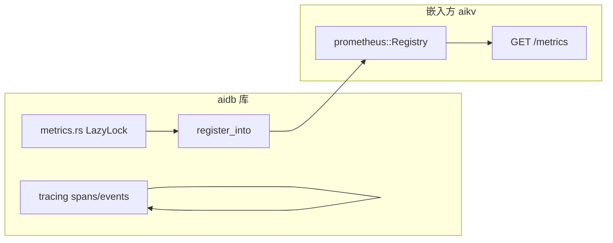

# Cursor transcript

---

## 1. User

下面给我可以直接复制使用的，下一章的 开场对话

---

## 2. Assistant

**Tool `Read`**

```json
{
  "path": "../../../AiKv-Workflow/backup/SESSION-PROMPT.md"
}
```


**Tool `Read`**

```json
{
  "limit": 25,
  "path": "../../../AiKv-Workflow/backup/PROGRESS.md"
}
```


**Tool `Grep`**

```json
{
  "glob": "*.md",
  "head_limit": 30,
  "path": "../../../AiKv-Workflow/backup/INDEX.md",
  "pattern": "observability"
}
```


---

## 3. Assistant

**Tool `Grep`**

```json
{
  "path": "../../../AiKv-Workflow/backup/design.md",
  "pattern": "observability"
}
```


**Tool `Glob`**

```json
{
  "glob_pattern": "aidb/src/metrics*",
  "target_directory": "<workspace>"
}
```


**Tool `Grep`**

```json
{
  "glob": "*.rs",
  "head_limit": 25,
  "path": "../../src",
  "pattern": "monitoring|metrics|tracing"
}
```


---

## 4. Assistant

**Tool `Read`**

```json
{
  "limit": 80,
  "path": "../../../AiKv-Workflow/backup/aidb/docs/observability.md"
}
```


**Tool `Glob`**

```json
{
  "glob_pattern": "aidb/src/cluster/metrics*",
  "target_directory": "<workspace>"
}
```


**Tool `Grep`**

```json
{
  "glob": "Cargo.toml",
  "path": "../../../aidb",
  "pattern": "monitoring|otel|prometheus|tracing"
}
```


---

## 5. Assistant

**Tool `Grep`**

```json
{
  "glob": "*.rs",
  "head_limit": 15,
  "path": "../../../aidb",
  "pattern": "metrics-port|9191|MetricsServer|/metrics"
}
```


**Tool `Grep`**

```json
{
  "glob": "*.md",
  "head_limit": 15,
  "path": "../../../WiQunTools/docs/wiqun-db-inventory",
  "pattern": "observability|metrics|tracing"
}
```


---

## 6. Assistant

**Tool `Glob`**

```json
{
  "glob_pattern": "aidb/tests/**/metrics/**",
  "target_directory": "<workspace>"
}
```


**Tool `Grep`**

```json
{
  "glob": "*.rs",
  "head_limit": 20,
  "path": "../../../aidb",
  "pattern": "opentelemetry|init_tracing|metrics::init"
}
```


---

## 7. Assistant

## 文档整理 — 新会话

工作目录: `<workspace>` (含 aidb/、aikv/、aifactory/)

请先阅读 (不要跳过):

1. `AiKv-Workflow/backup/design.md` — 总规程
2. `AiKv-Workflow/backup/PROGRESS.md` — 当前进度
3. `AiKv-Workflow/backup/INDEX.md` — 本章索引 (若已有行则更新)

---

### 本次任务

| 项 | 值 |
|----|-----|
| PROGRESS 总步 | 10 |
| 目标文件 | `aidb/docs/modules/observability.md` |
| 本次子步 | 从步 0 开始 |
| 对比深度 | 模块级 (见 `design.md` — aidb `observability` 非加深章) |

### 必须遵守

- **确认门控**: 步 0→1→2→3→4, 每步先讨论, 我确认后再下一步
- **步 4**: 先出 Module Skill 正文 **草稿**, 我确认后再写入 aidb/aikv、更新 INDEX/PROGRESS
- **Module Skill 基础模板**: frontmatter `name` + `description` (含 `Use when`); 见 `design.md`
- **过程只进 backup/**: INDEX; aidb/aikv 不写迁移历史
- **旧文档顺序**: `backup/{aidb,aikv}/` → `*-oldmain` → WiQunTools inventory 段 → wiqun-*
- **待核实**: module 一行引用; 详情写入 **当前仓库** 根目录 `ISSUES.md` (`aidb/ISSUES.md`)
- **步 4 落盘前**: 对照 create-skill Summary Checklist 自检 (见 `design.md`)

### 上下文 (上一章已完成)

- 步 9 ✅ [`aidb/docs/modules/backup.md`](aidb/docs/modules/backup.md) — BackupManager/Recovery/Retention; ISSUE-011~013 (doc-only); 会话归档 [`aidb/archive/09-backup.md`](aidb/archive/09-backup.md)
- 前置 module: 各章 tracing span 分散在 [engine.md](aidb/docs/modules/engine.md)、[engine-storage.md](aidb/docs/modules/engine-storage.md)、[cluster.md](aidb/docs/modules/cluster.md)、[backup.md](aidb/docs/modules/backup.md); 本章做 **汇总 + metrics.rs 注册面**
- 本章覆盖 `aidb/src/metrics.rs`; `monitoring` feature; `cluster/metrics.rs` (feature `cluster`); 测试 `tests/modules/metrics/`、`tests/metrics.rs`、`tests/common/observability.rs`
- WiQunTools 查漏: `13-backup-bench.md` **§2 Metrics** 属 **aikv/wiqun-kv** HTTP 暴露, 勿迁入; aidb 侧以库内 Prometheus 注册 + tracing/OTel 为准

### 边界提示 (步 0 可细化)

- **本章**: `metrics.rs` 指标清单与 `record_*` 触发点; `monitoring` / `cluster` feature gate; `metrics::init` / `register_into`; tracing span 矩阵 (WAL/DB/compaction/raft/backup); OTel 接线 (若有)
- **不重复**: 各 module 内 span 实现细节 → 对应 module 只链; cluster Raft 指标语义 → cluster.md; `aidb_backup_*` 业务触发 → backup.md; HTTP `/metrics` 端点与 `:9191` → **aikv** observability (步 12) / `backup/aidb/DEPLOYMENT.md` 运维段 (阶段 2)
- **旧稿**: `backup/aidb/docs/observability.md` 已移出 aidb, 优先参考; `backup/aidb/DEPLOYMENT.md` §可观测性、`wiqun-factory/docs/MONITORING.md` 按需提炼

### 本次不要

- 不要跳过未确认的步骤
- 不要一次写多篇 module
- 不要修改 `design.md` / 流程, 除非我明确要求
- 不要 commit, 除非我明确要求

---

请从步 0 开始, 给出本步交付物, 等我确认。

---

## 8. User

可以

---

## 9. Assistant

开始步 10（observability）：先读规程与进度，再梳理本章范围与边界。

**Tool `Read`**

```json
{
  "path": "../../../AiKv-Workflow/backup/PROGRESS.md",
  "limit": 50
}
```


**Tool `Grep`**

```json
{
  "path": "../../../AiKv-Workflow/backup/INDEX.md",
  "pattern": "observability"
}
```


**Tool `Read`**

```json
{
  "limit": 50,
  "path": "../../src/metrics.rs"
}
```


**Tool `Glob`**

```json
{
  "glob_pattern": "aidb/tests/**/metrics*",
  "target_directory": "<workspace>"
}
```


**Tool `Grep`**

```json
{
  "glob": "*.rs",
  "head_limit": 40,
  "path": "../../src",
  "pattern": "#\\[instrument|tracing::"
}
```


---

## 10. Assistant

**Tool `Read`**

```json
{
  "offset": 140,
  "path": "../../src/metrics.rs"
}
```


**Tool `Read`**

```json
{
  "path": "../../src/cluster/metrics.rs"
}
```


**Tool `Grep`**

```json
{
  "glob": "lib.rs",
  "path": "../../src",
  "pattern": "metrics|monitoring|tracing"
}
```


**Tool `Glob`**

```json
{
  "glob_pattern": "aidb/tests/**/*",
  "target_directory": "<workspace>"
}
```


---

## 11. Assistant

**Tool `Grep`**

```json
{
  "glob": "*.rs",
  "head_limit": 30,
  "path": "../../../aidb",
  "pattern": "opentelemetry|tracing_subscriber|tracing_opentelemetry"
}
```


**Tool `Read`**

```json
{
  "path": "../../tests/common/observability.rs"
}
```


**Tool `Read`**

```json
{
  "path": "../../tests/metrics.rs"
}
```


**Tool `Grep`**

```json
{
  "glob": "Cargo.toml",
  "path": "../../../aidb",
  "pattern": "feature"
}
```


---

## 12. Assistant

**Tool `Read`**

```json
{
  "limit": 35,
  "path": "../../Cargo.toml"
}
```


**Tool `Grep`**

```json
{
  "glob": "*.rs",
  "path": "../../src",
  "pattern": "opentelemetry"
}
```


**Tool `Read`**

```json
{
  "limit": 100,
  "path": "../../../AiKv-Workflow/backup/aidb/docs/observability.md"
}
```


**Tool `Glob`**

```json
{
  "glob_pattern": "wiqun-factory/docs/MONITORING*",
  "target_directory": "<workspace>"
}
```


---

## 13. Assistant

**Tool `Grep`**

```json
{
  "glob": "*.rs",
  "output_mode": "count",
  "path": "../../src",
  "pattern": "#\\[tracing::instrument|#\\[instrument"
}
```


**Tool `Grep`**

```json
{
  "glob": "*.rs",
  "path": "../../src",
  "pattern": "name = \\\"",
  "head_limit": 60
}
```


**Tool `Grep`**

```json
{
  "glob": "*.rs",
  "head_limit": 20,
  "path": "../../src",
  "pattern": "metrics::|record_"
}
```


---

## 14. Assistant

**Tool `Grep`**

```json
{
  "glob": "*.rs",
  "path": "../../src",
  "pattern": "metrics::init|metrics::record_|metrics::set_|metrics::memtable"
}
```


**Tool `Read`**

```json
{
  "limit": 80,
  "path": "../../tests/modules/metrics/prometheus.rs"
}
```


**Tool `Glob`**

```json
{
  "glob_pattern": "backup/aidb/docs/superpowers/**/*observ*",
  "target_directory": "../../../AiKv-Workflow"
}
```


---

## 15. Assistant

**Tool `Grep`**

```json
{
  "glob": "*.rs",
  "path": "../../../aidb",
  "pattern": "WAL_SIZE|SSTABLE_COUNT|SSTABLE_SIZE"
}
```


**Tool `Grep`**

```json
{
  "glob": "*.md",
  "head_limit": 20,
  "path": "../../../aidb-oldmain",
  "pattern": "aidb_wal|aidb_operations|MONITORING"
}
```


---

## 16. Assistant

## 步 0 — 定范围

**章节**: PROGRESS 步 10 · `aidb/docs/modules/observability.md`  
**对比深度**: 模块级  
**状态**: 讨论中, 未写入 INDEX / aidb

---

### 本章覆盖 (`src/` 路径)

| 路径 | 职责 | 入口 |
|------|------|------|
| `src/metrics.rs` | 集中 Prometheus 注册 + `record_*` / `set_*` | `init`, `register_into`, 各 `LazyLock` 静态量 |
| `src/cluster/metrics.rs` | Raft RPC / log 指标 (`cluster` + `monitoring`) | `record_raft_rpc`, `record_raft_log_entries`, `register_into` |
| `src/lib.rs` | `#[cfg(feature = "monitoring")] pub mod metrics` | feature gate |
| **tracing 散布面** (本章汇总索引, 不展开实现) | `#[instrument]` / `tracing::debug!` | 见下「Span 域」 |

**Span 域** (按 module 链出, 本章做索引表):

| 域 | 主要 `src/` | 代表 span 名 |
|----|-------------|--------------|
| WAL | `engine/wal/*` | `wal_open`, `wal_write`, `wal_replay`, … |
| MemTable | `engine/memtable/table.rs` | `mem_put`, `mem_get`, `mem_freeze` |
| SSTable / Cache | `engine/sstable/*`, `cache/block_cache.rs` | `sst_seek`, `sst_block_read`, `cache_get` |
| DB | `engine/db/inner.rs` | `db_open`, `db_put`, `db_get`, `db_flush`, … |
| Compaction | `engine/compaction/*` | `cmp_pick`, `cmp_run`, `cmp_apply` |
| Checkpoint | `engine/checkpoint/mod.rs` | `bgsave_checkpoint` |
| Backup | `backup/*` | `backup_create`, `backup_restore`, … |
| Cluster / Raft | `cluster/{network,storage,meta_*}.rs` | `raft_rpc_*`, `raft_apply_sm`, `meta_propose` |

**metrics 触发面** (步 1 细读):

- `engine/db/inner.rs` — operations / flush / compaction / sequence / key_count
- `engine/wal/manager.rs` — `WAL_SIZE`
- `engine/memtable/table.rs` — memtable gauges
- `engine/cache/block_cache.rs` — cache hit/miss/size
- `engine/filter/bloom.rs` — bloom false positive
- `backup/manager.rs`, `backup/recovery.rs` — backup 指标
- `cluster/network.rs` — raft metrics

---

### 拟读文件列表

#### 步 1 — 新代码 (主)

| 优先级 | 路径 | 目的 |
|--------|------|------|
| P0 | `aidb/src/metrics.rs` | 全量指标名、label、bucket、`init`/`register_into` |
| P0 | `aidb/src/cluster/metrics.rs` | 集群指标边界 |
| P1 | `aidb/Cargo.toml` | `monitoring` / `cluster` feature 依赖 |
| P1 | `aidb/tests/modules/metrics/prometheus.rs` | 指标接线验收 |
| P1 | `aidb/tests/metrics.rs` | 测试入口 |
| P1 | `aidb/tests/common/observability.rs` | `EventCatcher`、tracing 测试约定 |
| P1 | `aidb/tests/modules/cluster/metrics.rs` | Raft 指标测试 |
| P2 | 各 module 中 `metrics::` / `#[instrument]` 调用点 | 汇总 span ↔ metrics 矩阵 (抽样 + grep) |

#### 步 2 — 旧文档

| 顺序 | 来源 | 路径 |
|------|------|------|
| 1 | backup/aidb | `docs/observability.md` (主参考, 已移出 aidb) |
| 1 | backup/aidb | `DEPLOYMENT.md` §可观测性、`CHANGELOG.md` monitoring 段 |
| 2 | aidb-oldmain | `docs/monitoring/MONITORING_GUIDE.md` |
| 3 | WiQunTools | `13-backup-bench.md` **§2** (属 aikv, 查漏边界) |
| 4 | wiqun-factory | `docs/MONITORING.md` (运维栈, 阶段 2 亦可吸收) |

#### 步 3 — 旧代码对照 (模块级)

| 来源 | 说明 |
|------|------|
| aidb-oldmain | 指标命名 (`aidb_backups_total` vs 现 `aidb_backup_total` 等) |
| wiqun-db | 与 backup/aidb 重叠时二选一 |

#### 关联 module (只引用)

| 文档 | 关系 |
|------|------|
| [engine.md](aidb/docs/modules/engine.md) | DB/WAL/MemTable span 细节 |
| [engine-storage.md](aidb/docs/modules/engine-storage.md) | compaction/SST/cache/checkpoint span |
| [cluster.md](aidb/docs/modules/cluster.md) | Raft span 语义 |
| [backup.md](aidb/docs/modules/backup.md) | `aidb_backup_*` 业务触发 |
| aikv observability (步 12) | HTTP `/metrics`、`:9191`、slowlog/INFO |

---

### 本章边界

#### ✅ 本章写

- **双轨模型**: tracing (始终编译) vs Prometheus (`monitoring` feature)
- **`metrics.rs` 指标清单**: 名称、类型、label、`record_*` 触发模块
- **`init` vs `register_into`**: 库内 LazyLock vs 嵌入方 Registry (aikv 等)
- **`cluster/metrics.rs`**: 与 `metrics::register_into` 的条件注册
- **Span 索引表**: 按域列出主要 `name`, 链到各 module
- **测试**: `cargo test --test metrics --features monitoring`, `EventCatcher` 约定
- **集成方职责**: aidb 是库, 不内置 HTTP scrape 端点

#### ❌ 不重复

| 主题 | 归属 |
|------|------|
| 各 span 实现细节 / 字段 | 对应 engine/cluster/backup module |
| HTTP `GET /metrics`、MetricsServer、CLI `--metrics-port` | aikv observability (步 12); DEPLOYMENT 阶段 2 |
| WiQunTools §2 wiqun-kv Metrics 结构体 | aikv, 不迁入 |
| slowlog / LATENCY / INFO | aikv observability |
| `benches/*` 性能回归 | development.md |

#### ⚠️ 步 2 预备观察 (非步 0 结论)

- `monitoring` feature 依赖 `opentelemetry` / `tracing-opentelemetry`, 但 **`aidb/src` 无 OTel 接线代码** — 旧稿「OTel 导出拓扑」可能过时
- 旧稿 span 名 (如 `wal_write`) vs 现码 (`wal_write` manager 有, writer 用 `wal.write.*` debug event) — 需步 2 核对
- oldmain `aidb_wal_sync_duration_seconds` — 现 `metrics.rs` **无** 对应 histogram

---

### 步 4 预设

- **Skill name**: `aidb-observability`
- **description 草案**: `AiDb observability — centralized Prometheus metrics (monitoring feature), tracing span index, register_into integration. Use when changing src/metrics.rs or cluster/metrics.rs, wiring metrics in embedders, or debugging aidb_* Prometheus counters and tracing spans.`
- **Mermaid**: tracing vs metrics 双轨; `DB::open` → `metrics::init` → `register_into` 嵌入流程

---

### 拟 INDEX 行 (确认步 0 后写入)

```
| `docs/modules/observability.md` | 🔄 步 1 | backup/aidb/docs/observability.md; DEPLOYMENT §可观测性 | | metrics.rs + cluster/metrics; tracing 索引 |
```

---

请确认步 0: **可以** / **调整…**. 确认后进入步 1 读新代码.

---

## 17. User

可以

---

## 18. Assistant

步 0 已确认。开始步 1：通读 metrics/tracing 相关代码并整理要点。

**Tool `Read`**

```json
{
  "path": "../../src/metrics.rs"
}
```


**Tool `Read`**

```json
{
  "path": "../../tests/modules/metrics/prometheus.rs"
}
```


**Tool `Read`**

```json
{
  "path": "../../tests/modules/cluster/metrics.rs"
}
```


**Tool `StrReplace`**

```json
{
  "new_string": "| `docs/modules/observability.md` | 🔄 步 1 | backup/aidb/docs/observability.md; DEPLOYMENT §可观测性 | | metrics.rs + cluster/metrics; tracing 索引 |",
  "old_string": "| `docs/modules/observability.md` | 待开始 | `backup/aidb/docs/observability.md` | 已移出 aidb | `metrics.rs` + monitoring |",
  "path": "../../../AiKv-Workflow/backup/INDEX.md"
}
```


---

## 19. Assistant

**Tool `Read`**

```json
{
  "limit": 30,
  "offset": 145,
  "path": "../../src/engine/db/inner.rs"
}
```


**Tool `Read`**

```json
{
  "limit": 30,
  "offset": 1225,
  "path": "../../src/engine/db/inner.rs"
}
```


**Tool `Grep`**

```json
{
  "glob": "*.rs",
  "path": "../../src",
  "pattern": "record_operation\\(|record_compaction\\("
}
```


**Tool `Grep`**

```json
{
  "glob": "*.rs",
  "path": "../../src",
  "pattern": "tracing::(debug|info|warn|event)!",
  "head_limit": 35
}
```


**Tool `Shell`**

```bash
cd ../../../aidb && cargo test --test metrics --features monitoring -- --test-threads=1 2>&1 | tail -20
```


---

## 20. Assistant

**Tool `Grep`**

```json
{
  "glob": "*.rs",
  "path": "<workspace>",
  "pattern": "register_into|aidb::metrics"
}
```


**Tool `Grep`**

```json
{
  "glob": "inner.rs",
  "path": "../../src/engine/db",
  "pattern": "scan|close|record_operation"
}
```


**Tool `Grep`**

```json
{
  "glob": "*.rs",
  "path": "../../src/cluster",
  "pattern": "#\\[instrument"
}
```


---

## 21. Assistant

## 步 1 — 读新代码

已通读 `metrics.rs`、`cluster/metrics.rs`、各模块 `metrics::` / tracing 调用点, 并跑通 `cargo test --test metrics --features monitoring -- --test-threads=1` (3/3 通过). INDEX 已标 🔄 步 1.

---

### 模块职责 (一句话)

**aidb 是可观测性「库」层**: `tracing` 始终可用; Prometheus 指标集中在 `metrics.rs`, 由 `monitoring` feature 门控; 嵌入方 (aikv) 通过 `register_into` 挂到自己的 Registry 并暴露 HTTP.**

---

### 代码地图

| 路径 | 职责 | 入口 |
|------|------|------|
| `src/metrics.rs` | 20 个 Prometheus 系列 + `init` / `register_into` / `record_*` | `DB::open` 时 `init()` |
| `src/cluster/metrics.rs` | Raft RPC / log 计数 | `network.rs` 收发 RPC 时 |
| `src/lib.rs` | `#[cfg(monitoring)] pub mod metrics` | 无 monitoring 则无 `aidb::metrics` |
| `tests/common/observability.rs` | `EventCatcher`、tracing 测试锁 | 跨模块 tracing 验收 |
| `tests/modules/metrics/prometheus.rs` | cache/bloom/DB histogram 接线 | `--test metrics` |
| `tests/modules/cluster/metrics.rs` | Raft 指标 register + gather | cluster 测试 |
| **嵌入方** | `aikv/src/server/metrics.rs` 调 `aidb::metrics::register_into` | HTTP `/metrics` 在 aikv (步 12) |

---

### 双轨架构

```mermaid
flowchart LR
  subgraph always [始终编译]
    T[tracing crate]
    SP[#[instrument] spans]
    EV[target 结构化 event]
  end
  subgraph mon [feature monitoring]
    M[metrics.rs LazyLock]
    R[record_* / set_*]
    REG[register_into]
  end
  SP --> T
  EV --> T
  R --> M
  REG --> M
  REG -->|cluster feature| CR[cluster/metrics.rs]
```

要点:
- **`opentelemetry` / `tracing-opentelemetry` 在 `Cargo.toml` 中列为 `monitoring` 依赖, 但 `aidb/src` 无 OTel Layer 接线** (步 2 核对旧稿)
- **无内置 HTTP scrape**: aidb 只提供指标定义与注册 API

---

### Prometheus 指标清单 (`metrics.rs`)

| 指标 | 类型 | labels | 主要触发 |
|------|------|--------|----------|
| `aidb_wal_size_bytes` | Gauge | — | `wal/manager.rs` append/rotate |
| `aidb_memtable_size_bytes` | IntGaugeVec | `state=active\|frozen` | `memtable/table.rs` put/freeze |
| `aidb_sstable_count` | IntGaugeVec | `level` | `db/inner.rs` `update_sstable_metrics` |
| `aidb_sstable_size_bytes` | IntGaugeVec | `level` | 同上 |
| `aidb_operations_total` | CounterVec | `op` | `db/inner.rs` |
| `aidb_operation_duration_seconds` | HistogramVec | `op` | put/get/delete/write_batch |
| `aidb_flush_total` | Counter | — | flush 完成 |
| `aidb_flush_duration_seconds` | Histogram | — | flush 路径 |
| `aidb_block_cache_*` | Gauge/Counter | — | `block_cache.rs` |
| `aidb_bloom_false_positive_total` | Counter | — | `filter/bloom.rs` |
| `aidb_sequence` | IntGauge | — | open / allocate sequence |
| `aidb_total_key_count` | IntGauge | — | put/delete 后更新 |
| `aidb_compaction_total` | CounterVec | **`type`**=pick/run/apply | compaction 循环 |
| `aidb_compaction_duration_seconds` | HistogramVec | **`phase`**=pick/run/apply | 同上 |
| `aidb_backup_*` | Counter/Gauge/Histogram | `op` (backup_total) | `backup/*` — 见 [backup.md](aidb/docs/modules/backup.md) |

**`operations_total` / `operation_duration` 的 `op` 值**: `put`, `get`, `delete`, `write_batch`, `snapshot`, `stall_stop`, `stall_slowdown`. **`scan` / `close` 无对应 counter.**

**`cluster/metrics.rs`** (需 `monitoring` + `cluster`):

| 指标 | labels | 触发 |
|------|--------|------|
| `aidb_raft_rpc_total` | `type`=vote/append_entries/install_snapshot, `direction`=incoming/outgoing | `cluster/network.rs` |
| `aidb_raft_log_entries_total` | — | AppendEntries 入站 entry 数 |

`metrics::register_into` 在 `monitoring` + `cluster` 时链式注册 cluster 指标.

---

### 生命周期

1. **`DB::open`** (`monitoring`): `metrics::init()` + `set_sequence`
2. **运行时**: 各路径调 `record_*` / 直接 `WAL_SIZE.set` / `update_sstable_metrics`
3. **嵌入方启动** (aikv): `prometheus::Registry::new()` → `aidb::metrics::register_into(&registry)?` → 自有 HTTP encode

`init()` 幂等: 触摸所有 `LazyLock`, memtable gauge 归零.

---

### Tracing 索引 (按域, 链 module 不展开)

| 域 | 机制 | 代表名 / target |
|----|------|-----------------|
| WAL | `#[instrument]` + `target:wal` events | `wal_write`, `wal_replay`; `wal.write.*`, `wal.sync.*` |
| MemTable | instrument + `target:mem` | `mem_put`, `mem_get`, `mem_freeze` |
| SST | instrument + `target:sst` | `sst_seek`, `sst_block_read`, `sst_build_add` |
| Cache | instrument | `cache_get`, `cache_insert` |
| DB | instrument + `target:db` | `db_open`, `db_put`, `db_scan`, `db_flush`, `db.close` event |
| Compaction | instrument | `cmp_pick`, `cmp_run`, `cmp_apply`, `cmp_merge` |
| Checkpoint | instrument | `bgsave_checkpoint` |
| Backup | instrument | `backup_create`, `backup_restore`, … |
| Raft 存储 | instrument | `raft_append_log`, `raft_apply_sm`, … |
| Raft RPC | instrument | `raft_rpc_ae`, `raft_rpc_vote`, `raft_rpc_is` |
| Meta | instrument | `meta_propose`, `meta_apply`, `meta_slot_query` |

**与旧稿差异预备**: 旧 `observability.md` 列 `wal_write` span — 现码 manager 有 `wal_write` instrument; writer 层主要是 **debug event** (`wal.write.start`), 非独立 span 名.

---

### Feature 矩阵

| 组合 | `aidb::metrics` | `record_*` | `register_into` | Raft metrics |
|------|-----------------|------------|-----------------|--------------|
| 默认 (无 monitoring) | ❌ 模块不存在 | — | — | cluster 有 no-op stub |
| `monitoring` | ✅ | ✅ | ✅ (引擎指标) | 需再加 `cluster` |
| `monitoring` + `cluster` | ✅ | ✅ | ✅ + cluster | ✅ |

aikv 依赖 aidb 时需启用 `aidb/monitoring` 才能 `register_into`.

---

### 测试

```bash
cargo test --test metrics --features monitoring -- --test-threads=1
# cluster raft 指标: 在 cluster 测试套件内 test_raft_metrics_register_and_record
```

| 测试 | 验证 |
|------|------|
| `test_block_cache_prometheus_counters_and_size` | hit/miss/size gauge |
| `test_bloom_false_positive_prometheus_counter` | 与内部 atomic 一致 |
| `test_db_operation_and_flush_duration_histograms` | put/get/flush histogram 有样本 |
| `test_raft_metrics_register_and_record` | gather 后 counter 值 |

**tracing 测试约定** (`observability.rs`):
- 全局 `Registry::default()` ctor 预热 callsite
- `tracing_test_lock` 串行化 subscriber 安装
- CI 含 tracing 的测试建议 `--test-threads=1`

---

### 步 2/3 预备观察

1. **OTel 依赖未接线** — `monitoring` 拉入 opentelemetry, src 无 Layer 初始化
2. **`aidb_wal_sync_duration_seconds`** — oldmain 有, 现码无
3. **compaction 指标 label 名不一致** — counter 用 `type`, histogram 用 `phase` (同值 pick/run/apply)
4. **scan/close 无 operations_total** — 旧 DEPLOYMENT 表列 `close` op, 现码未记
5. **`backup_list` 等 span 无 Prometheus 计数** — 仅 backup create/delete/restore 有 `aidb_backup_total`

---

请确认步 1: **可以** / **调整…**. 确认后进入步 2 查旧文档.

---

## 22. User

可以

---

## 23. Assistant

步 1 已确认。开始步 2：按规程查阅旧文档并分类。

**Tool `Read`**

```json
{
  "path": "../../../AiKv-Workflow/backup/aidb/docs/observability.md"
}
```


**Tool `Read`**

```json
{
  "limit": 80,
  "offset": 125,
  "path": "../../../AiKv-Workflow/backup/aidb/DEPLOYMENT.md"
}
```


**Tool `Grep`**

```json
{
  "glob": "CHANGELOG.md",
  "head_limit": 25,
  "path": "../../../AiKv-Workflow/backup/aidb",
  "pattern": "monitoring|metrics|tracing|OTel|Prometheus|observability"
}
```


**Tool `Read`**

```json
{
  "limit": 120,
  "offset": 1,
  "path": "../../../aidb-oldmain/docs/monitoring/MONITORING_GUIDE.md"
}
```


---

## 24. Assistant

**Tool `Grep`**

```json
{
  "glob": "*.rs",
  "path": "../../../aidb",
  "pattern": "MetricsServer|AIDB_OTLP|AIDB_JSON_LOG"
}
```


**Tool `Read`**

```json
{
  "limit": 80,
  "path": "../../../wiqun-factory/docs/MONITORING.md"
}
```


**Tool `Grep`**

```json
{
  "glob": "*.md",
  "head_limit": 15,
  "path": "../../../wiqun-db",
  "pattern": "observability|metrics"
}
```


**Tool `Read`**

```json
{
  "limit": 50,
  "offset": 200,
  "path": "../../../aidb-oldmain/docs/monitoring/MONITORING_GUIDE.md"
}
```


---

## 25. Assistant

**Tool `Read`**

```json
{
  "path": "../../../wiqun-db/docs/observability.md"
}
```


**Tool `Grep`**

```json
{
  "path": "../../ISSUES.md",
  "pattern": "ISSUE-014"
}
```


---

## 26. Assistant

**Tool `Grep`**

```json
{
  "glob": "*.rs",
  "path": "../../src",
  "pattern": "bloom_build|snapshot_create|raft_propose|compaction_pick"
}
```


**Tool `Grep`**

```json
{
  "glob": "*.rs",
  "path": "../../src/engine/compaction",
  "pattern": "cmp_background|instrument"
}
```


---

## 27. Assistant

**Tool `StrReplace`**

```json
{
  "new_string": "| `docs/modules/observability.md` | 🔄 步 2 | backup/aidb/docs/observability.md; DEPLOYMENT §可观测性 | | metrics.rs + cluster/metrics; tracing 索引 |",
  "old_string": "| `docs/modules/observability.md` | 🔄 步 1 | backup/aidb/docs/observability.md; DEPLOYMENT §可观测性 | | metrics.rs + cluster/metrics; tracing 索引 |",
  "path": "../../../AiKv-Workflow/backup/INDEX.md"
}
```


---

## 28. Assistant

## 步 2 — 查旧文档

按 `design.md` 顺序查阅 observability 相关旧文档并分类. **未写入** `ISSUES.md` / aidb 正文, 等你确认.

---

### 旧文档清单与分类

| 顺序 | 路径 | 分类 | 说明 |
|------|------|------|------|
| 1 | `backup/aidb/docs/observability.md` | ⚠️ **部分有效 + 大量过时** | 双轨思路、`monitoring` feature 仍对; span 树含 **aikv** (`kv_command`); 指标表为旧命名 (`aidb_puts_total` 等); OTel/`:9191` 暗示 aidb 自带导出 |
| 1 | `backup/aidb/DEPLOYMENT.md` §可观测性 | ⚠️ **指标表有效, 运维段过时** | `aidb_operations_total` 等与现码一致; `--metrics-port`/`AIDB_OTLP_ENDPOINT`/`AIDB_JSON_LOG` **aidb 源码无** |
| 1 | `backup/aidb/CHANGELOG.md` | ✅ **仍有效** | `register_into`、Raft 指标、各阶段 `aidb_*` 增量记录; 步 4 消化参考 |
| 1 | `backup/aidb/DESIGN.md` | ➡️ 边界 | Histogram/Gauge/Counter 区分 — 阶段 2 DESIGN 或本章一句 |
| 2 | `aidb-oldmain/docs/monitoring/MONITORING_GUIDE.md` | ❌ **已过时** | `MetricsServer`/`MetricsCollector`/`aidb_requests_total` — **不存在**; 大量指标名与现码不符 |
| 3 | `WiQunTools/13-backup-bench.md` **§2** | ➡️ **不属本章** | Metrics HTTP 归 wiqun-kv/aikv (步 12); 仅作边界确认 |
| 3 | `WiQunTools/08-observability.md` (wiqun-kv) | ➡️ **不迁入** | aikv observability 步 12 |
| 4 | `wiqun-db/docs/observability.md` | ⏭️ 跳过 | 与 `backup/aidb/docs/observability.md` 同稿 (`wiqun_*` 前缀) |
| 4 | `wiqun-factory/docs/MONITORING.md` | ➡️ 边界 | **wiqun-kv** 部署 scrape/OTel; 阶段 2 `DEPLOYMENT.md` 可提炼; 本章链一句 |

---

### 仍有效 (可吸收进 module)

| 来源 | 内容 |
|------|------|
| CHANGELOG | `metrics::init` / `register_into`; aikv 嵌入; Raft `aidb_raft_*` |
| DEPLOYMENT 指标表 | 现码 `aidb_*` 名称 (除 scan/close 备注) |
| observability.md §1 双轨 | tracing + Prometheus (`monitoring`) |
| observability.md §2 矩阵 **思路** | 按域列 span/metric; 需按步 1 **重写名与状态** |
| observability.md §2 已知缺口 | `bloom_build`/`slot_migration` span 等待核实 — 见下 |
| `tests/common/observability.rs` 模式 | EventCatcher / `--test-threads=1` |

---

### 已过时 / 设计偏离 (不写进 module 正文)

| 旧说法 | 现况 |
|--------|------|
| `aidb_puts_total` / `aidb_gets_total` / `aidb_deletes_total` | 合并为 `aidb_operations_total{op}` |
| `aidb_wal_bytes` (Counter) | `aidb_wal_size_bytes` (Gauge) |
| `aidb_cache_hit_rate` (Gauge) | hit/miss **两个 Counter**, 命中率需 PromQL 计算 |
| `aidb_compaction_count{level}` | `aidb_compaction_total{type}` + `aidb_compaction_duration_seconds{phase}` |
| `aidb_bloom_false_positives` | `aidb_bloom_false_positive_total` |
| `aidb_memtable_size` (无 label) | `aidb_memtable_size_bytes{state}` |
| `aidb_snapshot_count` | **无** 对应 Prometheus 系列 |
| `aidb_wal_sync_duration_seconds` (oldmain) | **无** |
| `aidb_backups_total{status}` | `aidb_backup_total{op}` |
| `aidb_restore_duration_seconds` | **无** 独立 histogram |
| `aidb_cluster_nodes` / `aidb_errors_total` | **无** |
| Span `compaction_pick` / `memtable_insert` | 现 `cmp_pick` / `mem_put` |
| Span `sstable_read` / `cache_lookup` | 现 `sst_seek` / `cache_get` |
| Span `raft_propose` / `raft_append` / `raft_apply` | 现 `meta_propose` / `raft_rpc_ae` / `raft_apply_sm` 等 |
| Span 树顶层 `kv_command` | **aikv** 侧, 不在 aidb |
| OTel 导出 / `:9191/metrics` / `AIDB_OTLP_*` | **aikv** `main.rs` + `server/metrics.rs`; aidb 仅 `register_into` |
| oldmain `MetricsServer` | 不存在 |

---

### 待核实 (步 2 分类)

| 项 | 旧文档 | 步 1 现码 | 建议 |
|----|--------|----------|------|
| `bloom_build` span | 标 ⚠️ 缺失 | `sstable/builder.rs` 有 `info_span!("bloom_build")` | **已实现**, 旧稿过时 |
| `slot_migration` / `failover` span | 已知缺口 P2 | cluster 有 `#[instrument]` 但无固定名 `slot_migration` | 已知限制一句 |
| `scan`/`close` in operations_total | DEPLOYMENT 表列 | 现码未 `record_operation` | ISSUE 候选 |
| OTel 依赖 | 双轨写 OTel | `monitoring` 拉依赖, src **无 Layer** | ISSUE 候选 |
| `cmp_background` span | CHANGELOG 提及 | 未找到 instrument | 不写或标缺口 |

---

### 拟新增 ISSUES (步 2–3 门控)

建议 **4 条 doc-only**:

| 编号 | 标题 | 现象 | module 影响 |
|------|------|------|-------------|
| **ISSUE-014** | HTTP/OTel/JSON log 运行在 aikv, aidb 仅库内指标 | DEPLOYMENT/旧 observability 写 aidb 直连 `:9191` 与 `AIDB_OTLP_ENDPOINT`; aidb 无 `MetricsServer`/env | 本章写 `register_into` 嵌入模式; 链 aikv 步 12 |
| **ISSUE-015** | 旧 observability 指标表与 span 名大量过时 | `aidb_puts_total`、`compaction_pick`、`raft_propose` 等与现码不符 | 正文以 `metrics.rs` + grep 为准; 旧稿仅查漏 |
| **ISSUE-016** | 旧设计若干 Prometheus 系列未实现 | `wal_sync_duration`, `cache_hit_rate`, `snapshot_count`, `cluster_nodes`, `errors_total`, `restore_duration` | 已知限制列举 |
| **ISSUE-017** | compaction 指标 label 名不一致 | `aidb_compaction_total{type}` vs `aidb_compaction_duration_seconds{phase}` | 文档如实写两 label 名 |

**可选第 5 条** (你若想单独跟踪):
- **ISSUE-018**: `scan`/`close` 未计入 `aidb_operations_total` — DEPLOYMENT 表与现码不一致

或合并进 ISSUE-016.

---

### 步 4 文档应如何表述

1. **定位**: aidb = **指标定义 + tracing 埋点 + `register_into`**; 抓取/OTel/日志格式 = **嵌入方 (aikv)**
2. **吸收**: DEPLOYMENT 现码指标表、CHANGELOG `register_into` 叙事、双轨模型
3. **重写**: span 索引表 (instrument 名 + 主要 `target:` event), 对齐步 1
4. **不迁入**: 旧 metrics 表、Dashboard PromQL (阶段 2 DEPLOYMENT 或删减)、wiqun-factory 运维细节
5. **不重复**: 各 module span 实现; backup 指标触发 → backup.md
6. **嵌入示例**: 引用 `aikv/src/server/metrics.rs` 调 `aidb::metrics::register_into` (一行链)

---

### 拟 INDEX 更新 (确认步 2 后)

```
| `docs/modules/observability.md` | 🔄 步 3 | backup/aidb/docs/observability.md; DEPLOYMENT §; oldmain MONITORING (过时) | | ISSUE-014~017; 旧稿指标表过时 |
```

---

请确认步 2:

1. **分类** 是否 OK?
2. **ISSUE-014~017** (+ 可选 018): 写入 `aidb/ISSUES.md` / 还是 **待核实写「无」**?
3. 确认后进入 **步 3** (oldmain 模块级对照, 主要为 MONITORING_GUIDE vs `metrics.rs`).

---

## 29. User

可以，吸入

---

## 30. Assistant

步 2 已确认。正在写入 ISSUES，并对照 oldmain 完成步 3 模块级对比。

**Tool `Grep`**

```json
{
  "glob": "*.rs",
  "head_limit": 20,
  "path": "../../../aidb-oldmain/src",
  "pattern": "monitoring|metrics"
}
```


**Tool `Read`**

```json
{
  "limit": 50,
  "path": "../../ISSUES.md"
}
```


---

## 31. Assistant

**Tool `Read`**

```json
{
  "limit": 80,
  "path": "../../../aidb-oldmain/src/monitoring/metrics.rs"
}
```


**Tool `StrReplace`**

```json
{
  "new_string": "## 条目列表\n\n<!-- 按 ISSUE-NNN 倒序追加 -->\n\n### ISSUE-018: scan/close 未计入 aidb_operations_total\n\n- **状态**: doc-only\n- **发现于**: PROGRESS 步 2–3 / 章节 `docs/modules/observability.md`\n- **相关 src**: `src/engine/db/inner.rs` (`scan`, `close`)\n- **旧文档**: `backup/aidb/DEPLOYMENT.md` §可观测性 — 列 `put/get/delete/scan/close`\n- **现象**: `record_operation` 覆盖 put/get/delete/write_batch/snapshot/stall_*; `db_scan`/`db_close` 有 span 但无 counter\n- **影响**: module 指标表不写 scan/close; 或已知限制一句\n- **下一步**: 已关闭 (doc-only)\n\n### ISSUE-017: compaction 指标 counter/histogram label 名不一致\n\n- **状态**: doc-only\n- **发现于**: PROGRESS 步 2 / 章节 `docs/modules/observability.md`\n- **相关 src**: `src/metrics.rs` (`COMPACTION_TOTAL`, `COMPACTION_DURATION`)\n- **现象**: `aidb_compaction_total` label 为 `type`; `aidb_compaction_duration_seconds` label 为 `phase`; 值均为 pick/run/apply\n- **影响**: 文档如实写两 label 名; PromQL 勿混用\n- **下一步**: 已关闭 (doc-only)\n\n### ISSUE-016: 旧设计若干 Prometheus 系列未实现\n\n- **状态**: doc-only\n- **发现于**: PROGRESS 步 2–3 / 章节 `docs/modules/observability.md`\n- **相关 src**: `src/metrics.rs`\n- **旧文档**: `backup/aidb/docs/observability.md` Metrics 表; `aidb-oldmain/docs/monitoring/MONITORING_GUIDE.md`\n- **oldmain 代码**: `aidb-oldmain/src/monitoring/metrics.rs` — 独立 requests/errors/cluster 指标\n- **现象**: 现码无 `wal_sync_duration`, `cache_hit_rate` gauge, `snapshot_count`, `cluster_nodes`, `errors_total`, `restore_duration` 等\n- **影响**: 已知限制; Dashboard 用 PromQL 派生 (如 hit rate) 或链 aikv 指标\n- **下一步**: 已关闭 (doc-only)\n\n### ISSUE-015: 旧 observability 指标表与 span 名大量过时\n\n- **状态**: doc-only\n- **发现于**: PROGRESS 步 2–3 / 章节 `docs/modules/observability.md`\n- **相关 src**: `src/metrics.rs`, 各模块 `#[instrument]`\n- **旧文档**: `backup/aidb/docs/observability.md` §2 矩阵\n- **现象**: 旧稿 `aidb_puts_total`、`compaction_pick`、`raft_propose`、`memtable_insert` 等与现 `aidb_operations_total{op}`、`cmp_pick`、`meta_propose`、`mem_put` 不符\n- **影响**: 正文以现码 grep 为准; 不回迁旧表\n- **下一步**: 已关闭 (doc-only)\n\n### ISSUE-014: HTTP/OTel/JSON log 运行在嵌入方, aidb 仅库内指标\n\n- **状态**: doc-only\n- **发现于**: PROGRESS 步 2–3 / 章节 `docs/modules/observability.md`\n- **相关 src**: `src/metrics.rs` (`register_into`); `aikv/src/server/metrics.rs`\n- **旧文档**: `backup/aidb/DEPLOYMENT.md` §可观测性 (`--metrics-port`, `AIDB_OTLP_ENDPOINT`); `backup/aidb/docs/observability.md` OTel 拓扑\n- **oldmain 代码**: `aidb-oldmain/src/monitoring/{server,metrics}.rs` — 内置 MetricsServer + Collector\n- **现象**: 现 aidb 无 HTTP 端点、无 OTel Layer 初始化、无 `AIDB_*` env; `monitoring` 依赖含 opentelemetry 但未接线; aikv 调 `aidb::metrics::register_into` 后自行暴露 `/metrics`\n- **影响**: module 写库侧职责边界; HTTP/OTel 链 aikv observability (步 12)\n- **下一步**: 已关闭 (doc-only)\n\n### ISSUE-013: list_backups 与 get_backup_info 对损坏 manifest 行为不一致",
  "old_string": "## 条目列表\n\n<!-- 按 ISSUE-NNN 倒序追加 -->\n\n### ISSUE-013: list_backups 与 get_backup_info 对损坏 manifest 行为不一致",
  "path": "../../ISSUES.md"
}
```


**Tool `StrReplace`**

```json
{
  "new_string": "| `docs/modules/observability.md` | 🔄 步 3 | backup/aidb/docs/observability.md; DEPLOYMENT §; oldmain monitoring/* + MONITORING_GUIDE (过时) | | ISSUE-014~018 doc-only |",
  "old_string": "| `docs/modules/observability.md` | 🔄 步 2 | backup/aidb/docs/observability.md; DEPLOYMENT §可观测性 | | metrics.rs + cluster/metrics; tracing 索引 |",
  "path": "../../../AiKv-Workflow/backup/INDEX.md"
}
```


---

## 32. Assistant

## 步 2 收尾

已写入 [`aidb/ISSUES.md`](aidb/ISSUES.md) **ISSUE-014 ~ 018** (均为 doc-only). INDEX 已更新为 🔄 步 3.

---

## 步 3 — 对比旧代码 (模块级)

对照 `aidb-oldmain/src/monitoring/*` 与当前 `aidb/src/metrics.rs` + `cluster/metrics.rs`.

### 差异表

| 维度 | oldmain | 当前 aidb | 主流程等价? | 文档表述建议 |
|------|---------|-----------|-------------|--------------|
| **模块位置** | `src/monitoring/{mod,metrics,server}.rs` | `src/metrics.rs` + `cluster/metrics.rs` | 架构变 | 写现路径; 不提 `monitoring/` 目录 |
| **公开 API** | `MetricsServer`, `MetricsCollector`, `register_metrics` | `metrics::init`, `register_into`, `record_*` | 否 | 嵌入方 Registry 模式 |
| **HTTP 暴露** | 内置 `MetricsServer` (`/metrics`) | **无** | — | ISSUE-014; 链 aikv |
| **指标注册** | `lazy_static` + 全局 `register_*` | `LazyLock` 静态量 + 显式 `register_into(registry)` | 理念变 | 强调可嵌入多 Registry |
| **请求指标** | `aidb_requests_total{operation,status}` | `aidb_operations_total{op}` (无 status) | 部分等价 | 写现 label 集 |
| **延迟** | `aidb_request_duration_seconds{operation}` | `aidb_operation_duration_seconds{op}` | 等价 | 名称略变 |
| **WAL** | 含 `wal_sync_duration` histogram | 仅 `aidb_wal_size_bytes` gauge | 缩减 | ISSUE-016 |
| **Cache** | `cache_hits/misses{cache_type}` | `block_cache_hits/misses_total` (无 label) | 类似 | 写 block cache 专指 |
| **Compaction** | `compactions_total{level}` | `compaction_total{type}` + `duration{phase}` | 语义变 | ISSUE-017 |
| **系统指标** | `memory_bytes`, `disk_bytes` | **无** | — | ISSUE-016 |
| **错误指标** | `errors_total` | **无** | — | ISSUE-016 |
| **集群指标** | `cluster_nodes`, `cluster_requests` | 仅 `raft_rpc_total` + `raft_log_entries` | 缩减 | 链 cluster.md |
| **备份指标** | `backups_total{status}` | `backup_total{op}` | 变 | 链 backup.md |
| **触发方式** | 外部 `MetricsCollector.record_*` | 引擎路径内自动 `metrics::record_*` | **现码更内聚** | 写「DB 路径自动打点」 |
| **Tracing** | 未集中在 monitoring 模块 | `tracing` 散布各 engine/cluster | — | 本章做索引 |
| **OTel** | 未见 | 依赖在 Cargo, **未接线** | — | ISSUE-014 |

### 主流程等价性

| 流程 | 结论 |
|------|------|
| **指标采集意图** | **等价** — 均为 Prometheus 兼容运行时指标 |
| **暴露路径** | **不等价** — oldmain 自包含 HTTP; 现码 **库 + 嵌入方** (aikv `register_into`) |
| **打点位置** | **现码优于 oldmain** — 内嵌于 `DB::open`/put/get/compaction, 无需手动 Collector |
| **指标全集** | **不等价** — oldmain 更多系统/错误类; 现码更贴 LSM 引擎面 |

### 与 `backup/aidb/docs/observability.md` 对照

| 设计项 | 现码 | 备注 |
|--------|------|------|
| 双轨 tracing + metrics | ✅ | OTel 导出 ❌ (ISSUE-014) |
| Span 矩阵 | ⚠️ 名大量偏离 | ISSUE-015; 以 instrument 名为准 |
| Metrics 清单表 | ❌ 过时 | 用 `metrics.rs` 20 系列 |
| 已知缺口 bloom_build | ❌ 旧稿过时 | 已实现 `info_span!("bloom_build")` |
| Dashboard/排查 §3 | ⚠️ PromQL 基于旧指标名 | 不迁入 module; 阶段 2 DEPLOYMENT 酌情 |

### 步 4 文档应如何表述

1. **架构**: tracing (全量) + Prometheus (`monitoring`) + `register_into` 嵌入
2. **与 oldmain**: 不写 `MetricsServer`; 强调自动打点
3. **指标章**: 完整表 (`metrics.rs` + `cluster/metrics.rs`)
4. **Span 章**: 压缩索引表 + 链各 module
5. **集成**: `aikv/src/server/metrics.rs` 一行示例链
6. **待核实**: ISSUE-014~018 各行引用

---

请确认步 3: **可以** / **调整…**. 确认后进入步 4, 先出 **Module Skill 正文草稿**.

---

## 33. User

可以

---

## 34. Assistant

步 3 已确认。正在起草步 4 的 Module Skill 正文。

**Tool `Read`**

```json
{
  "limit": 50,
  "path": "../../../aikv/src/server/metrics.rs",
  "offset": 755
}
```


**Tool `StrReplace`**

```json
{
  "new_string": "| `docs/modules/observability.md` | 🔄 步 4 草稿 | backup/aidb/docs/observability.md; DEPLOYMENT §; oldmain monitoring/* (过时) | | ISSUE-014~018 doc-only |",
  "old_string": "| `docs/modules/observability.md` | 🔄 步 3 | backup/aidb/docs/observability.md; DEPLOYMENT §; oldmain monitoring/* + MONITORING_GUIDE (过时) | | ISSUE-014~018 doc-only |",
  "path": "../../../AiKv-Workflow/backup/INDEX.md"
}
```


---

## 35. Assistant

## 步 4 — Module Skill 正文草稿

以下为 `aidb/docs/modules/observability.md` 草稿, **尚未落盘**. 请审阅后回复 **可以** / **调整…**.

---

### create-skill 自检

| 项 | 状态 |
|----|------|
| description 含 WHAT + WHEN, 第三人称 | ✅ |
| 正文 <500 行 (~220 行) | ✅ |
| 术语一致 (metrics / tracing / register_into) | ✅ |
| 链接一层深度 | ✅ |
| 无时间敏感表述 | ✅ |

---

### 草稿正文

```markdown
---
name: aidb-observability
description: AiDb observability — centralized Prometheus metrics (monitoring feature), tracing span index, metrics::init and register_into for embedders. Use when changing src/metrics.rs or cluster/metrics.rs, wiring aidb_* counters in aikv, or debugging Prometheus/tracing for engine and Raft paths.
---

# AiDb Observability (可观测性)

## 何时读本文

- 改 `src/metrics.rs`、`src/cluster/metrics.rs` 或排查 `aidb_*` Prometheus 指标
- 在 **嵌入方** (aikv) 注册 aidb 指标、理解 `register_into` 与 scrape 边界
- 查 tracing span / event 命名, 跨 module 定位埋点
- **不覆盖**: 各 module 内 span 实现细节 → [engine.md](engine.md) / [engine-storage.md](engine-storage.md) / [cluster.md](cluster.md) / [backup.md](backup.md)
- **不覆盖**: HTTP `/metrics`、OTel Collector、slowlog/INFO → aikv [observability.md](../../../aikv/docs/modules/observability.md) (步 12)
- **构建**: `monitoring` feature 启用 `aidb::metrics`; 默认 **不** 启用

## 代码地图

| 路径 | 职责 | 入口 |
|------|------|------|
| `src/metrics.rs` | 引擎 Prometheus 系列 + `init` / `register_into` / `record_*` | `DB::open` → `init()` |
| `src/cluster/metrics.rs` | Raft RPC / log 计数 | `cluster/network.rs` |
| `src/lib.rs` | `#[cfg(monitoring)] pub mod metrics` | 无 monitoring 则无模块 |
| `tests/common/observability.rs` | `EventCatcher`、tracing 测试锁 | 跨模块 tracing 验收 |
| `tests/modules/metrics/prometheus.rs` | cache/bloom/DB histogram 接线 | `--test metrics` |
| `tests/modules/cluster/metrics.rs` | Raft 指标 register + gather | cluster 测试套件 |

**嵌入方**: `aikv/src/server/metrics.rs` 在 `Metrics::new()` 内调用 `aidb::metrics::register_into(&registry)?`, 与 `wiqun_kv_*` 共用 Registry 后由 HTTP 暴露.

## 架构: 双轨 + 嵌入



要点:

- **Tracing**: 始终编译 (`tracing` crate); 与 `monitoring` feature **无关**
- **Prometheus**: 仅 `monitoring` feature; `record_*` 在引擎热路径自动调用
- **aidb 无内置 HTTP scrape 端点**; `opentelemetry` / `tracing-opentelemetry` 在 `Cargo.toml` 列为 `monitoring` 依赖, 但 **aidb/src 无 OTel Layer 接线** (见 ISSUE-014)

## 生命周期

1. **`DB::open`** (`monitoring`): `metrics::init()` (幂等触摸所有 `LazyLock`) + `set_sequence`
2. **运行时**: put/get/flush/compaction/backup 等路径调 `record_*` 或直接 `Gauge::set`
3. **嵌入方启动**: `Registry::new()` → `aidb::metrics::register_into(&registry)?` → encode 暴露

`register_into` 在 `monitoring` + `cluster` 时链式注册 `cluster/metrics.rs`.

## Prometheus 指标 (`metrics.rs`)

| 指标 | 类型 | labels | 主要触发 |
|------|------|--------|----------|
| `aidb_wal_size_bytes` | Gauge | — | `wal/manager.rs` |
| `aidb_memtable_size_bytes` | IntGaugeVec | `state=active\|frozen` | `memtable/table.rs` |
| `aidb_sstable_count` | IntGaugeVec | `level` | `db/inner.rs` `update_sstable_metrics` |
| `aidb_sstable_size_bytes` | IntGaugeVec | `level` | 同上 |
| `aidb_operations_total` | CounterVec | `op` | `db/inner.rs` |
| `aidb_operation_duration_seconds` | HistogramVec | `op` | put/get/delete/write_batch |
| `aidb_flush_total` | Counter | — | flush 完成 |
| `aidb_flush_duration_seconds` | Histogram | — | flush 路径 |
| `aidb_block_cache_size_bytes` | Gauge | — | `block_cache.rs` |
| `aidb_block_cache_hits_total` | Counter | — | cache get hit |
| `aidb_block_cache_misses_total` | Counter | — | cache get miss |
| `aidb_bloom_false_positive_total` | Counter | — | `filter/bloom.rs` |
| `aidb_sequence` | IntGauge | — | open / allocate |
| `aidb_total_key_count` | IntGauge | — | put/delete 后 |
| `aidb_compaction_total` | CounterVec | **`type`** | pick/run/apply |
| `aidb_compaction_duration_seconds` | HistogramVec | **`phase`** | pick/run/apply |
| `aidb_backup_total` | CounterVec | `op=create\|delete\|restore` | `backup/*` |
| `aidb_backup_size_bytes` | IntGauge | — | create |
| `aidb_backup_duration_seconds` | Histogram | — | create |

**`aidb_operations_total` / `operation_duration` 的 `op`**: `put`, `get`, `delete`, `write_batch`, `snapshot`, `stall_stop`, `stall_slowdown`. **`scan` / `close` 无 counter** (见 ISSUE-018).

**命中率**: 无 `cache_hit_rate` gauge; 用 PromQL `rate(hits)/(rate(hits)+rate(misses))`.

### 集群指标 (`cluster/metrics.rs`, `monitoring` + `cluster`)

| 指标 | labels | 触发 |
|------|--------|------|
| `aidb_raft_rpc_total` | `type`=vote/append_entries/install_snapshot, `direction`=incoming/outgoing | `cluster/network.rs` |
| `aidb_raft_log_entries_total` | — | AppendEntries 入站 entry 数 |

## Tracing 索引 (按域)

> 完整字段见各 module; 此处只列 **instrument `name`** 与主要 **`target:` event**.

| 域 | instrument 名 | 主要 event (`target`) |
|----|---------------|----------------------|
| WAL | `wal_open`, `wal_write`, `wal_replay`, … | `wal`: `wal.write.*`, `wal.sync.*` |
| MemTable | `mem_put`, `mem_get`, `mem_freeze` | `mem`: `mem.put`, `mem.get.hit/miss` |
| SSTable | `sst_seek`, `sst_block_read`, `sst_build_add` | `sst`: `sst.seek.result`; `bloom_build` info_span |
| Cache | `cache_get`, `cache_insert` | — |
| DB | `db_open`, `db_put`, `db_get`, `db_scan`, `db_flush`, `db_close` | `db`: `db.put`, `db.get.result`, `db.flush.complete` |
| Compaction | `cmp_pick`, `cmp_run`, `cmp_merge`, `cmp_apply` | — |
| Checkpoint | `bgsave_checkpoint` | `db`: `checkpoint.create.complete` |
| Backup | `backup_create`, `backup_restore`, … | 见 [backup.md](backup.md) |
| Raft 存储 | `raft_append_log`, `raft_apply_sm`, … | — |
| Raft RPC | `raft_rpc_ae`, `raft_rpc_vote`, `raft_rpc_is` | — |
| Meta | `meta_propose`, `meta_apply`, `meta_slot_query` | — |

**不在 aidb**: `kv_command` / RESP 命令 span → aikv.

## 常见任务

### 启用引擎指标

```toml
# 嵌入方 Cargo.toml
aidb = { path = "../aidb", features = ["monitoring"] }
```

```bash
cargo build --features monitoring
cargo test --test metrics --features monitoring -- --test-threads=1
```

### 注册到自定义 Registry

```rust
let registry = prometheus::Registry::new();
aidb::metrics::register_into(&registry)?;
// prometheus::Encoder::gather → HTTP 或文件
```

aikv 已在 `Metrics::new()` 内完成上述步骤.

### 读取指标值 (测试)

```rust
aidb::metrics::init();
// 操作后:
assert!(aidb::metrics::OPERATIONS_TOTAL.with_label_values(&["put"]).get() > 0);
```

或 `tests/common/observability.rs` 的 `assert_gauge_eq` / `assert_counter_eq`.

### 验证 tracing event

```rust
use crate::common::observability::{capture_events_under_lock, EventCatcher};
let events = capture_events_under_lock(|| { /* 被测操作 */ });
// 或 EventCatcher + init_test_subscriber
```

含 tracing 的测试建议 `--test-threads=1` (避免 subscriber 竞争).

### 排查指标为 0

1. 确认编译启用了 `monitoring` feature
2. 确认 `DB::open` 已执行 (`init()` 在 open 内)
3. 确认嵌入方调用了 `register_into` 且 scrape 的 Registry 为同一实例
4. 对 gauge (如 `sstable_count`): 确认发生过 flush/compaction 触发 `update_sstable_metrics`

## 配置与 feature flags

| 项 | 位置 | 说明 |
|----|------|------|
| `monitoring` | `Cargo.toml` | `prometheus`, `opentelemetry*`, `tracing-opentelemetry`; 导出 `aidb::metrics` |
| `cluster` | 与 `monitoring` 叠加 | `register_into` 额外注册 `aidb_raft_*` |
| 无 `monitoring` | — | 无 `aidb::metrics` mod; `cluster::metrics::record_*` 为 no-op stub |

## 测试

```bash
cargo test --test metrics --features monitoring -- --test-threads=1
# Raft: tests/modules/cluster/metrics.rs (cluster 测试套件内)
```

| 测试 | 覆盖 |
|------|------|
| `test_block_cache_prometheus_counters_and_size` | hit/miss/size |
| `test_bloom_false_positive_prometheus_counter` | 与内部 atomic 一致 |
| `test_db_operation_and_flush_duration_histograms` | put/get/flush 有样本 |
| `test_raft_metrics_register_and_record` | gather 后 counter 值 |

## 已知限制

- **无内置 HTTP / OTel / JSON log 开关** — 嵌入方 (aikv) 负责 (ISSUE-014)
- **旧 observability 稿大量指标名/span 名已过时** — 以 `metrics.rs` 为准 (ISSUE-015)
- **未实现**: `wal_sync_duration`, `cache_hit_rate` gauge, `snapshot_count`, `cluster_nodes`, `errors_total`, `restore_duration` 等 (ISSUE-016)
- **compaction counter label `type` vs histogram label `phase`** — 同值不同名 (ISSUE-017)
- **`scan`/`close` 无 `operations_total`** (ISSUE-018)
- **无进程级 memory/disk 指标** — oldmain `monitoring` 模块已移除

## 待核实

- 见 [ISSUES.md](../../ISSUES.md#issue-014--httpoteljson-log-运行在嵌入方-aidb-仅库内指标) — HTTP/OTel 在嵌入方, aidb 仅库内指标
- 见 [ISSUES.md](../../ISSUES.md#issue-015--旧-observability-指标表与-span-名大量过时) — 旧稿指标表与 span 名过时
- 见 [ISSUES.md](../../ISSUES.md#issue-016--旧设计若干-prometheus-系列未实现) — 若干旧设计指标未实现
- 见 [ISSUES.md](../../ISSUES.md#issue-017--compaction-指标-counterhistogram-label-名不一致) — compaction label 名不一致
- 见 [ISSUES.md](../../ISSUES.md#issue-018--scanclose-未计入-aidb_operations_total) — scan/close 未计入 operations_total
```

---

### 步 4 确认后行政动作 (预览)

1. 写入 `aidb/docs/modules/observability.md`
2. INDEX ✅ + 归档 log (`backup/aidb/docs/observability.md` 已吸收)
3. PROGRESS 步 10 ✅
4. 可选归档: oldmain `MONITORING_GUIDE.md` → INDEX 标跳过 (同 backup ADMIN)

---

请确认草稿: **可以** / **调整…**.

---

## 36. User

可以

---

## 37. Assistant

草稿已确认，正在落盘并更新 INDEX/PROGRESS。

**Tool `Write`**

```json
{
  "path": "../../docs/modules/observability.md",
  "contents": "---\nname: aidb-observability\ndescription: AiDb observability — centralized Prometheus metrics (monitoring feature), tracing span index, metrics::init and register_into for embedders. Use when changing src/metrics.rs or cluster/metrics.rs, wiring aidb_* counters in aikv, or debugging Prometheus/tracing for engine and Raft paths.\n---\n\n# AiDb Observability (可观测性)\n\n## 何时读本文\n\n- 改 `src/metrics.rs`、`src/cluster/metrics.rs` 或排查 `aidb_*` Prometheus 指标\n- 在 **嵌入方** (aikv) 注册 aidb 指标、理解 `register_into` 与 scrape 边界\n- 查 tracing span / event 命名, 跨 module 定位埋点\n- **不覆盖**: 各 module 内 span 实现细节 → [engine.md](engine.md) / [engine-storage.md](engine-storage.md) / [cluster.md](cluster.md) / [backup.md](backup.md)\n- **不覆盖**: HTTP `/metrics`、OTel Collector、slowlog/INFO → aikv [observability.md](../../../aikv/docs/modules/observability.md) (步 12)\n- **构建**: `monitoring` feature 启用 `aidb::metrics`; 默认 **不** 启用\n\n## 代码地图\n\n| 路径 | 职责 | 入口 |\n|------|------|------|\n| `src/metrics.rs` | 引擎 Prometheus 系列 + `init` / `register_into` / `record_*` | `DB::open` → `init()` |\n| `src/cluster/metrics.rs` | Raft RPC / log 计数 | `cluster/network.rs` |\n| `src/lib.rs` | `#[cfg(monitoring)] pub mod metrics` | 无 monitoring 则无模块 |\n| `tests/common/observability.rs` | `EventCatcher`、tracing 测试锁 | 跨模块 tracing 验收 |\n| `tests/modules/metrics/prometheus.rs` | cache/bloom/DB histogram 接线 | `--test metrics` |\n| `tests/modules/cluster/metrics.rs` | Raft 指标 register + gather | cluster 测试套件 |\n\n**嵌入方**: `aikv/src/server/metrics.rs` 在 `Metrics::new()` 内调用 `aidb::metrics::register_into(&registry)?`, 与 `wiqun_kv_*` 共用 Registry 后由 HTTP 暴露.\n\n## 架构: 双轨 + 嵌入\n\n```mermaid\nflowchart LR\n  subgraph lib [aidb 库]\n    T[tracing spans/events]\n    M[metrics.rs LazyLock]\n    R[register_into]\n  end\n  subgraph embed [嵌入方 aikv]\n    REG[prometheus::Registry]\n    HTTP[GET /metrics]\n  end\n  T --> T\n  M --> R\n  R --> REG\n  REG --> HTTP\n```\n\n要点:\n\n- **Tracing**: 始终编译 (`tracing` crate); 与 `monitoring` feature **无关**\n- **Prometheus**: 仅 `monitoring` feature; `record_*` 在引擎热路径自动调用\n- **aidb 无内置 HTTP scrape 端点**; `opentelemetry` / `tracing-opentelemetry` 在 `Cargo.toml` 列为 `monitoring` 依赖, 但 **aidb/src 无 OTel Layer 接线** (见 ISSUE-014)\n\n## 生命周期\n\n1. **`DB::open`** (`monitoring`): `metrics::init()` (幂等触摸所有 `LazyLock`) + `set_sequence`\n2. **运行时**: put/get/flush/compaction/backup 等路径调 `record_*` 或直接 `Gauge::set`\n3. **嵌入方启动**: `Registry::new()` → `aidb::metrics::register_into(&registry)?` → encode 暴露\n\n`register_into` 在 `monitoring` + `cluster` 时链式注册 `cluster/metrics.rs`.\n\n## Prometheus 指标 (`metrics.rs`)\n\n| 指标 | 类型 | labels | 主要触发 |\n|------|------|--------|----------|\n| `aidb_wal_size_bytes` | Gauge | — | `wal/manager.rs` |\n| `aidb_memtable_size_bytes` | IntGaugeVec | `state=active\\|frozen` | `memtable/table.rs` |\n| `aidb_sstable_count` | IntGaugeVec | `level` | `db/inner.rs` `update_sstable_metrics` |\n| `aidb_sstable_size_bytes` | IntGaugeVec | `level` | 同上 |\n| `aidb_operations_total` | CounterVec | `op` | `db/inner.rs` |\n| `aidb_operation_duration_seconds` | HistogramVec | `op` | put/get/delete/write_batch |\n| `aidb_flush_total` | Counter | — | flush 完成 |\n| `aidb_flush_duration_seconds` | Histogram | — | flush 路径 |\n| `aidb_block_cache_size_bytes` | Gauge | — | `block_cache.rs` |\n| `aidb_block_cache_hits_total` | Counter | — | cache get hit |\n| `aidb_block_cache_misses_total` | Counter | — | cache get miss |\n| `aidb_bloom_false_positive_total` | Counter | — | `filter/bloom.rs` |\n| `aidb_sequence` | IntGauge | — | open / allocate |\n| `aidb_total_key_count` | IntGauge | — | put/delete 后 |\n| `aidb_compaction_total` | CounterVec | **`type`** | pick/run/apply |\n| `aidb_compaction_duration_seconds` | HistogramVec | **`phase`** | pick/run/apply |\n| `aidb_backup_total` | CounterVec | `op=create\\|delete\\|restore` | `backup/*` |\n| `aidb_backup_size_bytes` | IntGauge | — | create |\n| `aidb_backup_duration_seconds` | Histogram | — | create |\n\n**`aidb_operations_total` / `operation_duration` 的 `op`**: `put`, `get`, `delete`, `write_batch`, `snapshot`, `stall_stop`, `stall_slowdown`. **`scan` / `close` 无 counter** (见 ISSUE-018).\n\n**命中率**: 无 `cache_hit_rate` gauge; 用 PromQL `rate(hits)/(rate(hits)+rate(misses))`.\n\n### 集群指标 (`cluster/metrics.rs`, `monitoring` + `cluster`)\n\n| 指标 | labels | 触发 |\n|------|--------|------|\n| `aidb_raft_rpc_total` | `type`=vote/append_entries/install_snapshot, `direction`=incoming/outgoing | `cluster/network.rs` |\n| `aidb_raft_log_entries_total` | — | AppendEntries 入站 entry 数 |\n\n## Tracing 索引 (按域)\n\n> 完整字段见各 module; 此处只列 **instrument `name`** 与主要 **`target:` event**.\n\n| 域 | instrument 名 | 主要 event (`target`) |\n|----|---------------|----------------------|\n| WAL | `wal_open`, `wal_write`, `wal_replay`, … | `wal`: `wal.write.*`, `wal.sync.*` |\n| MemTable | `mem_put`, `mem_get`, `mem_freeze` | `mem`: `mem.put`, `mem.get.hit/miss` |\n| SSTable | `sst_seek`, `sst_block_read`, `sst_build_add` | `sst`: `sst.seek.result`; `bloom_build` info_span |\n| Cache | `cache_get`, `cache_insert` | — |\n| DB | `db_open`, `db_put`, `db_get`, `db_scan`, `db_flush`, `db_close` | `db`: `db.put`, `db.get.result`, `db.flush.complete` |\n| Compaction | `cmp_pick`, `cmp_run`, `cmp_merge`, `cmp_apply` | — |\n| Checkpoint | `bgsave_checkpoint` | `db`: `checkpoint.create.complete` |\n| Backup | `backup_create`, `backup_restore`, … | 见 [backup.md](backup.md) |\n| Raft 存储 | `raft_append_log`, `raft_apply_sm`, … | — |\n| Raft RPC | `raft_rpc_ae`, `raft_rpc_vote`, `raft_rpc_is` | — |\n| Meta | `meta_propose`, `meta_apply`, `meta_slot_query` | — |\n\n**不在 aidb**: `kv_command` / RESP 命令 span → aikv.\n\n## 常见任务\n\n### 启用引擎指标\n\n```toml\n# 嵌入方 Cargo.toml\naidb = { path = \"../aidb\", features = [\"monitoring\"] }\n```\n\n```bash\ncargo build --features monitoring\ncargo test --test metrics --features monitoring -- --test-threads=1\n```\n\n### 注册到自定义 Registry\n\n```rust\nlet registry = prometheus::Registry::new();\naidb::metrics::register_into(&registry)?;\n// prometheus::Encoder::gather → HTTP 或文件\n```\n\naikv 已在 `Metrics::new()` 内完成上述步骤.\n\n### 读取指标值 (测试)\n\n```rust\naidb::metrics::init();\n// 操作后:\nassert!(aidb::metrics::OPERATIONS_TOTAL.with_label_values(&[\"put\"]).get() > 0);\n```\n\n或 `tests/common/observability.rs` 的 `assert_gauge_eq` / `assert_counter_eq`.\n\n### 验证 tracing event\n\n```rust\nuse crate::common::observability::{capture_events_under_lock, EventCatcher};\nlet events = capture_events_under_lock(|| { /* 被测操作 */ });\n// 或 EventCatcher + init_test_subscriber\n```\n\n含 tracing 的测试建议 `--test-threads=1` (避免 subscriber 竞争).\n\n### 排查指标为 0\n\n1. 确认编译启用了 `monitoring` feature\n2. 确认 `DB::open` 已执行 (`init()` 在 open 内)\n3. 确认嵌入方调用了 `register_into` 且 scrape 的 Registry 为同一实例\n4. 对 gauge (如 `sstable_count`): 确认发生过 flush/compaction 触发 `update_sstable_metrics`\n\n## 配置与 feature flags\n\n| 项 | 位置 | 说明 |\n|----|------|------|\n| `monitoring` | `Cargo.toml` | `prometheus`, `opentelemetry*`, `tracing-opentelemetry`; 导出 `aidb::metrics` |\n| `cluster` | 与 `monitoring` 叠加 | `register_into` 额外注册 `aidb_raft_*` |\n| 无 `monitoring` | — | 无 `aidb::metrics` mod; `cluster::metrics::record_*` 为 no-op stub |\n\n## 测试\n\n```bash\ncargo test --test metrics --features monitoring -- --test-threads=1\n# Raft: tests/modules/cluster/metrics.rs (cluster 测试套件内)\n```\n\n| 测试 | 覆盖 |\n|------|------|\n| `test_block_cache_prometheus_counters_and_size` | hit/miss/size |\n| `test_bloom_false_positive_prometheus_counter` | 与内部 atomic 一致 |\n| `test_db_operation_and_flush_duration_histograms` | put/get/flush 有样本 |\n| `test_raft_metrics_register_and_record` | gather 后 counter 值 |\n\n## 已知限制\n\n- **无内置 HTTP / OTel / JSON log 开关** — 嵌入方 (aikv) 负责 (ISSUE-014)\n- **旧 observability 稿大量指标名/span 名已过时** — 以 `metrics.rs` 为准 (ISSUE-015)\n- **未实现**: `wal_sync_duration`, `cache_hit_rate` gauge, `snapshot_count`, `cluster_nodes`, `errors_total`, `restore_duration` 等 (ISSUE-016)\n- **compaction counter label `type` vs histogram label `phase`** — 同值不同名 (ISSUE-017)\n- **`scan`/`close` 无 `operations_total`** (ISSUE-018)\n- **无进程级 memory/disk 指标** — oldmain `monitoring` 模块已移除\n\n## 待核实\n\n- 见 [ISSUES.md](../../ISSUES.md#issue-014--httpoteljson-log-运行在嵌入方-aidb-仅库内指标) — HTTP/OTel 在嵌入方, aidb 仅库内指标\n- 见 [ISSUES.md](../../ISSUES.md#issue-015--旧-observability-指标表与-span-名大量过时) — 旧稿指标表与 span 名过时\n- 见 [ISSUES.md](../../ISSUES.md#issue-016--旧设计若干-prometheus-系列未实现) — 若干旧设计指标未实现\n- 见 [ISSUES.md](../../ISSUES.md#issue-017--compaction-指标-counterhistogram-label-名不一致) — compaction label 名不一致\n- 见 [ISSUES.md](../../ISSUES.md#issue-018--scanclose-未计入-aidb_operations_total) — scan/close 未计入 operations_total\n"
}
```


**Tool `StrReplace`**

```json
{
  "new_string": "**当前阶段**: 阶段 1 — modules (步 11/12 待开始)",
  "old_string": "**当前阶段**: 阶段 1 — modules (步 10/12 待开始)",
  "path": "../../../AiKv-Workflow/backup/PROGRESS.md"
}
```


**Tool `StrReplace`**

```json
{
  "new_string": "| 10 | aidb | `docs/modules/observability.md` | metrics, monitoring | ✅ 完成 | 2026-06-18 |",
  "old_string": "| 10 | aidb | `docs/modules/observability.md` | metrics, monitoring | ⬜ 待开始 | |",
  "path": "../../../AiKv-Workflow/backup/PROGRESS.md"
}
```


**Tool `StrReplace`**

```json
{
  "new_string": "| `docs/modules/observability.md` | ✅ | backup/aidb/docs/observability.md; DEPLOYMENT §; oldmain monitoring/* + MONITORING_GUIDE (过时) | 已写 aidb/docs/modules/observability.md | ISSUE-014~018 doc-only |",
  "old_string": "| `docs/modules/observability.md` | 🔄 步 4 草稿 | backup/aidb/docs/observability.md; DEPLOYMENT §; oldmain monitoring/* (过时) | | ISSUE-014~018 doc-only |",
  "path": "../../../AiKv-Workflow/backup/INDEX.md"
}
```


**Tool `StrReplace`**

```json
{
  "new_string": "| 日期 | 源仓库 | 旧文件路径 | 对应新章节 | 处理 |\n|------|--------|------------|------------|------|\n| 2026-06-18 | aidb-oldmain | `docs/monitoring/MONITORING_GUIDE.md` | `docs/modules/observability.md` | 无有效内容跳过 (MetricsServer/Collector 已移除) |\n| 2026-06-18 | aidb-oldmain | `docs/monitoring/ADMIN_TOOL_GUIDE.md` §Backup | `docs/modules/backup.md` | 无有效内容跳过 (aidb-admin CLI 已移除) |",
  "old_string": "| 日期 | 源仓库 | 旧文件路径 | 对应新章节 | 处理 |\n|------|--------|------------|------------|------|\n| 2026-06-18 | aidb-oldmain | `docs/monitoring/ADMIN_TOOL_GUIDE.md` §Backup | `docs/modules/backup.md` | 无有效内容跳过 (aidb-admin CLI 已移除) |",
  "path": "../../../AiKv-Workflow/backup/INDEX.md"
}
```


---

## 38. Assistant

## 步 4 完成

`aidb/docs/modules/observability.md` 已落盘, 行政收尾如下.

### 写入

- [`aidb/docs/modules/observability.md`](aidb/docs/modules/observability.md) — Module Skill (`aidb-observability`)
- [`aidb/ISSUES.md`](aidb/ISSUES.md) — ISSUE-014 ~ 018 (步 2 已写入)

### 过程文档

- [`PROGRESS.md`](AiKv-Workflow/backup/PROGRESS.md) — 步 10 ✅ (2026-06-18); **aidb 5 篇 modules 全部完成**; 当前 **步 11/12**
- [`INDEX.md`](AiKv-Workflow/backup/INDEX.md) — observability 行 ✅; 归档 log 追加 oldmain `MONITORING_GUIDE.md` → 跳过

### 下一章开场 (复制即用)

```markdown
## 文档整理 — 新会话

工作目录: `<workspace>` (含 aidb/、aikv/、aifactory/)

请先阅读 (不要跳过):
1. `AiKv-Workflow/backup/design.md` — 总规程
2. `AiKv-Workflow/backup/PROGRESS.md` — 当前进度
3. `AiKv-Workflow/backup/INDEX.md` — 本章索引 (若已有行则更新)

---

### 本次任务

| 项 | 值 |
|----|-----|
| PROGRESS 总步 | 11 |
| 目标文件 | `aikv/docs/modules/cluster.md` |
| 本次子步 | 从步 0 开始 |
| 对比深度 | **核心章逐段** (见 `design.md` — aikv `cluster` 为加深章) |

### 必须遵守

- **确认门控**: 步 0→1→2→3→4, 每步先讨论, 我确认后再下一步
- **步 4**: 先出 Module Skill 正文 **草稿**, 我确认后再写入 aidb/aikv、更新 INDEX/PROGRESS
- **Module Skill 基础模板**: frontmatter `name` + `description` (含 `Use when`); 见 `design.md`
- **过程只进 backup/**: INDEX; aidb/aikv 不写迁移历史
- **旧文档顺序**: `backup/{aidb,aikv}/` → `*-oldmain` → WiQunTools inventory 段 → wiqun-*
- **待核实**: module 一行引用; 详情写入 **当前仓库** 根目录 `ISSUES.md` (`aikv/ISSUES.md`)
- **步 4 落盘前**: 对照 create-skill Summary Checklist 自检 (见 `design.md`)

### 上下文 (上一章已完成)

- 步 10 ✅ [`aidb/docs/modules/observability.md`](aidb/docs/modules/observability.md) — metrics/register_into/tracing 索引; ISSUE-014~018
- **aidb modules 5/5 已全部 ✅** (engine → observability)
- 前置 module: [`aidb/docs/modules/cluster.md`](aidb/docs/modules/cluster.md) (MetaRaft/MultiRaft/Router/slot 迁移); [`aikv/docs/modules/storage.md`](aikv/docs/modules/storage.md) (AiDbEngine/cluster_adapter); [`commands-core.md`](aikv/docs/modules/commands-core.md) (Router)
- 本章覆盖 `aikv/src/cluster/*` + `command/cluster_commands`; MOVED/ASK/Gossip/failover/CLUSTER 子命令
- WiQunTools 查漏: `wiqun-kv-inventory` cluster 相关段

### 边界提示 (步 0 可细化)

- **本章**: aikv 侧 MOVED/ASK 重定向、Gossip、slot 视图、failover、CLUSTER 命令; 与 aidb cluster 的分工
- **不重复**: aidb Raft/MetaRaft 实现 → aidb cluster.md; `aidb_raft_*` 指标 → aidb observability.md
- **加深**: 关键文件逐段对照 oldmain (cluster adapter、cluster commands、MOVED 路径)

### 本次不要

- 不要跳过未确认的步骤
- 不要一次写多篇 module
- 不要修改 `design.md` / 流程, 除非我明确要求
- 不要 commit, 除非我明确要求

---

请从步 0 开始, 给出本步交付物, 等我确认。
```
