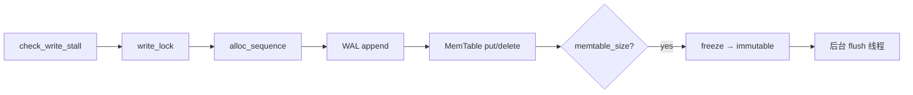
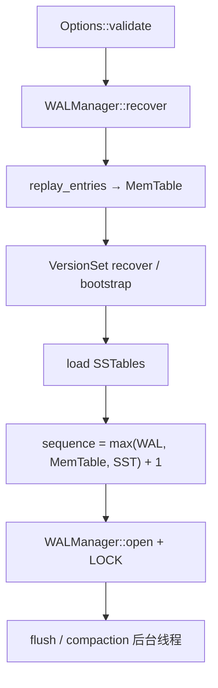

# AiDb Engine (写路径)

## 何时读本文

- 改 `engine/wal`, `engine/memtable`, `engine/db` 或 `DB::*` 公共 API
- 排查写路径、WAL 恢复、MemTable freeze、WriteBatch 原子性、Snapshot 读
- **不覆盖**: SSTable 布局 / compaction / Bloom / BlockCache / checkpoint → [engine-storage.md](02-engine-storage.md)
- **不覆盖**: 分布式共识与 Raft 日志适配 → [cluster.md](03-cluster.md)

## 代码地图

| 路径 | 职责 | 入口 |
| --- | --- | --- |
| `engine/mod.rs` | 引擎模块根; 子模块声明与组织 | — |
| `engine/wal/mod.rs` | WAL 模块根; re-export | — |
| `engine/wal/record.rs` | Record 物理格式; `WalEntry` 编解码; `OpType` | `WalEntry::encode`, `OpType` |
| `engine/wal/writer.rs` | 追加 Record; 32KB block padding; sync | `Writer::write_record` |
| `engine/wal/reader.rs` | 顺序读; 分片重组; strict/非 strict 损坏处理 | `Reader::read_record` |
| `engine/wal/manager.rs` | open/recover/append/rotate/cleanup; `LOCK` | `WALManager::*` |
| `engine/memtable/mod.rs` | MemTable 模块根; re-export | — |
| `engine/memtable/rep.rs` | `MemTableRep` trait: 抽象 MemTable 底层存储 | `MemTableRep` |
| `engine/memtable/skiplist_rep.rs` | crossbeam SkipMap 实现 (当前唯一 rep) | `SkipMapRep` |
| `engine/memtable/key_bytes.rs` | SkipMap 排序键包装 | `InternalKeyBytes` |
| `engine/memtable/internal_key.rs` | InternalKey 编码; `ValueType`; sequence 上界 | `encode_internal_key`, `check_sequence` |
| `engine/memtable/table.rs` | `MemTable` / `ImmutableMemTable`; freeze | `MemTable::put`, `freeze` |
| `engine/memtable/iterator.rs` | MemTable 迭代 | `MemTableIterator` |
| `engine/memtable/range_tombstone.rs` | Range tombstone 辅助 (`[start,end)` 覆盖 / 最大 seq) | `max_covering_range_tombstone_seq` |
| `engine/db/mod.rs` | DB 模块根; re-export | — |
| `engine/db/inner/` | DB 总协调 (子目录): `mod.rs` 生命周期/状态 + `write.rs` 写路径 + `read.rs` 读路径 + `exists.rs` 存在性判定 + `flush.rs` Flush + `compaction.rs` Compaction | `DB::open`, `put`, `write`, `get`, `key_exists` |
| `engine/db/write_batch.rs` | 批写容器与写摘要 | `WriteBatch`, `WriteOp`, `EngineWriteStats` |
| `engine/db/replay.rs` | WAL entry → MemTable 回放 | `replay_entries` |
| `engine/db/snapshot.rs` | MVCC 快照; `SnapshotList` | `Snapshot::get`, `SnapshotList` |
| `engine/db/iterator.rs` | 跨 MemTable + SSTable 归并迭代 | `DBIterator` |
| `engine/db/numbers.rs` | WAL 文件编号扫描 | `scan_next_wal_file_number` |
| `src/config.rs` | 引擎配置: `Options` / `ClusterConfig` / `MigrationConfig` / `CompressionType` | `Options::for_testing`, `Options::validate` |
| `src/error.rs` | 类型化错误 (`thiserror`); `Cluster` 变体需 feature `cluster` | `Error`, `Result` |

公共 re-export (`src/lib.rs`): `DB`, `WriteBatch`, `WriteOp`, `EngineWriteStats`, `Snapshot`, `DbIterGuard`.

## 关键 invariant (勿破坏)

- **写顺序**: WAL append **先于** MemTable 写入 (`put`/`delete`/`write` 均如此).
- **Sequence**: 合法范围 `[1, 2^56)`; `alloc_sequence` 与 `check_sequence` 双重校验; overflow → `Error::InvalidState`.
- **User key**: 非空; 空 key → `Error::InvalidArgument`.
- **单进程**: 数据目录 `LOCK` 文件 + `fs2` 独占锁; 多进程打开 → `Error::Busy`.
- **Batch 崩溃原子性**: recover 时 `BatchStart` 标记不完整 batch 整批丢弃; 单条 put/delete 无 BatchStart.
- **MemTable freeze**: `freeze(self)` 消费可变表; `flush_seq` = 冻结时刻 sequence.
- **Snapshot 创建**: 在 `write_lock` 下读 sequence 并注册 `SnapshotList` (register 必须发生在释放锁之前); Drop 时 unregister. Compaction 读取 `min_snapshot_sequence()` 时同样短暂持有 `write_lock`, 与 snapshot 创建之间形成 happens-before, 避免读到"seq 已确定但尚未 register"的中间态.
- **iter/scan vs get**: `iter`/`scan` 使用 `K_MAX_SEQUENCE`; `get` 使用 `sequence.load()` — 行为 intentionally 不同.
- **delete_range**: O(1) 写入 MemTable RangeTombstone 与 WAL `TypeRangeDelete`, 非扫 key 逐条删除.

## 数据流

### 写入 (put / write)



### 打开 (open + recover)



SSTable / VersionSet 细节见 [engine-storage.md](02-engine-storage.md).

### 读取 (get / snapshot / key_exists)

`get_at_sequence(key, max_seq)`: 构造 `seek_key = encode_internal_key(key, max_seq, TypePut)` → active MemTable → immutable (新→旧) → SSTable 层 (L0 新→旧, L1+ 二分定位).

`key_exists` / `key_exists_at_sequence`: 查序与 `get` 相同, 但热路径只读 `ValueType` (mem/imm 用 `search`, SST 用 `SSTableReader::value_type`), **不**物化 Value. 禁止仅用 `MemTable::contains_key` 代替完整存在性判定.

## 关键类型与 API

### WalEntry / OpType

逻辑 WAL 记录 (非 InternalKey):

| OpType | 含义 | has_value |
| --- | --- | --- |
| `TypePut` | put | true |
| `TypeDelete` | delete | false |
| `TypeRangeDelete` | delete_range 墓碑 | true (end_key) |
| `BatchStart` | WriteBatch 边界; value = op count (u32 LE) | true |
| `FileHeader` | 文件元数据; key=`WAL` | true |

磁盘 Record: `CRC32(4) + Length(2 LE) + Type(1) + Data`. Data 承载编码后的 `WalEntry`. 超大 entry 分片为 First/Middle/Last; 32KB block 边界 padding.

### InternalKey

`user_key + 7B (sequence<<8 高 56 位, 每位取反) + 1B ValueType`. `TypePut=0`, `TypeDelete=1`, `TypeRangeDelete=2`. MemTable 与 SSTable 共用编码.

### DB 公共 API (摘录)

| API | 说明 |
| --- | --- |
| `DB::open(path, Options)` | 恢复 + 启动后台 flush/compaction 线程 |
| `put(key, value) -> Result<bool>` | 单条写; 返回是否 insert (新 key); 同源更新 `total_key_count` |
| `write(&WriteBatch) -> Result<EngineWriteStats>` | 原子批量写; BatchStart + 连续 seq; 一次 `sync_wal`; 批内 overlay 累计 inserted/deleted |
| `write_without_wal(&WriteBatch) -> Result<EngineWriteStats>` | 同上但不写引擎 WAL (Raft apply 等); 同样用 `key_exists` + overlay |
| `delete(key)` | 单条删; 分配连续 sequence |
| `get(key)` | 读取最新可见版本 |
| `key_exists(key)` | 完整存在性判定 (mem→imm→SST); 不物化 Value |
| `delete_range(start, end)` | RangeTombstone O(1) 写入; 记 WAL + memtable `put_range_delete` |
| `snapshot()` | 创建 MVCC 点快照 |
| `iter()` / `scan(range)` | 全表或范围迭代 (见 invariant) |
| `flush()` / `close()` | 手动 flush; 优雅关闭 (停线程 → flush → WAL sync) |

### Snapshot

- `Snapshot::get/iter/scan` 固定 `sequence` 边界, 仅见 `seq <= snapshot_seq`.
- `SnapshotList::min_snapshot_sequence()` 供 compaction 保留旧版本 (见 [engine-storage.md](02-engine-storage.md)).

## 常见任务

### 排查写路径未持久化

1. 确认 `Options.use_wal` 与 `sync_wal` (false 时进程 crash 可能丢末批写).
2. 查 WAL 文件 `wal_{n}.log` 是否存在最新 entry.
3. `cargo test --test wal function::test_crash_recovery -- --test-threads=1`

### 排查 open 恢复丢数据

1. 读 `WALManager::recover` 日志 / `strict_wal_recovery` 配置.
2. 检查是否有未完成 BatchStart batch (recover 会整批 rollback).
3. `cargo test --test engine crash_recovery -- --test-threads=1`

### 改 MemTable freeze 行为

1. 入口: `DB::maybe_freeze`, `wait_for_memtable_slot` (`inner.rs`).
2. 阈值: `Options.memtable_size`, `max_write_buffer_number`.
3. freeze 后 immutable 由后台 `flush_pending` 或 `DB::flush` 写出 SST.

### 使用 WriteBatch

```rust
let mut batch = WriteBatch::new();
batch.put(b"k1", b"v1");
batch.delete(b"k2");
let _ = db.write(&batch)?;
```

空 batch 为 no-op (不写 WAL, 不分配 sequence; 返回零值 `EngineWriteStats`).

### Snapshot 点读

```rust
let snap = db.snapshot()?;
let _ = db.put(b"k", b"new")?;
assert_eq!(snap.get(b"k")?, Some(b"old".to_vec()));
```

## 配置与 feature flags

引擎写路径相关 `Options` 字段 (`src/config.rs`):

| 项 | 默认 (生产) | 说明 |
| --- | --- | --- |
| `memtable_size` | 64 MiB | freeze 阈值 |
| `max_write_buffer_number` | 2 | immutable 上限; 超出触发写背压 |
| `min_write_buffer_number_to_merge` | 1 | flush 合并控制 |
| `use_wal` | true | 禁用则 crash 不保证持久 |
| `sync_wal` | false | true = 每条写后 fsync |
| `strict_wal_recovery` | false | true = CRC 损坏报 `Corruption` |
| `max_wal_size` | 64 MiB | WAL 自动轮转 (0=禁用) |
| `group_commit_batch_us` | 0 | 组提交等待窗口 (微秒, 0=无额外等待) |
| `flush_poll_ms` | 500 | 后台 flush 轮询 (毫秒) |
| `write_stall_poll_ms` | 10 | L0 过多时写 stall 轮询间隔 (毫秒) |
| `write_stall_slowdown_max_ms` | 100 | Slowdown 最大 sleep 时间 (毫秒) |
| `memtable_wait_iters` / `memtable_wait_interval_ms` | 10000 / 1 | immutable 满时等待 flush (最大轮询次数 / 间隔毫秒) |
| `background_compaction` | true | false 时无写 stall (测试用) |

SSTable / compaction / cache 字段见 [engine-storage.md](02-engine-storage.md). `Options::for_testing()` 缩小 memtable/WAL 便于单测.

Feature: `monitoring` 启用 **OTel 指标**; span 始终编译 (`tracing` crate) 与 feature 无关 → [observability.md](05-observability.md).

## 测试

```bash
cargo test --test wal --test memtable --test db --test pipeline -- --test-threads=1
cargo test --test engine --test snapshot -- --test-threads=1
```

| 测试集 | 覆盖 |
| --- | --- |
| `tests/wal.rs` | Record 格式, recover, BatchStart rollback, LOCK, cleanup, WriteBatch/WAL rotate 边界 |
| `tests/memtable.rs` | InternalKey 编码, put/delete/get, freeze |
| `tests/pipeline/wal_memtable.rs` | recover → replay 管线 |
| `tests/db.rs` | DB 模块 (wal_corruption, bootstrap, prod_options, scan_boundary 等) |
| `tests/engine.rs` | 黑盒场景 + crash_recovery |
| `tests/snapshot.rs` | MVCC + compaction 并发保版本 |

## 已知限制

- 并发 `get` 无锁读 MemTable: WriteBatch 逐条写入 MemTable 期间, 其他线程可能看到 batch **部分** 效果 (与 LevelDB 一致). Snapshot 创建持 `write_lock`, 无此问题.
- `iter`/`scan` 不过滤到当前 sequence, 使用 `K_MAX_SEQUENCE` 见全部已写入版本.
- `total_key_count` 与 `put`/`write`/`write_without_wal` 返回的 insert/delete 摘要同源: 经完整 `key_exists` (及批内 overlay) 判定后增减 (AtomicUsize Relaxed 序, 不持久化).
- 数据目录格式与旧版 `aidb-oldmain` **不兼容** (文本 WAL → 二进制 WalEntry).
