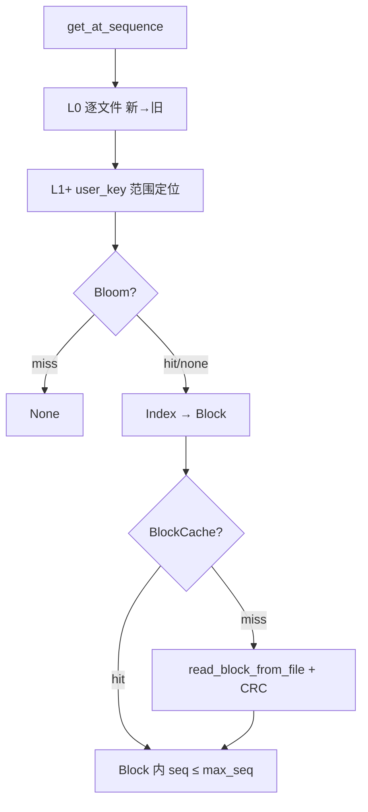
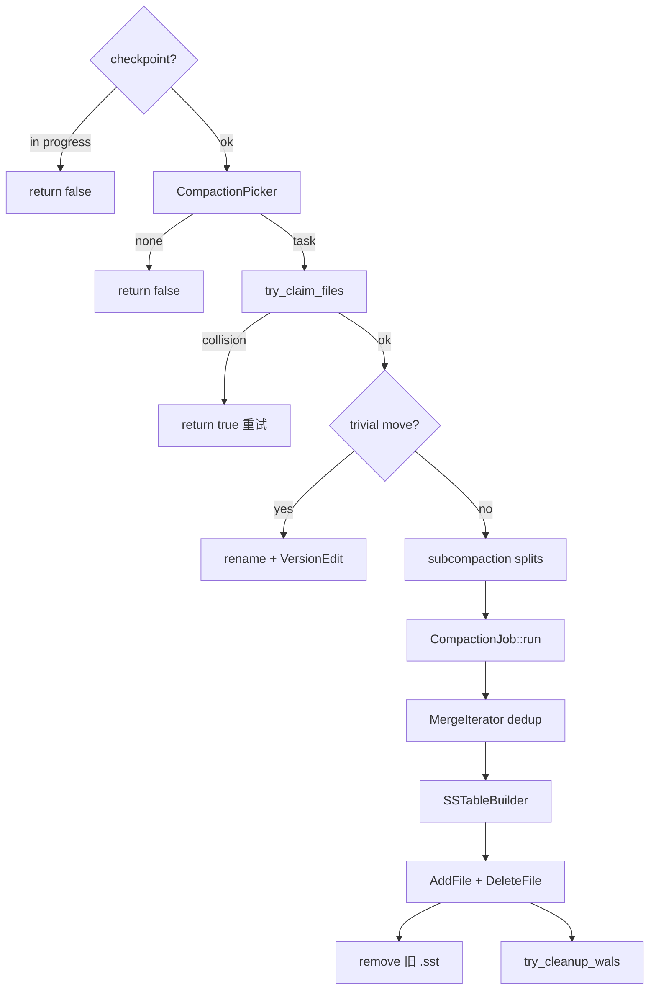
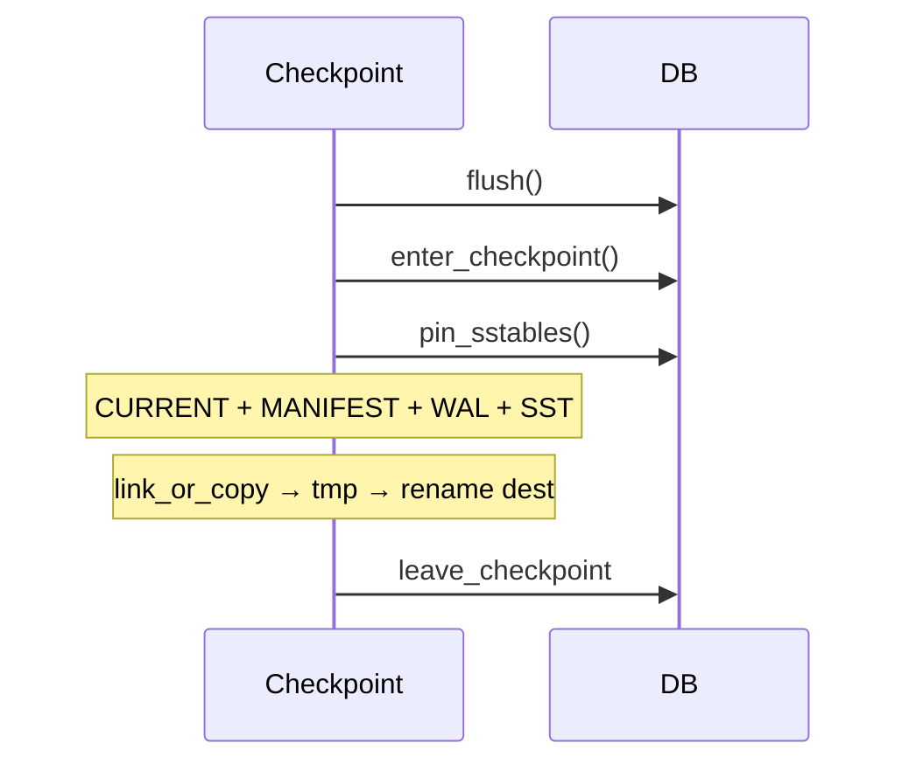

# AiDb Engine Storage (持久化层)

## 何时读本文

- 改 `engine/sstable`, `compaction`, `filter`, `cache`, `checkpoint`
- 排查 flush→SST、compaction 不触发/卡住、get 读放大、Bloom/BlockCache、MANIFEST、目录 checkpoint
- **不覆盖**: WAL / MemTable / 写路径 / `DB::put` → [engine.md](01-engine.md)
- **衔接**: flush/compaction/checkpoint 编排见 `engine/db/inner.rs`; 全量备份见 [backup.md](04-backup.md)

## 代码地图

| 路径 | 职责 | 入口 |
|------|------|------|
| `sstable/mod.rs` | SSTable 模块根; re-export | — |
| `sstable/block.rs` | Data Block: prefix compression + restart points | `BlockBuilder::add`, `Block::iter` |
| `sstable/block_io.rs` | Block trailer (压缩类型 + CRC); cache 读写 | `write_block`, `read_block_cached` |
| `sstable/builder.rs` | InternalKey 有序写盘; `.sst.tmp` → rename | `SSTableBuilder::add`, `finish` |
| `sstable/reader.rs` | Footer → Index → Bloom → Block 点查 | `SSTableReader::open`, `get` |
| `sstable/iterator.rs` | 单文件顺序迭代 | `SSTableIterator` |
| `sstable/index.rs` | Block 最大 InternalKey → `BlockHandle` | `find_block_handle` |
| `sstable/handle.rs` | Block offset + size 编码 (Index/Meta Index 引用) | `BlockHandle::encode/decode` |
| `sstable/footer.rs` | 48B Footer + MAGIC | `Footer::encode/decode` |
| `sstable/filename.rs` | `{num:06}_L{level}.sst` | `sstable_path`, `parse_sstable_filename` |
| `sstable/meta.rs` | Bloom meta 裸块 | `BLOOM_META_NAME`, `write_raw_block` |
| `sstable/properties.rs` | SST 统计属性 (entries / raw key/value size, 24B) | `SstProperties::encode/decode` |
| `compaction/mod.rs` | Compaction 模块根; re-export | — |
| `compaction/version.rs` | `CURRENT` + `MANIFEST-*`; recover/bootstrap | `VersionSet::recover`, `apply_edit` |
| `compaction/picker.rs` | L0/Ln 选取; trivial move | `CompactionPicker::pick_compaction` |
| `compaction/job.rs` | 归并 dedup; subcompaction | `CompactionJob::run` |
| `compaction/merge.rs` | 多 SST 堆归并 (compaction 专用) | `MergeIterator` |
| `compaction/helpers.rs` | key range 重叠; user_key 提取 | `key_ranges_overlap_by_meta_raw`, `user_key_from_internal` |
| `compaction/filter.rs` | `CompactionFilter` trait: 写输出 SST 前过滤 entry | `FilterDecision`, `CompactionFilter` |
| `filter/mod.rs` | Filter 模块根; re-export | — |
| `filter/bloom.rs` | SST 级 Bloom (user_key) | `BloomFilter`, `Filter` |
| `cache/mod.rs` | Cache 模块根; re-export | — |
| `cache/block_cache.rs` | 16 分片 LRU Data Block cache | `BlockCache::get/insert` |
| `checkpoint/mod.rs` | 目录一致性快照 | `Checkpoint::create`, `verify_openable` |

**DB 衔接** (`engine/db/inner.rs`, 本章只引用不展开):

| 函数 | 职责 | 本章关注 |
|------|------|----------|
| `flush_memtable_to_sstable` | MemTable → L0 SST | `SSTableBuilder` / `VersionEdit::AddFile` |
| `get_from_sstables` | L0 新→旧 + L1+ 范围定位 | 点查 SST 层 |
| `run_compaction_once` | pick → claim → trivial/subcompaction → apply | compaction 生命周期 |
| `enter_checkpoint` / `leave_checkpoint` | checkpoint 互斥 + SST pin | 与 compaction 互斥 |

公共 re-export (`lib.rs`): `BlockCache`, `CacheStats`, `Checkpoint`. SST/compaction 类型多为内部 API.

## 关键 invariant (勿破坏)

- **SST 键**: 文件内 InternalKey **严格递增**; 非排序 key → `Error::InvalidArgument`; 空 SST `finish` 拒绝; restart point 存完整 key (`shared=0`).
- **L0 overlap**: L0 允许多文件 overlap; 新 flush 的文件在 `sstables[0]` **头部** (读时新→旧全扫). **L1+** 同层目标不重叠.
- **L1+ 定位**: `find_sstable_for_key` 用 **user_key range**; picker 用 meta raw range 扩展 overlap.
- **Bloom**: 仅索引 user_key; block 内仍按 `seq <= max_seq` 过滤. miss → 免 I/O; decode 失败 → open **降级**为无 filter (warn).
- **Block CRC**: 校验 **解压后** payload; trailer = `[compressed_data][type:1][crc:4]`. MANIFEST CRC 失败 → `Error::Corruption` (与 Bloom 策略不同).
- **Compaction dedup**: 同 user_key 保留最高 seq; L1+ 丢弃 `TypeDelete` tombstone; **活跃 Snapshot** 保护 (`min_snapshot_sequence`).
- **Trivial move**: rename 后若 reader open 失败, 文件 rename 回原位置.
- **Checkpoint**: `checkpoint_in_progress` 阻止 `run_compaction_once`; `pin_sstables` 防止 unlink.
- **Subcompaction**: 子任务负责 `[range_start, range_end)`; 0 entry 子任务输出空 `CompactionResult`.
- **MergeIterator 勿混用**: compaction 用 `compaction::MergeIterator`; 读路径用 `db/iterator::DBIterator`.

## 数据流

### Flush (MemTable → L0)


`SSTableBuilder`: `add` 收集 Bloom; data block ≥ `block_size` 时 `flush_data_block`; `finish` 写 Meta Index → Index → Footer; `count==0` 时 `abandon`.

### 点查 (get → SST)



### Compaction



Dedup: 同 user_key 分组内最新版本无条件保留; 从新到旧扫描, 一旦出现 `seq <= min_snapshot_sequence` 的"边界穿越版本"即保留它 (所有活跃 Snapshot 都能读到这个版本), 更老的版本一律丢弃 —— 而不是逐条独立判断 `seq >= min_snapshot_sequence` (该写法在 snapshot 边界与该 key 版本不精确对齐时会保留冗余版本、误删边界外真正被需要的版本).

### Checkpoint



## 关键类型与 API

### SSTable 文件布局 (自上而下)

```
┌──────────────────────────┐
│ Data Blocks              │  prefix compression + restart points
├──────────────────────────┤
│ Meta Block (Bloom)       │  optional; 裸字节 (无 5B trailer)
├──────────────────────────┤
│ Meta Index Block         │  "bloom" → BlockHandle
├──────────────────────────┤
│ Index Block              │  max_key → BlockHandle
├──────────────────────────┤
│ Footer (48B)             │  meta_index + index handles + magic
└──────────────────────────┘
```

每个 Data/Index block 磁盘布局为 `[payload][type:1][crc:4]` (5B trailer). `payload` 启用压缩时为**压缩后**字节 (Index/Meta Index block 固定不压缩); CRC32 覆盖**解压后**明文, 与压缩算法无关. `BlockHandle.size` 记录的是 `payload` 的实际字节数 (不含 5B trailer) —— 即 `write_block` 返回值, **不可**用压缩前的原始长度代替, 否则读侧会按错误偏移拆 trailer, 表现为 `Error::Corruption("block CRC mismatch")` (2026-07-02 前的 P0 bug, 已修复; 回归见下方「测试」).

- 命名: `{file_number:06}_L{level}.sst`
- 空 SST: `finish` 报错; flush 路径 `count==0` 时 `abandon`

### VersionSet

- `CURRENT` 指向活跃 `MANIFEST-NNNNNN`
- `VersionEdit`: `AddFile` / `DeleteFile` (JSON line + sync)
- 超 `max_manifest_size` → `rotate_manifest`
- 无 `CURRENT` 遗留库: `scan_version_edits_from_dir` → `bootstrap_from_scan`

### CompactionTask

- `inputs` + `expanded_inputs` (L1 overlap)
- `is_trivial_move`: 无 overlap 时 rename 提升, 不重写

### Checkpoint

- `Checkpoint::create(db, dest)`: flush → pin → link/copy 全目录
- **非** Redis RDB; 完整数据目录副本, 可 `DB::open`
- `BackupManager` 基于此后处理 → [backup.md](04-backup.md)

## 常见任务

### 排查 compaction 不前进

1. 看 L0 文件数 vs `level0_compaction_trigger`
2. 确认 `background_compaction=true` 或测试里 `drain_compactions()`
3. 查是否卡在 `checkpoint_in_progress` 或 `try_claim_files` 冲突
4. `RUST_LOG=aidb=debug` 看 `cmp_*` span

### 排查 get 慢 / 读放大

1. L0 文件过多 → 触发 compaction 或调低 trigger
2. Bloom 关闭 (`bloom_false_positive_rate=0`) → 每文件读 Block
3. `block_cache_size=0` → 无 Data Block 缓存
4. `--features monitoring` 看 bloom FP / cache hit

### 调优 level 大小

`target_size(Ln) = max_bytes_for_level_base × mult^(n-1)` (L1 起). 默认 base=256MB, mult=10 → L1=256MB, L2≈2.5GB, … 变基不影响已有 SST; 新 pick 使用新 target.

### 测试 compaction (单线程驱动)

```rust
let mut opts = Options::for_testing();
opts.background_compaction = false;
let db = DB::open(path, opts)?;
// write + flush...
db.drain_compactions()?;
```

### 改 SST 格式或 Block 大小

1. 改 `Options.block_size` / `block_restart_interval` (≥256 / ≥1)
2. 同步 `SSTableBuilder` 与 `CompactionJob` 构造参数 (经 `db/inner.rs`)
3. `cargo test --test sstable -- --test-threads=1`

### 验证 checkpoint 一致性

```rust
Checkpoint::create(&db, dest)?;
Checkpoint::verify_openable(dest, Options::default())?;
```

测试: `cargo test checkpoint_consistency -- --test-threads=1`

## 配置与 feature flags

### Options (engine-storage 相关, prod 默认)

| 项 | 默认 (prod) | 说明 |
|----|-------------|------|
| `block_size` | 4KB | Data Block 切分 |
| `block_restart_interval` | 16 | restart 间隔 |
| `compression` | `Snap` | `Options::default()`/`for_high_write_throughput()` 默认 Snap; `for_testing()`/`for_high_read_throughput()` 为 `None`. Snap/Lz4 需 crate feature `compression` |
| `bloom_false_positive_rate` | 0.01 | `0.0` = 不写 Bloom |
| `block_cache_size` | 64MB | `0` = 禁用 |
| `level0_compaction_trigger` | 4 | L0 compaction |
| `level0_slowdown_writes_trigger` | 8 | L0 过多时 write sleep |
| `level0_stop_writes_trigger` | 16 | L0 过多时 write stall |
| `max_bytes_for_level_base` | 256MB | L1 target |
| `max_bytes_for_level_multiplier` | 10 | 每层 ×10 |
| `compaction_threads` | 1 | 1–4; 配合 subcompaction |
| `subcompaction_min_size` | 64MB | `0` = 禁用分裂 |
| `background_compaction` | true | `for_testing()` → false |
| `max_manifest_size` | 64MB | MANIFEST 轮转 |

### Feature flags

| flag | 说明 |
|------|------|
| `compression` | 启用 Snap/LZ4 block 压缩; `default = ["backup"]` **不含**, 需显式 `--features compression` (aikv 生产镜像/aifactory Dockerfile 已默认启用) |
| `monitoring` | OTel: bloom FP, SST/compaction 指标 |

### 环境变量

| 变量 | 说明 |
|------|------|
| `AIDB_SKIP_CHECKSUM=1` | 跳过 Block CRC (测试/诊断; 勿用于生产) |

## 测试

```bash
cargo test --test sstable --test compaction --test filter --test cache -- --test-threads=1
cargo test --test engine compaction -- --test-threads=1
cargo test checkpoint_consistency -- --test-threads=1
cargo test --test regression -- --test-threads=1
# 压缩 (Snap/Lz4) 多 block 写读 roundtrip; 默认 feature 不含 compression, 需显式加上
cargo test --features compression --test sstable function::test_multi_block_read_with -- --test-threads=1
```

## 已知限制

- 与 **aidb-oldmain** 磁盘格式不兼容 (InternalKey SST、Bloom CRC、Block CRC 语义等均已演进).
- Index/Meta Index Block 固定 `CompressionType::None`.
- Checkpoint 复制当前 MANIFEST + 现存 SST/WAL, 非增量备份; 跨设备 `hard_link` 失败时 fallback `copy`.
- **BlockCache**: 总容量均分 16 shard; hash 偏斜时单 shard 先满, 不借用其它 shard 配额.
- **Subcompaction**: 条目数常以 `file_size/100` 估算, 大 value workload 可能偏斜.
- **Snapshot 阈值**: 同一 compaction job 内 subcompaction 共用读取时的 `min_snapshot_sequence`.

## 待核实

- 无.
