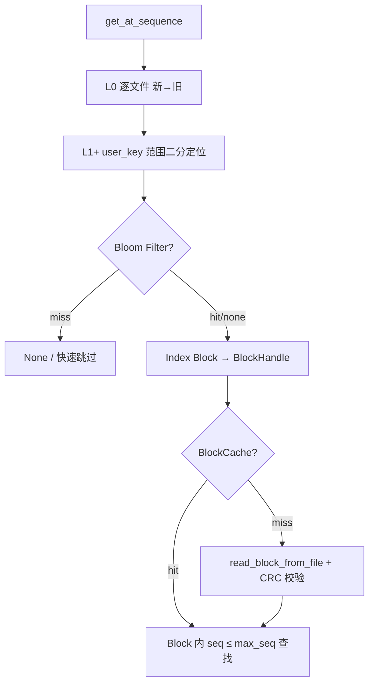
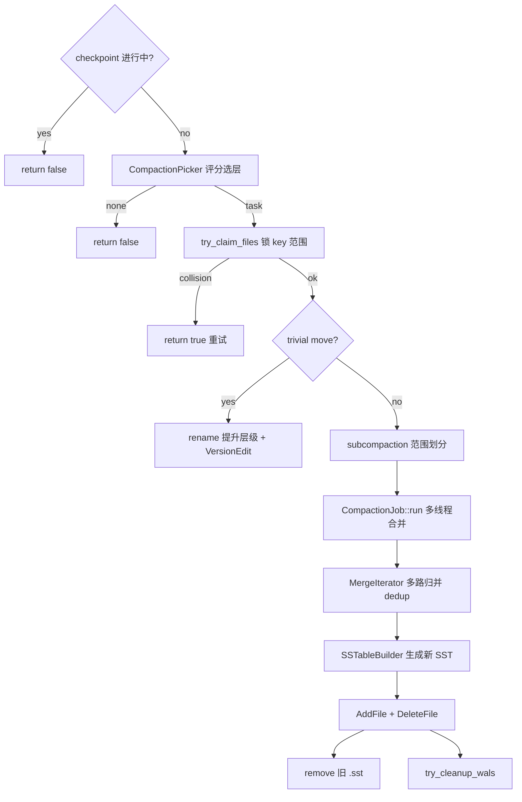
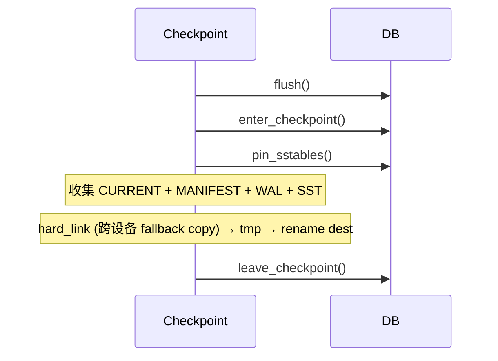

# AiDb Engine Storage (持久化层)

## 何时读本文

- 改 `engine/sstable`, `compaction`, `filter`, `cache`, `checkpoint`
- 排查 flush→SST、compaction 调度/卡住、get 读放大、Bloom/BlockCache、MANIFEST、目录 Checkpoint
- **不覆盖**: WAL / MemTable / 写路径 / `DB::put` → [engine.md](01-engine.md)
- **衔接**: 全量备份与容灾管理 → [backup.md](04-backup.md)

## 代码地图

| 路径 | 职责 | 入口 |
| --- | --- | --- |
| `engine/sstable/mod.rs` | SSTable 模块根; re-export | — |
| `engine/sstable/block.rs` | Data Block: 前缀压缩 (prefix compression) + 重启点 (restart points) | `BlockBuilder::add`, `Block::iter` |
| `engine/sstable/block_io.rs` | Block trailer (压缩类型 + CRC); cache 读写 | `write_block`, `read_block_cached` |
| `engine/sstable/builder.rs` | InternalKey 有序写盘; `.sst.tmp` → rename | `SSTableBuilder::add`, `finish` |
| `engine/sstable/reader.rs` | Footer → Index → Bloom → Block 点查 | `SSTableReader::open`, `get` |
| `engine/sstable/iterator.rs` | 单文件顺序迭代 | `SSTableIterator` |
| `engine/sstable/index.rs` | Block 最大 InternalKey → `BlockHandle` | `find_block_handle` |
| `engine/sstable/handle.rs` | Block offset + size 编码 (Index/Meta Index 引用) | `BlockHandle::encode/decode` |
| `engine/sstable/footer.rs` | 48B Footer + 8B MAGIC | `Footer::encode/decode` |
| `engine/sstable/filename.rs` | `{num:06}_L{level}.sst` | `sstable_path`, `parse_sstable_filename` |
| `engine/sstable/meta.rs` | Bloom meta 裸块 | `BLOOM_META_NAME`, `write_raw_block` |
| `engine/sstable/properties.rs` | SST 统计属性 (entries / raw key/value size, 24B) | `SstProperties::encode/decode` |
| `engine/compaction/mod.rs` | Compaction 模块根; re-export | — |
| `engine/compaction/version.rs` | `CURRENT` + `MANIFEST-*`; recover/bootstrap | `VersionSet::recover`, `apply_edit` |
| `engine/compaction/picker.rs` | L0/Ln 选层评分; trivial move 判定 | `CompactionPicker::pick_compaction` |
| `engine/compaction/job.rs` | 归并 dedup; subcompaction 多线程分裂 | `CompactionJob::run` |
| `engine/compaction/merge.rs` | 多 SST 堆归并 (compaction 专用) | `MergeIterator` |
| `engine/compaction/helpers.rs` | key range 重叠判定; user_key 提取 | `key_ranges_overlap_by_meta_raw`, `user_key_from_internal` |
| `engine/compaction/filter.rs` | `CompactionFilter` trait: 写输出 SST 前过滤 entry | `FilterDecision`, `CompactionFilter` |
| `engine/filter/mod.rs` | Filter 模块根; re-export | — |
| `engine/filter/bloom.rs` | SST 级 Bloom Filter (user_key 散列) | `BloomFilter`, `Filter` |
| `engine/cache/mod.rs` | Cache 模块根; re-export | — |
| `engine/cache/block_cache.rs` | 16 分片 LRU Data Block cache | `BlockCache::get/insert` |
| `engine/checkpoint/mod.rs` | 目录一致性硬链接快照 | `Checkpoint::create`, `verify_openable` |

**DB 协调入口** (`engine/db/inner.rs`):
- `flush_memtable_to_sstable`: MemTable → L0 SSTable (`SSTableBuilder` / `VersionEdit::AddFile`)
- `get_from_sstables`: L0 新→旧 + L1+ 范围定位点查
- `run_compaction_once`: pick → claim → trivial/subcompaction → apply
- `enter_checkpoint` / `leave_checkpoint`: Checkpoint 互斥加锁 + SST pin

公共 re-export (`src/lib.rs`): `BlockCache`, `CacheStats`, `Checkpoint`.

## 关键 invariant (勿破坏)

- **SST 键序**: 文件内 InternalKey **严格递增**; 非排序 key → `Error::InvalidArgument`; 空 SST `finish` 拒绝; restart point 存完整 key (`shared=0`).
- **L0 overlap**: L0 允许多文件 overlap; 新 flush 的文件插入在 `sstables[0]` **头部** (读时新→旧全扫). **L1+** 同层目标文件 range 绝不重叠.
- **L1+ 定位**: `find_sstable_for_key` 用 **user_key range**; picker 用 meta raw range 扩展 overlap.
- **Bloom Filter**: 仅索引 user_key; block 内仍按 `seq <= max_seq` 过滤. miss → 免 I/O; decode 失败 → open **降级**为无 filter (记录 warn 日志, 不崩溃).
- **Block CRC 与 Handle 长度**: 校验 **解压后** payload; trailer = `[compressed_data][type:1][crc:4]`. `BlockHandle.size` 必须记录压缩后 payload 的实际长度 (不含 5B trailer). MANIFEST CRC 失败 → `Error::Corruption`.
- **Compaction dedup 与活跃快照保护**: 同 user_key 分组内最新版本无条件保留; 从新到旧扫描, 一旦出现 `seq <= min_snapshot_sequence` 的版本即保留它, 更老版本直接丢弃; L1+ 丢弃 tombstone.
- **Trivial move**: rename 后若 reader open 失败, 文件自动 rename 回原位置.
- **Checkpoint 互斥**: `checkpoint_in_progress` 阻止 `run_compaction_once`; `pin_sstables` 防止 unlink.
- **MergeIterator 隔离**: compaction 使用 `compaction::MergeIterator`; 读路径使用 `db/iterator::DBIterator`.

## 数据流

### Flush (MemTable → L0)


### 点查 (get → SST)



### Compaction



### Checkpoint (目录一致性快照)



## 关键类型与 API

### SSTable 文件物理布局 (自上而下)

```
┌──────────────────────────┐
│ Data Blocks              │  prefix compression + restart points
├──────────────────────────┤
│ Meta Block (Bloom)       │  optional; 裸字节 (无 5B trailer)
├──────────────────────────┤
│ Meta Index Block         │  "bloom" → BlockHandle
├──────────────────────────┤
│ Index Block              │  max_key → BlockHandle
├──────────────────────────┤
│ Footer (48B)             │  meta_index + index handles + magic
└──────────────────────────┘
```

每个 Data/Index block 磁盘布局为 `[payload][type:1][crc:4]` (5B trailer). `payload` 启用压缩时为**压缩后**字节 (Index/Meta Index block 固定不压缩); CRC32 覆盖**解压后**明文.

- 命名规范: `{file_number:06}_L{level}.sst`
- 空 SST: `finish` 拒绝; flush 路径 `count==0` 时 `abandon`.

### VersionSet / MANIFEST

- `CURRENT` 纯文本指针文件，记录当前活跃的 `MANIFEST-NNNNNN`.
- `VersionEdit`: 记录 `AddFile` / `DeleteFile` 版本增量 (JSON line + fsync).
- 超出 `max_manifest_size` 时自动触发 `rotate_manifest`.

### Checkpoint API

```rust
// 创建目录级硬链接一致性快照
Checkpoint::create(&db, dest_path)?;

// 冒烟校验快照目录是否可正常打开
Checkpoint::verify_openable(dest_path, Options::default())?;
```

## 常见任务

### 排查 compaction 不前进

1. 检查 L0 文件数 vs `level0_compaction_trigger`.
2. 确认 `background_compaction=true` (单测中可手动调用 `db.drain_compactions()`).
3. 查验是否被 `checkpoint_in_progress` 阻塞或遭遇 `try_claim_files` 范围锁冲突.
4. 设置 `RUST_LOG=aidb=debug` 查看 `cmp_pick`, `cmp_run`, `cmp_apply` 相关 span.

### 排查 get 慢 / 读放大

1. L0 文件过多: 调低 `level0_compaction_trigger` 或等待 compaction 追赶.
2. Bloom 关闭: 检查 `bloom_false_positive_rate` (0.0 表示禁用).
3. BlockCache 未生效: 检查 `block_cache_size` (0 表示禁用).
4. 开启 `--features monitoring` 监控 `aidb_block_cache_hits_total` / `misses_total` 与 `aidb_bloom_false_positive_total`.

### 调优层级容量

`target_size(Ln) = max_bytes_for_level_base × mult^(n-1)` (L1 起算). 默认 base=256MB, mult=10 → L1=256MB, L2≈2.5GB, L3≈25GB. 修改配置仅影响后续 pick 策略，不影响已有磁盘文件.

## 配置与 feature flags

### Options (engine-storage 相关, 生产默认)

| 项 | 默认 (生产) | 说明 |
| --- | --- | --- |
| `block_size` | 4 KiB | Data Block 切分大小 (字节) |
| `block_restart_interval` | 16 | 前缀压缩 restart point 间隔 |
| `compression` | `Snap` (有 feature) / `None` (无 feature) | Snap/LZ4 块级压缩; 默认构建无 feature 时为 `None` |
| `bloom_false_positive_rate` | 0.01 | Bloom Filter 目标假阳性率 (0.0=禁用) |
| `block_cache_size` | 64 MiB | 16 分片 LRU 缓存容量 (0=禁用) |
| `level0_compaction_trigger` | 4 | L0 文件数达到该阈值触发 Compaction |
| `level0_slowdown_writes_trigger` | 8 | L0 文件数达到该阈值触发写 sleep 降速 |
| `level0_stop_writes_trigger` | 16 | L0 文件数达到该阈值触发写 stall 停写 |
| `max_bytes_for_level_base` | 256 MiB | L1 目标容量上限 |
| `max_bytes_for_level_multiplier` | 10 | 各 Level 容量倍率 |
| `compaction_threads` | 1 | 后台 Compaction 线程数 (建议 1~4) |
| `subcompaction_min_size` | 64 MiB | Subcompaction 多线程分裂阈值 (0=禁用) |
| `max_sub_compactions` / `min_sub_compactions` | 4 / 2 | Subcompaction 最大 / 最小任务分裂数 |
| `compaction_poll_ms` | 500 | 后台 Compaction 线程轮询间隔 (毫秒) |
| `compaction_channel_size` | 64 | Compaction 唤醒通道容量 |
| `max_manifest_size` | 64 MiB | MANIFEST 轮转阈值 |
| `max_levels` | 7 | LSM-Tree 最大层级数 |
| `background_compaction` | true | 是否启动后台 compaction 线程 |

### Feature flags 与环境变量

| Flag / 变量 | 说明 |
| --- | --- |
| `compression` | Cargo feature: 启用 Snap / LZ4 SSTable 块压缩 |
| `monitoring` | Cargo feature: 启用 OTel SST/compaction/cache 统计指标 |
| `AIDB_SKIP_CHECKSUM=1` | 环境变量: 跳过 Block CRC 校验 (仅用于测试/灾难恢复诊断) |

## 测试

```bash
cargo test --test sstable --test compaction --test filter --test cache -- --test-threads=1
cargo test --test engine compaction -- --test-threads=1
cargo test --test regression -- --test-threads=1
cargo test --test db modules::db::checkpoint_consistency -- --test-threads=1
# 压缩特性测试 (Snap / LZ4)
cargo test --features compression --test sstable -- --test-threads=1
```

| 测试集 | 覆盖 |
| --- | --- |
| `tests/sstable.rs` | Data Block 编码、前缀压缩、Index/Footer 编解码、CRC32 校验、Bloom 与 Cache 集成 |
| `tests/compaction.rs` | 选层评分、VersionEdit / MANIFEST 轮转、MergeIterator 多路归并、Tombstone 清理 |
| `tests/filter.rs` | Bloom Filter 编解码与假阳性率校验 |
| `tests/cache.rs` | 16 分片 LRU BlockCache 淘汰机制与命中率统计 |
| `tests/regression.rs` | Bloom 统计回归与空值 Compaction 回归测试 |

## 已知限制

- 与 **aidb-oldmain** 历史磁盘格式不兼容.
- Index Block 与 Meta Index Block 固定不压缩 (`CompressionType::None`).
- Checkpoint 产生全量目录硬链接副本, 跨文件系统/挂载点失败时 fallback 复制整份数据.
- **BlockCache**: 总容量严格均分 16 shard; 单 shard 满时独立 LRU 淘汰, 不跨 shard 借用配额.
- **Subcompaction**: 条目数常以 `file_size / 100` 估算, 极端大 value 场景可能存在分裂偏斜.
