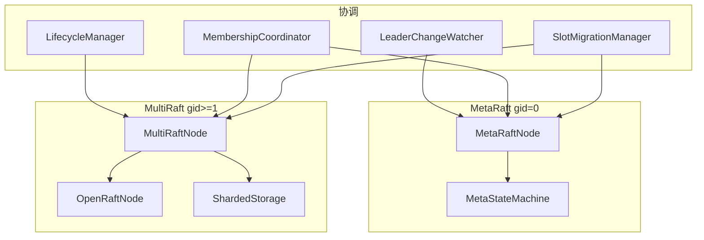
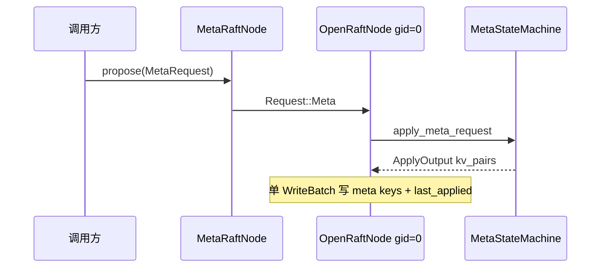
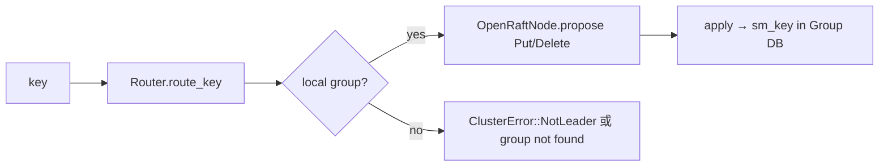
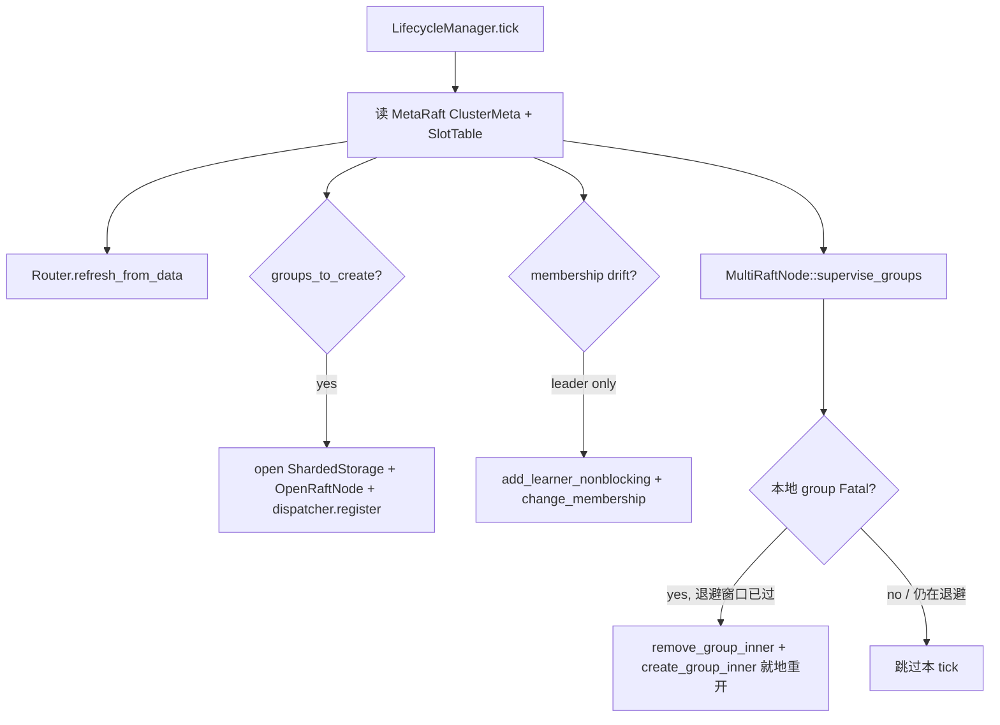

# AiDb Cluster (集群: MetaRaft + MultiRaft)

## 何时读本文

- 改 `src/cluster/*` 或排查 MetaRaft / 数据 Group Raft / Router / slot 迁移 / gRPC
- 集成 aikv `storage` / `cluster` 前, 理解 aidb 侧 pub API 与错误语义
- **不覆盖**: 单节点 LSM 写读路径 → [engine.md](01-engine.md); SSTable/compaction → [engine-storage.md](02-engine-storage.md)
- **不覆盖**: RESP MOVED/ASK / CLUSTER 子命令 → aikv [cluster.md](../../../aikv/docs/modules/06-cluster.md) (步 11)
- **构建**: 需 `--features cluster` 与 `protoc`

## 架构一览

- **MetaRaft** (`group_id = 0`): 节点 / Group / SlotTable / 迁移状态; `MetaRequest` 经 Raft 共识
- **MultiRaft** (`group_id ≥ 1`): 每 Group 独立 `ShardedStorage` (目录 `data/group_{id}/`) + `OpenRaftNode`
- **Router**: Redis 兼容 16384 slot (CRC16 + hash tag); 缓存由 `LifecycleManager::tick` 刷新
- **统一 gRPC**: `RaftServiceDispatcher` 按 RPC 内 `group_id` 分发; Meta 与数据 Group 可共享端口



## 代码地图

| 路径 | 职责 | 入口 |
|------|------|------|
| `mod.rs` | 模块根; re-export | — |
| `types.rs` | `TypeConfig`, `Request`/`Response`, `ThinWriteBatch`, `RaftNodeConfig` | `Request::Meta`, `RaftNodeConfig::validate` |
| `meta_types.rs` | `ClusterMeta`, `SlotTable`, `MetaRequest`, `METARAFT_GROUP_ID=0` | `MetaRequest::*`, `SLOT_COUNT=16384` |
| `meta_state_machine.rs` | Meta SM: validate + apply → 三 KV | `apply_meta_request`, `validate_meta_request` |
| `meta_raft_node.rs` | 控制平面封装 | `new`, `initialize`, `propose`, `start_server_with_dispatcher` |
| `node.rs` | 通用 OpenRaft 节点 | `new_with_storage`, `propose`, `change_membership`, `get` |
| `multi_raft_node.rs` | 数据面编排 | `start`, `start_lifecycle_with_data`, `propose_key`, `get_local` |
| `router.rs` | slot 路由 | `key_to_slot`, `route_key`, `refresh_from_data`, `group_ops` |
| `sharded_storage.rs` | 每 Group 独立 DB | `ShardedStorage::open` |
| `storage/keys.rs` | Raft / SM / Meta key 编码 | `sm_key`, `log_key`, `meta_*_key` |
| `storage/{mod,log,apply,snapshot}.rs` | `OpenRaftStorage` (OpenRaft trait) | `apply_entries_internal` |
| `pending_log.rs` | 未 flush log entries 内存暂存 + generation 防护 | `PendingLogOverlay` |
| `log_committer.rs` | 异步批量 I/O actor; 聚合 log 写入保序 flush | `LogCommitter` |
| `network.rs` | gRPC client/server + dispatcher | `RaftNetworkClientFactory`, `RaftServiceDispatcher` |
| `aidb.raft.rs` | prost 生成的 gRPC 消息 (勿手改) | — |
| `lifecycle_manager.rs` | Group 创建/销毁 + Router 刷新 | `tick` → `TickResult` |
| `leader_watcher.rs` | 本地 leader → Meta `is_leader` | `tick`, `spawn_background` |
| `membership_coordinator.rs` | 节点 join/leave/replace | `add_node`, `remove_node`, `change_group_membership` |
| `slot_migration.rs` | 在线 slot 迁移 | `SlotMigrationManager`, `SlotMigrationExecutor` |
| `migration_oplog.rs` | 迁移 tombstone/tip 值编码 (FIX-0056-A1) | `MigOp`, `encode_tombstone`, `encode_tip` |
| `replica_allocator.rs` | 副本/slot 分配算法 (纯计算) | `allocate_group`, `rebalance_replicas` |
| `metrics.rs` | Raft RPC 计数 (feature `monitoring`) | `record_raft_rpc` |
| `failpoint.rs` | 故障注入框架 (feature `cluster-test-util`) | `FailPoint`, `FailPointRegistry`, `fire()` |

`lib.rs` re-export: `MetaRaftNode`, `MultiRaftNode`, `OpenRaftNode`, `Router`, `key_to_slot`, `ClusterError`, `SlotMigrationManager`, `MembershipCoordinator`, 等 (见 `cluster/mod.rs`).

## DB key 空间 (每 Group 独立 DB 实例内)

```shell
\x00raft/{gid}/vote|log/{idx}|membership|snapshot_meta|last_applied  # Raft 元数据
\x01sm/{gid}/{user_key}                                               # 数据面状态机 KV
\x00meta_raft/cluster_meta|slot_table|migration_state                 # 仅 MetaRaft DB (gid=0)
```

- 数据 Group 的用户 key 在 apply 时写入 `sm_key(group_id, user_key)` (`storage/apply.rs`)
- Meta / Membership / Blank entry 保持独立 WriteBatch 原子写入 (`apply_meta_entry`, `apply_membership_entry_atomic`)
- **连续的 Normal data entry 合并为单个 WriteBatch, 一次性写入 SM + `last_applied`** (`apply_entries_internal` 批量合并逻辑, 2026-07-01 重构)

## 关键 invariant (勿破坏)

- **WAL**: Raft 模式要求 `db.use_wal() == true`, 否则 `ClusterError::InvalidConfig`
- **Group ID**: `0` = MetaRaft; 数据 Group ≥ `1` (`DEFAULT_GROUP_ID = 1` 为 P12 单 Group 测试默认)
- **Slot**: 固定 `16384`; `Unallocated` → `route_slot` 返回 `InvalidState`
- **Request 序列化**: 不用 adjacently tagged serde (rmp_serde + openraft `Entry` 限制)
- **成员变更**: `OpenRaftNode::change_membership` 前 catch-up、后 replication confirm 双屏障
- **Router leader**: `observed_group_leaders` (本地 OpenRaft) 优先于 MetaRaft `ReplicaInfo.is_leader`
- **地址**: MOVED 重定向用 `NodeInfo.client_addr`, 缺省 fallback `rpc_addr`; Raft RPC 始终 `rpc_addr`
- **Meta 版本**: 每次成功 `apply_meta_request` 后 `ClusterMeta.version += 1`
- **Apply fail-fast**: `apply_entries_internal` 遇到真实存储错误 (如 `PutConditional` 的 dedup 读 I/O 失败) 必须直接 `?` 向上抛, 交给 openraft 判定该 raft 实例 `Fatal` 并停止服务; **绝不能**把存储故障当作业务级 `Response::Error` 吞掉继续处理下一条, 否则 `last_applied` 会越过失败 entry 被持久化, 数据永久丢失且副本间可能分叉 (2026-07-02 修复, 见 `apply.rs`)

## 数据流

### MetaRaft 元数据变更



数据 Group apply 将连续的 Normal entry 合并到单个 WriteBatch (SM ops + last_applied), 见 `apply_entries_internal`; Membership/Blank entry 仍独立原子写入.

### 单 key 写入 (数据 Group)



### Lifecycle tick (本节点 Group 对齐)



- **自愈重启 (`supervise_groups`)**: 每次 lifecycle tick 扫描本地 group, 若 `raft().metrics().running_state` 为 `Err` (即上面 apply fail-fast 触发的 `Fatal`), 按 `(2s * 2^连续失败次数)` 指数退避 (上限 60s) 就地重开该 group (不影响同节点其它 group / gRPC server); 重开**不**传 `init_as_voter=true` (该 group 已是正常集群成员, 只是重新加载磁盘上的现有状态, 不是单节点 bootstrap). 健康后清零退避计数. 指标: `aidb_raft_group_fatal_total` / `aidb_raft_group_restart_total{outcome}` (2026-07-02, 见 `multi_raft_node.rs::supervise_groups`).

## 关键类型与 API

### Request / Response (数据面)

| 变体 | 用途 |
|------|------|
| `Put` / `Delete` | 单 key 写 |
| `WriteBatch(ThinWriteBatch)` | 批写 (Group 内原子) |
| `PutConditional` | slot 迁移目标写入 (key 已存在则跳过) |
| `Meta(MetaRequest)` | 仅 MetaRaft group |

### MetaRequest (控制面, 摘要)

| 类别 | 变体 |
|------|------|
| 节点 | `RegisterNode`, `UpdateNodeStatus`, `ChangeNodeRole`, `UpdateNodeTags`, `UpdateNodeClientAddr`, `RemoveNode` |
| Group | `CreateGroup`, `RemoveGroup`, `ChangeGroupMembership` |
| Slot | `AssignSlots`, `UnassignSlots`, `BeginSlotMigration`, `UpdateMigrationProgress`, `CommitSlotMigration`, `CancelSlotMigration` |
| 其他 | `BumpEpoch` |

完整校验规则见 `meta_state_machine.rs::validate_with_state`.

### ClusterError (常用)

| 变体 | 典型场景 |
|------|----------|
| `NotLeader { leader, leader_addr, is_ask }` | 非 Leader; **aidb 写路径通常 `is_ask=false`** (ASK 由 aikv 读 Router + migration_state) |
| `InvalidState` / `InvalidConfig` | Meta 校验失败、slot 未分配 |
| `Raft(String)` | openraft / group 不存在 |
| `Timeout` | 成员变更屏障超时 |

## 常见任务

### 启动 MetaRaft + MultiRaft 节点 (概要)

1. 创建共享 `RaftNetworkClientFactory` 与 `RaftServiceDispatcher`
2. `MetaRaftNode::new(config, meta_db, factory)` — 强制 `group_id=0`
3. 首节点: `initialize` 或 `initialize_with_client` (Raft membership + bootstrap `RegisterNode`)
4. `MultiRaftNode::new_with_lifecycle(node_id, Router, dispatcher, lifecycle)`
5. `multi_raft.start(rpc_addr, max_message_size)` — 统一 gRPC
6. `multi_raft.start_lifecycle_with_data(LifecycleConfig { data_dir, raft_node_config, options })`
7. 可选: `LeaderChangeWatcher::spawn_background`, `MembershipCoordinator` / `SlotMigrationManager` 挂接

### 写入一条 KV (经 MultiRaft)

1. `multi_raft.propose_key(key, Some(value))` — 内部 `Router.route_key` → `propose_group`
2. 或已知 `group_id`: `propose_group(gid, Request::Put { key, value })`
3. 非本地 Group → `ClusterError::NotLeader` (调用方/aikv 转发)

### 注册新节点 (MembershipCoordinator)

1. 构造 `NodeJoinContext { node_id, rpc_addr, client_addr, join_method }`
2. `coordinator.add_node(ctx).await` — 幂等: 同 `rpc_addr` 已存在则更新 `client_addr`
3. 后续由运维 / `ReplicaAllocator` + MetaRaft `CreateGroup` / `AssignSlots` 分配 Group

### 在线 slot 迁移

1. `SlotMigrationManager::start_migration(source, target, slots)` → MetaRaft `BeginSlotMigration`
2. 后台 `SlotMigrationExecutor::execute` (经 `run_pending_migration`) — scan 源 Group → `PutConditional` 到目标; 执行结果记入持久化 `MigrationRunRecord` / `last_run`
3. 进度 `UpdateMigrationProgress`; 相位: Prepare → Migrating → **Frozen** → **ReadyToCommit** → Commit
4. 收尾链 `finish_migration()` = `freeze_for_commit` → `quiesce_writes` → `drain_oplog_tip_stable` → `final_verify` → `mark_ready` → `commit_migration` (+ GC mig oplog 前缀). `commit_migration` **仅**接受 `ReadyToCommit` (Meta validate + Manager 双保险). AiKv `CLUSTER REBALANCE` / `SETSLOT STABLE` 必须走 `finish_migration`, 不得裸 `commit`
5. F-056-A1: 迁移期客户端写经 `Request::MigrationWrite` 同批落 mig tombstone/tip; 全量拷贝 `PutConditional` 带 `migration_epoch` 尊重 Del tombstone; 读侧合并读见 aikv cluster 文档
6. 取消: **先** `CancelSlotMigration` (Meta → Assigned(source), 读立刻回 source), **再** `cleanup_target_residuals` + GC mig oplog. Ready/Frozen 下禁止先清 target (避免读空洞)

## 配置与 feature flags

| 项 | 位置 | 说明 |
|----|------|------|
| `cluster` | `Cargo.toml` | tonic/prost/tokio/openraft; 需 `protoc` |
| `monitoring` | `cluster/metrics.rs` | Raft RPC counter; 无 feature 时为 no-op |
| `ClusterConfig` | `config.rs` | `group_count`, `replication_factor`, log 限制, `MigrationConfig` |
| `RaftNodeConfig` | `types.rs` | election/heartbeat/snapshot/rpc 超时; 必须 `validate()` |
| `MigrationConfig` | `config.rs` | `max_batch_size`, `progress_report_interval`, 重试参数 |

测试常用: `ClusterConfig::for_testing()` (4 slot, RF=1).

## 测试

```bash
# OpenRaftNode + storage + network
cargo test --features cluster --test raft -- --test-threads=1

# MetaRaft SM + 集成
cargo test --features cluster --test meta -- --test-threads=1

# MultiRaft + lifecycle + leader_watcher
cargo test --features cluster --test multi_raft -- --test-threads=1

# 运维: membership / migration
cargo test --features cluster --test cluster_ops -- --test-threads=1
cargo test --features cluster --test cluster_replica_reconcile -- --test-threads=1
```

| 测试目录 | 覆盖 |
|----------|------|
| `tests/modules/cluster/*` | 3-node formation, storage, network |
| `tests/modules/meta/*` | MetaStateMachine, MetaRaft 集成 |
| `tests/modules/multi_raft/*` | Router CRC16, lifecycle, MultiRaftNode |
| `examples/cluster.rs` | `key_to_slot` / hash tag (无网络) |

## 已知限制

- **无 ThinReplication**: 全量 Raft log 复制
- **Raft log 性能**: `get_log_entries` 按 index 点查; `purge_logs_upto` 使用 `delete_range` (避免 log 累积后全 prefix scan / 逐条 delete). 长跑时关注 `target=perf` 日志 `raft_purge_logs` / `raft_propose_ok`.
- **无 `MultiRaftNode::write_batch`**: 跨 Group 批写由调用方 `Router::group_ops` 分组后逐 Group `propose`
- **ASK/MOVED**: aidb 提供 `SlotStatus` + `ClusterError::NotLeader`; 客户端重定向在 **aikv cluster** 实现
- **slot 级 ASK**: Migrating 期间整 slot ASK (非 per-key 追踪)
- **`get_ttl_from_group`**: 恒 `None`; 迁移 verify 仅比对 value
- **`ShardedStorage` stats**: `StorageStats` 字段预留, 未全量接线 engine 指标
