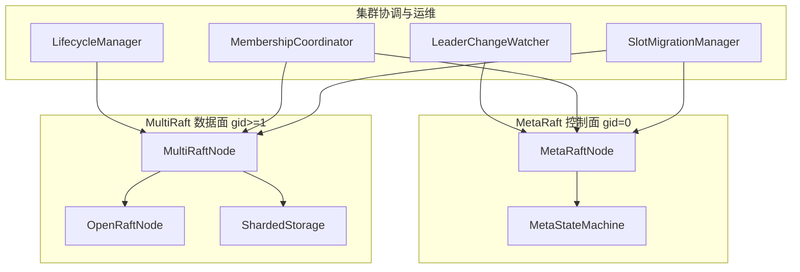
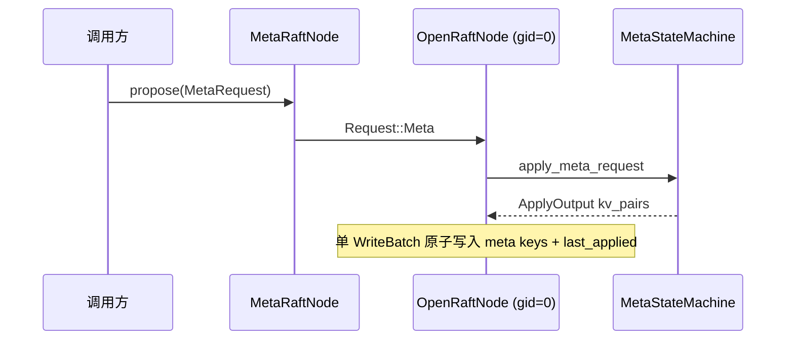
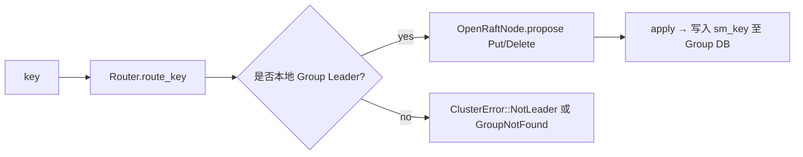
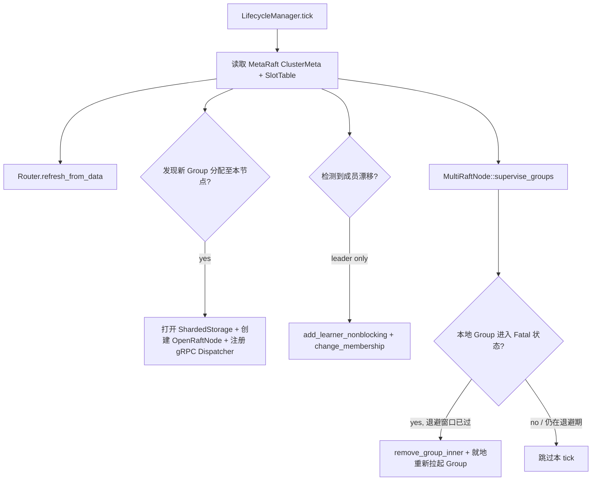

# AiDb Cluster (集群: MetaRaft + MultiRaft)

## 何时读本文

- 改 `src/cluster/*` 或排查 MetaRaft / 数据 Group Raft / Router / slot 迁移 / gRPC 分发
- 集成下游服务 (如 AiKv) `storage` / `cluster` 前, 理解 aidb 侧 pub API 与错误语义
- **不覆盖**: 单节点 LSM 写读路径 → [engine.md](01-engine.md); SSTable / compaction → [engine-storage.md](02-engine-storage.md)
- **不覆盖**: RESP MOVED/ASK 重定向 / CLUSTER 系列客户端命令 → AiKv cluster 模块
- **构建**: 需开启 `--features cluster` 且安装 `protoc`

## 架构一览

- **MetaRaft** (`group_id = 0`): 统一管理节点拓扑、Group 分配、SlotTable 路由表与迁移状态; `MetaRequest` 经 Raft 多数派共识.
- **MultiRaft** (`group_id ≥ 1`): 每 Group 拥有独立 `ShardedStorage` (数据目录 `data/group_{id}/`) 与 `OpenRaftNode`.
- **Router**: Redis 兼容 16384 slot (CRC16 + Hash Tag 算法); 拓扑缓存由 `LifecycleManager::tick` 定期刷新.
- **统一 gRPC**: `RaftServiceDispatcher` 按 RPC 载荷内的 `group_id` 自动分发; Meta 与各数据 Group 共享单个 gRPC 监听端口.



## 代码地图

| 路径 | 职责 | 入口 |
| --- | --- | --- |
| `cluster/mod.rs` | 模块根; re-export 公共类型 | — |
| `cluster/types.rs` | `TypeConfig`, `Request`/`Response`, `ThinWriteBatch`, `RaftNodeConfig` | `Request::Meta`, `RaftNodeConfig::validate` |
| `cluster/meta_types.rs` | `ClusterMeta`, `SlotTable`, `MetaRequest`, `METARAFT_GROUP_ID=0` | `MetaRequest::*`, `SLOT_COUNT=16384` |
| `cluster/meta_state_machine/` | Meta 状态机: 校验 + Apply → 元数据 KV | `mod.rs::apply_meta_request`, `validate.rs`, `apply.rs` |
| `cluster/meta_raft_node.rs` | 控制平面 Raft 节点封装 | `new`, `initialize`, `propose`, `start_server_with_dispatcher` |
| `cluster/node.rs` | 通用 OpenRaft 节点包装 | `new_with_storage`, `propose`, `change_membership`, `get` |
| `cluster/multi_raft_node/` | 数据面编排总入口 | `lifecycle.rs::start`, `io.rs::propose_key` / `get_local` |
| `cluster/router.rs` | 16384 槽路由计算与映射表 | `key_to_slot`, `route_key`, `refresh_from_data`, `group_ops` |
| `cluster/sharded_storage.rs` | 每 Group 独立 DB 实例管理 | `ShardedStorage::open` |
| `cluster/storage/mod.rs` | OpenRaftStorage 存储适配层根 | `OpenRaftStorage` |
| `cluster/storage/keys.rs` | Raft / SM / Meta 二进制 Key 前缀编码 | `sm_key`, `log_key`, `meta_*_key` |
| `cluster/storage/log.rs` | Raft Log 读取、追加与清理 (Purge) | `append_to_log`, `delete_conflict_logs_since` |
| `cluster/storage/apply.rs` | 批量 Apply entries 至状态机并更新 `last_applied` | `apply_entries_internal`, `apply_meta_entry` |
| `cluster/storage/snapshot.rs` | OpenRaft Snapshot 生成与安装 | `build_snapshot`, `install_snapshot` |
| `cluster/pending_log.rs` | 未落盘 Log Entry 内存暂存与 Generation 防护 | `PendingLogOverlay` |
| `cluster/log_committer.rs` | 异步批量 I/O Actor; 聚合 Log 写入并保序 flush | `LogCommitter` |
| `cluster/network/` | gRPC 客户端/服务端与分发调度; prost 桩由 `build.rs` 生成到 `OUT_DIR` (需 `protoc`) | `incoming.rs`, `factory.rs`, `server.rs::RaftServiceDispatcher` |
| `cluster/lifecycle_manager.rs` | Group 创建/销毁与 Router 自动刷新 | `tick` → `TickResult` |
| `cluster/leader_watcher.rs` | 本地 Leader 探活并同步 Meta `is_leader` | `tick`, `spawn_background` |
| `cluster/membership_coordinator.rs` | 节点加入/离开/替换成员变更协调 | `add_node`, `remove_node`, `change_group_membership` |
| `cluster/slot_migration/` | 在线 Slot 迁移执行器与状态机 | `executor.rs`, `manager.rs` |
| `cluster/migration_oplog.rs` | 迁移 Tombstone 与 Tip 值编码 (F-056-A1) | `MigOp`, `encode_tombstone`, `encode_tip` |
| `cluster/replica_allocator.rs` | 副本与 Slot 分配算法 (纯计算) | `allocate_group`, `rebalance_replicas` |
| `cluster/metrics.rs` | Raft RPC 计数 (feature `monitoring`) | `record_raft_rpc` |
| `cluster/failpoint.rs` | 故障注入框架 (feature `cluster-test-util`) | `FailPoint`, `FailPointRegistry`, `fire()` |

公共 re-export (`src/lib.rs`): `MetaRaftNode`, `MultiRaftNode`, `OpenRaftNode`, `Router`, `key_to_slot`, `ClusterError`, `SlotMigrationManager`, `MembershipCoordinator` 等.

## DB Key 空间隔离 (每 Group 独立 DB 实例内)

```shell
\x00raft/{gid}/vote|log/{idx}|membership|snapshot_meta|last_applied  # Raft 协议元数据
\x01sm/{gid}/{user_key}                                               # 数据面状态机业务 KV
\x00meta_raft/cluster_meta|slot_table|migration_state                 # 仅 MetaRaft DB (gid=0)
```

- 数据 Group 的用户 Key 在 apply 时写入 `sm_key(group_id, user_key)` (`storage/apply.rs`).
- Meta / Membership / Blank entry 保持独立 WriteBatch 原子写入.
- **连续的 Normal data entry 合并为单个 WriteBatch, 一次性写入 SM + `last_applied`** (`apply_entries_internal` 批量合并优化).

## 关键 invariant (勿破坏)

- **WAL 强制开启**: Raft 模式要求 `db.use_wal() == true`, 否则报 `ClusterError::InvalidConfig`.
- **Group ID 语义**: `0` = MetaRaft 控制面; 数据 Group ≥ `1` (`DEFAULT_GROUP_ID = 1`).
- **Slot 总数固定**: 严格为 `16384`; `Unallocated` 槽位调用 `route_slot` 返回 `InvalidState`.
- **Request 序列化**: 避免使用 adjacently tagged serde (受限于 rmp_serde 与 openraft `Entry` 限制).
- **成员变更屏障**: `OpenRaftNode::change_membership` 前执行 catch-up、后执行 replication confirm 双屏障.
- **Router Leader 优先级**: `observed_group_leaders` (本地 OpenRaft 实时观测) 优先于 MetaRaft `ReplicaInfo.is_leader`.
- **地址规范**: MOVED 重定向优先使用 `NodeInfo.client_addr`, 缺省时 fallback `rpc_addr`; 节点间 Raft RPC 始终使用 `rpc_addr`.
- **Meta 版本单调递增**: 每次成功 `apply_meta_request` 后 `ClusterMeta.version += 1`.
- **Apply Fail-Fast 机制**: `apply_entries_internal` 遇到真实底级存储错误时必须直接 `?` 向上抛, 交给 openraft 判定该实例 `Fatal` 并停机; 绝不能当作业务错误吞掉, 否则会导致 `last_applied` 越过失败 entry, 造成数据丢失或副本分叉.

## 数据流

### MetaRaft 元数据变更



### 单 Key 数据面写入 (数据 Group)



### Lifecycle Tick (本地 Group 对齐与自愈)

`start_lifecycle_with_data` 首次 tick 立即执行 (delay=0), 之后按 `tick_interval` 巡检, 避免冷启动必须空等一个周期才能打开 data group.



- **自愈重启 (`supervise_groups`)**: 每次 lifecycle tick 扫描本地 group, 若 `running_state` 为 `Err` (Fatal), 按 `(2s * 2^连续失败次数)` 指数退避 (上限 60s) 就地重新加载已有状态拉起 Group. 健康后重置计数. 指标: `aidb_raft_group_fatal_total` / `aidb_raft_group_restart_total`.

## 关键类型与 API

### Request / Response (数据面)

| 变体 | 用途 |
| --- | --- |
| `Put` / `Delete` | 单 key 写入 / 删除 |
| `WriteBatch(ThinWriteBatch)` | 组内原子批量写 |
| `PutConditional` | slot 迁移目标写入 (key 已存在则跳过) |
| `Meta(MetaRequest)` | 仅 MetaRaft group 使用 |

### MetaRequest (控制面, 摘要)

| 类别 | 变体 |
| --- | --- |
| 节点管理 | `RegisterNode`, `UpdateNodeStatus`, `ChangeNodeRole`, `UpdateNodeTags`, `UpdateNodeClientAddr`, `RemoveNode` |
| Group 编排 | `CreateGroup`, `RemoveGroup`, `ChangeGroupMembership` |
| Slot 运维 | `AssignSlots`, `UnassignSlots`, `BeginSlotMigration`, `UpdateMigrationProgress`, `CommitSlotMigration`, `CancelSlotMigration` |
| 其他 | `BumpEpoch` |

### ClusterError (常用)

| 变体 | 典型场景 |
| --- | --- |
| `NotLeader { leader, leader_addr, is_ask }` | 请求到达非 Leader 节点 (供上层转发或返回 MOVED/ASK) |
| `InvalidState` / `InvalidConfig` | Meta 校验失败、slot 未分配 |
| `Raft(String)` | openraft 底层错误 / group 不存在 |
| `Timeout` | 成员变更或网络屏障超时 |

## 常见任务

### 启动 MetaRaft + MultiRaft 节点

```rust
// 1. 创建共享网络客户端工厂与统一 gRPC 分发器
let factory = Arc::new(RaftNetworkClientFactory::new(raft_node_config.clone()));
let dispatcher = Arc::new(RaftServiceDispatcher::new());

// 2. 初始化 MetaRaft 控制面 (gid=0)
let meta_raft = MetaRaftNode::new(raft_node_config.clone(), meta_db, factory.clone())?;
dispatcher.register_meta(meta_raft.clone());

// 3. 构建 MultiRaft 数据面
let multi_raft = MultiRaftNode::new_with_lifecycle(node_id, router, dispatcher, lifecycle);
multi_raft.start(rpc_addr, 64 * 1024 * 1024).await?;
multi_raft.start_lifecycle_with_data(lifecycle_config);
```

### 在线 Slot 迁移全流程

1. **发起**: `SlotMigrationManager::start_migration(source, target, slots)` → MetaRaft `BeginSlotMigration`.
2. **后台拷贝**: `SlotMigrationExecutor` 扫描源 Group 数据并使用 `PutConditional` 迁移至目标节点.
3. **收尾流程**: `finish_migration()` 依次执行 `freeze_for_commit` → `quiesce_writes` → `drain_oplog_tip_stable` → `final_verify` → `mark_ready` → `commit_migration`.
4. **取消保护**: 必须先执行 `CancelSlotMigration` 将槽位切回源节点, 再清理目标节点残留, 杜绝读空洞.

## 配置与 feature flags

| 项 | 位置 | 说明 |
| --- | --- | --- |
| `cluster` | `Cargo.toml` | 编译 `src/cluster/*` 体系; 依赖 `tonic`, `prost`, `openraft`, `tokio` |
| `monitoring` | `cluster/metrics.rs` | 启用 Raft RPC 与自愈监控指标 |
| `ClusterConfig` | `src/config.rs` | `group_count = 256`, `replication_factor = 3`, `max_log_entries = 1000` |
| `RaftNodeConfig` | `cluster/types.rs` | election/heartbeat/snapshot/rpc 超时配置 |
| `MigrationConfig` | `src/config.rs` | `max_batch_size = 1000`, `progress_report_interval = 100`, 重试参数 |

## 测试

```bash
# OpenRaftNode + Storage + Network
cargo test --features cluster --test raft -- --test-threads=1

# MetaRaft SM + 集成测试
cargo test --features cluster --test meta -- --test-threads=1

# MultiRaft + Lifecycle + LeaderWatcher
cargo test --features cluster --test multi_raft -- --test-threads=1

# 集群运维: 成员变更与在线迁移
cargo test --features cluster --test cluster_ops -- --test-threads=1
cargo test --features cluster --test cluster_replica_reconcile -- --test-threads=1
```

| 测试集 | 覆盖 |
| --- | --- |
| `tests/raft.rs` | 3 节点集群组网、日志复制、Leader 切换、线性一致读 LeaseRead、Slot 迁移与原子 Apply |
| `tests/meta.rs` | MetaStateMachine 规则校验、节点注册、元数据持久化恢复 |
| `tests/multi_raft.rs` | Router CRC16 槽位计算、Hash Tag 解析、Lifecycle 协调与 LeaderWatcher 探活 |
| `tests/cluster_ops.rs` | 在线成员变更、Group 扩缩容 |
| `tests/cluster_replica_reconcile.rs` | 副本漂移检测与自动对齐 |

## 已知限制

- **全量 Raft Log 复制**: 暂未实现 ThinReplication (瘦复制).
- **无内置跨 Group 分布式事务**: 跨 Group 批量操作需由调用方按 Slot 分组后向各 Group 分别发起 `propose`.
- **ASK/MOVED 协议层**: Aidb 提供 `SlotStatus` 与 `ClusterError::NotLeader`; 客户端 RESP 重定向逻辑由上层 AiKv 负责.
- **迁移粒度**: 迁移期整 Slot 处于 Migrating / Frozen / ReadyToCommit 状态.
