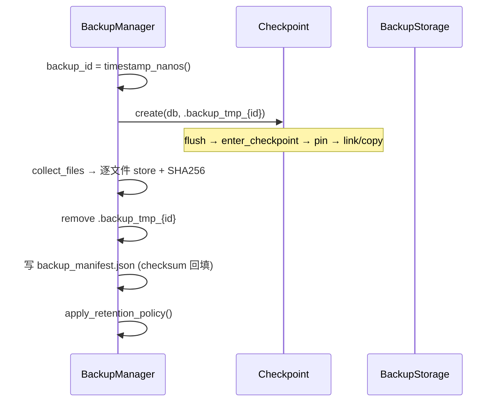

# AiDb Backup (备份与恢复)

## 何时读本文

- 改 `src/backup/*` 或集成 `BackupManager` / `RecoveryManager`
- 排查备份创建、manifest 校验、保留策略、restore 失败
- **不覆盖**: `Checkpoint::create` 内部 (pin / link-copy / compaction 互斥) → [engine-storage.md](02-engine-storage.md)
- **不覆盖**: slot 迁移文件 checkpoint → [cluster.md](03-cluster.md)
- **不覆盖**: AiKv `BGSAVE` (直调 `Checkpoint`, 不用 `BackupManager`) → aikv [commands-extended.md](../../../aikv/docs/modules/05-commands-extended.md)
- **不覆盖**: `aidb_backup_*` OTel 指标 → [observability.md](05-observability.md) (步 10)
- **构建**: 默认启用 `backup` feature; 关则整个 `backup` mod 不存在

## 代码地图

| 路径 | 职责 | 入口 |
|------|------|------|
| `backup/mod.rs` | re-export | `#[cfg(feature = "backup")]` via `lib.rs` |
| `backup/manager.rs` | 创建 / 列举 / 删除 / 保留策略 | `BackupManager`, `RetentionPolicy`, manifest 类型 |
| `backup/recovery.rs` | 恢复 / 校验 | `RecoveryManager::restore`, `verify_backup` |
| `backup/storage.rs` | 存储抽象 | `BackupStorage`, `LocalFileStorage` |
| `backup/util.rs` | SHA256 (`ring` + `hex`) | `sha256_file`, `sha256_bytes` |

**存储目录布局** (`LocalFileStorage`):

```shell
{root}/
└── backup_{id}/              # backup_path(backup_id)
    ├── backup_manifest.json  # 元数据 + 文件清单 + manifest checksum
    ├── CURRENT
    ├── MANIFEST-*
    ├── *.sst
    └── wal/ ...
```

**与 Checkpoint 分工**: `BackupManager` 调用 `Checkpoint::create` 得 DB 目录级快照, 再复制到 `backup_{id}` 并写 manifest; 不重复实现 pin / link-copy.

## 关键 invariant (勿破坏)

- **一致性来源**: 备份数据必须来自 `Checkpoint::create` 输出 (含 MANIFEST/CURRENT/SST/WAL), 不可只复制 SST 列表
- **manifest checksum**: 序列化时 `metadata.checksum` 先为空, SHA256 后回填; restore / verify 须复现同一规则
- **per-file SHA256**: `BackupFileEntry.checksum` 为备份存储中文件的 SHA256; restore 逐文件校验
- **restore 原子性**: 必须先写到 `restore_tmp_{id}`, `DB::open` 冒烟通过后再 `rename` (EXDEV 时 `copy_dir_all`)
- **保留策略**: `max_age` 硬过期不受 `min_count` 保护; `min_age` 内备份归入 young 组不删
- **目标目录**: restore 时 `db_path` 可不存在或**空目录**; 非空 → `Error::InvalidArgument`

## 数据流

### 创建备份



### 恢复

```mermaid
flowchart TD
    A[读 manifest + 校验 checksum] --> B[restore_tmp_{id}]
    B --> C[逐文件 load + SHA256]
    C --> D[DB::open 冒烟]
    D --> E{rename tmp → db_path}
    E -->|ok| F[sync 父目录]
    E -->|EXDEV| G[copy_dir_all + sync]
```

## 关键类型与 API

| 类型 / API | 说明 |
|------------|------|
| `BackupId` | `u64`, 纳秒时间戳 |
| `BackupMetadata` / `BackupManifest` / `BackupFileEntry` | serde JSON; manifest 在 `backup_manifest.json` |
| `RetentionPolicy` | `min_count`/`max_count`/`min_age`/`max_age`; 默认 3/30/1d/30d |
| `BackupStorage` | `store`, `store_bytes`, `load`, `read_to_string`, `list`, `delete`, `backup_path` |
| `LocalFileStorage::new(root)` | 唯一内置实现; `fs::copy` |
| `BackupManager::new(Arc<dyn BackupStorage>, policy)` | 创建后自动 `apply_retention_policy` |
| `create_backup` / `create_backup_with_description` | 主入口 |
| `list_backups` / `get_backup_info` / `delete_backup` | CRUD |
| `RecoveryManager::new(storage)` | 与 Manager 共享同一 `Arc<dyn BackupStorage>` |
| `restore(id, db_path)` | 五步流程 (见上) |
| `verify_backup(id)` | 不恢复; 失败返回 `Ok(false)` |

`RecoveryManager` 冒烟使用 `Options::for_testing()`, 非调用方生产 `Options`.

## 常见任务

### 创建并列举备份

1. `let storage = Arc::new(LocalFileStorage::new(backup_root));`
2. `let manager = BackupManager::new(storage.clone(), RetentionPolicy::default());`
3. `let id = manager.create_backup(&db)?;` (或 `create_backup_with_description`)
4. `manager.list_backups()?` — 按 `created_at` 降序

### 恢复到新目录

1. 确保目标目录不存在或为空
2. `let recovery = RecoveryManager::new(storage);`
3. `recovery.restore(id, &restore_path)?;`
4. `DB::open(&restore_path, options)?` 验证业务数据

### 仅校验备份完整性

```rust
assert!(RecoveryManager::new(storage).verify_backup(id)?);
```

### 调整保留策略

1. 构造 `RetentionPolicy { min_count, max_count, min_age, max_age }`
2. 传入 `BackupManager::new`
3. 每次 `create_backup` 结束自动清理; 也可手动 `apply_retention_policy()`

### 自定义存储后端

1. 实现 `BackupStorage` trait (`Send + Sync`)
2. `BackupManager::new(Arc::new(MyStorage), policy)` — Manager / Recovery 逻辑不变

### 禁用 backup 模块

```bash
cargo build --no-default-features
# 或显式: cargo build --no-default-features --features monitoring,cluster,...
```

## 配置与 feature flags

| 项 | 位置 | 说明 |
|----|------|------|
| `backup` | `Cargo.toml` default | 启用 `src/backup/`; 依赖 `ring`, `hex`, `serde_json` |
| `monitoring` | `manager` / `recovery` | `aidb_backup_total{op}`, `aidb_backup_size_bytes`, `aidb_backup_duration_seconds` |
| tracing span | `#[instrument]` | `backup_create`, `backup_list`, `backup_delete`, `backup_retention`, `backup_restore`, `backup_verify` |

## 测试

```bash
cargo test --test backup
cargo test -p aidb --lib backup
cargo run --example backup
```

| 文件 | 覆盖 |
|------|------|
| `tests/engine/backup.rs` (Cargo entry: `--test backup`) | 空库、roundtrip、并发写后 verify |
| `backup/manager.rs` tests | RetentionPolicy 五条规则 |
| `backup/recovery.rs` tests | verify 完整 / 篡改 SST |
| `benches/backup_bench.rs` | criterion (见 development / observability 边界) |

## 已知限制

- **双重复制 I/O**: checkpoint 已 link/copy 到 `.backup_tmp_*`, 再 `fs::copy` 到 `backup_{id}` (见 ISSUE-011)
- **无增量 / 压缩 / 远程存储**: 仅全量; 无 S3 trait 实现 (见 ISSUE-012)
- **无 backup_id 碰撞重试**: 单次 `timestamp_nanos()` (见 ISSUE-012)
- **`list` vs `get`**: 损坏 manifest 在 list 中 warn 跳过, get 抛 `Corruption` (见 ISSUE-013)
- **无 CLI**: 无 `aidb-admin`; 用库 API 或 `examples/backup.rs`
- **单 DB 实例**: 集群多 group 协调备份不在本章; aikv 集群 checkpoint 见 `storage/cluster_adapter.rs`

## 待核实

- 见 [ISSUES.md](../../ISSUES.md#issue-011--创建路径为-checkpoint-组合而非-inventory-直连-pin_sstables) — 创建路径为 Checkpoint 组合, 非 inventory 直连 pin_sstables
- 见 [ISSUES.md](../../ISSUES.md#issue-012--无-backup_id-碰撞重试与压缩增量s3) — 无碰撞重试、压缩、增量、S3
- 见 [ISSUES.md](../../ISSUES.md#issue-013--list_backups-与-get_backup_info-对损坏-manifest-行为不一致) — list 与 get 对损坏 manifest 行为不一致
