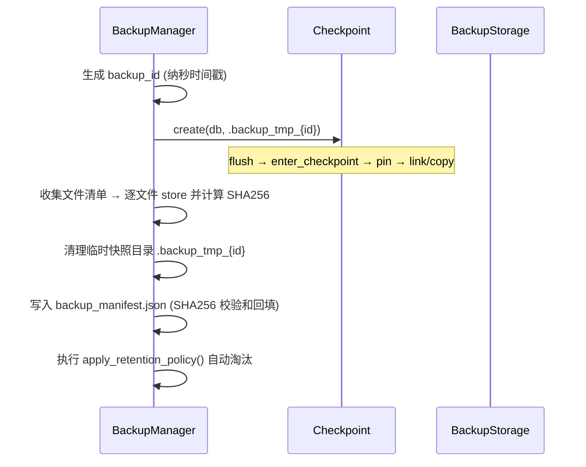

# AiDb Backup (备份与恢复)

## 何时读本文

- 改 `src/backup/*` 或集成 `BackupManager` / `RecoveryManager`
- 排查全量备份创建、manifest 校验和、保留策略清理、数据 restore 失败
- **不覆盖**: `Checkpoint::create` 底层实现 (pin / hard_link / compaction 互斥) → [engine-storage.md](02-engine-storage.md)
- **不覆盖**: AiKv `BGSAVE` 命令 (AiKv 直接调用 `Checkpoint::create`, 不经 `BackupManager`)
- **不覆盖**: `aidb_backup_*` OTel 监控指标 → [observability.md](05-observability.md)
- **构建**: 默认启用 `backup` feature; 禁用时整个 `backup` 模块不参与编译

## 代码地图

| 路径 | 职责 | 入口 |
| --- | --- | --- |
| `backup/mod.rs` | 模块根; re-export 公共 API | `#[cfg(feature = "backup")]` via `src/lib.rs` |
| `backup/manager.rs` | 备份创建 / 列举 / 删除 / 保留策略应用 | `BackupManager`, `RetentionPolicy`, manifest 类型 |
| `backup/recovery.rs` | 备份恢复 / 完整性校验 | `RecoveryManager::restore`, `verify_backup` |
| `backup/storage.rs` | 备份存储后端抽象与本地文件系统实现 | `BackupStorage`, `LocalFileStorage` |
| `backup/util.rs` | SHA256 校验和计算 (基于 `ring` + `hex`) | `sha256_file`, `sha256_bytes` |

**存储目录物理布局** (`LocalFileStorage`):

```shell
{backup_root}/
└── backup_{id}/              # backup_path(backup_id)
    ├── backup_manifest.json  # 元数据 + 文件清单 + manifest 校验和
    ├── CURRENT
    ├── MANIFEST-*
    ├── *.sst
    └── wal/ ...
```

**与 Checkpoint 的分工**: `BackupManager` 调用 `Checkpoint::create` 获取 DB 目录级快照, 再将文件流复制到 `backup_{id}` 并计算 SHA256 写入 manifest; 不重复实现底层的 SST pin 与 compaction 互斥.

## 关键 invariant (勿破坏)

- **一致性来源**: 备份数据必须来源于 `Checkpoint::create` 的输出 (完整包含 MANIFEST/CURRENT/SST/WAL), 不可仅复制部分 SST 文件.
- **Manifest Checksum 回填**: 序列化时 `metadata.checksum` 先置空, 计算整份 JSON 的 SHA256 后回填; 校验与恢复时必须遵循相同规则.
- **逐文件 SHA256 校验**: `BackupFileEntry.checksum` 记录各文件 SHA256; 恢复时逐一核验, 损坏立即报错.
- **Restore 原子性保证**: 必须先恢复至 `restore_tmp_{id}`, 使用 `DB::open` 进行冒烟验证通过后, 再原子 `rename` 到目标目录 (`EXDEV` 跨设备时 fallback `copy_dir_all`).
- **保留策略优先级**: `max_age` 硬过期不受 `min_count` 保护; `min_age` 内的年轻备份归入保护组不予删除.
- **目标恢复目录检查**: 恢复目标 `db_path` 必须不存在或为空目录; 存在已有数据时直接拒绝 (`Error::InvalidArgument`).

## 数据流

### 创建备份



### 数据恢复

```mermaid
flowchart TD
    A[读取 backup_manifest.json 并校验 Checksum] --> B[创建临时恢复目录 restore_tmp_{id}]
    B --> C[逐文件 load 并核对 SHA256 校验和]
    C --> D[DB::open 冒烟验证数据目录]
    D --> E{原子重命名 tmp → db_path}
    E -->|成功| F[fsync 同步父目录]
    E -->|EXDEV 跨设备| G[copy_dir_all + fsync]
```

## 关键类型与 API

| 类型 / API | 说明 |
| --- | --- |
| `BackupId` | `u64`, 纳秒时间戳唯一标识 |
| `BackupMetadata` / `BackupManifest` / `BackupFileEntry` | serde JSON 元数据; 存储于 `backup_manifest.json` |
| `RetentionPolicy` | `min_count`/`max_count`/`min_age`/`max_age`; 默认 3 / 30 / 1d / 30d |
| `BackupStorage` (trait) | 抽象存储后端: `store`, `load`, `list`, `delete`, `backup_path` |
| `LocalFileStorage::new(root)` | 本地文件系统实现; 基于 `fs::copy` |
| `BackupManager::new(storage, policy)` | 备份管理入口; 创建时自动触发 `apply_retention_policy` |
| `create_backup(&db)` | 创建全量备份主入口 |
| `list_backups()` / `get_backup_info(id)` / `delete_backup(id)` | 备份元数据查询与手动删除 |
| `RecoveryManager::new(storage)` | 恢复管理器; 与 Manager 共享 `Arc<dyn BackupStorage>` |
| `restore(id, db_path)` | 执行全流程原子恢复 |
| `verify_backup(id)` | 纯校验备份文件完整性 (不产生恢复目录) |

## 常见任务

### 创建并列举备份

```rust
use std::sync::Arc;
use aidb::backup::{BackupManager, LocalFileStorage, RetentionPolicy};

let storage = Arc::new(LocalFileStorage::new("/data/backups"));
let manager = BackupManager::new(storage.clone(), RetentionPolicy::default());

// 创建备份
let backup_id = manager.create_backup(&db)?;

// 按创建时间倒序查看
let backups = manager.list_backups()?;
for info in backups {
    println!("id={}, created_at={:?}, size={}", info.id, info.created_at, info.size_bytes);
}
```

### 恢复备份到新目录

```rust
use aidb::backup::RecoveryManager;

let recovery = RecoveryManager::new(storage);

// 校验并恢复
recovery.restore(backup_id, "/data/restored_db")?;

// 打开验证
let db = DB::open("/data/restored_db", Options::default())?;
```

### 自定义保留策略

```rust
use std::time::Duration;
use aidb::backup::RetentionPolicy;

let policy = RetentionPolicy {
    min_count: 5,                                // 最少保留 5 个
    max_count: 50,                               // 最多保留 50 个
    min_age: Duration::from_secs(2 * 86400),     // 2 天内不删
    max_age: Duration::from_secs(60 * 86400),    // 超过 60 天强制清理
};
let manager = BackupManager::new(storage, policy);
```

## 配置与 feature flags

| 项 | 位置 | 说明 |
| --- | --- | --- |
| `backup` | `Cargo.toml` default | 启用 `src/backup/`; 引入 `ring`, `hex`, `serde_json` |
| `monitoring` | `manager` / `recovery` | 记录 `aidb_backup_total`, `aidb_backup_size_bytes`, `aidb_backup_duration_seconds` |
| tracing spans | `#[instrument]` | `backup_create`, `backup_list`, `backup_delete`, `backup_retention`, `backup_restore`, `backup_verify` |

## 测试

```bash
cargo test --test backup
cargo test -p aidb --lib backup
cargo run --example backup
```

| 测试集 / 示例 | 覆盖 |
| --- | --- |
| `tests/backup.rs` | 空库备份、并发写入下备份、备份恢复全流程 roundtrip |
| `src/backup/manager.rs` unittests | RetentionPolicy 五条保留规则逻辑 |
| `src/backup/recovery.rs` unittests | 备份完整性校验与文件被篡改检测 |
| `examples/backup.rs` | 生产级端到端示例验证 |

## 已知限制

- **双重复制 I/O**: Checkpoint 先硬链接/复制到临时目录, Manager 再复制到备份存储目标.
- **无内置远程对象存储**: 内置提供 `LocalFileStorage`; S3 / GCS 等后端可通过实现 `BackupStorage` trait 扩展.
- **单 DB 实例边界**: 本模块专注单机 DB 实例的全量打包; 分布式多 Group 协同备份由上层运维或 AiKv 编排.
