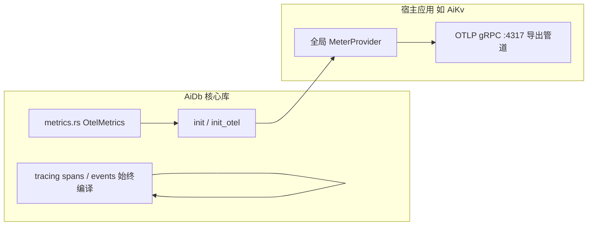

# AiDb Observability (可观测性)

## 何时读本文

- 改 `src/metrics.rs`、`src/cluster/metrics.rs` 或排查 `aidb_*` OTel 监控指标
- 在 **嵌入方** (如 AiKv) 初始化全局 `MeterProvider` 并调用 `metrics::init()`
- 查阅 tracing span / event 命名与索引, 跨模块定位埋点
- **不覆盖**: 各模块内部 span 局部逻辑 → [engine.md](01-engine.md) / [engine-storage.md](02-engine-storage.md) / [cluster.md](03-cluster.md) / [backup.md](04-backup.md)
- **不覆盖**: HTTP `/health` 健康检查端点、OTel Collector 收集器配置 → AiKv 可观测性模块
- **构建**: 需开启 `--features monitoring` 编译 `aidb::metrics`; 默认不启用

## 代码地图

| 路径 | 职责 | 入口 |
| --- | --- | --- |
| `src/metrics.rs` | 引擎 OTel instruments 注册 + `init` / `init_otel` / `record_*` | `DB::open` → `init()` |
| `src/cluster/metrics.rs` | Raft RPC 与集群自愈指标埋点 (需 `cluster` + `monitoring`) | `cluster/network/` (`client.rs` / `server.rs`) |
| `src/lib.rs` | `#[cfg(feature = "monitoring")] pub mod metrics` 声明 | — |
| `tests/common/observability.rs` | `EventCatcher`、tracing 捕获与测试锁 | 跨模块 tracing 验收 |
| `tests/metrics.rs` | cache / bloom / DB histogram 指标导出测试 (InMemory exporter) | `--test metrics` |
| `tests/span_contract.rs` | 热路径 span `level = "debug"` 静态源码扫描契约测试 | `--test span_contract` |

**嵌入集成机制**: 下游应用 (AiKv) 设置全局 `MeterProvider` 后调用 `aidb::metrics::init()`; 与上层业务指标共用 OTLP 导出管道, 由 Collector 转发至 Prometheus / Grafana.

## 架构模型: OTel + 宿主嵌入



要点说明:
- **Tracing**: 始终编译 (`tracing` crate); 与 `monitoring` feature 无关.
- **OTel Metrics**: 仅在 `monitoring` feature 下编译; 引擎热路径自动调用 `record_*`.
- **零网络端口**: AiDb 作为库不自建 HTTP / Prometheus listener, 指标统一依托宿主进程导出.

## 生命周期

1. **`DB::open`** (开启 `monitoring`): 内部自动调用 `metrics::init()` (幂等) 并设置初始 sequence gauge.
2. **运行时**: put / get / flush / compaction / backup 等路径自动触发 `record_*` 计数与耗时采集.
3. **宿主启动**: 宿主配置 `MeterProvider` → `aidb::metrics::init()` → OTLP 管道导出.

## Prometheus 指标总表 (`src/metrics.rs`)

| 指标全名 | 类型 | 标签 (Labels) | 触发与采集时机 |
| --- | --- | --- | --- |
| `aidb_wal_size_bytes` | Gauge | — | WAL 追加与轮转清理时刷新 |
| `aidb_memtable_size_bytes` | Gauge | `aidb.memtable.state=active\|frozen` | MemTable 写入与冻结时统计 |
| `aidb_sstable_count` | Gauge | `aidb.sstable.level` | flush 与 compaction 产生/删除 SST 时更新 |
| `aidb_sstable_size_bytes` | Gauge | `aidb.sstable.level` | 同上 |
| `aidb_operations_total` | Counter | `aidb.operation.name` | `put`, `get`, `delete`, `write_batch`, `write_batch_no_wal`, `snapshot`, `stall_stop`, `stall_slowdown` |
| `aidb_operation_duration_seconds` | Histogram | `aidb.operation.name` | 核心同步操作耗时分布 |
| `db.client.operations` | Counter | `db.system`, `db.operation.name` | OpenTelemetry 标准语义双写 |
| `db.client.operation.duration` | Histogram | `db.system`, `db.operation.name` | OpenTelemetry 标准语义双写 |
| `aidb_flush_total` | Counter | — | MemTable flush 完成时累加 |
| `aidb_flush_duration_seconds` | Histogram | — | MemTable flush 执行耗时 |
| `aidb_block_cache_size_bytes` | Gauge | — | 16 分片 LRU 当前缓存占用 |
| `aidb_block_cache_capacity_bytes` | Gauge | — | BlockCache 总容量上限 |
| `aidb_block_cache_hits_total` | Counter | — | BlockCache 读取命中 |
| `aidb_block_cache_misses_total` | Counter | — | BlockCache 读取未命中 |
| `aidb_bloom_false_positive_total` | Counter | — | Bloom Filter 假阳性穿透判定 |
| `aidb_sequence` | Gauge | — | 最新已分配的全局 Sequence 编号 |
| `aidb_total_key_count` | Gauge | — | 近似 Key 总数 (AtomicUsize 估计) |
| `aidb_compaction_total` | Counter | `aidb.compaction.phase=pick\|run\|apply` | Compaction 各阶段累加 |
| `aidb_compaction_duration_seconds` | Histogram | `aidb.compaction.phase=pick\|run\|apply` | Compaction 各阶段耗时分布 |
| `aidb_backup_total` | Counter | `aidb.backup.operation=create\|delete\|restore` | 备份与恢复操作统计 |
| `aidb_backup_size_bytes` | Gauge | — | 最近一次备份总大小 |
| `aidb_backup_duration_seconds` | Histogram | — | 备份打包耗时分布 |

### 集群指标 (`src/cluster/metrics.rs`, 需 `monitoring` + `cluster`)

| 指标全名 | 类型 | 标签 (Labels) | 触发与采集时机 |
| --- | --- | --- | --- |
| `aidb_raft_rpc_total` | Counter | `aidb.raft.rpc.type=vote\|append_entries\|install_snapshot`<br>`aidb.raft.rpc.direction=incoming\|outgoing` | Raft RPC 消息收发计数 |
| `aidb_raft_log_entries_total` | Counter | — | AppendEntries 入站 entry 数量累加 |
| `aidb_raft_group_fatal_total` | Counter | `aidb.raft.group.id` | Group 进入 OpenRaft Fatal 状态时记录 |
| `aidb_raft_group_restart_total` | Counter | `aidb.raft.group.id`<br>`aidb.raft.group.restart.outcome=success\|failure` | 自愈重启 Group 结果统计 |

## Tracing Span 索引

| 模块域 | Instrument Span 名 | 主要 Event (`target`) |
| --- | --- | --- |
| **WAL** | `wal_open`, `wal_write`, `wal_replay` | `wal`: `wal.write.*`, `wal.sync.*` |
| **MemTable** | `mem_put`, `mem_get`, `mem_freeze` | `mem`: `mem.put`, `mem.get.hit/miss` |
| **SSTable** | `sst_seek`, `sst_block_read`, `sst_build_add` | `sst`: `sst.seek.result`; `bloom_build` |
| **Cache** | `cache_get`, `cache_insert` | — |
| **DB 核心** | `db_open`, `db_put`, `db_get`, `db_scan`, `db_flush`, `db_close` | `db`: `db.put`, `db.get.result`, `db.flush.complete` |
| **Compaction** | `cmp_pick`, `cmp_run`, `cmp_merge`, `cmp_apply` | — |
| **Checkpoint** | `bgsave_checkpoint` | `db`: `checkpoint.create.complete` |
| **Backup** | `backup_create`, `backup_restore`, `backup_list`, `backup_delete` | — |
| **Raft 存储** | `raft_save_vote`, `raft_recv_snapshot`, `raft_install_snapshot` | `raft_append_log` (`target: "perf"`) |
| **Raft RPC** | `raft_rpc_ae`, `raft_rpc_vote`, `raft_rpc_full_snapshot` | — |
| **Meta 控制面**| `meta_propose`, `meta_apply`, `meta_slot_query` | — |

### 热路径 Span 级别硬约束

- **约束原则**: 生产环境默认 `RUST_LOG=info`. 为防止高频热路径 (put/get/scan/wal/block/raft RPC 等) 产生海量无用 Span 拖慢性能, 热路径 `#[tracing::instrument]` **必须显式声明 `level = "debug"`**.
- **契约测试保障**: 通过 `tests/span_contract.rs` 源码静态 AST 扫描强制执行该约束, 违反规则将直接导致 CI 报错:

```bash
cargo test --test span_contract -- --test-threads=1
```

## 常见任务

### 宿主应用绑定 MeterProvider 并导出指标

```rust
// 1. 初始化宿主 OpenTelemetry SDK MeterProvider (示例)
let provider = opentelemetry_sdk::metrics::SdkMeterProvider::builder()
    .with_periodic_exporter(otlp_exporter)
    .build();
opentelemetry::global::set_meter_provider(provider);

// 2. 初始化 AiDb 内部指标
aidb::metrics::init();
```

### 单测中捕获并验证指标

```rust
use aidb::metrics::testutil;

let exporter = testutil::init_in_memory();
// 执行 DB 读写...
let metrics = exporter.get_finished_metrics().unwrap();
```

## 配置与 feature flags

| 项 | 位置 | 说明 |
| --- | --- | --- |
| `monitoring` | `Cargo.toml` | 引入 `opentelemetry`, `opentelemetry_sdk`; 导出 `aidb::metrics` |
| `cluster` + `monitoring` | `Cargo.toml` | 额外激活 `src/cluster/metrics.rs` 中的 Raft RPC 与自愈指标 |

## 测试

```bash
cargo test --test metrics --features monitoring -- --test-threads=1
cargo test --test span_contract -- --test-threads=1
```

| 测试集 | 覆盖 |
| --- | --- |
| `tests/metrics.rs` | BlockCache 命中/未命中 Counter、Bloom 假阳性 Counter、DB 操作与 Flush 耗时 Histogram |
| `tests/span_contract.rs` | 源码扫描契约: 强制校验所有热路径 Span 必须为 Debug 级别 |

## 已知限制

- **无内置 HTTP Exporter**: 库不内置 HTTP `/metrics` 端口, 统一由上层应用通过 OTLP 导出.
- **`scan` / `close` 无独立 Counter**: 仅覆盖点查与写批次操作.
- **无进程级系统资源采集**: 内存 RSS、CPU 使用率由宿主环境或 Node Exporter / Alloy 采集.
