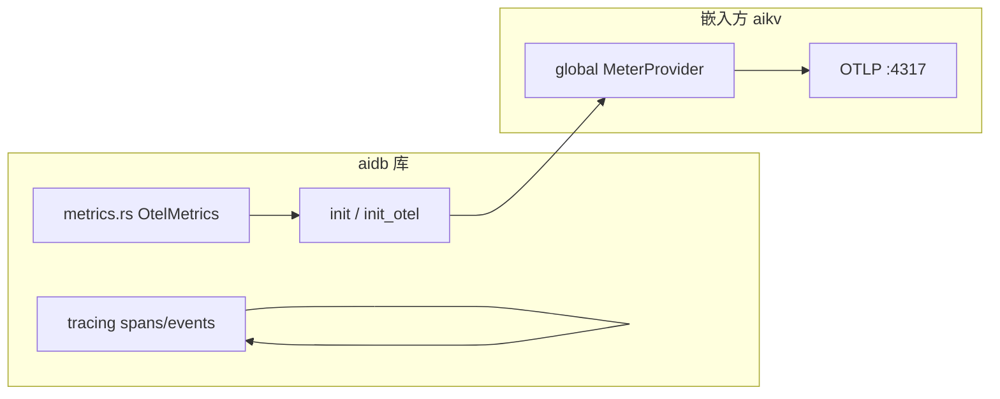

# AiDb Observability (可观测性)

## 何时读本文

- 改 `src/metrics.rs`、`src/cluster/metrics.rs` 或排查 `aidb_*` OTel 指标
- 在 **嵌入方** (aikv) 初始化 global `MeterProvider` 后调用 `metrics::init()`
- 查 tracing span / event 命名, 跨 module 定位埋点
- **不覆盖**: 各 module 内 span 实现细节 → [engine.md](01-engine.md) / [engine-storage.md](02-engine-storage.md) / [cluster.md](03-cluster.md) / [backup.md](04-backup.md)
- **不覆盖**: HTTP `/health`、OTel Collector、slowlog/INFO → aikv [observability.md](../../../aikv/docs/modules/07-observability.md)
- **监控栈部署**: AiFactory [`monitor/README.md`](../../../aifactory/monitor/README.md) (115 中心 + worker Alloy)
- **构建**: `monitoring` feature 启用 `aidb::metrics`; 默认 **不** 启用

## 代码地图

| 路径 | 职责 | 入口 |
|------|------|------|
| `src/metrics.rs` | 引擎 OTel instruments + `init` / `init_otel` / `record_*` | `DB::open` → `init()` |
| `src/cluster/metrics.rs` | Raft RPC / log 计数 | `cluster/network.rs` |
| `src/lib.rs` | `#[cfg(monitoring)] pub mod metrics` | 无 monitoring 则无模块 |
| `tests/common/observability.rs` | `EventCatcher`、tracing 测试锁 | 跨模块 tracing 验收 |
| `tests/modules/metrics/prometheus.rs` | cache/bloom/DB histogram 接线 (InMemory exporter) | `--test metrics` |
| `tests/modules/cluster/metrics.rs` | Raft 指标 init + 导出验证 | cluster 测试套件 |

**嵌入方**: aikv `otel.rs` 在设置 global `MeterProvider` 后调用 `aidb::metrics::init()`; 与 `aikv_*` 共用 OTLP 管道, 经 Collector → Prom remote write 查询.

## 架构: OTel + 嵌入



要点:

- **Tracing**: 始终编译 (`tracing` crate); 与 `monitoring` feature **无关**
- **OTel Metrics**: 仅 `monitoring` feature; `record_*` 在引擎热路径自动调用
- **aidb 无内置 HTTP/OTLP 出口**; 嵌入方设置 global `MeterProvider` 并调用 `init()` 后, 指标经 aikv OTLP 导出

## 生命周期

1. **`DB::open`** (`monitoring`): `metrics::init()` (幂等; 需嵌入方已设 global `MeterProvider`) + `set_sequence`
2. **运行时**: put/get/flush/compaction/backup 等路径调 `record_*` 或直接 gauge `record`
3. **嵌入方启动**: aikv `create_otel_tracer` 设置 `MeterProvider` → `aidb::metrics::init()` → OTLP export

`init()` 在 `monitoring` + `cluster` 时链式初始化 `cluster/metrics.rs` 计数器.

## Prometheus 指标名 (`metrics.rs`)

> 指标 **名** 与 PromQL 查询前缀不变; 生产经 OTLP remote write 写入 Prometheus, 非进程内 registry / HTTP scrape.

| 指标 | 类型 | labels | 主要触发 |
|------|------|--------|----------|
| `aidb_wal_size_bytes` | Gauge | — | `wal/manager.rs` |
| `aidb_memtable_size_bytes` | IntGaugeVec | `aidb.memtable.state=active\|frozen` | `memtable/table.rs` |
| `aidb_sstable_count` | IntGaugeVec | `aidb.sstable.level` | `db/inner.rs` `update_sstable_metrics` |
| `aidb_sstable_size_bytes` | IntGaugeVec | `aidb.sstable.level` | 同上 |
| `aidb_operations_total` | CounterVec | `aidb.operation.name` | `db/inner.rs` |
| `aidb_operation_duration_seconds` | HistogramVec | `aidb.operation.name` | put/get/delete/write_batch |
| `db.client.operations` | Counter | `db.system`, `db.operation.name` | 与 `aidb_operations_total` 双写 |
| `db.client.operation.duration` | Histogram | `db.system`, `db.operation.name` | 与 `aidb_operation_duration_seconds` 双写 |
| `aidb_flush_total` | Counter | — | flush 完成 |
| `aidb_flush_duration_seconds` | Histogram | — | flush 路径 |
| `aidb_block_cache_size_bytes` | Gauge | — | `block_cache.rs` |
| `aidb_block_cache_capacity_bytes` | Gauge | — | `BlockCache::new` |
| `aidb_block_cache_hits_total` | Counter | — | cache get hit |
| `aidb_block_cache_misses_total` | Counter | — | cache get miss |
| `aidb_bloom_false_positive_total` | Counter | — | `filter/bloom.rs` |
| `aidb_sequence` | IntGauge | — | open / allocate |
| `aidb_total_key_count` | IntGauge | — | put/delete 后 |
| `aidb_compaction_total` | Counter | **`aidb.compaction.phase`** | pick/run/apply |
| `aidb_compaction_duration_seconds` | HistogramVec | **`aidb.compaction.phase`** | pick/run/apply |
| `aidb_backup_total` | CounterVec | `aidb.backup.operation=create\|delete\|restore` | `backup/*` |
| `aidb_backup_size_bytes` | IntGauge | — | create |
| `aidb_backup_duration_seconds` | Histogram | — | create |

**`aidb_operations_total` / `operation_duration` 的 `aidb.operation.name`**: `put`, `get`, `delete`, `write_batch`, `snapshot`, `stall_stop`, `stall_slowdown`. PromQL label: `aidb_operation_name`. **`scan` / `close` 无 counter** (见 ISSUE-018).

**命中率**: 无 `cache_hit_rate` gauge; 用 PromQL `rate(hits)/(rate(hits)+rate(misses))`.

### 集群指标 (`cluster/metrics.rs`, `monitoring` + `cluster`)

| 指标 | labels | 触发 |
|------|--------|------|
| `aidb_raft_rpc_total` | `aidb.raft.rpc.type`=vote/append_entries/install_snapshot, `aidb.raft.rpc.direction`=incoming/outgoing | `cluster/network.rs` |
| `aidb_raft_log_entries_total` | — | AppendEntries 入站 entry 数 |
| `aidb_raft_group_fatal_total` | `aidb.raft.group.id` | Lifecycle tick 检测到本地 group 进入 openraft `Fatal` 状态 (apply fail-fast 触发, 见 `multi_raft_node.rs::supervise_groups`) |
| `aidb_raft_group_restart_total` | `aidb.raft.group.id`, `aidb.raft.group.restart.outcome`=success/failure | 自愈就地重启该 group 后的结果 |

**Grafana**: `aidb_raft_rpc_total` / `aidb_raft_log_entries_total` / `aidb_raft_group_fatal_total` / `aidb_raft_group_restart_total` 在 AiFactory **Cluster** 行 (Raft RPC); 引擎 LSM/cache/compaction 见 **Engine** 行 — [`monitor/config/grafana/dashboards/README.md`](../../../aifactory/monitor/config/grafana/dashboards/README.md).

## Tracing 索引 (按域)

> 完整字段见各 module; 此处只列 **instrument `name`** 与主要 **`target:` event**.

| 域 | instrument 名 | 主要 event (`target`) |
|----|---------------|----------------------|
| WAL | `wal_open`, `wal_write`, `wal_replay`, … | `wal`: `wal.write.*`, `wal.sync.*` |
| MemTable | `mem_put`, `mem_get`, `mem_freeze` | `mem`: `mem.put`, `mem.get.hit/miss` |
| SSTable | `sst_seek`, `sst_block_read`, `sst_build_add` | `sst`: `sst.seek.result`; `bloom_build` info_span |
| Cache | `cache_get`, `cache_insert` | — |
| DB | `db_open`, `db_put`, `db_get`, `db_scan`, `db_flush`, `db_close` | `db`: `db.put`, `db.get.result`, `db.flush.complete` |
| Compaction | `cmp_pick`, `cmp_run`, `cmp_merge`, `cmp_apply` | — |
| Checkpoint | `bgsave_checkpoint` | `db`: `checkpoint.create.complete` |
| Backup | `backup_create`, `backup_restore`, … | 见 [backup.md](04-backup.md) |
| Raft 存储 | `raft_append_log`, `raft_apply_sm`, … | — |
| Raft RPC | `raft_rpc_ae`, `raft_rpc_vote`, `raft_rpc_is` | — |
| Meta | `meta_propose`, `meta_apply`, `meta_slot_query` | — |

**不在 aidb**: `kv_command` / RESP 命令 span → aikv.

## 常见任务

### 启用引擎指标

```toml
# 嵌入方 Cargo.toml
aidb = { path = "../aidb", features = ["monitoring"] }
```

```bash
cargo build --features monitoring
cargo test --test metrics --features monitoring -- --test-threads=1
```

### 绑定 OTel Meter (嵌入方)

```rust
// aikv 已在 otel.rs 内完成; 自定义嵌入方示例:
opentelemetry::global::set_meter_provider(provider);
aidb::metrics::init(); // 或 init_otel(meter) 显式传入
```

### 读取指标值 (测试)

```rust
use aidb::metrics::testutil;
let exporter = testutil::init_in_memory();
// 操作后从 InMemoryMetricExporter 断言 counter/gauge
```

或 `tests/common/observability.rs` 的 tracing 辅助.

### 验证 tracing event

```rust
use crate::common::observability::{capture_events_under_lock, EventCatcher};
let events = capture_events_under_lock(|| { /* 被测操作 */ });
// 或 EventCatcher + init_test_subscriber
```

含 tracing 的测试建议 `--test-threads=1` (避免 subscriber 竞争).

### 排查指标为 0

1. 确认编译启用了 `monitoring` feature
2. 确认 `DB::open` 已执行 (`init()` 在 open 内)
3. 确认嵌入方已设 global `MeterProvider` 且 `aidb::metrics::init()` 在 export 前调用
4. 对 gauge (如 `sstable_count`): 确认发生过 flush/compaction 触发 `update_sstable_metrics`

## 配置与 feature flags

| 项 | 位置 | 说明 |
|----|------|------|
| `monitoring` | `Cargo.toml` | `opentelemetry*`, `tracing-opentelemetry`; 导出 `aidb::metrics` |
| `cluster` | 与 `monitoring` 叠加 | `init()` 额外初始化 `aidb_raft_*` |
| 无 `monitoring` | — | 无 `aidb::metrics` mod; `cluster::metrics::record_*` 为 no-op stub |

## 测试

```bash
cargo test --test metrics --features monitoring -- --test-threads=1
# Raft: tests/modules/cluster/metrics.rs (cluster 测试套件内)
```

| 测试 | 覆盖 |
|------|------|
| `test_block_cache_prometheus_counters_and_size` | hit/miss/size |
| `test_bloom_false_positive_prometheus_counter` | 与内部 atomic 一致 |
| `test_db_operation_and_flush_duration_histograms` | put/get/flush 有样本 |
| `test_raft_metrics_register_and_record` | InMemory exporter 后 counter 值 |

## 已知限制

- **无内置 HTTP / OTLP / JSON log 开关** — 嵌入方 (aikv) 负责 export 与 `/health` (ISSUE-014)
- **旧 observability 稿大量指标名/span 名已过时** — 以 `metrics.rs` 为准 (ISSUE-015)
- **未实现**: `wal_sync_duration`, `cache_hit_rate` gauge, `snapshot_count`, `cluster_nodes`, `errors_total`, `restore_duration` 等 (ISSUE-016)
- **compaction counter/histogram** — label `aidb.compaction.phase` (pick/run/apply); PromQL: `aidb_compaction_phase`
- **`scan`/`close` 无 `operations_total`** (ISSUE-018)
- **无进程级 memory/disk 指标** — oldmain `monitoring` 模块已移除

## 待核实

- 见 [ISSUES.md](../../ISSUES.md#issue-014--httpoteljson-log-运行在嵌入方-aidb-仅库内指标) — HTTP/OTel 在嵌入方, aidb 仅库内指标
- 见 [ISSUES.md](../../ISSUES.md#issue-015--旧-observability-指标表与-span-名大量过时) — 旧稿指标表与 span 名过时
- 见 [ISSUES.md](../../ISSUES.md#issue-016--旧设计若干-prometheus-系列未实现) — 若干旧设计指标未实现
- 见 [ISSUES.md](../../ISSUES.md#issue-017--compaction-指标-counterhistogram-label-名不一致) — compaction label 名不一致
- 见 [ISSUES.md](../../ISSUES.md#issue-018--scanclose-未计入-aidb_operations_total) — scan/close 未计入 operations_total
